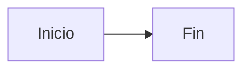
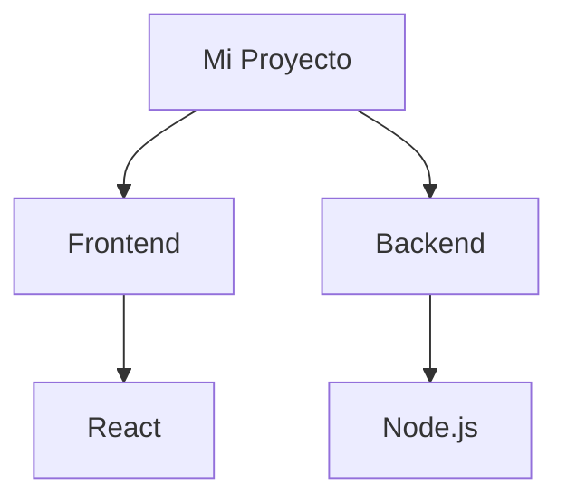

# 🚀 Guía Rápida - Capacitación en 2 Horas

## ⏰ Tienes 2 horas. Aquí está TODO lo que necesitas.

### ✅ Pre-Capacitación (5 minutos antes)

```bash
# 1. Levantar el servidor
cd /home/santosdev/all_as_code
mkdocs serve

# 2. Abrir en navegador
# http://127.0.0.1:8000

# 3. Tener abierto un editor (VS Code) con el proyecto
# Para hacer cambios en vivo
```

---

## 📋 Estructura de la Presentación (120 min)

### 1️⃣ Introducción Emocional (15 min) → `index.md`

**Puntos clave:**

- 🎯 **Portada impactante:** Docs as Code + Diagrams as Code
- 💡 **Mensaje clave:** "¿Por qué documentar es lo último que hacemos? Porque pensamos que es complejo y aburrido"
- 🚀 **Solución moderna:** AI + Mermaid + MkDocs = 100% más fácil
- 👥 **Conexión humana:** "Somos muchas mentes brillantes trabajando juntas"
- 🧠 **Problema real:** Sobrecarga mental, decisiones de $40K, ser el único que sabe
- 💡 **Transformación:** De horas a minutos con las nuevas herramientas

**Demo en vivo:**
- Mostrar la portada con tu nombre
- Enfatizar la tabla AI + Mermaid + MkDocs
- Mostrar navegación del sitio
- Cambiar el tema (modo oscuro/claro)
- Usar el buscador

**💬 Frase de apertura:**  
*"Levanten la mano: ¿Quién deja la documentación para el final porque parece complicada y aburrida? [Pausa] Bueno, eso terminó hoy."*

---

### 2️⃣ Tipos de Diagramas (20 min) → `01_abstraccion.md`

**Puntos clave:**

- 🎨 **El error común:** Mostrar código a gerentes, contexto a devs
- 📊 **La tabla:** Tipos de diagramas y cuándo usar cada uno
- 🏗️ **Modelo C4:** Los 4 niveles de zoom

**Demo en vivo:**
- Mostrar el diagrama C4
- **Click en tab "📋 Código Mermaid"**
- **Click en botón copiar (esquina superior derecha del bloque)**
- Pegar en [Mermaid Live](https://mermaid.live)
- Modificar algo (ej: cambiar "React" por "Angular")
- Mostrar cómo se actualiza instantáneamente

**💬 Frase clave:**  
*"Cada audiencia necesita un nivel de abstracción diferente"*

---

### 3️⃣ Caso Real: Rendimiento (25 min) → `02_rendimiento.md`

**Puntos clave:**

- ⏱️ **Problema:** Proceso de facturación tarda 5-10 segundos
- 🔴 **Diagrama AS-IS:** Llamada síncrona bloqueante a AFIP
- 🟢 **Diagrama TO-BE:** Patrón asíncrono con colas
- 📊 **Impacto:** De 10s a 500ms

**Demo en vivo:**
- Mostrar diagrama del problema (con zona roja)
- Explicar `activate/deactivate` para mostrar tiempo
- Mostrar diagrama de solución (con zona verde)
- Comparar lado a lado

**💬 Frase clave:**  
*"Si AFIP cae, ¿por qué debe caer nuestro sistema?"*

**Ejercicio mental:** "¿Cuántos de ustedes tienen llamadas síncronas a servicios externos?"

---

### 4️⃣ Caso Real: Seguridad (25 min) → `03_seguridad.md`

**Puntos clave:**

- 🔒 **Problema:** Passwords en texto plano en logs
- 🚨 **Impacto:** Violación de GDPR, ISO 27001, PCI-DSS
- ✅ **Solución:** Middleware de sanitización
- 📋 **Checklist:** Validar datos en tránsito, reposo, logs

**Demo en vivo:**
- Mostrar DFD del problema (zona roja en logs)
- Explicar los estilos (classDef danger/safe)
- Mostrar DFD de la solución
- Mostrar código de ejemplo del middleware

**💬 Frase clave:**  
*"Si se ve mal en el diagrama, probablemente lo es"*

**Pregunta al público:** "¿Alguien está seguro de que no loguea datos sensibles?"

---

### 5️⃣ Tutorial Práctico (25 min) → `05_tutorial_mkdocs.md`

**Puntos clave:**

- 📦 **Instalación:** `pip install mkdocs-material mkdocs-mermaid2-plugin`
- ⚙️ **Configuración:** Copiar mkdocs.yml de la presentación
- 📝 **Sintaxis Mermaid:** Ejemplos de cada tipo de diagrama
- 🚀 **Comandos:** `serve`, `build`, `gh-deploy`

**Demo en vivo:**

```bash
# Crear proyecto nuevo en otra ventana
cd /tmp
mkdocs new demo-capacitacion
cd demo-capacitacion

# Copiar configuración
# (Copiar manualmente desde 05_tutorial_mkdocs.md)

# Crear diagrama simple
# En docs/index.md agregar:
```

````markdown

````

```bash
# Levantar servidor
mkdocs serve -a 127.0.0.1:8001

# Abrir en navegador
```

**💬 Frase clave:**  
*"De cero a documentación profesional en 15 minutos"*

---

### 6️⃣ Ejercicio Hands-On (15 min)

**Pedir a los asistentes:**

1. Abrir una terminal
2. Ejecutar: `mkdocs new mi-doc && cd mi-doc`
3. Ejecutar: `mkdocs serve`
4. Abrir http://localhost:8000
5. Editar `docs/index.md` y agregar un diagrama simple
6. Ver el cambio automático

**Diagrama de ejemplo para copiar:**



**Ayuda circulante:** Camina entre los asistentes ayudando con errores.

---

### 7️⃣ Conclusiones y Q&A (15 min) → `04_conclusiones.md`

**Puntos clave:**

- 💭 **Reflexión:** No es problema técnico, es cultural
- 🎯 **Resumen:** C4 + Secuencia + DFD = Cobertura completa
- 📚 **Recursos:** Mermaid Live, MkDocs docs
- 🚀 **Call to Action:** Empieza hoy con UN diagrama

**Demo en vivo:**
- Volver a mostrar el sitio completo
- Resaltar la búsqueda (buscar "seguridad")
- Mostrar cómo se ve en mobile (responsive)

**💬 Frase de cierre:**  
*"El mejor desarrollador no es el que resuelve todo solo, es el que hace que su equipo resuelva sin él."*

**Preguntas frecuentes esperadas:**

- **"¿Reemplaza Confluence?"** → Sí para docs técnicas, no para procesos de negocio
- **"¿Funciona offline?"** → Sí, `mkdocs serve` es local
- **"¿Qué pasa si no sé Markdown?"** → Se aprende en 10 minutos
- **"¿Costo?"** → TODO es open source y gratis

---

## 🎨 Tips de Presentación

### Antes de Empezar

- ✅ Abre http://127.0.0.1:8000 en el navegador
- ✅ Ten VS Code abierto con el proyecto
- ✅ Ten [Mermaid Live](https://mermaid.live) en otra pestaña
- ✅ Prueba cambiar entre modo oscuro/claro
- ✅ Verifica que el buscador funciona

### Durante la Presentación

- 🎤 **Habla con el corazón:** Cuenta anécdotas reales
- 👀 **Haz contacto visual:** No leas las slides
- ⏸️ **Haz pausas:** Después de cada sección, pregunta "¿dudas hasta aquí?"
- 🖱️ **Navega en vivo:** Muestra cómo usar el sitio
- ✏️ **Edita en vivo:** Cambia un diagrama y muestra el auto-reload

### Momentos Clave para Conectar

1. **Inicio:** "¿Quién aquí ha sido LA única persona que sabía cómo funciona algo?" (Levanten la mano)
2. **Rendimiento:** "¿Cuántos tienen endpoints que tardan más de lo que deberían?" (Levanten la mano)
3. **Seguridad:** "¿Alguien 100% seguro de que no loguea datos sensibles?" (Silencio incómodo)
4. **Tutorial:** "¿Quién está listo para crear su primer MkDocs?" (Energía positiva)

---

## 🆘 Troubleshooting Rápido

### "El servidor no arranca"

```bash
# Verificar puerto ocupado
lsof -i :8000

# Usar otro puerto
mkdocs serve -a 127.0.0.1:8001
```

### "Los diagramas no se ven"

Verificar en `mkdocs.yml`:

```yaml
plugins:
  - mermaid2

markdown_extensions:
  - pymdownx.superfences:
      custom_fences:
        - name: mermaid
          class: mermaid
          format: !!python/name:mermaid2.fence_mermaid
```

### "Me equivoqué en un diagrama en vivo"

```bash
# Volver cambios
git checkout docs/archivo.md
```

---

## 📊 Métricas de Éxito

Al final, preguntar:

1. ✋ **"¿Quién va a usar esto la próxima semana?"** (Objetivo: >50%)
2. ✋ **"¿Quién recomienda esta capacitación?"** (Objetivo: >80%)
3. ✋ **"¿Quedaron dudas importantes?"** (Objetivo: <20%)

---

## 🎁 Material para Llevar

Compartir al final:

- 📎 **Link del repo:** [URL de tu repo]
- 📎 **Mermaid Live:** https://mermaid.live
- 📎 **MkDocs Docs:** https://www.mkdocs.org
- 📎 **Este README completo**

---

## ⏰ Timing Sugerido

| Sección | Tiempo | Acumulado |
|---------|--------|-----------|
| Introducción | 15 min | 0:15 |
| Tipos de Diagramas | 20 min | 0:35 |
| Rendimiento | 25 min | 1:00 |
| Seguridad | 25 min | 1:25 |
| Tutorial | 25 min | 1:50 |
| Hands-On | 15 min | 2:05 |
| Q&A + Cierre | 15 min | 2:20 |

**Buffer:** 20 minutos extra para preguntas

---

## 💪 ¡TÚ PUEDES!

Recuerda:

- ✅ **Conoces el tema** - Viviste estos problemas
- ✅ **Tienes buenos ejemplos** - Casos reales que conectan
- ✅ **La herramienta es simple** - No es magia, es práctico
- ✅ **Tu audiencia necesita esto** - Les vas a ahorrar tiempo y dinero

**Respira, sonríe y comparte tu conocimiento.** 🚀

---

**¡Buena suerte con la capacitación!** 🎉
