# 📊 Resumen Ejecutivo: Sistema de Documentación Estándar

## 🎯 Propósito

Hemos creado un **sistema completo de documentación estandarizada** para todos los proyectos de software de la organización, potenciado por **Inteligencia Artificial** para generar documentación de forma automática, consistente y de alta calidad.

---

## ✨ Lo Que Hemos Creado

### 1. Hub Central de Documentación

Un sitio web centralizado (MkDocs + Material) donde se consolida la documentación de **todos los proyectos** de la empresa.

- ✅ **Navegación intuitiva** por proyecto
- ✅ **Búsqueda global** en toda la documentación
- ✅ **Tema profesional** con modo claro/oscuro
- ✅ **Diagramas interactivos** con Mermaid

---

### 2. Guía Completa de Documentación

Un **manual detallado** que establece el formato estándar para documentar proyectos:

| Documento | Contenido | Audiencia |
|-----------|-----------|-----------|
| **00-intro.md** | Introducción al formato estándar | Todos |
| **01-formato.md** | Convenciones de escritura, emojis, estilos | Documentadores |
| **02-niveles-abstraccion.md** | Cómo organizar info por audiencia | Arquitectos, Líderes |
| **03-diagramas.md** | Catálogo completo de diagramas Mermaid | Todos |
| **04-plantillas.md** | Templates listos para copiar/pegar | Documentadores |
| **05-prompts.md** | 🤖 Prompts para agentes IA | ⭐ CRÍTICO |
| **06-workflow.md** | Proceso de integración completo | Documentadores |
| **07-glosario.md** | Diccionario de términos técnicos | Todos |

---

### 3. Sistema de Generación Automatizada con IA

El componente más **innovador**: **7 prompts estructurados** que permiten a agentes de IA generar documentación completa automáticamente.

```mermaid
flowchart LR
    A[📦 Repositorio] --> B[🤖 Prompt 01<br/>Análisis]
    B --> C[🤖 Prompt 02<br/>Vista Ejecutiva]
    C --> D[🤖 Prompt 03<br/>Arquitectura C4]
    D --> E[🤖 Prompt 04<br/>Docs Técnica]
    E --> F[🤖 Prompt 05<br/>Procesos]
    F --> G[🤖 Prompt 06<br/>Infraestructura]
    G --> H[🤖 Prompt 07<br/>ADRs]
    H --> I[✅ Documentación<br/>Completa]
    
    style A fill:#4caf50,color:#fff
    style I fill:#2196f3,color:#fff
    style B fill:#ff9800,color:#fff
    style C fill:#ff9800,color:#fff
    style D fill:#ff9800,color:#fff
    style E fill:#ff9800,color:#fff
    style F fill:#ff9800,color:#fff
    style G fill:#ff9800,color:#fff
    style H fill:#ff9800,color:#fff
```



#### Los 7 Prompts Cubren:

1. **Análisis Inicial**: El agente entiende el proyecto completo
2. **Vista Ejecutiva**: Genera documento para stakeholders de negocio
3. **Arquitectura C4**: Crea diagramas de Contexto, Contenedores y Componentes
4. **Documentación Técnica**: Stack, APIs, Modelo de Datos, Integraciones
5. **Procesos de Negocio**: Casos de uso y flujos funcionales
6. **Infraestructura**: Deployment, CI/CD, monitoreo
7. **ADRs**: Documenta decisiones arquitectónicas importantes

---

## 📁 Estructura Estándar por Proyecto

Cada proyecto documentado sigue esta estructura:

```
proyecto-xyz/
├── 01-vista-ejecutiva.md          # Para gerentes/ejecutivos
├── 02-arquitectura/
│   ├── 01-contexto.md             # C4 L1: Vista macro
│   ├── 02-contenedores.md         # C4 L2: Apps y DBs
│   ├── 03-componentes.md          # C4 L3: Estructura interna
│   └── 04-decisiones.md           # ADRs
├── 03-tecnico/
│   ├── 01-stack-tecnologico.md    # Tecnologías usadas
│   ├── 02-modelo-datos.md         # Esquema de BD
│   ├── 03-apis.md                 # Endpoints documentados
│   └── 04-integraciones.md        # Sistemas externos
├── 04-procesos-negocio/
│   ├── 01-casos-uso.md            # Escenarios funcionales
│   └── 02-flujos-funcionales.md   # Diagramas de secuencia
├── 05-infraestructura/
│   ├── 01-deployment.md           # Arquitectura de infra
│   ├── 02-ci-cd.md                # Pipelines
│   └── 03-monitoreo.md            # Observabilidad
└── 06-apendices/
    ├── 01-glosario.md
    ├── 02-referencias.md
    └── 03-changelog.md
```

---

## 🎭 Documentación Multi-Audiencia

El formato está diseñado para que **cada stakeholder encuentre lo que necesita**:

| Audiencia | Documentos Relevantes | Tiempo de Lectura |
|-----------|----------------------|-------------------|
| 👔 **CEO/Ejecutivos** | Vista Ejecutiva | 5 min |
| 🏗️ **Arquitectos** | Arquitectura completa + ADRs | 20 min |
| 👨‍💻 **Desarrolladores** | Técnico + Componentes | 30-45 min |
| 🔧 **DevOps/SRE** | Infraestructura | 20 min |
| 📊 **Product Owners** | Vista Ejecutiva + Casos de Uso | 15 min |

---

## 💡 Beneficios Clave

### 1. Ahorro de Tiempo ⏰

**Antes**: 20-40 horas documentar un proyecto manualmente
**Ahora**: 2-4 horas (IA genera 90%, humano revisa 10%)

**Ahorro estimado**: **85-90%** de tiempo

---

### 2. Consistencia Total 📏

- Todos los proyectos siguen el **mismo formato**
- Fácil de navegar entre diferentes proyectos
- Nuevos miembros del equipo se familiarizan rápidamente

---

### 3. Calidad Garantizada ✅

- Formato estándar probado
- Checklist de validación
- Prompts optimizados para claridad y completitud

---

### 4. Facilita Onboarding 🚀

- Nuevos desarrolladores encuentran toda la info en un solo lugar
- Documentación visual (diagramas Mermaid)
- Navegación por nivel de detalle

---

### 5. Escalabilidad 📈

- Agregar un nuevo proyecto toma **horas**, no **semanas**
- Proceso repetible y automatizable
- Documentación centralizada y fácil de mantener

---

## 🚀 Cómo Usarlo

### Para Documentar un Nuevo Proyecto

1. **Abre** `docs/guia-documentacion/05-prompts.md`
2. **Ejecuta** los 7 prompts con tu agente IA (ChatGPT, Claude, etc.)
3. **Guarda** los outputs en la estructura estándar
4. **Revisa** y completa datos faltantes
5. **Integra** al Hub siguiendo `docs/guia-documentacion/06-workflow.md`

**Tiempo total**: 2-4 horas (vs 20-40 horas manual)

---

### Para Consumir Documentación

1. **Navega** al Hub Central: http://[URL-DEL-HUB]
2. **Usa el menú lateral** para encontrar el proyecto
3. **Lee la sección relevante** para tu rol:
   - Ejecutivo → Vista Ejecutiva
   - Arquitecto → Arquitectura
   - Developer → Técnico
   - DevOps → Infraestructura

---

## 📊 Métricas de Éxito

| Métrica | Objetivo | Cómo Medirlo |
|---------|----------|--------------|
| **Tiempo de documentación** | < 4 horas por proyecto | Tracking manual |
| **Proyectos documentados** | 100% en 6 meses | Contador en index.md |
| **Tiempo de onboarding** | -50% | Encuesta a nuevos miembros |
| **Satisfacción del equipo** | > 80% | Encuesta trimestral |
| **Actualizaciones mensuales** | 100% proyectos activos | Git commits |

---

## 🎯 Roadmap Propuesto

### Fase 1: Piloto (Mes 1-2)
- [ ] Documentar 3 proyectos piloto con el nuevo formato
- [ ] Recoger feedback del equipo
- [ ] Ajustar prompts y formato según aprendizajes

### Fase 2: Expansión (Mes 3-4)
- [ ] Documentar 10 proyectos adicionales
- [ ] Entrenar al equipo en el uso de prompts
- [ ] Automatizar deployment del Hub

### Fase 3: Consolidación (Mes 5-6)
- [ ] Documentar TODOS los proyectos activos
- [ ] Establecer proceso de actualización mensual
- [ ] Crear dashboard de métricas

### Fase 4: Optimización (Mes 7+)
- [ ] Automatizar más el proceso (scripts, CI/CD)
- [ ] Integrar con herramientas de desarrollo (IDEs)
- [ ] Expandir a documentación de procesos organizacionales

---

## 💰 ROI Estimado

### Inversión Inicial
- **Setup del Hub**: 8 horas (completado ✅)
- **Creación de Guía**: 16 horas (completado ✅)
- **Prompts de IA**: 12 horas (completado ✅)
- **TOTAL**: 36 horas (completado ✅)

### Ahorro por Proyecto
- **Antes**: 30 horas/proyecto (promedio)
- **Ahora**: 3 horas/proyecto
- **Ahorro**: 27 horas/proyecto

### ROI con 10 Proyectos
- **Ahorro total**: 270 horas
- **ROI**: 750% (270/36)
- **Tiempo de recuperación**: < 2 proyectos

### ROI con 50 Proyectos (escala completa)
- **Ahorro total**: 1,350 horas
- **ROI**: 3,750%
- **Equivalente en días**: 168 días de trabajo

---

## 🎓 Capacitación Requerida

### Para Documentadores (2 horas)
1. Leer la Guía de Documentación (1 hora)
2. Práctica: Documentar un proyecto pequeño (1 hora)

### Para Consumidores (15 minutos)
1. Tour del Hub Central
2. Cómo navegar por proyecto
3. Cómo usar la búsqueda

---

## 🔑 Factores Críticos de Éxito

1. ✅ **Compromiso del liderazgo**: Priorizar la documentación
2. ✅ **Adopción del equipo**: Usar los prompts consistentemente
3. ✅ **Calidad de input**: Información precisa de POs y Tech Leads
4. ✅ **Mantenimiento continuo**: Actualizar docs al cambiar código
5. ✅ **Cultura de documentación**: Valorar la documentación como parte del desarrollo

---

## 🚦 Próximos Pasos Inmediatos

### Esta Semana
1. [ ] Presentar esta guía al equipo de liderazgo
2. [ ] Seleccionar 3 proyectos piloto
3. [ ] Asignar responsables para cada piloto

### Próximas 2 Semanas
1. [ ] Documentar los 3 proyectos piloto
2. [ ] Sesión de feedback con el equipo
3. [ ] Ajustar según aprendizajes

### Próximo Mes
1. [ ] Lanzar oficialmente el Hub Central
2. [ ] Capacitar a todo el equipo
3. [ ] Comenzar documentación masiva

---

## 📞 Contacto y Soporte

- **Preguntas sobre el formato**: Ver [Guía de Documentación](docs/guia-documentacion/)
- **Problemas técnicos**: Ver [Troubleshooting](README-PROYECTO.md#troubleshooting)
- **Sugerencias de mejora**: Abrir issue en el repositorio

---

## 🎉 Conclusión

Hemos creado un **sistema completo, escalable y automatizado** para documentar todos los proyectos de software de la organización. 

Con esta infraestructura:
- ✅ Documentar es **rápido** (horas, no semanas)
- ✅ El formato es **consistente** (todos los proyectos iguales)
- ✅ La calidad es **alta** (prompts optimizados)
- ✅ Es **fácil de mantener** (workflow claro)
- ✅ Beneficia a **todos** (multi-audiencia)

**El próximo paso es ejecutar: documentar los primeros proyectos piloto y demostrar el valor.**

---

<div style="text-align: center; margin-top: 50px; padding: 20px; background-color: #f5f5f5; border-radius: 8px;">
    <h3>🚀 ¡Estamos listos para transformar la documentación!</h3>
    <p><strong>De 40 horas a 3 horas por proyecto</strong></p>
    <p><strong>De caos a consistencia total</strong></p>
    <p><strong>De manual a automatizado con IA</strong></p>
</div>

---

<div style="text-align: center; margin-top: 30px;">
    <small>Preparado por: [Tu Nombre]<br>
    Fecha: 2025-12-10<br>
    Versión: 1.0</small>
</div>
