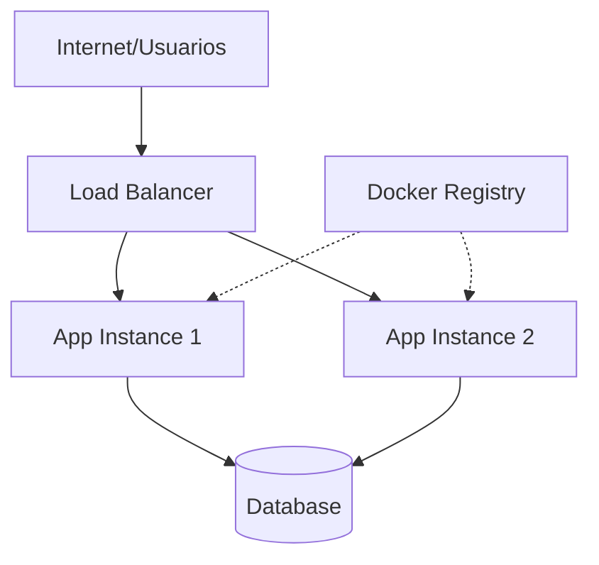
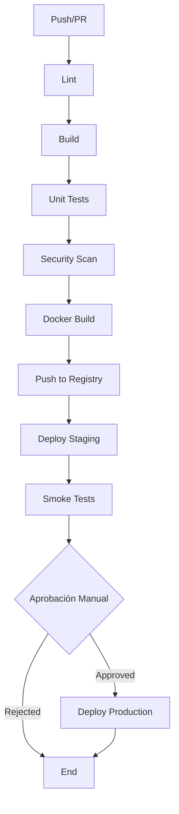

# 📝 Instrucciones de Generación - Documentación de Infraestructura

## TAREA

Genera 3 archivos de documentación COMPLETA y PRECISA basándote en la información recopilada.

---

## ARCHIVO 1: `ai_docs/06-infraestructura/01-deployment.md`

Documenta la arquitectura de deployment con las siguientes secciones:

### 📊 Diagrama de Infraestructura

Genera un diagrama Mermaid detallado que muestre:

- Internet/Usuarios → Load Balancer → App Instances → Database
- Registry de Docker (si aplica)
- Zonas de disponibilidad (si es multi-AZ)
- CDN (si se usa)
- Servicios externos

**Ejemplo de estructura:**


### 🌍 Ambientes

Para **cada ambiente** documentado, incluye:

- Nombre y propósito del ambiente
- URL/endpoint (si está disponible)
- Configuración específica (variables de entorno, recursos, etc.)
- Diferencias con producción
- Proceso de acceso y permisos

### 📦 Contenedorización

**Si usa Docker:**
- Analiza el Dockerfile encontrado:
  * Imagen base y versión
  * Puertos expuestos
  * Variables de entorno requeridas
  * Volúmenes configurados
  * Multi-stage build (si aplica)
- Docker Compose (si existe): servicios, dependencias, networks
- Registry utilizado y proceso de push/pull
- Ambientes donde se usa Docker

**Si NO usa Docker:**
- Documenta cómo se ejecuta la aplicación directamente
- Dependencias del sistema operativo
- Proceso de instalación manual

### ☸️ Orquestación (si aplica)

**Si usa Kubernetes:**
- Analiza los manifests encontrados
- Deployments: replicas, strategy, recursos
- Services: tipos (ClusterIP, NodePort, LoadBalancer)
- Ingress: reglas de routing
- ConfigMaps y Secrets
- Helm Charts (si se usan): values principales
- Namespaces y organización

**Si NO usa Kubernetes:**
- Indica qué plataforma de orquestación se usa (o ninguna)

### 📈 Escalabilidad

- Tipo de escalamiento: horizontal, vertical, o ambos
- Auto-scaling configurado (sí/no)
- Configuración de instancias: mínimo, máximo, desired
- Métricas que disparan el scaling
- Estrategias de Alta Disponibilidad:
  * Multi-AZ (múltiples zonas)
  * Multi-Region (si aplica)
  * Failover automático
  * Health checks configurados

### 🔒 Seguridad

- Load Balancer: tipo y configuración
- WAF (Web Application Firewall): proveedor y reglas
- Certificados SSL/TLS: gestión y renovación
- Security Groups / Firewall rules: puertos abiertos
- IAM / Roles / Service Accounts: permisos mínimos
- Secrets management: cómo se gestionan credenciales

### 💾 Backups y Disaster Recovery

- Estrategia de backups: automáticos o manuales
- Frecuencia: tiempo real, horaria, diaria, semanal
- Retención: cuánto tiempo se guardan
- Proceso de restore: paso a paso
- DR plan: RTO, RPO, procedimientos
- Ubicación de backups: misma región, cross-region

### 🗄️ Persistencia y Migraciones

- Provider de base de datos utilizado
- Herramienta de migraciones configurada
- Proceso para aplicar migraciones:
  * Desarrollo/local
  * Staging
  * Producción
- Proceso de rollback de migraciones
- Estrategia de datos de prueba

---

## ARCHIVO 2: `ai_docs/06-infraestructura/02-ci-cd.md`

Documenta el pipeline completo de CI/CD:

### 🛠️ Herramienta Principal

Identifica la herramienta de CI/CD utilizada y proporciona:
- Versión (si está disponible)
- Ubicación de los archivos de configuración
- Acceso al dashboard/UI

### 📊 Diagrama del Pipeline

Genera un flowchart Mermaid con **todos los stages** identificados:



Incluye:
- Trigger: qué dispara el pipeline (push, PR, merge)
- Orden de ejecución de stages
- Puntos de decisión (gates, approvals)
- Deploy automático o manual
- Proceso de rollback

### ⚙️ Stages Detallados

Para **CADA stage** encontrado, documenta:

1. **Nombre del stage**
2. **Qué hace**: descripción funcional
3. **Comandos ejecutados**: código real del pipeline
4. **Artefactos generados**: qué produce
5. **Tiempo estimado**: duración aproximada
6. **Condiciones**: cuándo se ejecuta (branches, tags, manual)
7. **Variables de entorno**: cuáles necesita

**Ejemplo:**
```markdown
#### Build
- **Qué hace**: Compila el código fuente y genera el ejecutable
- **Comandos**:
  ```bash
  npm install
  npm run build
  ```
- **Artefactos**: `dist/` con código compilado
- **Tiempo**: ~2-3 minutos
- **Condiciones**: Se ejecuta en todos los branches
- **Variables**: `NODE_ENV=production`
```

### 🌿 Estrategia de Branching

Documenta la estrategia Git utilizada:

- **Tipo**: Git Flow, GitHub Flow, Trunk Based, etc.
- **Branches principales**: main, develop, staging, etc.
- **Naming conventions**: 
  * Features: `feature/nombre`
  * Hotfixes: `hotfix/nombre`
  * Releases: `release/version`
- **Merge strategy**: squash, rebase, merge commit
- **Branch protections**: 
  * Require PR reviews (cuántas aprobaciones)
  * Status checks required
  * Signed commits
- **Code review process**: quién revisa, criterios

### 🚀 Proceso de Deployment

Detalla el proceso completo paso a paso:

1. Developer hace commit y push
2. Se abre Pull Request
3. Se ejecuta pipeline de validación (lint, tests)
4. Code review y aprobación
5. Merge a branch principal
6. Pipeline de deployment se activa
7. [Detallar cada paso específico del deploy]
8. Verificaciones post-deploy (health checks, smoke tests)
9. Notificaciones (Slack, email, etc.)
10. Proceso de rollback (si algo falla)

**Tipo de deployment**: Automático, semi-automático (con approval), o manual

### 🔐 Secrets y Variables

- **Dónde se almacenan**: 
  * GitHub Secrets
  * GitLab CI/CD Variables
  * AWS Secrets Manager
  * HashiCorp Vault
  * etc.
  
- **Variables por ambiente**:
  * Development: `API_URL`, `DB_HOST`, etc.
  * Staging: valores específicos
  * Production: valores específicos

- **Rotación de credentials**: 
  * Frecuencia
  * Proceso automatizado o manual
  * Quién tiene acceso

- **Acceso a secrets**:
  * Roles y permisos
  * Auditoría de accesos

---

## ARCHIVO 3: `ai_docs/06-infraestructura/03-monitoreo.md`

Documenta observabilidad y monitoreo completo:

### 🛠️ Stack de Herramientas

Lista las herramientas de monitoreo identificadas:

**Si NO hay monitoreo configurado:**

⚠️ **Sin monitoreo configurado - RECOMENDACIONES CRÍTICAS:**

1. **Logs Centralizados:**
   - AWS CloudWatch Logs (si estás en AWS)
   - IBM Log Analysis (si estás en IBM Cloud)
   - Google Cloud Logging (si estás en GCP)
   - Azure Monitor (si estás en Azure)
   - Elastic Stack (ELK) - on-premise o cloud

2. **Métricas de Aplicación:**
   - Prometheus + Grafana (open source, gratuito)
   - Datadog (SaaS, completo)
   - New Relic (APM completo)
   - Dynatrace (enterprise)

3. **Tracking de Errores:**
   - Sentry (recomendado, plan gratuito disponible)
   - Rollbar
   - Bugsnag
   - Airbrake

4. **Métricas de Infraestructura:**
   - CloudWatch (AWS)
   - IBM Cloud Monitoring
   - Google Cloud Monitoring
   - Azure Monitor
   - Prometheus Node Exporter

**Prioridad de implementación:**
1. Logs centralizados (crítico)
2. Error tracking (crítico)
3. Métricas de infraestructura (importante)
4. APM (importante)

**Si SÍ hay monitoreo configurado:**

Lista completa de herramientas y su propósito:
- Nombre de la herramienta
- Qué monitorea (logs, métricas, traces, errors)
- Ubicación de la configuración
- Acceso al dashboard

### 📈 Métricas Monitoreadas

Documenta las métricas recopiladas:

#### Infraestructura
- **CPU**: utilización, límites, alertas
- **RAM**: uso de memoria, límites
- **Disco**: espacio disponible, I/O
- **Network**: ancho de banda, latencia, paquetes perdidos
- **Costos**: gastos de cloud por servicio

#### Aplicación
- **Request rate**: RPM (requests per minute)
- **Response time**: latencia promedio, p95, p99
- **Error rate**: % de errores 4xx, 5xx
- **Throughput**: datos procesados por segundo
- **Concurrent users**: usuarios simultáneos
- **Queue depth**: tamaño de colas de mensajes

#### Base de Datos
- **Connections**: activas, idle, límites
- **Query performance**: queries lentas, tiempo promedio
- **Slow queries**: identificación y optimización
- **Locks**: bloqueos y deadlocks
- **Replication lag**: retraso en réplicas
- **Storage**: espacio utilizado, crecimiento

#### Negocio (custom metrics)
- Métricas específicas del dominio
- KPIs del negocio
- Conversiones, transacciones, etc.

### 🚨 Alertas

**Configuración de alertas:**

- **Estado**: Configuradas o No configuradas
- **Canales**: Email, Slack, Teams, PagerDuty, Opsgenie, SMS

**Alertas críticas (P0/P1):**

| Alerta | Threshold | Acción | Responsable |
|--------|-----------|--------|-------------|
| CPU > 90% | 5 min | Escalar instancias | DevOps |
| Error rate > 5% | 2 min | Investigar logs | Dev Team |
| DB connections > 95% | 1 min | Reiniciar pool | DBA |
| Disco > 85% | 15 min | Limpiar logs | SRE |

**Escalation policy:**
1. Alerta inicial → Slack channel #alerts
2. Sin respuesta (5 min) → Email al equipo on-call
3. Sin respuesta (10 min) → Llamada telefónica
4. Sin respuesta (15 min) → Escalar a manager

**On-call rotation:**
- Frecuencia: semanal, quincenal, mensual
- Herramienta: PagerDuty, Opsgenie, manual
- Compensación: tiempo libre, pago extra

### 📝 Logs

**Estrategia de logging:**

- **Niveles utilizados**: DEBUG, INFO, WARN, ERROR, FATAL
- **Formato**: JSON structured logs, texto plano
- **Centralización**: 
  * Herramienta: CloudWatch, Elasticsearch, Splunk
  * Proceso de envío: agentes, sidecars
  * Indexación y búsqueda

- **Retención**:
  * Development: 7 días
  * Staging: 30 días
  * Production: 90 días (o según compliance)

- **Búsqueda y análisis**:
  * Queries comunes
  * Dashboards de logs
  * Correlación de eventos
  * Tracing distribuido (trace IDs)

### 🔍 Tracing Distribuido

**Si está configurado:**
- Herramienta: Jaeger, Zipkin, AWS X-Ray, Datadog APM, New Relic
- Sampling rate: % de requests rastreados
- Service dependencies: mapa de servicios
- Latency breakdown: por servicio/endpoint
- Error tracing: seguimiento de errores

**Si NO está configurado:**
- Recomendar implementación
- Beneficios: debugging, performance optimization
- Herramientas sugeridas según stack

### 📊 Dashboards

**Dashboards disponibles:**

1. **Overview del Sistema**
   - URL de acceso
   - Métricas principales
   - Estado general de salud

2. **Por Servicio/Componente**
   - Dashboards específicos por microservicio
   - Métricas granulares

3. **SLIs/SLOs**
   - Service Level Indicators configurados
   - Service Level Objectives: targets
   - Error budgets: margen disponible

4. **Business Metrics**
   - KPIs del negocio
   - Conversiones, revenue, etc.

**Acceso:**
- URLs de los dashboards
- Permisos necesarios
- Cómo solicitar acceso

---

## REGLAS CRÍTICAS DE GENERACIÓN

### 1. Validación de Información

**Si algo está marcado "No sé / A investigar":**
- Genera placeholder: `[⚠️ REQUIERE VALIDACIÓN POR DEVOPS]`
- Sugiere dónde buscar la información
- Proporciona preguntas específicas para el equipo

**Ejemplo:**
```markdown
### Load Balancer
[⚠️ REQUIERE VALIDACIÓN POR DEVOPS]

**Preguntas para el equipo:**
- ¿Qué tipo de load balancer se usa? (ALB, NLB, Nginx, etc.)
- ¿En qué región/zona está desplegado?
- ¿Cuáles son las reglas de routing configuradas?
```

### 2. Análisis de Archivos Reales

- **NO inventes configuraciones**
- **Documenta LO QUE EXISTE** en el código
- **Cita archivos específicos** con rutas completas
- **Incluye fragmentos de código** relevantes cuando sea útil

**Ejemplo:**
```markdown
Según el archivo `.github/workflows/deploy.yml` (líneas 23-30):
```yaml
- name: Build Docker image
  run: |
    docker build -t myapp:${{ github.sha }} .
    docker tag myapp:${{ github.sha }} myapp:latest
```
```

### 3. Diagramas Mermaid

- **Usa sintaxis correcta** de Mermaid
- **Basate en la información real** proporcionada
- **Incluye leyenda** si el diagrama es complejo
- **Usa colores** para diferenciar componentes (opcional)
- **Verifica** que el diagrama sea renderizable

### 4. Especificidad Técnica

- **Comandos exactos**: no uses placeholders genéricos
- **Nombres de servicios**: usa los nombres reales del proyecto
- **Versiones**: especifica versiones de herramientas cuando se conozcan
- **Configuraciones**: valores reales, no ejemplos

### 5. Marcado de Incertidumbres

- Usa ⚠️ para cosas que requieren validación
- Sugiere **dónde buscar** la información faltante
- Proporciona **alternativas** cuando sea posible

### 6. Integración de Información

- **Relaciona** CI/CD con deployment
- **Conecta** monitoreo con infraestructura
- **Menciona** dependencias entre componentes
- **Crea referencias cruzadas** entre los 3 archivos

**Ejemplo:**
```markdown
El pipeline de CI/CD (ver `02-ci-cd.md`) despliega a los ambientes 
configurados en AWS ECS (detallado en este documento).
```

---

## FORMATO DE SALIDA

### Estructura de Archivos

Cada archivo debe tener:

1. **Título principal** (H1)
2. **Descripción breve** del contenido
3. **Tabla de contenidos** (automática en MkDocs)
4. **Secciones** bien organizadas con headers
5. **Diagramas** donde sean útiles
6. **Ejemplos de código** cuando aplique
7. **Tablas** para datos estructurados
8. **Listas** para enumeraciones
9. **Admonitions** (info, warning, danger) para destacar información importante

### Uso de Markdown Extendido

Aprovecha las extensiones de MkDocs Material:

**Admonitions:**
```markdown
!!! info "Información adicional"
    Contenido del info box

!!! warning "Advertencia"
    Contenido del warning

!!! danger "Peligro"
    Contenido crítico
```

**Tabs:**
```markdown
=== "Development"
    Configuración para desarrollo

=== "Production"
    Configuración para producción
```

**Code blocks con resaltado:**
```markdown
```yaml
# Con lenguaje especificado
key: value
`` `
```

---

## ARCHIVOS DE SALIDA FINALES

Genera **EXACTAMENTE** estos 3 archivos:

1. `ai_docs/06-infraestructura/01-deployment.md`
2. `ai_docs/06-infraestructura/02-ci-cd.md`
3. `ai_docs/06-infraestructura/03-monitoreo.md`

### Acciones Requeridas

⚠️ **IMPORTANTE:**
- Crea la carpeta `ai_docs/06-infraestructura/` si no existe
- Genera los 3 archivos completos y detallados
- Guarda automáticamente en el workspace
- Usa formato Markdown correcto
- Incluye todos los diagramas Mermaid necesarios
- Verifica que el contenido sea preciso y útil

---

## OUTPUT

Los 3 archivos markdown completos, detallados, precisos y listos para uso inmediato en producción.
