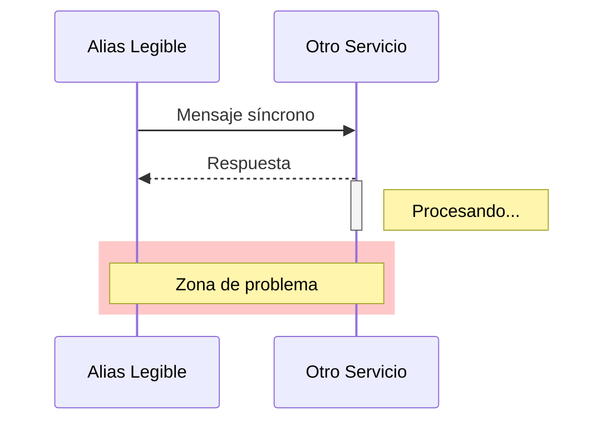

# Diagramas de Rendimiento: Detectar Cuellos de Botella

## 🎯 ¿Por Qué Diagramas de Secuencia?

Los diagramas de secuencia son **la herramienta ideal** para visualizar:

- ⏱️ **TIEMPO:** Duración de operaciones

- 🔒 **BLOQUEOS:** Llamadas síncronas que frenan el sistema

- 🔄 **DEPENDENCIAS:** Servicios externos que afectan performance

- 📊 **ORDEN:** Secuencia exacta de eventos

### Cuándo Usarlos

✅ "Este endpoint tarda mucho, ¿por qué?"  
✅ "¿Cuántas llamadas a BD hacemos en esta operación?"  
✅ "¿Por qué el usuario espera 10 segundos?"  
✅ "¿Podemos hacer esto asíncrono?"

---

## 🔴 Caso Real: Proceso de Facturación Bloqueante

### El Problema

**RNF Incumplido:**  
> "El sistema debe responder en < 2 segundos (p95)"

**Realidad:** El 80% de las facturas tardan **5-10 segundos** en generarse.

!!! info "📋 Copia este diagrama"
    Usa el botón de copiar en la esquina superior derecha del bloque de código y pruébalo en [Mermaid Live](https://mermaid.live)

### Análisis Visual

=== "📊 Diagrama"

    ```mermaid
    sequenceDiagram
        autonumber
        participant U as Usuario
        participant API as API Gateway
        participant S as Servicio Facturación
        participant AFIP as Ente Fiscal (Externo)

        Note over U, AFIP: ⚠️ RNF INCUMPLIDO: Latencia depende de tercero

        U->>API: 1. Solicitar Factura
        API->>S: 2. Crear Factura

        rect rgb(255, 200, 200)
            Note right of S: 🔥 CUELLO DE BOTELLA CRÍTICO
            S->>AFIP: 3. ¿Validar Comprobante?
            activate AFIP
            Note right of AFIP: ⏱️ Esto tarda 5-10 segundos...<br/>El usuario sigue esperando.
            AFIP-->>S: 4. OK Aprobado
            deactivate AFIP
        end

        S-->>API: 5. Factura Creada
        API-->>U: 6. Respuesta (200 OK)

        Note over U: 😞 Usuario esperó todo el proceso
    ```

=== "📋 Código Mermaid"

    ```text
    sequenceDiagram
        autonumber
        participant U as Usuario
        participant API as API Gateway
        participant S as Servicio Facturación
        participant AFIP as Ente Fiscal (Externo)

        Note over U, AFIP: ⚠️ RNF INCUMPLIDO: Latencia depende de tercero

        U->>API: 1. Solicitar Factura
        API->>S: 2. Crear Factura

        rect rgb(255, 200, 200)
            Note right of S: 🔥 CUELLO DE BOTELLA CRÍTICO
            S->>AFIP: 3. ¿Validar Comprobante?
            activate AFIP
            Note right of AFIP: ⏱️ Esto tarda 5-10 segundos...<br/>El usuario sigue esperando.
            AFIP-->>S: 4. OK Aprobado
            deactivate AFIP
        end

        S-->>API: 5. Factura Creada
        API-->>U: 6. Respuesta (200 OK)

        Note over U: 😞 Usuario esperó todo el proceso
    ```

### ¿Qué Revela el Diagrama?

1. **Paso 3:** Llamada SÍNCRONA a servicio externo (AFIP)

2. **Bloqueo:** El usuario espera mientras AFIP responde

3. **Sin control:** La latencia depende de un tercero

4. **Impacto:** Si AFIP cae, TODO el sistema se frena

---

## ✅ Solución Propuesta: Patrón Asíncrono

### Arquitectura Mejorada

=== "📊 Diagrama"

    ```mermaid
    sequenceDiagram
        autonumber
        participant U as Usuario
        participant API as API Gateway
        participant S as Servicio Facturación
        participant Q as Cola de Mensajes<br/>(RabbitMQ/SQS)
        participant W as Worker Async
        participant AFIP as Ente Fiscal

        Note over U, AFIP: ✅ SOLUCIÓN: Desacoplar validación externa

        U->>API: 1. Solicitar Factura
        API->>S: 2. Crear Factura (Pendiente)
        
        rect rgb(200, 255, 200)
            Note right of S: ⚡ Respuesta INMEDIATA
            S->>Q: 3. Encolar para validación
            S-->>API: 4. Factura Creada (Estado: Pendiente)
            API-->>U: 5. OK 202 Accepted
        end

        Note over U: 😊 Usuario continúa trabajando

        par Proceso en Background
            Q->>W: 6. Procesar mensaje
            W->>AFIP: 7. Validar comprobante
            activate AFIP
            Note right of AFIP: Esto sigue tardando 5s,<br/>pero NO afecta al usuario
            AFIP-->>W: 8. OK Aprobado
            deactivate AFIP
            W->>S: 9. Actualizar estado a "Aprobado"
            W->>U: 10. Notificar (WebSocket/Email)
        end
    ```

=== "📋 Código"

    ```text
    sequenceDiagram
        autonumber
        participant U as Usuario
        participant API as API Gateway
        participant S as Servicio Facturación
        participant Q as Cola de Mensajes<br/>(RabbitMQ/SQS)
        participant W as Worker Async
        participant AFIP as Ente Fiscal

        Note over U, AFIP: ✅ SOLUCIÓN: Desacoplar validación externa

        U->>API: 1. Solicitar Factura
        API->>S: 2. Crear Factura (Pendiente)
        
        rect rgb(200, 255, 200)
            Note right of S: ⚡ Respuesta INMEDIATA
            S->>Q: 3. Encolar para validación
            S-->>API: 4. Factura Creada (Estado: Pendiente)
            API-->>U: 5. OK 202 Accepted
        end

        Note over U: 😊 Usuario continúa trabajando

        par Proceso en Background
            Q->>W: 6. Procesar mensaje
            W->>AFIP: 7. Validar comprobante
            activate AFIP
            Note right of AFIP: Esto sigue tardando 5s,<br/>pero NO afecta al usuario
            AFIP-->>W: 8. OK Aprobado
            deactivate AFIP
            W->>S: 9. Actualizar estado a "Aprobado"
            W->>U: 10. Notificar (WebSocket/Email)
        end
    ```

### Beneficios de la Solución

| Antes | Después |
|-------|---------|
| ❌ Latencia: 5-10 segundos | ✅ Latencia: < 500ms |
| ❌ Bloqueo del usuario | ✅ Respuesta inmediata |
| ❌ Si AFIP cae, sistema cae | ✅ Reintentos automáticos |
| ❌ No escala | ✅ Procesa miles concurrentemente |

---

## 📊 Otros Patrones de Performance

### 1. N+1 Queries (Problema Común)

=== "📊 Diagrama"

    ```mermaid
    sequenceDiagram
        participant API
        participant DB as Base de Datos

        Note over API, DB: ❌ ANTI-PATRÓN: N+1 Queries

        API->>DB: SELECT * FROM users LIMIT 10
        DB-->>API: ["10 usuarios"]

        loop Por cada usuario (10 veces)
            API->>DB: SELECT * FROM orders WHERE user_id = ?
            DB-->>API: Órdenes del usuario
        end

        Note over API: 11 queries totales (1 + 10)
    ```

=== "📋 Código"

    ```text
    sequenceDiagram
        participant API
        participant DB as Base de Datos

        Note over API, DB: ❌ ANTI-PATRÓN: N+1 Queries

        API->>DB: SELECT * FROM users LIMIT 10
        DB-->>API: [10 usuarios]

        loop Por cada usuario (10 veces)
            API->>DB: SELECT * FROM orders WHERE user_id = ?
            DB-->>API: Órdenes del usuario
        end

        Note over API: 11 queries totales (1 + 10)
    ```

**Solución:** Usar JOIN o batching:

=== "📊 Diagrama"

    ```mermaid
    sequenceDiagram
        participant API
        participant DB

        Note over API, DB: ✅ SOLUCIÓN: Eager Loading

        API->>DB: SELECT users.*, orders.*<br/>FROM users<br/>JOIN orders ON users.id = orders.user_id<br/>LIMIT 10
        DB-->>API: Datos completos

        Note over API: 1 sola query
    ```

=== "📋 Código"

    ```text
    sequenceDiagram
        participant API
        participant DB

        Note over API, DB: ✅ SOLUCIÓN: Eager Loading

        API->>DB: SELECT users.*, orders.*<br/>FROM users<br/>JOIN orders ON users.id = orders.user_id<br/>LIMIT 10
        DB-->>API: Datos completos

        Note over API: 1 sola query
    ```

---

### 2. Cache Miss Cascade

=== "📊 Diagrama"

    ```mermaid
    sequenceDiagram
        participant U as Usuario
        participant API
        participant Cache as Redis Cache
        participant DB as Base de Datos
        participant Ext as API Externa

        U->>API: GET /dashboard
        
        API->>Cache: ¿Datos en cache?
        Cache-->>API: MISS (no hay)
        
        rect rgb(255, 220, 220)
            Note right of API: Reconstrucción costosa
            API->>DB: Query compleja (2s)
            DB-->>API: Datos
            API->>Ext: Enriquecer datos (3s)
            Ext-->>API: Info adicional
        end
        
        API->>Cache: Guardar en cache (TTL: 5min)
        API-->>U: Respuesta (5 segundos)

        Note over U, Ext: Primera carga lenta, siguientes rápidas
    ```

=== "📋 Código"

    ```text
    sequenceDiagram
        participant U as Usuario
        participant API
        participant Cache as Redis Cache
        participant DB as Base de Datos
        participant Ext as API Externa

        U->>API: GET /dashboard
        
        API->>Cache: ¿Datos en cache?
        Cache-->>API: MISS (no hay)
        
        rect rgb(255, 220, 220)
            Note right of API: Reconstrucción costosa
            API->>DB: Query compleja (2s)
            DB-->>API: Datos
            API->>Ext: Enriquecer datos (3s)
            Ext-->>API: Info adicional
        end
        
        API->>Cache: Guardar en cache (TTL: 5min)
        API-->>U: Respuesta (5 segundos)

        Note over U, Ext: Primera carga lenta, siguientes rápidas
    ```

**Estrategias:**

- **Cache warming:** Precalentar cache en deploy

- **Cache aside:** Actualizar cache en escrituras

- **Stale-while-revalidate:** Servir cache viejo mientras actualizas

---

## 🛠️ Cómo Crear Estos Diagramas

### Sintaxis Básica de Secuencia en Mermaid

```markdown

```

### Elementos Útiles

| Sintaxis | Efecto |
|----------|--------|
| `A->>B:` | Flecha sólida (llamada) |
| `B-->>A:` | Flecha punteada (respuesta) |
| `activate A` | Barra de activación |
| `autonumber` | Numerar mensajes |
| `rect rgb(r,g,b)` | Resaltar zona |
| `Note over A, B:` | Anotación |
| `par ... end` | Procesos paralelos |
| `loop ... end` | Iteraciones |

---

## 💡 Tips para Diagramas de Performance

### 1. Resalta el Problema
Usa colores para indicar zonas problemáticas:

- 🔴 Rojo (`rgb(255, 200, 200)`) → Cuello de botella

- 🟢 Verde (`rgb(200, 255, 200)`) → Solución

- 🟡 Amarillo (`rgb(255, 255, 200)`) → Advertencia

### 2. Anota Tiempos

=== "📊 Diagrama"

    ```mermaid
    sequenceDiagram
        A->>B: Query
        Note right of B: ⏱️ 2.5s promedio
        B-->>A: Result
    ```

=== "📋 Código"

    ```text
    sequenceDiagram
        A->>B: Query
        Note right of B: ⏱️ 2.5s promedio
        B-->>A: Result
    ```

### 3. Compara Antes/Después
Dos diagramas lado a lado muestran el impacto.

### 4. Limita Participantes
No más de 5-6 servicios por diagrama. Si es complejo, divídelo.

---

## 🎯 Casos de Uso Reales

### Cuándo usar Diagramas de Secuencia:

✅ Debugging de latencia  
✅ Análisis de transacciones distribuidas  
✅ Documentar flujos de autenticación  
✅ Planificar migraciones (sync → async)  
✅ Code reviews de lógica compleja  
✅ Onboarding de desarrolladores  

### Cuándo NO usarlos:

❌ Arquitectura general (usa C4)  
❌ Flujos de datos sensibles (usa DFD)  
❌ Estructura de código (usa diagramas de componentes)  

---

## 📚 Recursos Adicionales

- **Mermaid Sequence Diagram Docs:** https://mermaid.js.org/syntax/sequenceDiagram.html

- **Patrón CQRS:** Command Query Responsibility Segregation

- **Event-Driven Architecture:** Para desacoplar servicios

- **Circuit Breaker Pattern:** Resiliencia ante fallos de terceros

---

> 💡 **Tip Final:** Cada vez que veas "este proceso es lento", dibuja el diagrama de secuencia PRIMERO. El problema suele saltar a la vista.
