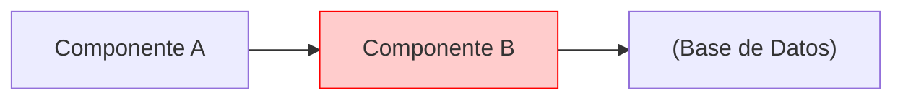

# Diagramas de Seguridad: Auditar Flujos de Datos

## 🔒 ¿Por Qué Diagramas de Flujo de Datos (DFD)?

Los **Data Flow Diagrams** son ideales para:

- 🔍 **Auditar:** ¿Dónde viajan datos sensibles?

- 🛡️ **Compliance:** GDPR, PCI-DSS, ISO 27001

- 🚨 **Threat Modeling:** Identificar vectores de ataque

- 📋 **Trazabilidad:** ¿Qué datos se loguean?

### Cuándo Usarlos

✅ Auditorías de seguridad  
✅ Análisis de privacidad (PII)  
✅ Validar encriptación end-to-end  
✅ Detectar logging de datos sensibles  
✅ Certificaciones (ISO, SOC 2)  

---

## 🚨 Caso Real: Fuga de Contraseñas en Logs

### El Problema

**RNF Incumplido:**  
> "Los datos sensibles (PII) NUNCA deben almacenarse en texto plano"

**Realidad:** Las contraseñas se estaban logueando sin encriptar.

!!! danger "🔒 Diagrama de Seguridad"
    Copia este diagrama (botón superior derecho) y ábrelo en [Mermaid Live](https://mermaid.live) para analizarlo mejor.

### Análisis Visual

=== "📊 Diagrama"

    ```mermaid
    graph LR
        %% Definición de Nodos
        User(("Usuario Final"))
        WebApp["Aplicación Web"]
        LogSys["Sistema de Logs<br/>Datadog/Splunk"]
        DB["(Base de Datos<br/>Usuarios)"]
        
        %% Estilos para resaltar el peligro
        classDef danger fill:#ffcccc,stroke:#ff0000,stroke-width:2px,color:#000;
        classDef safe fill:#ccffcc,stroke:#006600,stroke-width:2px,color:#000;

        %% El Flujo
        User -- "1. Envía Credenciales" --> WebApp
        
        subgraph Segura["✅ Zona Segura"]
            WebApp -- "2. Hash del Password" --> DB
            DB -- "3. Valida OK" --> WebApp
        end

        subgraph Riesgo["⚠️ Zona de Riesgo"]
            WebApp -- "4. Loguea Request Body Completo" --> LogSys
        end

        %% Anotación del problema
        Note["🔥 ALERTA DE SEGURIDAD<br/>Password en texto plano en logs<br/>Violación ISO 27001"]
        
        LogSys -.-> Note
        
        %% Aplicar estilos
        class LogSys,Note danger;
        class DB safe;
    ```

=== "📋 Código Mermaid"

    ```text
    graph LR
        %% Definición de Nodos
        User((Usuario Final))
        WebApp[Aplicación Web]
        LogSys[Sistema de Logs<br/>Datadog/Splunk]
        DB[(Base de Datos<br/>Usuarios)]
        
        %% Estilos para resaltar el peligro
        classDef danger fill:#ffcccc,stroke:#ff0000,stroke-width:2px,color:#000;
        classDef safe fill:#ccffcc,stroke:#006600,stroke-width:2px,color:#000;

        %% El Flujo
        User -- "1. Envía Credenciales" --> WebApp
        
        subgraph Segura["✅ Zona Segura"]
            WebApp -- "2. Hash del Password" --> DB
            DB -- "3. Valida OK" --> WebApp
        end

        subgraph Riesgo["⚠️ Zona de Riesgo"]
            WebApp -- "4. Loguea Request Body Completo" --> LogSys
        end

        %% Anotación del problema
        Note[🔥 ALERTA DE SEGURIDAD<br/>Password en texto plano en logs<br/>Violación ISO 27001]
        
        LogSys -.-> Note
        
        %% Aplicar estilos
        class LogSys,Note danger;
        class DB safe;
        
        %% Aplicar estilos
        class LogSys,Note danger;
        class DB safe;
    ```

### ¿Qué Revela el Diagrama?

1. ✅ **Zona Segura:** Password se hashea ANTES de guardar en BD

2. ❌ **Zona de Riesgo:** Request body completo va a logs externos

3. 🚨 **Impacto:** Logs en texto plano accesibles por DevOps, vendors, etc.

4. ⚖️ **Compliance:** Violación de GDPR, PCI-DSS, ISO 27001

---

## ✅ Solución: Sanitización de Logs

### Arquitectura Corregida

=== "📊 Diagrama"

    ```mermaid
    graph LR
        User((Usuario))
        WebApp["Aplicación Web"]
        Sanitizer["Filtro de Logs<br/>Middleware"]
        LogSys["Sistema de Logs"]
        DB["(Base de Datos)"]
        
        classDef safe fill:#ccffcc,stroke:#006600,stroke-width:2px,color:#000;
        classDef neutral fill:#e0e0e0,stroke:#666,color:#000;
        
        User -- "1. Credenciales" --> WebApp
        
        subgraph "Procesamiento Seguro"
            WebApp -- "2. Hash password" --> DB
            WebApp -- "3. Request sin password" --> Sanitizer
            Sanitizer -- "4. JSON sanitizado:<br/>{user: 'john', pass: '***'}" --> LogSys
        end
        
        Note["✅ SOLUCIÓN:<br/>Middleware elimina campos sensibles<br/>ANTES de loguear"]
        Sanitizer -.- Note
        
        class WebApp,Sanitizer,DB,LogSys safe;
    ```

=== "📋 Código"

    ```text
    graph LR
        User((Usuario))
        WebApp[Aplicación Web]
        Sanitizer[Filtro de Logs<br/>Middleware]
        LogSys[Sistema de Logs]
        DB[(Base de Datos)]
        
        classDef safe fill:#ccffcc,stroke:#006600,stroke-width:2px,color:#000;
        classDef neutral fill:#e0e0e0,stroke:#666,color:#000;
        
        User -- "1. Credenciales" --> WebApp
        
        subgraph "Procesamiento Seguro"
            WebApp -- "2. Hash password" --> DB
            WebApp -- "3. Request sin password" --> Sanitizer
            Sanitizer -- "4. JSON sanitizado:<br/>{user: 'john', pass: '***'}" --> LogSys
        end
        
        Note[✅ SOLUCIÓN:<br/>Middleware elimina campos sensibles<br/>ANTES de loguear]
        Sanitizer -.- Note
        
        class WebApp,Sanitizer,DB,LogSys safe;
    ```

### Código de Ejemplo (Node.js)

```javascript
// Middleware para sanitizar logs
const sanitizeLog = (req, res, next) => {
  const sanitized = { ...req.body };
  
  // Lista de campos sensibles
  const sensitiveFields = ['password', 'token', 'credit_card', 'ssn'];
  
  sensitiveFields.forEach(field => {
    if (sanitized[field]) {
      sanitized[field] = '***REDACTED***';
    }
  });
  
  // Loguear versión sanitizada
  logger.info('Request received', { 
    path: req.path, 
    body: sanitized 
  });
  
  next();
};

app.use(sanitizeLog);
```

---

## 🔍 Otros Casos de Uso de DFD en Seguridad

### 1. Validar Encriptación en Tránsito

=== "📊 Diagrama"

    ```mermaid
    graph LR
        Mobile["App Móvil"]
        LB["Load Balancer"]
        API["API Server"]
        DB[(Database)]
        
        classDef encrypted fill:#ccffcc,stroke:#006600,stroke-width:2px,color:#000;
        classDef unencrypted fill:#ffcccc,stroke:#ff0000,stroke-width:2px,color:#000;
        
        Mobile -- "HTTPS (TLS 1.3)" --> LB
        LB -- "HTTP (Interno)" --> API
        API -- "TLS/SSL" --> DB
        
        Note1["✅ Encriptado"]
        Note2["⚠️ Red interna<br/>¿VPC privada?"]
        Note3["✅ Encriptado"]
    ```

=== "📋 Código"

    ```text
    graph LR
        Mobile[App Móvil]
        LB[Load Balancer]
        API[API Server]
        DB[(Database)]
        
        classDef encrypted fill:#ccffcc,stroke:#006600,stroke-width:2px,color:#000;
        classDef unencrypted fill:#ffcccc,stroke:#ff0000,stroke-width:2px,color:#000;
        
        Mobile -- "HTTPS (TLS 1.3)" --> LB
        LB -- "HTTP (Interno)" --> API
        API -- "TLS/SSL" --> DB
        
        Note1[✅ Encriptado]
        Note2[⚠️ Red interna<br/>¿VPC privada?]
        Note3[✅ Encriptado]
    ```
    
    Mobile -.-> Note1
    LB -.-> Note2
    API -.-> Note3
    
    class Mobile,LB encrypted;
    class API unencrypted;
    class DB encrypted;
```

**Pregunta que responde:**  
> "¿En qué tramo del flujo los datos viajan sin encriptar?"

---

### 2. Auditoría de Acceso a Datos Sensibles (GDPR)

=== "📊 Diagrama"

    ```mermaid
    graph TB
        User["Usuario EU"]
        App["Aplicación"]
        API["API Gateway"]
        Auth["Servicio Auth"]
        UserDB["(Users DB<br/>PII Data)"]
        Analytics["(Analytics DB<br/>Anonymized)"]
        Logs["Audit Logs"]
        
        classDef pii fill:#ffcccc,stroke:#ff0000,stroke-width:2px,color:#000;
        classDef anonymized fill:#ccffcc,stroke:#006600,stroke-width:2px,color:#000;
        
        User -->|1. Login| App
        App -->|2. Autenticar| Auth
        Auth -->|3. Validar| UserDB
        UserDB -->|"4. User Data (PII)"| Auth
        Auth -->|5. Token JWT| App
        
        App -->|6. Request con Token| API
        API -->|7. Registrar acceso| Logs
        API -->|8. Query anónimo| Analytics
        
        Note["🔒 GDPR Compliance:<br/>- PII solo en UserDB<br/>- Analytics anonimizado<br/>- Audit log de todos los accesos"]
        
        UserDB -.-> Note
        
        class UserDB pii;
        class Analytics anonymized;
    ```

=== "📋 Código"

    ```text
    graph TB
        User[Usuario EU]
        App[Aplicación]
        API[API Gateway]
        Auth[Servicio Auth]
        UserDB[(Users DB<br/>PII Data)]
        Analytics["(Analytics DB<br/>Anonymized)"]
        Logs[Audit Logs]
        
        classDef pii fill:#ffcccc,stroke:#ff0000,stroke-width:2px,color:#000;
        classDef anonymized fill:#ccffcc,stroke:#006600,stroke-width:2px,color:#000;
        
        User -->|1. Login| App
        App -->|2. Autenticar| Auth
        Auth -->|3. Validar| UserDB
        UserDB -->|"4. User Data (PII)"| Auth
        Auth -->|5. Token JWT| App
        
        App -->|6. Request con Token| API
        API -->|7. Registrar acceso| Logs
        API -->|8. Query anónimo| Analytics
        
        Note[🔒 GDPR Compliance:<br/>- PII solo en UserDB<br/>- Analytics anonimizado<br/>- Audit log de todos los accesos]
        
        UserDB -.-> Note
        
        class UserDB pii;
        class Analytics anonymized;
    ```

**Casos de Uso:**

- Right to be Forgotten (GDPR Art. 17)

- Data Portability (GDPR Art. 20)

- Auditorías de compliance

---

### 3. Threat Modeling: SQL Injection

=== "📊 Diagrama"

    ```mermaid
    graph LR
        Attacker(("🔴 Atacante"))
        WAF["Web App Firewall"]
        App["Aplicación"]
        DB["(Base de Datos)"]
        
        classDef blocked fill:#ccffcc,stroke:#006600,stroke-width:2px,color:#000;
        classDef vulnerable fill:#ffcccc,stroke:#ff0000,stroke-width:2px,color:#000;
        
        Attacker -- "' OR 1=1--" --> WAF
        WAF -- "❌ BLOQUEADO" --> Attacker
        
        WAF -- "Input sanitizado" --> App
        App -- "Query parametrizada" --> DB
        
        Note1["✅ Defensa 1: WAF<br/>Detecta patrones maliciosos"]
        Note2["✅ Defensa 2: Prepared Statements<br/>Previene inyección"]
        
        WAF -.-> Note1
        App -.-> Note2
        
        class WAF,App,DB blocked;
    ```

=== "📋 Código"

    ```text
    graph LR
        Attacker((🔴 Atacante))
        WAF[Web App Firewall]
        App[Aplicación]
        DB[(Base de Datos)]
        
        classDef blocked fill:#ccffcc,stroke:#006600,stroke-width:2px,color:#000;
        classDef vulnerable fill:#ffcccc,stroke:#ff0000,stroke-width:2px,color:#000;
        
        Attacker -- "' OR 1=1--" --> WAF
        WAF -- "❌ BLOQUEADO" --> Attacker
        
        WAF -- "Input sanitizado" --> App
        App -- "Query parametrizada" --> DB
        
        Note1[✅ Defensa 1: WAF<br/>Detecta patrones maliciosos]
        Note2[✅ Defensa 2: Prepared Statements<br/>Previene inyección]
        
        WAF -.-> Note1
        App -.-> Note2
        
        class WAF,App,DB blocked;
    ```

---

## 🎨 Cómo Crear DFDs en Mermaid

### Sintaxis Básica

```markdown

```

### Elementos de DFD

| Elemento | Sintaxis | Uso |
|----------|----------|-----|
| Proceso | `A[Proceso]` | Transformación de datos |
| Almacenamiento | `DB[(Database)]` | Persistencia |
| Entidad externa | `User((Usuario))` | Actores externos |
| Flujo de datos | `A --> B` | Movimiento de información |
| Anotación | `Note[Texto]` | Explicaciones |

### Estilos para Seguridad

```markdown
classDef safe fill:#ccffcc,stroke:#006600,stroke-width:2px;
classDef danger fill:#ffcccc,stroke:#ff0000,stroke-width:2px;
classDef warning fill:#ffffcc,stroke:#ff9900,stroke-width:2px;

class ComponenteSeguro safe;
class ComponenteVulnerable danger;
class ComponenteSospechoso warning;
```

---

## 🛡️ Checklist de Seguridad con DFDs

Usa DFDs para validar:

### Datos en Tránsito

- [ ] ¿Todos los flujos usan HTTPS/TLS?

- [ ] ¿Las APIs internas están en VPC privada?

- [ ] ¿Se valida el certificado SSL?

### Datos en Reposo

- [ ] ¿Los passwords están hasheados (bcrypt/argon2)?

- [ ] ¿Los datos sensibles tienen encriptación at-rest?

- [ ] ¿Las claves están en secretos (no en código)?

### Logs y Auditoría

- [ ] ¿Se sanitizan datos sensibles ANTES de loguear?

- [ ] ¿Los logs están en storage seguro (no público)?

- [ ] ¿Hay audit trail de accesos a PII?

### Autenticación/Autorización

- [ ] ¿Dónde se validan los tokens?

- [ ] ¿Qué servicios tienen acceso a datos sensibles?

- [ ] ¿Hay rate limiting en endpoints críticos?

---

## 📋 Plantilla de Análisis de Seguridad

Cuando analices un flujo, documenta:

````markdown
## Análisis de Seguridad: [Nombre del Flujo]

### Datos Sensibles Involucrados

- Passwords

- Tokens de sesión

- PII (emails, teléfonos)

- Datos financieros

### Diagrama de Flujo de Datos
```mermaid
["Tu diagrama aquí"]
```

### Hallazgos
| Severidad | Problema | Ubicación | Solución |
|-----------|----------|-----------|----------|
| 🔴 Crítico | Passwords en logs | Middleware X | Sanitizar |
| 🟡 Medio | HTTP interno | LB → API | Migrar a HTTPS |

### Cumplimiento

- [ ] GDPR compliant

- [ ] PCI-DSS compliant

- [ ] ISO 27001 compliant
````

---

## 🎯 Casos de Uso Reales

### Cuándo usar DFD:

✅ Auditorías de seguridad  
✅ Threat modeling (STRIDE, PASTA)  
✅ Certificaciones de compliance  
✅ Análisis de privacidad (GDPR, CCPA)  
✅ Code reviews de features sensibles  
✅ Onboarding de security team  

### Cuándo NO usarlos:

❌ Análisis de performance (usa Secuencia)  
❌ Arquitectura general (usa C4)  
❌ Flujos de lógica de negocio (usa Flowchart)  

---

## 📚 Recursos de Seguridad

- **OWASP Top 10:** https://owasp.org/www-project-top-ten/

- **STRIDE Threat Model:** Microsoft's threat modeling framework

- **GDPR Compliance Checklist:** https://gdpr.eu/checklist/

- **PCI-DSS Requirements:** https://www.pcisecuritystandards.org/

---

## 🔗 Integración con Herramientas

### Automatización

```yaml
# .github/workflows/security-audit.yml
name: Security Audit
on: [pull_request]
jobs:
  scan:
    runs-on: ubuntu-latest
    steps:
      - uses: actions/checkout@v2
      - name: Check for secrets in logs
        run: |
          grep -r "password\|token\|api_key" src/logs/ && exit 1 || exit 0
```

### Integración con SIEM

- Exportar logs sanitizados a Splunk/Datadog

- Alertas automáticas si se detectan patrones sensibles

- Dashboards de compliance en tiempo real

---

> 💡 **Tip Final:** Cada vez que manejes datos sensibles, dibuja el DFD PRIMERO. Si algo se ve raro en el diagrama, probablemente lo es.
