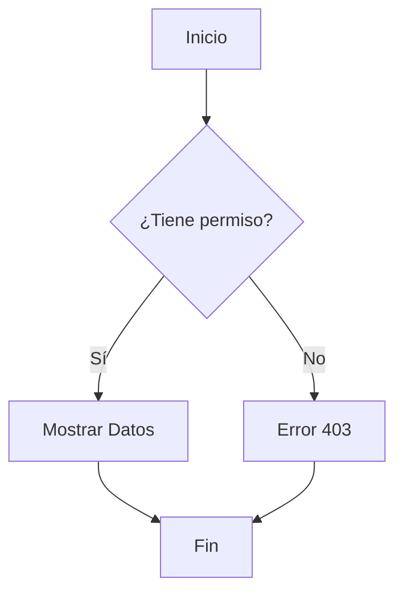
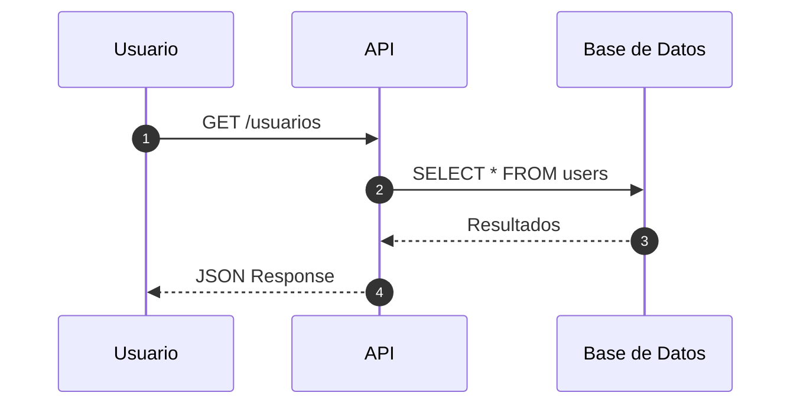
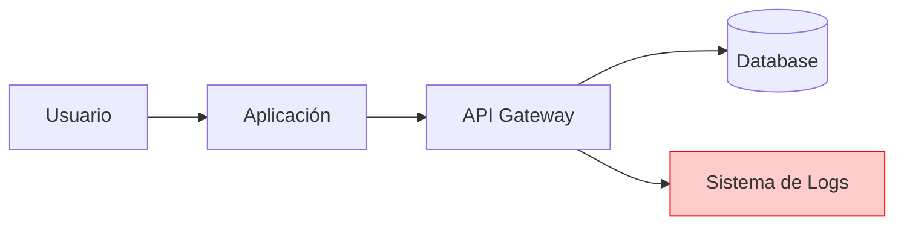
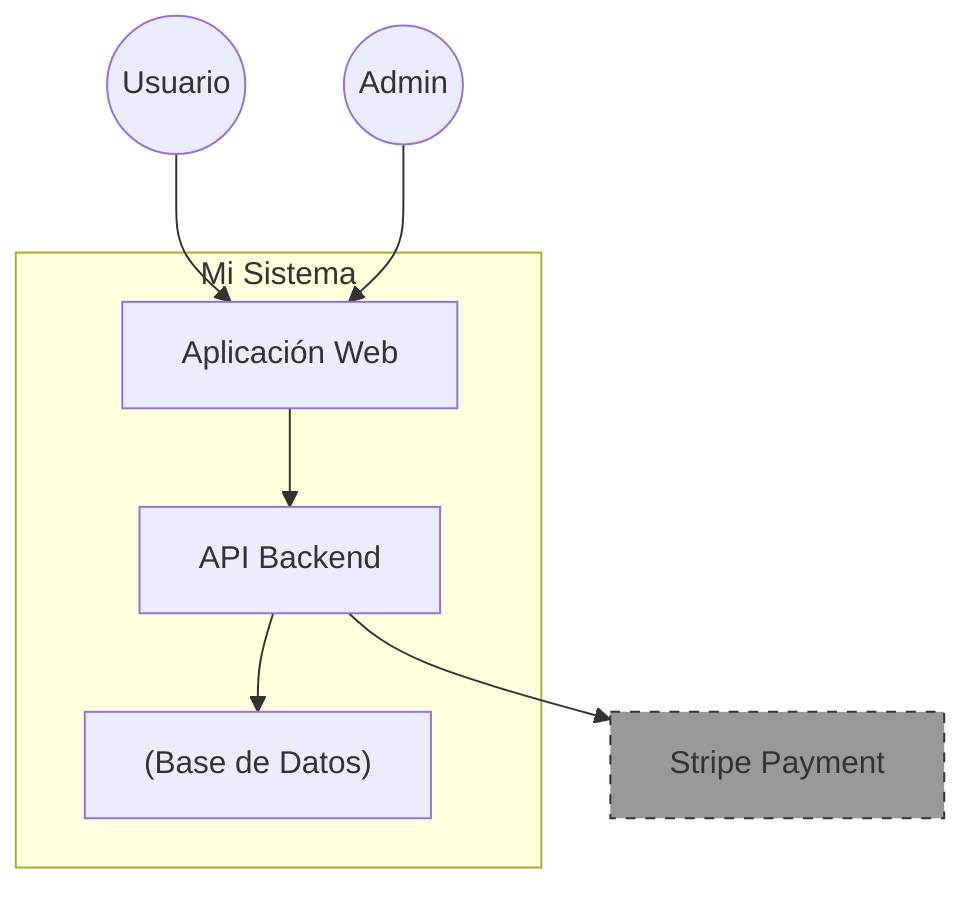
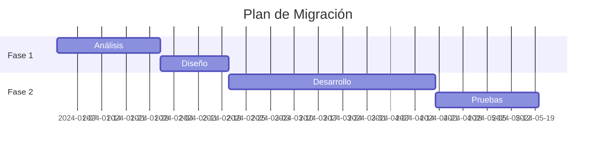

# Tutorial: MkDocs + Mermaid en 15 Minutos

## 🚀 Setup Rápido

### 1. Instalación (Una Sola Vez)

```bash
# Instalar MkDocs y el tema Material
pip install mkdocs mkdocs-material

# Instalar el plugin de Mermaid
pip install mkdocs-mermaid2-plugin
```

### 2. Crear un Proyecto Nuevo

```bash
# Crear proyecto
mkdocs new mi-documentacion
cd mi-documentacion

# Estructura generada automáticamente:
# mi-documentacion/
#   ├── mkdocs.yml        # Configuración
#   └── docs/
#       └── index.md      # Página principal
```

---

## ⚙️ Configuración: mkdocs.yml

Este es el archivo de configuración. Copia esto:

```yaml
site_name: Mi Documentación de Arquitectura

theme:
  name: material
  language: es
  palette:
    - scheme: default
      primary: indigo
      toggle:
        icon: material/brightness-7
        name: Cambiar a modo oscuro
    - scheme: slate
      primary: indigo
      toggle:
        icon: material/brightness-4
        name: Cambiar a modo claro
  features:
    - navigation.sections
    - navigation.expand
    - navigation.top
    - search.suggest
    - content.code.copy

plugins:
  - search:
      lang: es
  - mermaid2:
      version: 11.12.0
      arguments:
        theme: default  # El mismo tema que usa Mermaid Live
```

**Temas disponibles:**

- `default` - ⭐ **Recomendado** (igual que Mermaid Live)

- `dark` - Para modo oscuro

- `forest` - Verde/natural

- `neutral` - Minimalista gris

!!! tip "💡 Usa el tema default"
    Este proyecto usa `theme: default` que es exactamente el mismo que usa [Mermaid Live](https://mermaid.live), así tus diagramas se ven idénticos en ambos lugares.

markdown_extensions:
  - pymdownx.superfences:
      custom_fences:
        - name: mermaid
          class: mermaid
          format: !!python/name:mermaid2.fence_mermaid
  - admonition
  - pymdownx.details
  - tables
  - toc:
      permalink: true

nav:
  - Inicio: index.md
  - Arquitectura: arquitectura.md
  - Rendimiento: rendimiento.md
```

**Explicación de las partes clave:**

- `theme: material` → Tema moderno y profesional

- `plugins: mermaid2` → Habilita diagramas Mermaid

- `markdown_extensions` → Habilita tablas, admonitions, code fences

- `nav:` → Menú de navegación

---

## 📝 Cómo Escribir Contenido con Diagramas Mermaid

### Estructura de un Archivo .md

Crea un archivo `docs/arquitectura.md`:

````markdown
# Mi Arquitectura

## Descripción General
Aquí va texto normal en Markdown.

## Diagrama del Sistema

Este es un diagrama **embebido** con tabs (renderizado + código copiable):

=== "📊 Diagrama"

    ```mermaid
    graph LR
        A[Usuario] --> B[Frontend]
        B --> C["Backend API"]
        C --> D["(Base de Datos)"]
    ```

=== "📋 Código Mermaid"

    ```text
    graph LR
        A[Usuario] --> B[Frontend]
        B --> C[Backend API]
        C --> D[(Base de Datos)]
    ```

## Explicación

- El **tab "Diagrama"** muestra el diagrama renderizado

- El **tab "Código"** tiene botón de copiar para pegar en Mermaid Live
````

**Puntos clave:**

1. Los diagramas van en bloques de código con ` ```mermaid `

2. Usa tabs (`=== "Nombre"`) para mostrar diagrama + código

3. El tab de código usa ` ```text ` para que tenga botón copiar

4. Puedes mezclar todo con Markdown normal

---

## 🎨 Tipos de Diagramas Mermaid (Ejemplos Copiables)

!!! tip "🚀 Experimenta en Tiempo Real"
    Todos estos ejemplos los puedes copiar (botón en esquina superior derecha de cada bloque) y pegarlos en **[Mermaid Live Editor](https://mermaid.live)** para modificarlos y ver cambios instantáneos.

### 1. Diagrama de Flujo (Flowchart)

````markdown

````

**Cuándo usarlo:** Decisiones, flujos de negocio, procesos

---

### 2. Diagrama de Secuencia

````markdown

````

**Cuándo usarlo:** Analizar tiempos, detectar bloqueos, llamadas entre servicios

---

### 3. Diagrama de Flujo de Datos (DFD)

````markdown

````

**Cuándo usarlo:** Seguridad, privacidad, auditorías de datos sensibles

---

### 4. Diagrama C4 (Contexto)

````markdown

````

**Cuándo usarlo:** Presentaciones ejecutivas, vista general del sistema

---

### 5. Diagrama de Gantt (Cronogramas)

````markdown

````

**Cuándo usarlo:** Planificación de proyectos, roadmaps

---

## 🎯 Admonitions (Bloques de Alerta)

Además de diagramas, usa estas cajas para destacar información:

```markdown
!!! warning "Atención"
    Este servicio tiene un problema de rendimiento conocido.

!!! info "Nota"
    La documentación se actualiza automáticamente.

!!! danger "Crítico"
    Esto expone contraseñas en logs.

!!! tip "Buena Práctica"
    Usa async/await para llamadas externas.
```

---

## 🖥️ Comandos Esenciales

### Modo Desarrollo (Con Live Reload)

```bash
mkdocs serve
```

Esto:

- Levanta un servidor local en http://127.0.0.1:8000

- Se actualiza automáticamente cuando guardas cambios

- Perfecto para escribir documentación

### Generar Sitio Estático

```bash
mkdocs build
```

Genera la carpeta `site/` con HTML listo para desplegar.

### Desplegar a GitHub Pages

```bash
mkdocs gh-deploy
```

Sube la documentación a `https://tu-usuario.github.io/tu-repo`

---

## 📦 Estructura de Proyecto Completa

```
mi-proyecto/
├── mkdocs.yml              # Configuración
├── docs/
│   ├── index.md            # Página principal
│   ├── arquitectura.md     # Diagramas C4
│   ├── rendimiento.md      # Diagramas de secuencia
│   ├── seguridad.md        # DFDs
│   └── img/                # Imágenes adicionales (si necesitas)
├── site/                   # Generado por mkdocs build (ignorar en Git)
└── .gitignore              # Agregar: site/
```

---

## 🎓 Ejercicio Práctico (5 minutos)

**Crea tu primera documentación:**

1. Crea una carpeta nueva

2. Ejecuta `mkdocs new test-docs && cd test-docs`

3. Edita `mkdocs.yml` con la configuración de arriba

4. Crea `docs/diagrama.md` con un diagrama de secuencia

5. Ejecuta `mkdocs serve`

6. Abre http://localhost:8000

**¡Ya tienes documentación profesional!**

---

## 🔗 Recursos Útiles

- **Mermaid Live Editor:** [https://mermaid.live](https://mermaid.live) ⭐ **(Prueba diagramas en tiempo real)**

- **Documentación MkDocs:** [https://www.mkdocs.org](https://www.mkdocs.org)

- **Material Theme:** [https://squidfunk.github.io/mkdocs-material/](https://squidfunk.github.io/mkdocs-material/)

- **Mermaid Docs:** [https://mermaid.js.org/intro/](https://mermaid.js.org/intro/)

- **Mermaid Cheat Sheet:** [https://jojozhuang.github.io/tutorial/mermaid-cheat-sheet/](https://jojozhuang.github.io/tutorial/mermaid-cheat-sheet/)

!!! tip "💡 Flujo de Trabajo Recomendado"
    1. Diseña el diagrama en [Mermaid Live](https://mermaid.live)
    2. Copia el código cuando esté listo
    3. Pégalo en tu archivo `.md` en MkDocs
    4. Commitea a Git como código

---

## ✅ Checklist de Implementación

Usa esto cuando vayas a documentar un proyecto real:

- [ ] Instalar MkDocs + Material + Mermaid2

- [ ] Crear `mkdocs.yml` con configuración base

- [ ] Crear estructura de carpetas `docs/`

- [ ] Escribir `index.md` con introducción

- [ ] Agregar diagramas según necesidad:
  - [ ] C4 para arquitectura general
  - [ ] Secuencia para análisis de rendimiento
  - [ ] DFD para seguridad/compliance

- [ ] Configurar CI/CD para auto-deploy (GitHub Actions/GitLab CI)

- [ ] Agregar `site/` al `.gitignore`

---

> 💡 **Pro Tip:** Guarda snippets de diagramas frecuentes en un archivo `plantillas.md` para reusar.
