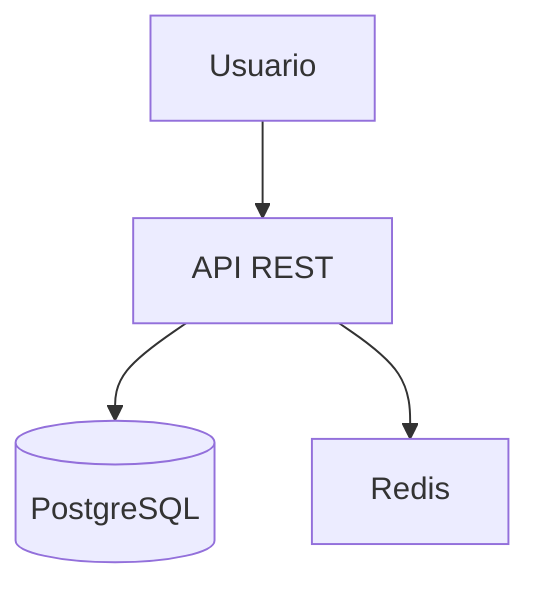

# Documentación y Diagramas as Code
## Una Capacitación Práctica

<div class="hero-banner">
  <div class="hero-author">
    <strong>Santiago Ramírez</strong>
    <p>Ingeniero de Sistemas</p>
  </div>
  
  <h1>
    <svg viewBox="0 0 24 24" xmlns="http://www.w3.org/2000/svg" width="45" height="45" style="vertical-align: middle; fill: white; margin-right: 0.5rem;">
      <path d="M12 8a3 3 0 0 0 3-3 3 3 0 0 0-3-3 3 3 0 0 0-3 3 3 3 0 0 0 3 3m0 3.54C9.64 9.35 6.5 8 3 8v11c3.5 0 6.64 1.35 9 3.54 2.36-2.19 5.5-3.54 9-3.54V8c-3.5 0-6.64 1.35-9 3.54"></path>
    </svg>
    Docs as Code 
    <span style="font-size: 2rem; margin: 0 1rem;">+</span> 
    
    Diagrams as Code
  </h1>
  
  <p style="font-size: 1.4rem; font-weight: 500; margin-top: 1.5rem;">MkDocs + Mermaid: El stack moderno de documentación</p>
  
  <!-- <p style="font-size: 1.1rem; margin-top: 2rem; opacity: 0.95;">
    De la complejidad a la simplicidad.<br>
    De horas a minutos.<br>
    De documentación obsoleta a código vivo.
  </p> -->
</div>

---

## 💭 La Verdad Sobre Documentar

**¿Por qué documentar suele ser la ÚLTIMA tarea que hacemos?**

Porque tenemos la idea de que es:

- ❌ Una tarea **compleja**

- ❌ Algo **aburrido**

- ❌ Que consume **mucho tiempo**

- ❌ Que queda **obsoleto** rápidamente

### 🚀 Pero Eso Quedó Atrás

**Con las nuevas tecnologías, la documentación cambió radicalmente:**

<div style="text-align: center; padding: 2rem 1.5rem; background: linear-gradient(135deg, #f5f7fa 0%, #c3cfe2 100%); border-radius: 8px; margin: 1.5rem 0; box-shadow: 0 4px 15px rgba(0,0,0,0.1);">
  <h3 style="margin: 0; color: #1e293b; font-size: 1.5rem; display: flex; align-items: center; justify-content: center; gap: 1rem; flex-wrap: wrap;">
    <span style="display: inline-flex; align-items: center; gap: 0.5rem;">
      <svg viewBox="0 0 24 24" xmlns="http://www.w3.org/2000/svg" width="35" height="35" style="fill: #8b5cf6;">
        <path d="M17.55 11.2c-.23-.3-.5-.56-.76-.82-.65-.6-1.4-1.03-2.03-1.66C13.3 7.26 13 4.85 13.91 3c-.91.23-1.75.75-2.45 1.32-2.54 2.08-3.54 5.75-2.34 8.9.04.1.08.2.08.33 0 .22-.15.42-.35.5-.22.1-.46.04-.64-.12a.83.83 0 0 1-.15-.17c-1.1-1.43-1.28-3.48-.53-5.12C5.87 10 5 12.3 5.14 14.47c.04.5.1 1 .27 1.5.14.6.4 1.2.72 1.73 1.04 1.73 2.87 2.97 4.84 3.22 2.1.27 4.35-.12 5.96-1.6 1.8-1.66 2.45-4.32 1.5-6.6l-.13-.26c-.2-.46-.47-.87-.8-1.25l.05-.01m-3.1 6.3c-.28.24-.73.5-1.08.6-1.1.38-2.2-.16-2.87-.82 1.19-.28 1.89-1.16 2.09-2.05.17-.8-.14-1.46-.27-2.23-.12-.74-.1-1.37.18-2.06.17.38.37.76.6 1.06.76 1 1.95 1.44 2.2 2.8.04.14.06.28.06.43.03.82-.32 1.72-.92 2.27h.01z"/>
      </svg>
      <strong style="color: #8b5cf6;">AI</strong>
    </span>
    <span style="font-size: 1.8rem; color: #64748b;">+</span>
    <span style="display: inline-flex; align-items: center; gap: 0.5rem;">
      
      <strong style="color: #059669;">Mermaid</strong>
    </span>
    <span style="font-size: 1.8rem; color: #64748b;">+</span>
    <span style="display: inline-flex; align-items: center; gap: 0.5rem;">
      <svg viewBox="0 0 24 24" xmlns="http://www.w3.org/2000/svg" width="35" height="35" style="fill: #3b82f6;">
        <path d="M12 8a3 3 0 0 0 3-3 3 3 0 0 0-3-3 3 3 0 0 0-3 3 3 3 0 0 0 3 3m0 3.54C9.64 9.35 6.5 8 3 8v11c3.5 0 6.64 1.35 9 3.54 2.36-2.19 5.5-3.54 9-3.54V8c-3.5 0-6.64 1.35-9 3.54"></path>
      </svg>
      <strong style="color: #3b82f6;">MkDocs</strong>
    </span>
    <span style="font-size: 1.8rem; color: #64748b;">=</span>
    <span style="color: #059669; font-weight: 600;">Documentación casi 100% automatizada</span>
  </h3>
</div>

**La combinación ganadora:**

| Tecnología | Aporte | Beneficio |
|------------|--------|-----------|
| 🤖 **AI** | Genera diagramas desde descripciones | "Dibuja un diagrama de secuencia de login" → ✅ Listo |
| 🎨 **Mermaid** | Diagramas como código (text-to-diagram) | Versionable, actualizable, compartible |
| 📚 **MkDocs** | Sitios profesionales en minutos | Deploy automático, búsqueda, temas modernos |

**Resultado:** Lo que antes tomaba **horas**, ahora toma **minutos**.

---

## 🛠️ ¿Qué Son Estas Herramientas?

Antes de continuar, entendamos rápidamente qué es cada una:

### 📚 MkDocs - Tu Sitio de Documentación en Minutos

**MkDocs** es un generador de sitios web estáticos diseñado específicamente para **documentación de proyectos**.

#### ¿Qué Hace MkDocs?

Convierte archivos **Markdown** (`.md`) en un **sitio web completo** con:

- 🎨 **Navegación automática** (menú lateral, breadcrumbs)

- 🔍 **Búsqueda integrada** (sin configuración)

- 📱 **Diseño responsive** (móvil, tablet, desktop)

- 🌓 **Modo oscuro/claro** (toggle automático)

- 📄 **Multi-página** (organización por secciones)

- 🔗 **Links internos** (entre páginas)

- 📊 **Soporte para Mermaid** (con plugin)

#### ¿Cómo Funciona?

1. Escribes archivos `.md` (Markdown) - texto plano simple

2. Ejecutas `mkdocs serve` en la terminal

3. ¡Boom! Tienes un **servidor de documentación local** en `http://localhost:8000`

4. Haces cambios → Se actualiza automáticamente (live reload)

**MkDocs monta tus Markdown en un servidor** donde puedes:

- Ver la documentación como sitio web profesional

- Navegar entre secciones fácilmente

- Buscar contenido al instante

- Ver diagramas Mermaid renderizados

- Compartir con el equipo (deploy a producción)

**¿Por qué es genial?**

- ✅ **Fácil**: Si sabes escribir un README, ya sabes usar MkDocs

- ✅ **Rápido**: De cero a sitio completo en 5 minutos

- ✅ **Temas bonitos**: Material Design incluido

- ✅ **Búsqueda automática**: Sin configuración adicional

- ✅ **Deploy gratis**: GitHub Pages, GitLab Pages, Vercel, Netlify

- ✅ **Versionable**: Todo en Git, mismo flujo que el código

!!! example "Ejemplo de uso"
    ```bash
    # Instalar
    pip install mkdocs-material
    
    # Crear proyecto
    mkdocs new mi-documentacion
    
    # Ver en vivo (auto-reload)
    mkdocs serve
    
    # Generar sitio estático
    mkdocs build
    ```

---

### 🎨 Mermaid - Diagramas Como Código

**Mermaid** sigue la filosofía de **"Diagram as Code"** (Diagramas como Código).

#### ¿Cómo Funciona?

Es simple: **escribes texto** en sintaxis Mermaid (muy sencilla) y **Mermaid genera el diagrama** automáticamente.

Escribes esto (texto):
```text
graph LR
    A[Usuario] --> B[API]
    B --> C[(Database)]
```

Y obtienes esto (diagrama visual):

=== "📊 Diagrama"

    ```mermaid
    graph LR
        A[Usuario] --> B[API]
        B --> C[(Database)]
    ```

=== "📋 Código"

    ```text
    graph LR
        A[Usuario] --> B[API]
        B --> C[(Database)]
    ```

**¿Por qué es genial?**

- ✅ **Versionable**: El diagrama es código, va a Git

- ✅ **Actualizable**: Cambias el texto, cambia el diagrama

- ✅ **Estandarizado**: Misma sintaxis en todos lados

- ✅ **Tipos múltiples**: Secuencia, flujo, Gantt, C4, etc.

- ✅ **Integrado**: Funciona en MkDocs, GitHub, Notion, etc.

#### 🤖 Potenciado por IA

**Aquí viene lo mejor:** No necesitas memorizar toda la sintaxis de Mermaid.

**ChatGPT, Claude, Copilot** te ayudan a escribir diagramas:

!!! example "Ejemplo de Prompt"
    **Tú:** "Crea un diagrama de secuencia donde un usuario hace login, el API valida con la BD y retorna un JWT"
    
    **ChatGPT:** Te da el código Mermaid completo, listo para copiar y pegar.

La IA ha democratizado estas herramientas. Ya no necesitas ser experto en sintaxis.

#### 📂 Úsalo en Todas Partes

**GitHub renderiza Mermaid automáticamente:**

✅ En **README.md** de tus repositorios  
✅ En **Issues** para explicar bugs  
✅ En **Pull Requests** para mostrar el flujo de cambios  
✅ En **comentarios** de código  
✅ En **discusiones** del equipo  

**Ejemplo real:**

# Mi Proyecto

## Arquitectura


```

GitHub lo renderiza como diagrama visual. **Tu equipo lo ve sin instalar nada.**

#### 🌍 Facilita la Comunicación

- **Entre equipos:** Frontend entiende qué hace Backend

- **Con stakeholders:** Managers visualizan el flujo sin código

- **Contigo mismo:** Vuelves al proyecto en 6 meses y entiendes todo rápidamente

- **En onboarding:** Nuevos developers entienden el sistema en minutos

!!! tip "💡 Prueba Ahora Mismo"
    Abre [mermaid.live](https://mermaid.live) en otra pestaña y pega cualquier código de ejemplo. Verás el diagrama instantáneamente.

---

### 🔗 MkDocs + Mermaid = Magia

Cuando los combinas:

1. Escribes documentación en Markdown

2. Incluyes diagramas Mermaid dentro del Markdown

3. MkDocs renderiza TODO automáticamente

4. Obtienes un sitio web con diagramas interactivos

**Esta presentación ES el ejemplo**: Todo lo que estás viendo fue creado con estas dos herramientas.

---

## 👥 Por Qué Estamos Aquí

Los desarrolladores **nunca trabajamos solos**. Somos un montón de mentes brillantes creando soluciones juntos.

### Nuestros Desafíos Reales

🧠 **Sobrecarga Mental**  
Tenemos tantas cosas en la cabeza que a veces es abrumador. Arquitecturas, detalles técnicos, decisiones importantes...

💰 **Decisiones de Alto Impacto**  
Nuestras decisiones tienen consecuencias grandes: levantar un servidor Redis de $40,000, elegir una base de datos, definir la arquitectura de microservicios...

🔒 **Dependencia de Conocimiento**  
Ser la **única persona** capaz de solucionar un problema específico porque no está documentado. Cuando te vas de vacaciones, el equipo sufre.

### La Solución: Herramientas que Nos Organizan

Los seres humanos entendemos mejor algo **visual**. Es uno de nuestros sentidos más desarrollados.

Los **diagramas** son la forma de:

- Sacar las ideas de la cabeza y aterrizarlas

- Comunicar decisiones complejas en segundos

- Dejar conocimiento documentado para el equipo

- Analizar problemas antes de que se vuelvan crisis

## 🎯 Objetivo de Hoy
Mostrarles **herramientas prácticas** que pueden usar MAÑANA para:

1. Documentar arquitectura de forma viva y versionada

2. Crear diagramas que se actualicen automáticamente

3. Analizar problemas de rendimiento y seguridad visualmente

4. **Dejar de ser el cuello de botella del conocimiento**

## 🚫 Los Problemas que Todos Conocemos

### Documentación Tradicional

* ❌ Diagramas en PowerPoint/Visio que nadie actualiza

* ❌ PDFs obsoletos en carpetas compartidas

* ❌ "La documentación está en la cabeza de Juan"

* ❌ Diagramas que no reflejan la realidad del código

### Análisis de Arquitectura
Cuando nos piden evaluar o cambiar una arquitectura:

1. **Documentación:** Si no hay, está desactualizada o incompleta → toca revisarla

2. **Requisitos:** Funcionales y No Funcionales (RNFs) → hay que documentarlos

3. **Análisis Actual:** Revisar decisiones de arquitectura existentes

4. **Evaluación:** Nivel de cumplimiento de cada RNF

5. **Comparación:** Decisiones vs Requisitos

6. **Mejoras:** Identificar oportunidades

> **Nota:** Este proceso se relaciona con metodologías como **ADR (Architecture Decision Records)**, **ATAM (Architecture Tradeoff Analysis Method)** y **Architecture Assessment** del SEI.

## ✅ La Solución: "Documentation as Code"

### Herramientas que Veremos Hoy

**MkDocs + Mermaid = Documentación Profesional en Minutos**

* **MkDocs:** Generador de sitios de documentación desde archivos Markdown

* **Mermaid.js:** Diagramas como texto (se renderizan automáticamente)

* **Git:** Versionado de documentación como código

!!! tip "🎨 Prueba Mermaid en Tiempo Real"
    **Mermaid Live Editor:** [https://mermaid.live](https://mermaid.live)
    
    Copia cualquier diagrama de esta presentación, pégalo allí y experimenta. Todos los diagramas tienen botón de copiar 📋

### ¿Por Qué Esta Combinación?

=== "📊 Diagrama"

    ```mermaid
    graph LR
        A["Escribes Markdown"] --> B["MkDocs Genera HTML"]
        B --> C["Sitio Web Profesional"]
        D["Diagramas Mermaid"] --> B
        E["Git Version Control"] --> A
        E --> D
        
        style C fill:#90EE90,stroke:#006400,stroke-width:2px
    ```

=== "📋 Código"

    ```text
    graph LR
        A[Escribes Markdown] --> B[MkDocs Genera HTML]
        B --> C[Sitio Web Profesional]
        D[Diagramas Mermaid] --> B
        E[Git Version Control] --> A
        E --> D
        
        style C fill:#90EE90,stroke:#006400,stroke-width:2px
    ```

**Ventajas:**

1. **Versionado:** Documentación en Git, mismo flujo que el código

2. **Viva:** Si cambia la arquitectura, actualizas el texto

3. **Colaborativa:** Pull Requests para documentación

4. **Portable:** Se despliega en GitHub Pages, AWS, Azure, etc.

5. **Buscable:** Índice automático y búsqueda integrada

## 📋 Agenda de Esta Capacitación

1. **Tipos de Diagramas y Cuándo Usarlos** - Abstracción según audiencia

2. **Diagramas de Rendimiento** - Detectar cuellos de botella

3. **Diagramas de Seguridad** - Auditar flujos de datos sensibles

4. **Cómo Implementar MkDocs + Mermaid** - Tutorial práctico

---

> 💡 **Esta presentación ES el ejemplo:** Todo lo que ven fue generado con las herramientas que voy a explicar.

