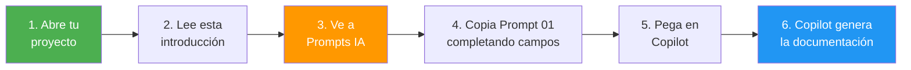
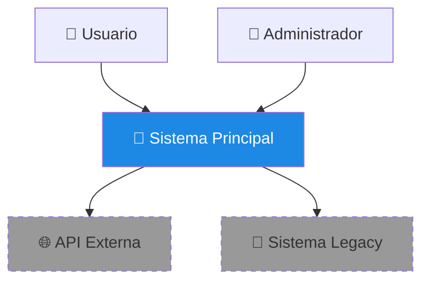
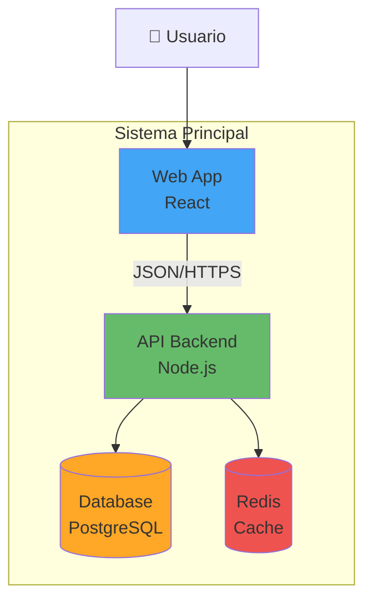
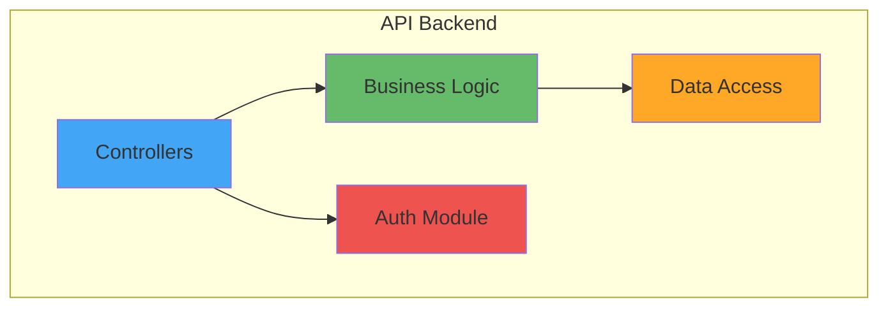
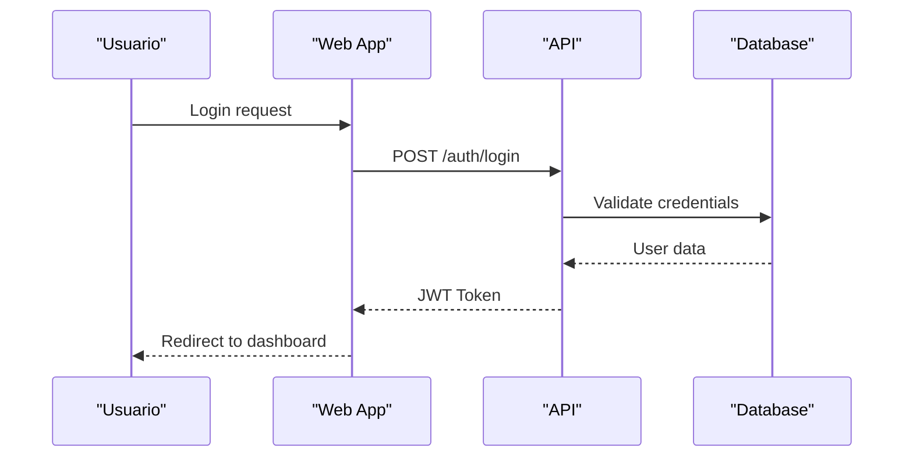
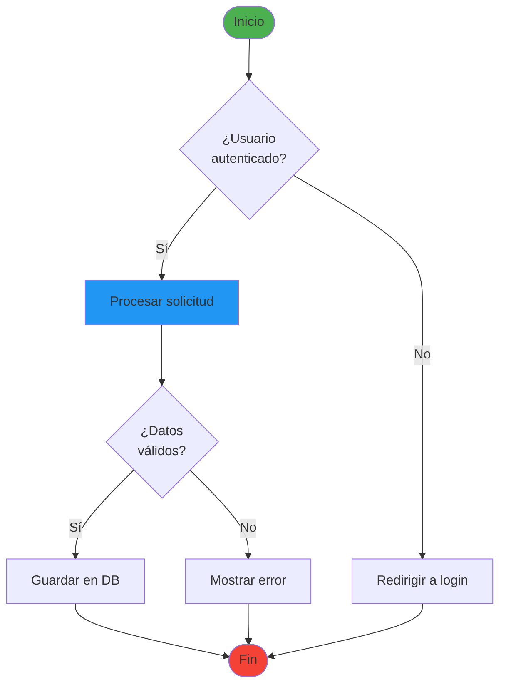
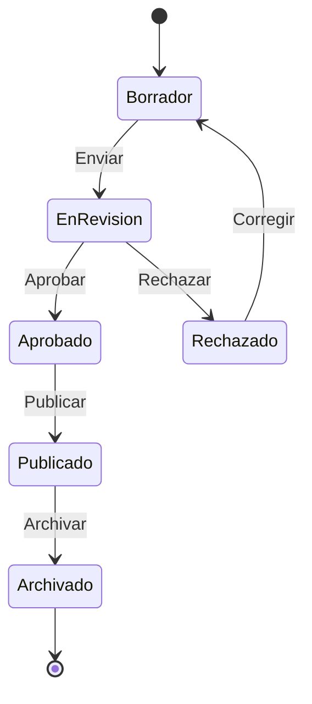
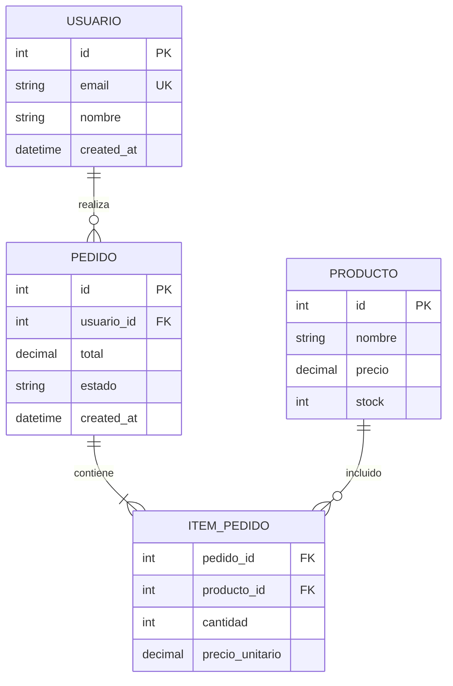

# 📖 Introducción a la Guía de Documentación

!!! tip "¿Quieres empezar YA? 🚀"
    Si ya tienes un proyecto y quieres documentarlo ahora mismo:
    
    👉 **[Ve directo a la Guía de Inicio Rápido](10-inicio-rapido.md)**
    
    Te llevará paso a paso en 50-60 minutos.

## 🎯 Propósito de Esta Guía

Esta guía te enseña a documentar proyectos de software usando **GitHub Copilot** (modo agente) para generar documentación consistente y completa automáticamente.

!!! success "Beneficios del Estándar"
    - ✅ **Consistencia**: Todos los proyectos siguen la misma estructura
    - ✅ **Automatización**: GitHub Copilot genera el 80% de la documentación
    - ✅ **Claridad**: Información organizada por audiencia (ejecutivos, arquitectos, developers)
    - ✅ **Rapidez**: Documenta un proyecto completo en 2-3 horas
    - ✅ **Mantenibilidad**: Fácil de actualizar cuando el código cambia

---

## 🚀 ¿Cómo Empiezo? - Flujo Rápido



### Pasos Detallados

1. **Abre tu proyecto** en VS Code

2. **Lee esta introducción** (5 minutos) para entender la estructura

3. **Ve a** [🤖 Prompts para Agentes IA](05-prompts.md)

4. **Sigue los prompts en orden** (01 → 02 → 03 → etc.)

5. **Completa los campos** marcados con `[COMPLETA:...]` antes de copiar

6. **Pega cada prompt** en GitHub Copilot (modo agente)

7. **Revisa y guarda** los archivos generados

!!! tip "Primer Vez"
    Si es tu primera vez, empieza con un proyecto pequeño para familiarizarte con el proceso. Tomará unas 2-3 horas para un proyecto completo.

---

## 🌟 Filosofía de Documentación

### Principios Fundamentales

1. **📊 Visual First**: Los diagramas comunican más que mil palabras

2. **🎭 Multi-Audiencia**: Cada stakeholder encuentra lo que necesita

3. **🔄 Viva y Actualizada**: Documentación generada del código fuente

4. **📱 Navegable**: Información estructurada y fácil de encontrar

5. **🤖 Automatizada**: IA hace el trabajo pesado, humanos validan

---

## 🏗️ Estructura Estándar de Proyecto

Cada proyecto documentado sigue esta estructura:

```
docs/
├── proyecto-xyz/
│   ├── 00-intro.md                    # Introducción del proyecto
│   ├── 01-requerimientos.md           # ⭐ NUEVO: Requisitos funcionales y no funcionales
│   ├── 02-vista-ejecutiva.md          # Para gerentes/ejecutivos
│   ├── 03-arquitectura/
│   │   ├── 01-contexto.md             # Nivel 1 C4: Sistema en contexto
│   │   ├── 02-contenedores.md         # Nivel 2 C4: Contenedores
│   │   ├── 03-componentes.md          # Nivel 3 C4: Componentes
│   │   └── 04-decisiones.md           # ADRs (Architecture Decision Records)
│   ├── 04-tecnico/
│   │   ├── 01-stack-tecnologico.md    # Tecnologías utilizadas
│   │   ├── 02-modelo-datos.md         # Bases de datos y esquemas
│   │   ├── 03-apis.md                 # APIs y contratos
│   │   └── 04-integraciones.md        # Sistemas externos
│   ├── 05-procesos-negocio/
│   │   ├── 01-casos-uso.md            # Casos de uso principales
│   │   ├── 02-flujos-funcionales.md   # Diagramas de secuencia
│   │   └── 03-reglas-negocio.md       # Lógica de negocio
│   ├── 06-infraestructura/
│   │   ├── 01-deployment.md           # Arquitectura de despliegue
│   │   ├── 02-ci-cd.md                # Pipelines
│   │   └── 03-monitoreo.md            # Observabilidad
│   └── 07-apendices/
│       ├── 01-glosario.md             # Términos y definiciones
│       ├── 02-referencias.md          # Enlaces y recursos
│       └── 03-changelog.md            # Historial de cambios
```

---

## 🎭 Audiencias y Sus Necesidades

### 0. 📋 Analistas de Negocio y Product Owners

**Qué necesitan:**

- Requisitos funcionales detallados (historias de usuario)

- Requisitos no funcionales cuantificados (rendimiento, seguridad, etc.)

- Casos de uso y criterios de aceptación

- Matriz de trazabilidad

- Priorización de features

**Dónde lo encuentran:**

- `01-requerimientos.md`

---

### 1. 👔 Ejecutivos y Gerentes

**Qué necesitan:**

- Visión general del proyecto y objetivos de negocio

- ROI y métricas de éxito

- Riesgos y dependencias

- Diagramas de contexto (alto nivel)

**Dónde lo encuentran:**

- `02-vista-ejecutiva.md`

- `03-arquitectura/01-contexto.md`

---

### 2. 🏗️ Arquitectos de Software

**Qué necesitan:**

- Decisiones arquitectónicas y rationale

- Diagramas C4 completos

- Patrones y estilos arquitectónicos

- Trade-offs y alternativas consideradas

**Dónde lo encuentran:**

- Todo `03-arquitectura/`

- `04-tecnico/04-integraciones.md`

- `06-infraestructura/01-deployment.md`

---

### 3. 👨‍💻 Desarrolladores

**Qué necesitan:**

- Detalles técnicos de implementación

- APIs y contratos

- Modelo de datos

- Flujos de lógica

**Dónde lo encuentran:**

- Todo `04-tecnico/`

- `03-arquitectura/03-componentes.md`

- `05-procesos-negocio/02-flujos-funcionales.md`

---

### 4. 🔧 DevOps/SRE

**Qué necesitan:**

- Arquitectura de infraestructura

- Pipelines de CI/CD

- Estrategias de deployment

- Monitoreo y alertas

**Dónde lo encuentran:**

- Todo `06-infraestructura/`

- `03-arquitectura/02-contenedores.md`

---

### 5. 📊 Analistas de Negocio y QA

**Qué necesitan:**

- Requisitos funcionales detallados

- Casos de uso y escenarios

- Procesos de negocio

- Reglas de negocio

- Criterios de aceptación

**Dónde lo encuentran:**

- `01-requerimientos.md`

- Todo `05-procesos-negocio/`

**Dónde lo encuentran:**

- Todo `04-procesos-negocio/`

- `01-vista-ejecutiva.md`

---

## 🎨 Tipos de Diagramas y Cuándo Usarlos

### Diagrama C4 - Nivel 1: Contexto

**Cuándo:** Vista macro del sistema y sus usuarios/sistemas externos



**Audiencia:** Ejecutivos, Gerentes, Stakeholders de negocio

---

### Diagrama C4 - Nivel 2: Contenedores

**Cuándo:** Mostrar aplicaciones y almacenes de datos principales



**Audiencia:** Arquitectos, Tech Leads, DevOps

---

### Diagrama C4 - Nivel 3: Componentes

**Cuándo:** Detallar la estructura interna de un contenedor



**Audiencia:** Desarrolladores, Arquitectos técnicos

---

### Diagramas de Secuencia

**Cuándo:** Mostrar interacciones entre componentes en el tiempo



**Audiencia:** Desarrolladores, Analistas de negocio

---

### Diagramas de Flujo

**Cuándo:** Procesos de negocio o flujos de decisión



**Audiencia:** Analistas de negocio, Product Owners

---

### Diagramas de Estado

**Cuándo:** Ciclo de vida de entidades



**Audiencia:** Desarrolladores, Analistas de negocio

---

### Diagramas de Entidad-Relación

**Cuándo:** Modelo de datos relacional



**Audiencia:** Desarrolladores, DBAs, Arquitectos

---

## ✅ Checklist de Documentación Completa

Antes de considerar un proyecto "documentado", verifica que tenga:

- [ ] **Introducción clara** del proyecto y objetivos

- [ ] **Requerimientos funcionales** documentados (15-20 mínimo)

- [ ] **Requerimientos no funcionales** cuantificados (rendimiento, seguridad, escalabilidad, etc.)

- [ ] **Matriz de trazabilidad** entre requisitos y componentes

- [ ] **Vista ejecutiva** para stakeholders no técnicos

- [ ] **Diagrama C4 Nivel 1** (Contexto)

- [ ] **Diagrama C4 Nivel 2** (Contenedores)

- [ ] **Diagrama C4 Nivel 3** (Componentes principales)

- [ ] **Stack tecnológico** completo y justificado

- [ ] **Modelo de datos** con diagramas ER

- [ ] **APIs documentadas** con ejemplos

- [ ] **Casos de uso** principales

- [ ] **Flujos funcionales** con diagramas de secuencia

- [ ] **Arquitectura de deployment**

- [ ] **Pipeline CI/CD** documentado

- [ ] **Decisiones de arquitectura** (ADRs)

- [ ] **Glosario** de términos

---

## 🚀 Siguiente Paso

Continúa con **[Formato de Documentos](/guia-documentacion/01-formato/)** para conocer las convenciones de escritura y formato que debes seguir.

---

!!! tip "Consejo Pro"
    Esta estructura puede parecer extensa, pero recuerda: **los agentes IA hacen el 90% del trabajo**. Tú solo necesitas revisar y validar.
