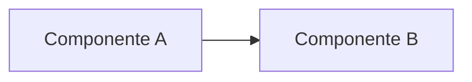
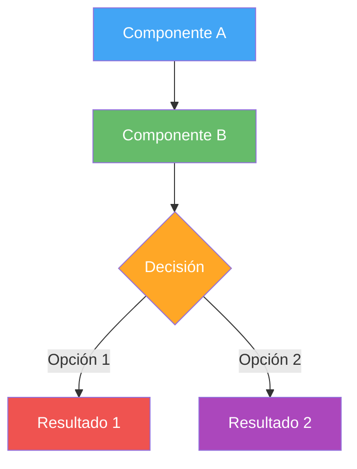

# 📝 Formato y Convenciones

## 🎨 Estructura de Archivos Markdown

Cada archivo markdown sigue un formato consistente para facilitar la lectura y navegación.

---

## 📋 Plantilla Base

```markdown
# 🔷 Título del Documento

## 🎯 Objetivo

[Párrafo breve explicando qué encontrará el lector en este documento]

---

## [Sección Principal 1]

### Subsección

Contenido...

!!! note "Nota Importante"
    Información adicional o aclaración

---

## [Sección Principal 2]

### Ejemplo con Diagrama



---

## 📚 Referencias

- [Enlace 1](#)
- [Enlace 2](#)

---

<div style="text-align: center; margin-top: 50px;">
    <small>Última actualización: YYYY-MM-DD</small>
</div>
```

---

## 🎯 Convenciones de Títulos

### Nivel 1: Título Principal
```markdown
# 🔷 Título Principal del Documento
```

- Usar **emoji relevante** al inicio
- Usar `🔷` como emoji por defecto si no hay uno más específico
- Solo **un título H1** por documento

### Nivel 2: Secciones Principales
```markdown
## 🎯 Sección Principal
```

- Usar emoji que represente la sección
- Separar secciones con `---`

### Nivel 3: Subsecciones
```markdown
### Subsección Detallada
```

- Sin emoji
- Usar para detalles dentro de una sección

### Nivel 4: Detalles Específicos
```markdown
#### Punto Específico
```

- Usar con moderación
- Solo cuando sea necesario mayor granularidad

---

## 🎨 Emojis Estándar

Usa estos emojis de forma consistente:

| Emoji | Uso | Ejemplo |
|-------|-----|---------|
| 🎯 | Objetivos, propósito | `## 🎯 Objetivo` |
| 📊 | Diagramas, visualización | `## 📊 Arquitectura` |
| 🏗️ | Arquitectura, construcción | `## 🏗️ Estructura` |
| 💡 | Ideas, conceptos importantes | `## 💡 Conceptos Clave` |
| ⚙️ | Configuración, tecnología | `## ⚙️ Configuración` |
| 🔐 | Seguridad, autenticación | `## 🔐 Seguridad` |
| 🚀 | Deployment, producción | `## 🚀 Despliegue` |
| 📝 | Documentación, notas | `## 📝 Notas` |
| ✅ | Checklist, validación | `## ✅ Requisitos` |
| ⚠️ | Advertencias, importante | `## ⚠️ Consideraciones` |
| 🔄 | Procesos, flujos | `## 🔄 Flujo de Trabajo` |
| 📦 | Componentes, módulos | `## 📦 Componentes` |
| 🌐 | APIs, integraciones | `## 🌐 Integraciones` |
| 💾 | Base de datos, storage | `## 💾 Modelo de Datos` |
| 👥 | Usuarios, stakeholders | `## 👥 Usuarios` |
| 📚 | Referencias, recursos | `## 📚 Referencias` |

---

## 📐 Formato de Diagramas Mermaid

### Convención de Estilo

Todos los diagramas deben:

1. **Incluir título descriptivo** antes del diagrama
2. **Usar colores consistentes** según el tipo de elemento
3. **Incluir leyenda** cuando sea necesario
4. **Ser autosuficientes** (entendibles sin contexto adicional)

### Plantilla de Diagrama

```markdown
### Nombre del Diagrama

Breve descripción de lo que muestra el diagrama.



**Interpretación:**
- **Azul**: Componentes de entrada
- **Verde**: Procesamiento
- **Naranja**: Decisiones
- **Rojo/Morado**: Resultados

```

### Paleta de Colores Estándar

```markdown
%% Para sistemas/componentes propios
style Element fill:#1e88e5,color:#fff    %% Azul primario

%% Para sistemas externos
style External fill:#999,stroke:#333,stroke-dasharray: 5

%% Para bases de datos
style DB fill:#ffa726,color:#fff         %% Naranja

%% Para cache/storage temporal
style Cache fill:#ef5350,color:#fff      %% Rojo

%% Para servicios de autenticación
style Auth fill:#ab47bc,color:#fff       %% Morado

%% Para APIs/Web Services
style API fill:#66bb6a,color:#fff        %% Verde

%% Para frontend/UI
style UI fill:#42a5f5,color:#fff         %% Azul claro

%% Para procesos en background
style BG fill:#78909c,color:#fff         %% Gris
```

---

## 📦 Uso de Admonitions

MkDocs Material proporciona admonitions (cajas de aviso). Úsalas estratégicamente:

### Success (Éxito, Beneficios)

```markdown
!!! success "Beneficio Clave"
    Esta arquitectura proporciona alta disponibilidad con 99.9% uptime.
```

!!! success "Beneficio Clave"
    Esta arquitectura proporciona alta disponibilidad con 99.9% uptime.

---

### Info (Información Adicional)

```markdown
!!! info "Información Adicional"
    Este componente también se puede configurar en modo cluster.
```

!!! info "Información Adicional"
    Este componente también se puede configurar en modo cluster.

---

### Warning (Advertencias)

```markdown
!!! warning "Advertencia"
    Esta operación puede tardar varios minutos en completarse.
```

!!! warning "Advertencia"
    Esta operación puede tardar varios minutos en completarse.

---

### Danger (Crítico, Peligroso)

```markdown
!!! danger "Crítico"
    NO ejecutar este comando en producción sin respaldo previo.
```

!!! danger "Crítico"
    NO ejecutar este comando en producción sin respaldo previo.

---

### Note (Notas)

```markdown
!!! note "Nota"
    La versión mínima requerida es Node.js 18+.
```

!!! note "Nota"
    La versión mínima requerida es Node.js 18+.

---

### Tip (Consejos)

```markdown
!!! tip "Consejo Pro"
    Usa variables de entorno para configuraciones sensibles.
```

!!! tip "Consejo Pro"
    Usa variables de entorno para configuraciones sensibles.

---

### Example (Ejemplos)

```markdown
!!! example "Ejemplo"
    ```bash
    npm install express
    ```
```

!!! example "Ejemplo"
    ```bash
    npm install express
    ```

---

## 📊 Formato de Tablas

### Tabla Estándar

```markdown
| Columna 1 | Columna 2 | Columna 3 |
|-----------|-----------|-----------|
| Dato 1    | Dato 2    | Dato 3    |
| Dato 4    | Dato 5    | Dato 6    |
```

### Tabla con Alineación

```markdown
| Izquierda | Centro | Derecha |
|:----------|:------:|--------:|
| Texto     | Texto  | 123     |
| Más texto | Más    | 456     |
```

### Tabla de Tecnologías

```markdown
| Tecnología | Versión | Propósito | Estado |
|------------|---------|-----------|--------|
| Node.js | 18.x | Backend runtime | ✅ Activo |
| PostgreSQL | 15.x | Base de datos principal | ✅ Activo |
| Redis | 7.x | Cache y sesiones | ✅ Activo |
| React | 18.x | Frontend framework | ✅ Activo |
```

---

## 💻 Bloques de Código

### Con Lenguaje y Título

````markdown
```python title="ejemplo.py"
def saludar(nombre: str) -> str:
    return f"Hola, {nombre}!"
```
````

### Con Resaltado de Líneas

````markdown
```python hl_lines="2 3"
def calcular_total(items):
    total = sum(item.precio for item in items)
    iva = total * 0.16
    return total + iva
```
````

### Con Números de Línea

````markdown
```python linenums="1"
class Usuario:
    def __init__(self, nombre, email):
        self.nombre = nombre
        self.email = email
```
````

---

## 🔗 Enlaces y Referencias

### Enlaces Internos

```markdown
Ver [Arquitectura de Contenedores](02-contenedores.md) para más detalles.
```

### Enlaces a Secciones

```markdown
Consulta la sección [Modelo de Datos](#modelo-de-datos) más abajo.
```

### Enlaces Externos

```markdown
Más información en [documentación oficial](https://example.com).
```

---

## 📸 Imágenes

### Imagen Simple

```markdown

```

### Imagen con Tamaño

```markdown

```

### Imagen Centrada

```markdown
<div align="center">
    
    <p><em>Figura 1: Descripción del diagrama</em></p>
</div>
```

---

## 📏 Espaciado y Separadores

### Separador Horizontal

```markdown
---
```

Usar entre secciones principales para mejorar la legibilidad.

### Espaciado Vertical

```markdown
<br>
```

Usar con moderación, solo cuando sea necesario separar visualmente.

---

## ✅ Checklist de Formato

Antes de considerar un documento completo, verifica:

- [ ] Tiene un **título H1** con emoji
- [ ] Las secciones principales usan **H2** con emojis apropiados
- [ ] Los diagramas tienen **título y descripción**
- [ ] Los diagramas usan la **paleta de colores estándar**
- [ ] Se usan **admonitions** para información importante
- [ ] Los bloques de código tienen **lenguaje especificado**
- [ ] Las tablas están **bien formateadas**
- [ ] Hay **separadores horizontales** entre secciones
- [ ] Incluye **fecha de última actualización** al final
- [ ] Los enlaces internos **funcionan correctamente**

---

## 🚀 Siguiente Paso

Continúa con **[Niveles de Abstracción](/guia-documentacion/02-niveles-abstraccion/)** para entender cómo estructurar la información según la audiencia.

---

<div style="text-align: center; margin-top: 50px;">
    <small>Última actualización: 2025-12-10</small>
</div>
