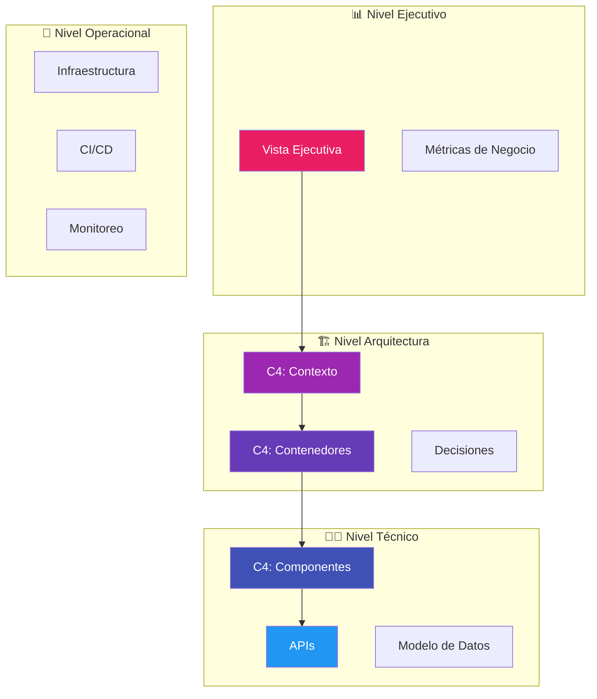
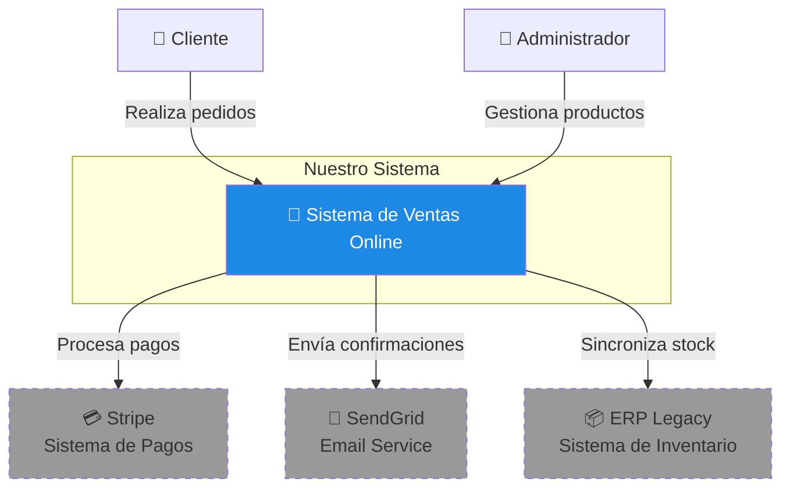
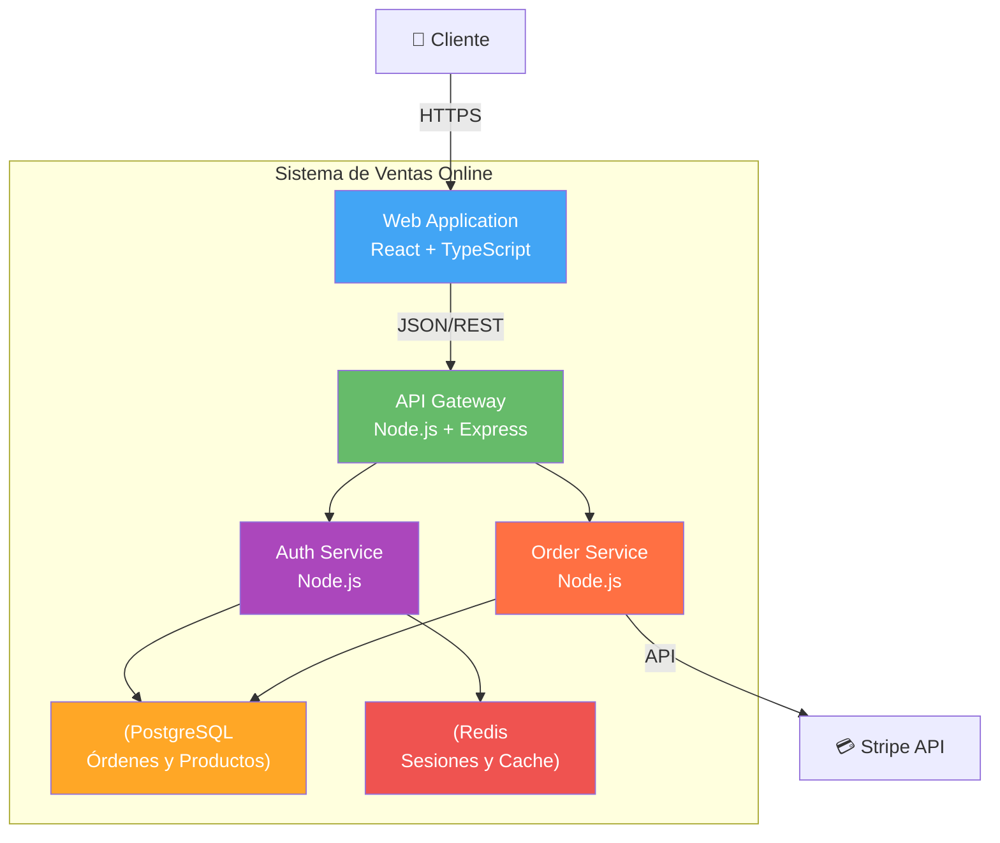
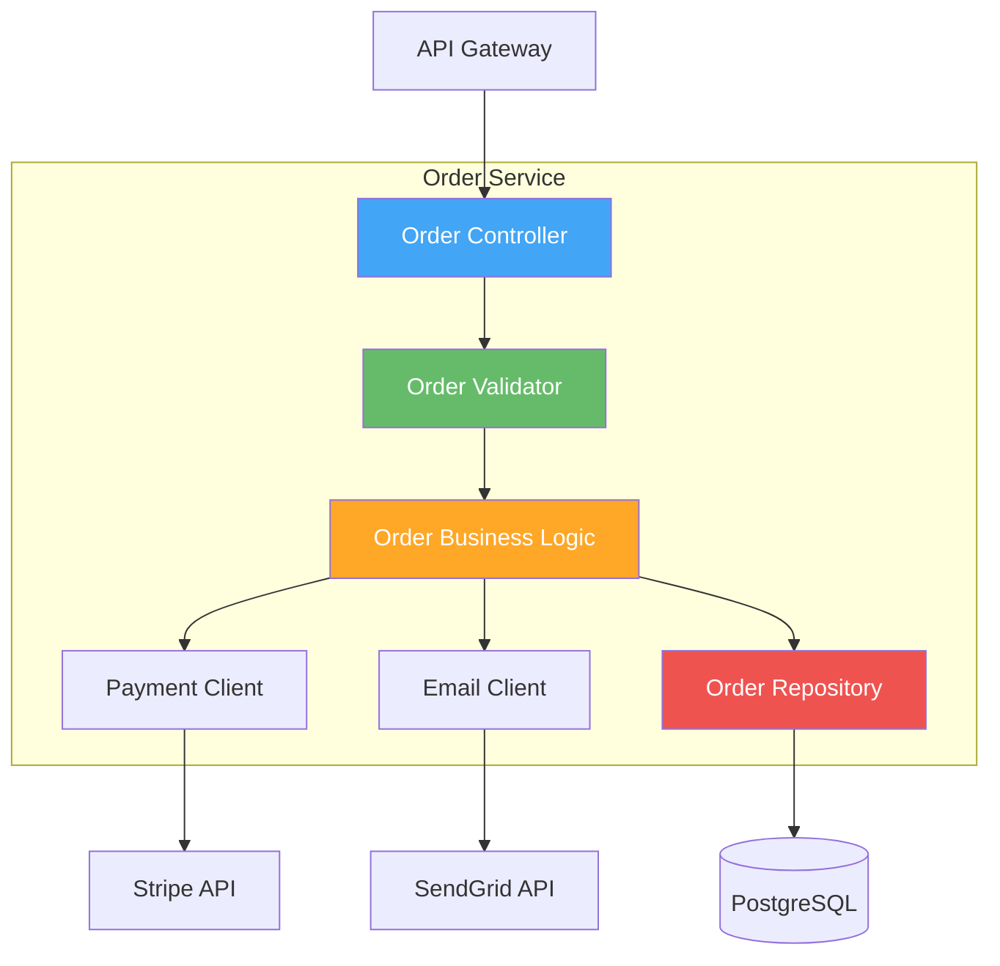
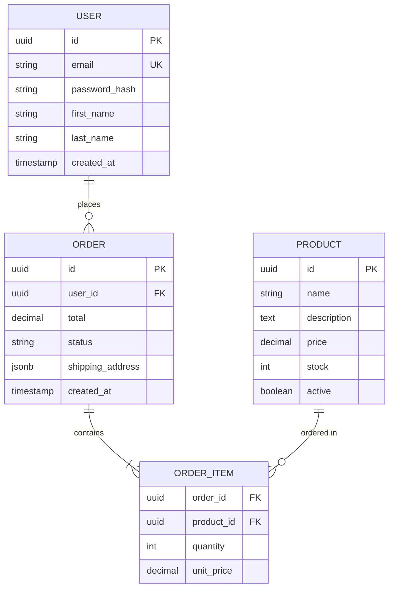
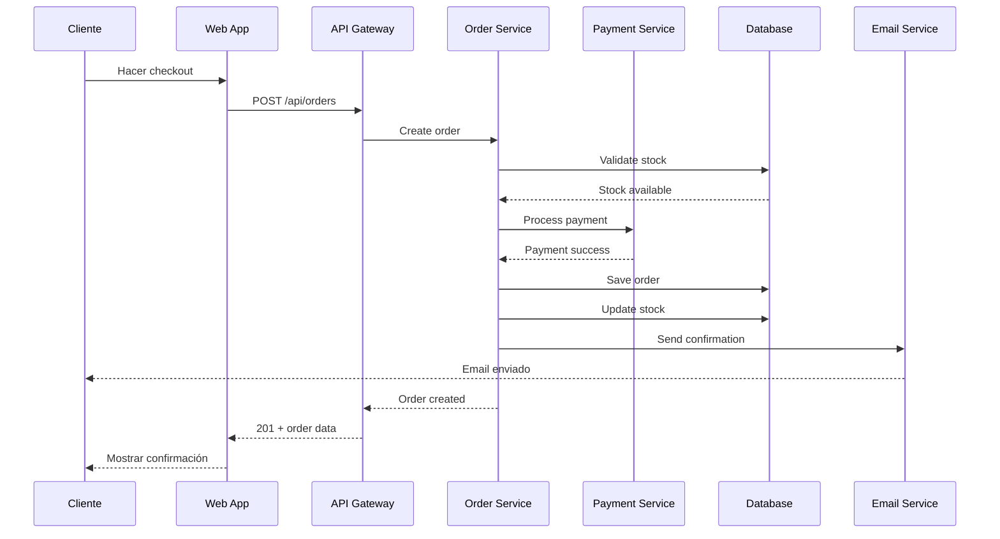
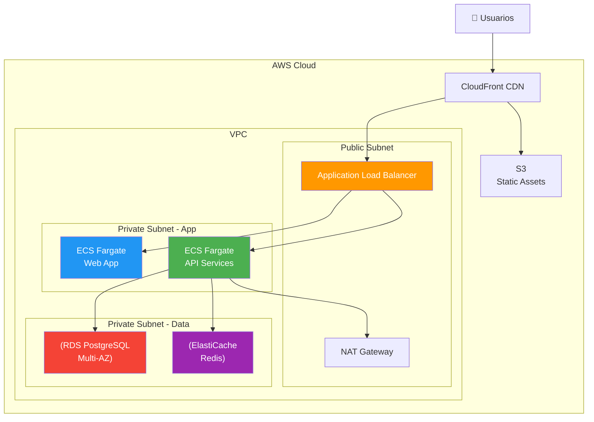
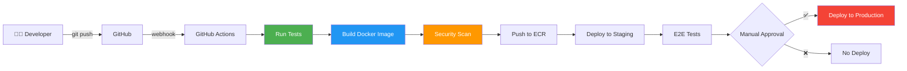

# 🎭 Niveles de Abstracción

## 🎯 Objetivo

Entender cómo estructurar la información según la audiencia, evitando el error común de mostrar demasiados detalles técnicos a stakeholders ejecutivos o muy poca información a desarrolladores.

---

## 🚫 El Error Más Común

### ❌ Antipatrón: Una Documentación para Todos

```
📄 Documento Único: "Sistema de Ventas.pdf"
├── Objetivos de negocio
├── Diagrama de arquitectura muy técnico
├── Código fuente pegado
├── Esquema de base de datos
├── Presupuesto
└── Manual de usuario
```

**Problema:** 

- El CEO quiere ver ROI, no tablas de base de datos

- El desarrollador necesita APIs, no objetivos estratégicos

- Nadie encuentra lo que necesita rápidamente

---

## ✅ La Solución: Documentación en Capas

Organizamos la información en **niveles de abstracción** que corresponden a diferentes audiencias.



---

## 📊 Nivel 1: Vista Ejecutiva

### 👔 Audiencia

- CEO, CTO, VP Engineering

- Product Owners

- Gerentes de proyecto

- Stakeholders de negocio

### 🎯 Qué Necesitan Saber

- **Propósito del sistema**: ¿Qué problema resuelve?

- **Valor de negocio**: ¿Por qué invertimos en esto?

- **Usuarios principales**: ¿Quién lo usa?

- **Métricas de éxito**: ¿Cómo medimos el impacto?

- **Riesgos y dependencias**: ¿Qué nos puede bloquear?

### 📄 Contenido

```markdown
# Vista Ejecutiva: Sistema de Ventas Online

## 🎯 Propósito

Plataforma de e-commerce B2C para venta directa de productos, 
permitiendo a los clientes realizar compras 24/7 sin intervención humana.

## 💼 Valor de Negocio

| Métrica | Objetivo | Estado Actual |
|---------|----------|---------------|
| Ventas mensuales | $500K | $320K ✅ |
| Usuarios activos | 10,000 | 7,500 ✅ |
| Tasa de conversión | 3.5% | 2.8% ⚠️ |
| Tiempo promedio de compra | < 5 min | 6.2 min ⚠️ |

## 👥 Usuarios Principales

- **Clientes**: 10,000 usuarios registrados

- **Administradores**: 5 personas del equipo de ventas

- **Soporte**: 3 agentes de atención al cliente

## 📊 Vista General del Sistema

[Diagrama C4 Nivel 1 - solo contexto general]
```

### ⏱️ Tiempo de Lectura Esperado
**5 minutos** - Debe ser escaneable rápidamente

---

## 🏗️ Nivel 2: Arquitectura de Alto Nivel

### 👥 Audiencia

- Arquitectos de software

- Tech Leads

- Engineering Managers

- Arquitectos empresariales

### 🎯 Qué Necesitan Saber

- **Estructura general**: ¿Cómo está organizado el sistema?

- **Tecnologías principales**: ¿Qué stack usamos?

- **Decisiones arquitectónicas**: ¿Por qué elegimos X sobre Y?

- **Patrones utilizados**: ¿Microservicios? Monolito? Serverless?

- **Integraciones**: ¿Con qué sistemas externos interactúa?

### 📄 Contenido

#### C4 Nivel 1: Diagrama de Contexto



**Descripción:** El sistema actúa como intermediario entre clientes y sistemas externos de pago, email e inventario.

#### C4 Nivel 2: Diagrama de Contenedores



#### Decisiones Arquitectónicas (ADRs)

**ADR-001: Microservicios vs Monolito**

- **Decisión**: Arquitectura de microservicios modulares

- **Contexto**: Necesidad de escalar componentes independientemente

- **Consecuencias**: 
  - ✅ Escalabilidad granular
  - ✅ Deploy independiente
  - ⚠️ Mayor complejidad operacional
  - ⚠️ Necesidad de observabilidad robusta

**ADR-002: PostgreSQL como Base de Datos Principal**

- **Decisión**: PostgreSQL sobre MySQL

- **Contexto**: Necesidad de transacciones ACID y soporte JSON

- **Alternativas consideradas**: MySQL, MongoDB

- **Consecuencias**: 
  - ✅ Transacciones robustas
  - ✅ Soporte JSON nativo
  - ✅ Ecosistema maduro

### ⏱️ Tiempo de Lectura Esperado
**15-20 minutos**

---

## 👨‍💻 Nivel 3: Documentación Técnica

### 👥 Audiencia

- Desarrolladores backend

- Desarrolladores frontend

- QA Engineers

- Nuevos miembros del equipo

### 🎯 Qué Necesitan Saber

- **Estructura de componentes**: ¿Cómo está organizado el código?

- **APIs y contratos**: ¿Qué endpoints existen?

- **Modelo de datos**: ¿Cómo se estructuran las tablas?

- **Flujos de lógica**: ¿Cómo funciona cada feature?

- **Cómo contribuir**: ¿Cómo hago cambios?

### 📄 Contenido

#### C4 Nivel 3: Componentes del Order Service



#### API Endpoints

**POST /api/orders**

Crea una nueva orden de compra.

```json
// Request
{
  "userId": "uuid",
  "items": [
    {
      "productId": "uuid",
      "quantity": 2,
      "price": 29.99
    }
  ],
  "paymentMethod": "credit_card",
  "shippingAddress": {
    "street": "123 Main St",
    "city": "Ciudad",
    "postalCode": "12345"
  }
}

// Response 201 Created
{
  "orderId": "uuid",
  "status": "pending",
  "total": 59.98,
  "createdAt": "2025-12-10T10:30:00Z"
}
```

#### Modelo de Datos



#### Flujo de Creación de Orden



### ⏱️ Tiempo de Lectura Esperado
**30-45 minutos** (documento de referencia, no para leer completo)

---

## 🔧 Nivel 4: Infraestructura y Operaciones

### 👥 Audiencia

- DevOps Engineers

- SRE (Site Reliability Engineers)

- Sysadmins

- Security Engineers

### 🎯 Qué Necesitan Saber

- **Arquitectura de deployment**: ¿Dónde y cómo se despliega?

- **CI/CD Pipeline**: ¿Cómo llega el código a producción?

- **Monitoreo y alertas**: ¿Cómo sabemos si algo falla?

- **Estrategia de backups**: ¿Cómo recuperamos datos?

- **Escalabilidad**: ¿Cómo crece el sistema?

### 📄 Contenido

#### Arquitectura de Deployment



#### Pipeline CI/CD



#### Monitoreo

**Métricas Clave:**

- **Disponibilidad**: Target 99.9% uptime

- **Latencia**: P95 < 500ms, P99 < 1s

- **Tasa de error**: < 0.1%

- **Throughput**: 1000 req/min en promedio

**Alertas Configuradas:**

- Error rate > 1% por 5 minutos → PagerDuty

- Latencia P99 > 2s por 10 minutos → Slack

- CPU > 80% por 15 minutos → Email

- Database connections > 90% → PagerDuty

### ⏱️ Tiempo de Lectura Esperado
**20-30 minutos**

---

## 🎯 Reglas de Oro para Niveles de Abstracción

### 1. 📊 Cada Nivel es Autosuficiente

No fuerces al lector a leer otros niveles para entender el suyo.

**❌ Mal:**
```markdown
# Vista Ejecutiva
Para entender el ROI, ver el diagrama de componentes en la sección técnica.
```

**✅ Bien:**
```markdown
# Vista Ejecutiva
El sistema reduce costos operativos en 30% al automatizar el proceso de ventas.
```

---

### 2. 🎭 Usa el Lenguaje de la Audiencia

**Para Ejecutivos:**

- ROI, KPIs, métricas de negocio

- Riesgos y mitigaciones

- Timelines y costos

**Para Arquitectos:**

- Patrones, trade-offs, decisiones

- Escalabilidad, performance

- Integraciones y dependencias

**Para Desarrolladores:**

- APIs, endpoints, contratos

- Modelos de datos, esquemas

- Ejemplos de código

**Para DevOps:**

- Infraestructura como código

- Pipelines, deployments

- Métricas y alertas

---

### 3. 🔗 Enlaces Cruzados Estratégicos

Proporciona enlaces a niveles más detallados solo cuando sea relevante.

```markdown
## Arquitectura General

El sistema utiliza microservicios para garantizar escalabilidad.

> 🏗️ **Para arquitectos:** Ver [Decisiones de Arquitectura](02-arquitectura/04-decisiones.md)
> 
> 👨‍💻 **Para desarrolladores:** Ver [Componentes Detallados](03-tecnico/componentes.md)
```

---

### 4. 📏 Usa Diagramas Apropiados al Nivel

| Nivel | Tipo de Diagrama | Detalle |
|-------|------------------|---------|
| Ejecutivo | C4 L1 (Contexto) | Solo sistemas y usuarios principales |
| Arquitectura | C4 L2 (Contenedores) | Aplicaciones y bases de datos |
| Técnico | C4 L3 (Componentes) + Secuencia | Clases, módulos, flujos |
| Operacional | Deployment + Network | Infraestructura física/cloud |

---

## ✅ Checklist de Niveles de Abstracción

Al documentar un proyecto, verifica que cada nivel:

**Nivel Ejecutivo:**

- [ ] Explica el **propósito de negocio** claramente

- [ ] Muestra **métricas de éxito** medibles

- [ ] Usa **lenguaje no técnico**

- [ ] Incluye **diagrama C4 L1** solamente

- [ ] Se lee en **menos de 5 minutos**

**Nivel Arquitectura:**

- [ ] Muestra **estructura general** del sistema

- [ ] Documenta **decisiones arquitectónicas** (ADRs)

- [ ] Incluye **diagramas C4 L1 y L2**

- [ ] Explica **integraciones** con sistemas externos

- [ ] Justifica **elecciones tecnológicas**

**Nivel Técnico:**

- [ ] Documenta **todas las APIs** con ejemplos

- [ ] Incluye **modelo de datos completo**

- [ ] Muestra **flujos de lógica** con diagramas de secuencia

- [ ] Proporciona **diagramas C4 L3** de componentes clave

- [ ] Tiene **ejemplos de código** relevantes

**Nivel Operacional:**

- [ ] Documenta **arquitectura de deployment**

- [ ] Explica **pipeline CI/CD**

- [ ] Define **métricas y alertas**

- [ ] Incluye **procedimientos de rollback**

- [ ] Documenta **estrategia de backups**

---

## 🚀 Siguiente Paso

Continúa con **[Catálogo de Diagramas](/guia-documentacion/03-diagramas/)** para conocer todos los tipos de diagramas Mermaid disponibles y cuándo usar cada uno.

---

<div style="text-align: center; margin-top: 50px;">
    <small>Última actualización: 2025-12-10</small>
</div>
