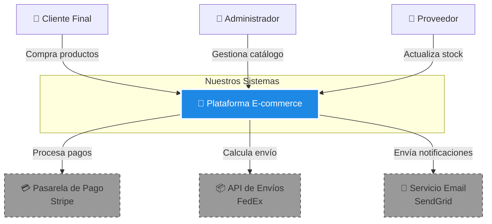
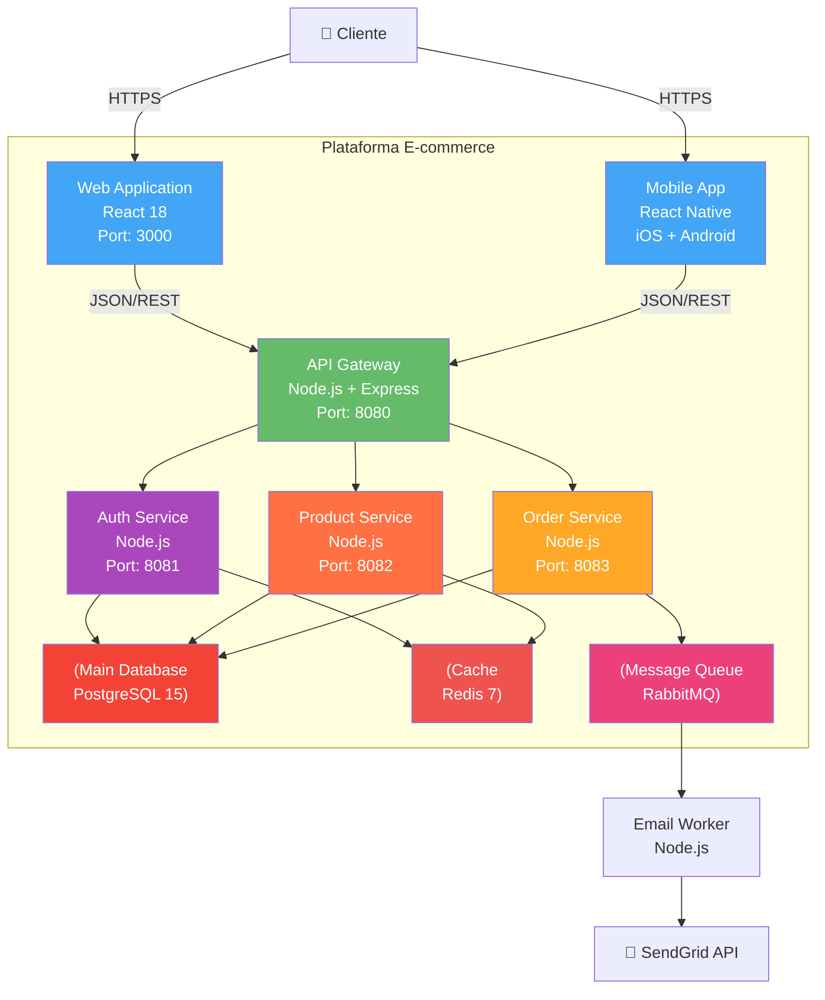
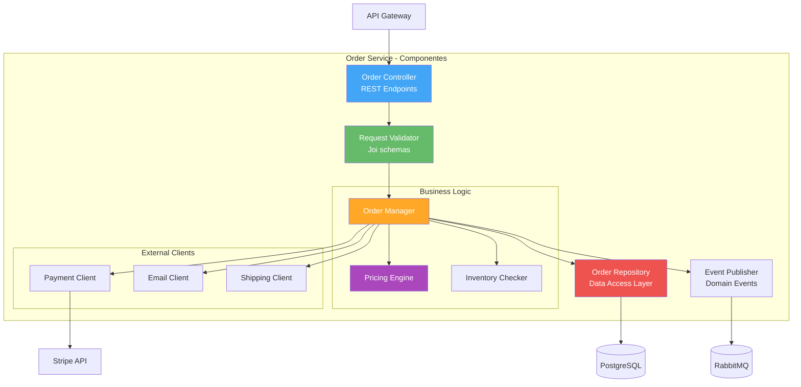
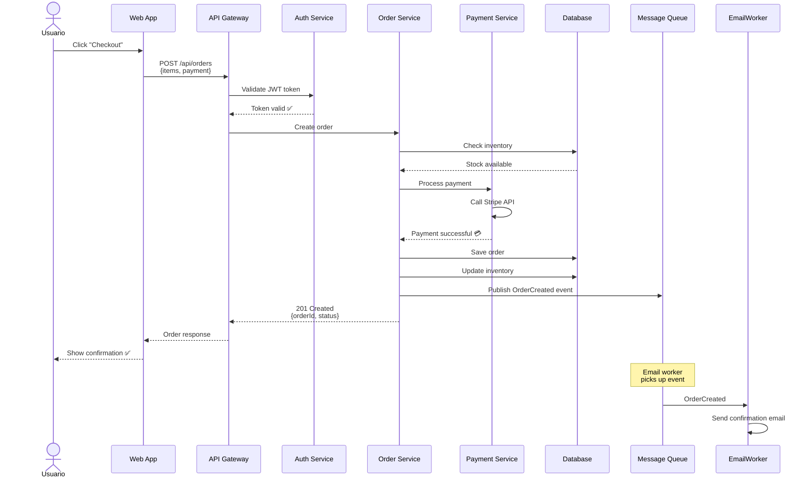
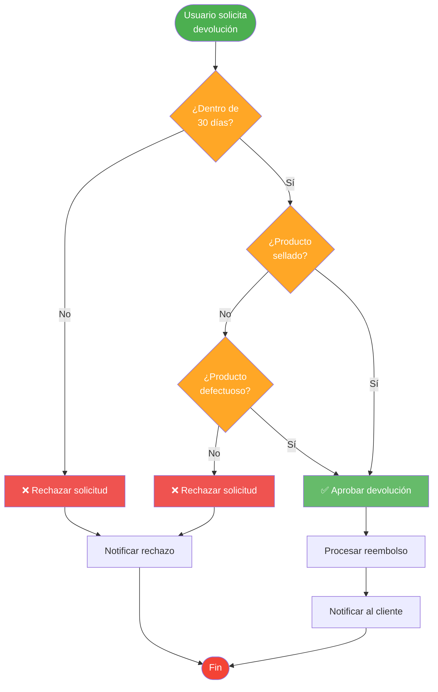
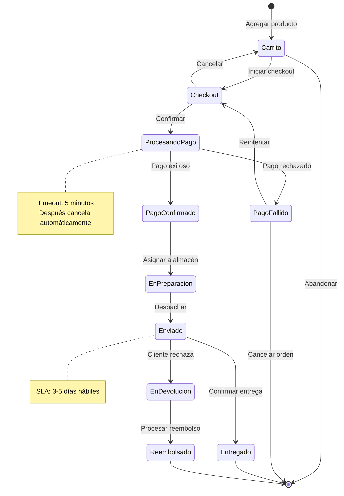
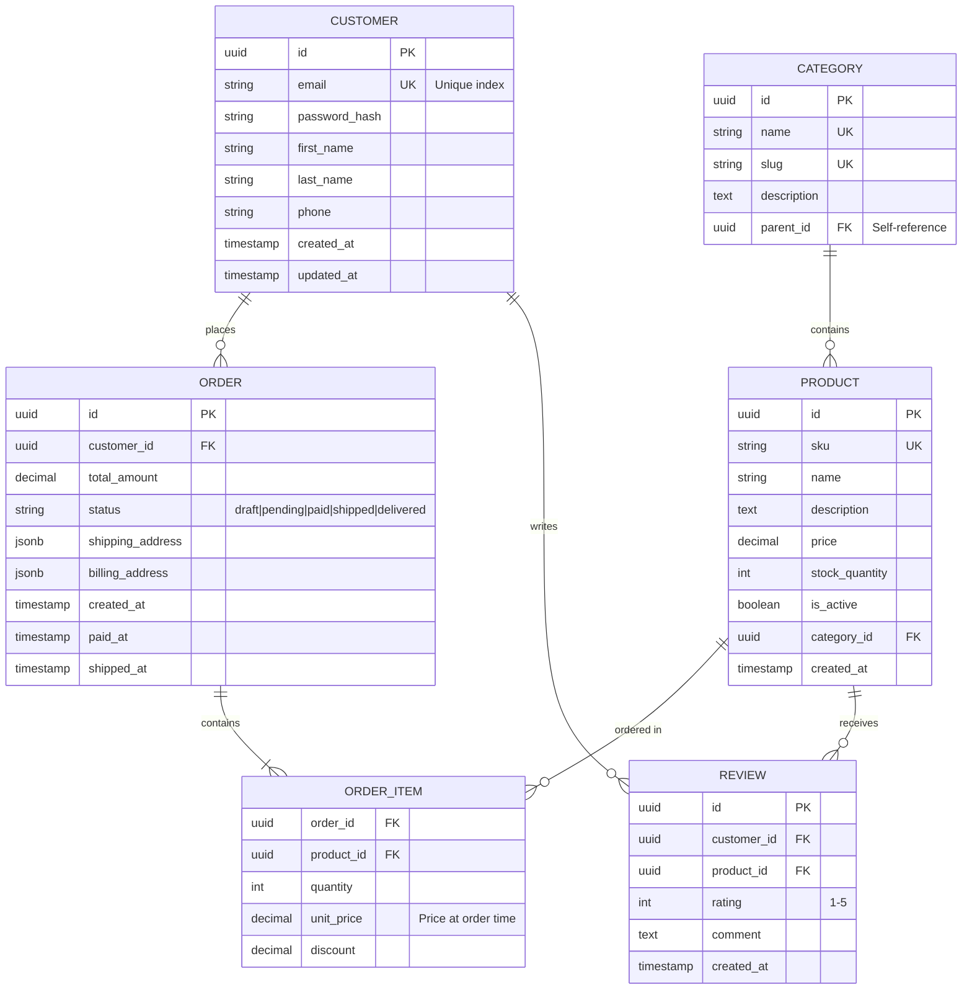
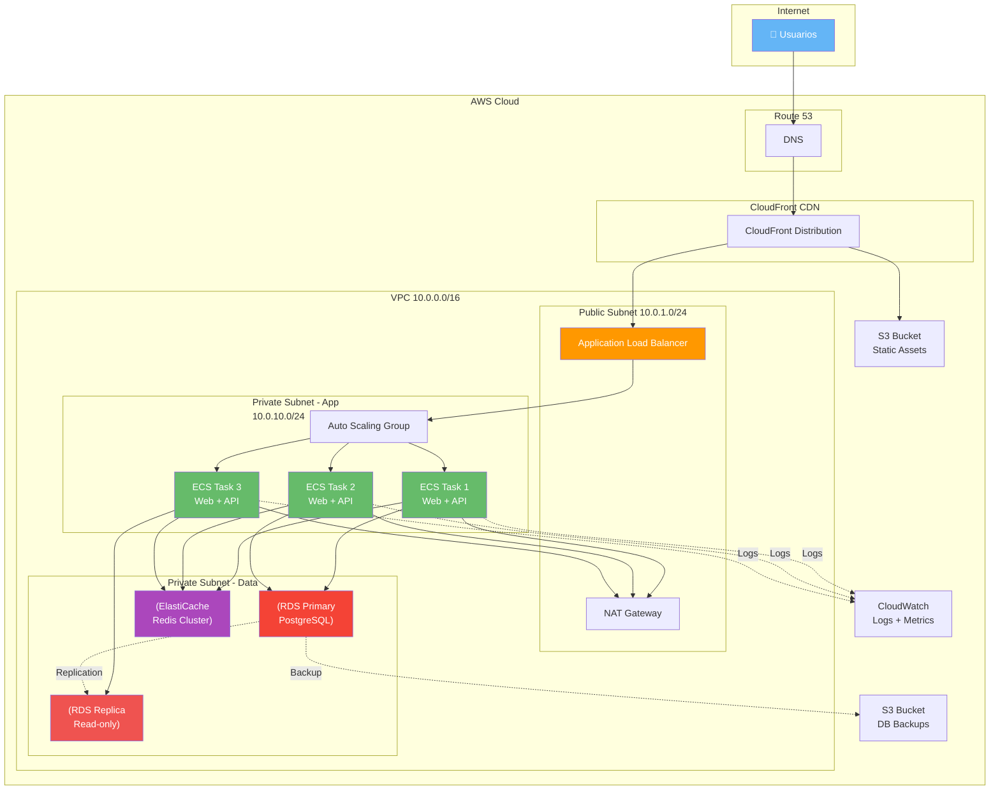
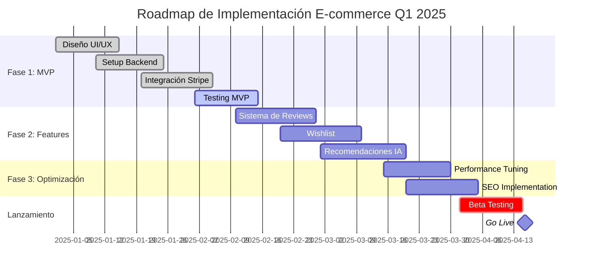
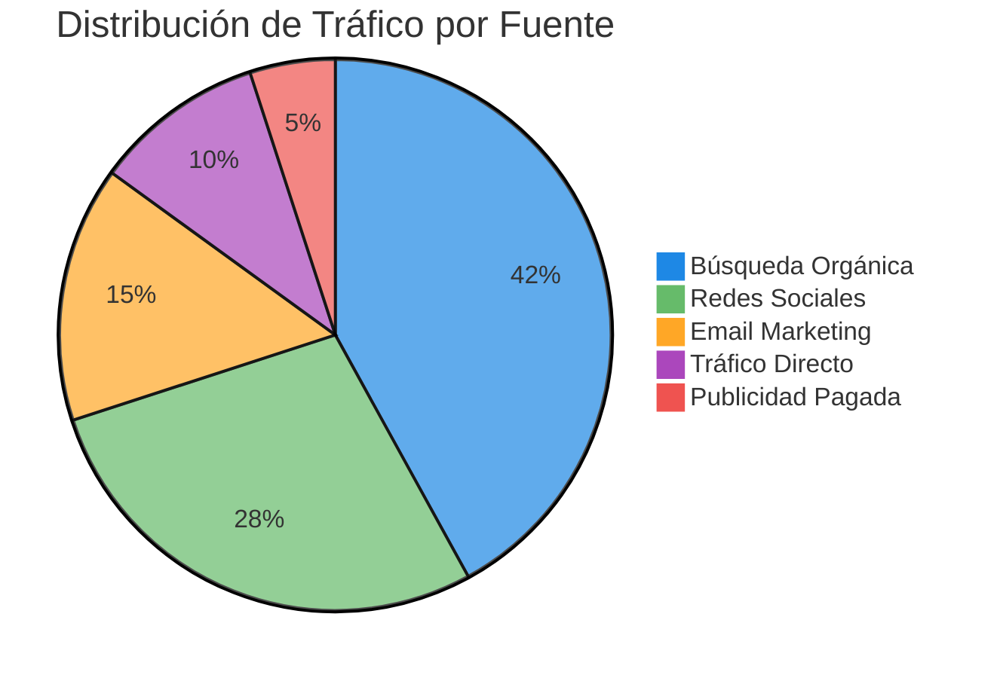

# 📊 Catálogo de Diagramas Mermaid

## 🎯 Objetivo

Conocer todos los tipos de diagramas disponibles en Mermaid y **cuándo usar cada uno** según el contexto y la audiencia.

---

## 🧭 Guía Rápida de Selección

```mermaid
flowchart TD
    Start{¿Qué quieres<br/>mostrar?}
    
    Start -->|Sistemas y contexto| C4Context["Diagrama C4 Contexto"]
    Start -->|Aplicaciones y DBs| C4Container["Diagrama C4 Contenedores"]
    Start -->|Clases y módulos| C4Component["Diagrama C4 Componentes"]
    Start -->|Interacciones en tiempo| Sequence["Diagrama de Secuencia"]
    Start -->|Proceso con decisiones| Flowchart["Diagrama de Flujo"]
    Start -->|Ciclo de vida| State["Diagrama de Estados"]
    Start -->|Modelo de datos| ERD["Diagrama ER"]
    Start -->|Infraestructura| Deployment["Diagrama de Deployment"]
    
    style C4Context fill:#e91e63,color:#fff
    style C4Container fill:#9c27b0,color:#fff
    style C4Component fill:#3f51b5,color:#fff
    style Sequence fill:#2196f3,color:#fff
    style Flowchart fill:#4caf50,color:#fff
    style State fill:#ff9800,color:#fff
    style ERD fill:#f44336,color:#fff
    style Deployment fill:#607d8b,color:#fff
```

---

## 1️⃣ Diagrama C4 - Nivel 1: Contexto

### 📋 Cuándo Usar

- Vista macro del sistema

- Mostrar usuarios y sistemas externos

- Presentaciones ejecutivas

- Onboarding de nuevos miembros

### 👥 Audiencia
Ejecutivos, Product Owners, Stakeholders de negocio

### 🎨 Ejemplo



### 💡 Mejores Prácticas

- Usar **una sola caja** para tu sistema

- Sistemas externos con **línea punteada**

- Máximo **5-7 elementos** para claridad

- Enfocarse en **qué hace el sistema**, no **cómo**

---

## 2️⃣ Diagrama C4 - Nivel 2: Contenedores

### 📋 Cuándo Usar

- Mostrar aplicaciones y bases de datos

- Explicar arquitectura de alto nivel

- Decisiones de stack tecnológico

- Discusiones de arquitectura

### 👥 Audiencia
Arquitectos, Tech Leads, Engineering Managers

### 🎨 Ejemplo



### 💡 Mejores Prácticas

- Incluir **tecnología y versión** en cada contenedor

- Diferenciar **frontend, backend, datos**

- Mostrar **puertos** cuando sea relevante

- Usar colores **consistentes por tipo**

---

## 3️⃣ Diagrama C4 - Nivel 3: Componentes

### 📋 Cuándo Usar

- Detallar estructura interna de un servicio

- Explicar patrones de diseño

- Onboarding de desarrolladores

- Code reviews arquitectónicos

### 👥 Audiencia
Desarrolladores, Arquitectos técnicos

### 🎨 Ejemplo



### 💡 Mejores Prácticas

- Mostrar **responsabilidades claras** de cada componente

- Agrupar por **capas** (Controller, Service, Repository)

- No mostrar **métodos individuales** (muy detallado)

- Enfocarse en **flujo de datos**

---

## 4️⃣ Diagrama de Secuencia

### 📋 Cuándo Usar

- Mostrar interacciones entre componentes **en el tiempo**

- Flujos de autenticación/autorización

- Procesos de negocio paso a paso

- Debugging de flujos complejos

### 👥 Audiencia
Desarrolladores, Analistas de negocio, QA

### 🎨 Ejemplo



### 💡 Mejores Prácticas

- Usar **actores** para usuarios humanos

- Flechas **sólidas** para llamadas síncronas

- Flechas **punteadas** para respuestas

- Incluir **notas** para aclaraciones

- Mostrar **errores** con color diferente

---

## 5️⃣ Diagrama de Flujo

### 📋 Cuándo Usar

- Procesos con **decisiones condicionales**

- Algoritmos de negocio

- Flujos de aprobación

- Troubleshooting guides

### 👥 Audiencia
Analistas de negocio, Desarrolladores, QA

### 🎨 Ejemplo



### 💡 Mejores Prácticas

- Usar **rombos** para decisiones

- **Inicio/Fin** con formas redondeadas

- Colores **verde para éxito**, **rojo para error**

- Mantener el flujo de **arriba hacia abajo** o **izquierda a derecha**

---

## 6️⃣ Diagrama de Estados

### 📋 Cuándo Usar

- Ciclo de vida de entidades

- Máquinas de estado

- Workflow de aprobaciones

- Estados de pedidos/tickets

### 👥 Audiencia
Desarrolladores, Analistas de negocio, Product Owners

### 🎨 Ejemplo



### 💡 Mejores Prácticas

- Mostrar **todas las transiciones posibles**

- Incluir **condiciones** en las flechas

- Usar **notas** para SLAs y timeouts

- Indicar **estado inicial** con `[*]`

---

## 7️⃣ Diagrama Entidad-Relación (ERD)

### 📋 Cuándo Usar

- Diseño de base de datos

- Modelo de dominio

- Análisis de requisitos de datos

- Migraciones de esquema

### 👥 Audiencia
Desarrolladores, DBAs, Arquitectos de datos

### 🎨 Ejemplo



### 💡 Mejores Prácticas

- Marcar **PK** (Primary Key) y **FK** (Foreign Key)

- Marcar **UK** (Unique Key)

- Indicar **tipo de datos** y **constraints**

- Usar cardinalidad: `||--o{` (uno a muchos), `||--||` (uno a uno)

- Incluir **índices importantes** como comentarios

---

## 8️⃣ Diagrama de Deployment/Infraestructura

### 📋 Cuándo Usar

- Arquitectura de infraestructura

- Planes de disaster recovery

- Explicar topología de red

- Documentación de DevOps

### 👥 Audiencia
DevOps, SRE, Arquitectos de infraestructura

### 🎨 Ejemplo



### 💡 Mejores Prácticas

- Mostrar **CIDR blocks** de subnets

- Diferenciar **Public vs Private subnets**

- Indicar **replicación** con línea punteada

- Incluir **servicios de monitoreo**

- Marcar **alta disponibilidad** claramente

---

## 9️⃣ Diagrama de Gantt

### 📋 Cuándo Usar

- Planificación de proyectos

- Roadmaps de producto

- Timelines de migración

- Planes de implementación

### 👥 Audiencia
Project Managers, Product Owners, Stakeholders

### 🎨 Ejemplo



### 💡 Mejores Prácticas

- Marcar hitos con `:milestone`

- Usar `:done`, `:active`, `:crit` para estado

- Agrupar en **secciones lógicas**

- Mostrar **dependencias** con fechas superpuestas

---

## 🔟 Diagrama de Pastel (Pie Chart)

### 📋 Cuándo Usar

- Distribución de recursos

- Composición de usuarios

- Breakdown de costos

- Análisis de métricas

### 👥 Audiencia
Ejecutivos, Product Owners, Analistas

### 🎨 Ejemplo



### 💡 Mejores Prácticas

- Máximo **5-7 segmentos** para legibilidad

- Ordenar de **mayor a menor**

- Usar **colores distintos** para cada segmento

- Incluir **porcentajes** en el título

---

## ✅ Matriz de Selección Rápida

| Necesitas Mostrar | Diagrama Recomendado | Nivel C4 |
|-------------------|----------------------|----------|
| Sistema en contexto general | C4 Contexto | L1 |
| Aplicaciones y bases de datos | C4 Contenedores | L2 |
| Estructura interna de código | C4 Componentes | L3 |
| Llamadas entre servicios | Secuencia | - |
| Proceso con if/else | Flowchart | - |
| Estados de una entidad | State Diagram | - |
| Tablas y relaciones | ERD | - |
| Infraestructura cloud | Deployment | - |
| Timeline de proyecto | Gantt | - |
| Distribución porcentual | Pie Chart | - |

---

## 🚀 Siguiente Paso

Continúa con **[Plantillas Reutilizables](/guia-documentacion/04-plantillas/)** para obtener templates listos para usar en tu documentación.

---

<div style="text-align: center; margin-top: 50px;">
    <small>Última actualización: 2025-12-10</small>
</div>
