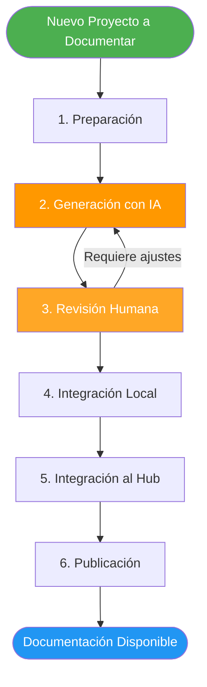
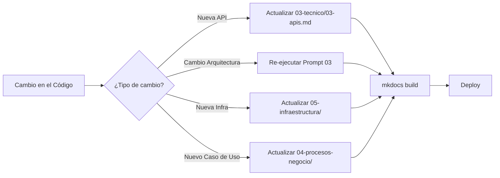

# 🔄 Workflow de Integración

## 🎯 Objetivo

Explicar el proceso completo desde la generación de documentación hasta su integración en el Hub Central de Documentación.

---

## 📊 Proceso General



---

## 1️⃣ Fase de Preparación

### Checklist Pre-Generación

- [ ] **Acceso al repositorio** del proyecto
- [ ] **README.md** actualizado (si existe)
- [ ] **Contacto con Product Owner** para información de negocio (opcional pero recomendado)
- [ ] **Contacto con Tech Lead** para validación técnica
- [ ] **Identificar nombre del proyecto** para la carpeta de documentación

### Información a Recopilar

```markdown
## Datos del Proyecto

- **Nombre del Proyecto**: [...]
- **Repositorio**: [URL]
- **Product Owner**: [Nombre y contacto]
- **Tech Lead**: [Nombre y contacto]
- **Objetivo de Negocio**: [Breve descripción]
- **Usuarios Principales**: [Tipos de usuarios]
- **Métricas Clave** (si se conocen): [...]
```

---

## 2️⃣ Fase de Generación con IA

### Paso 2.1: Análisis Inicial

```bash
# Ejecutar Prompt 01 con el agente IA
# Input: Ruta del repositorio
# Output: análisis-inicial.md (guardar para referencia)
```

**Acción:** 
1. Ejecuta el [Prompt 01](/guia-documentacion/05-prompts/#prompt-01-análisis-inicial-del-proyecto)
2. Guarda el output en `análisis-inicial.md` temporalmente
3. **REVISA** el output - valida que el agente entendió correctamente el proyecto

---

### Paso 2.2: Generar Documentación por Secciones

Ejecuta los prompts en orden:

```bash
# Prompt 02: Vista Ejecutiva
# Output: 01-vista-ejecutiva.md

# Prompt 03: Arquitectura C4
# Output: 02-arquitectura/01-contexto.md
#         02-arquitectura/02-contenedores.md
#         02-arquitectura/03-componentes.md

# Prompt 04: Documentación Técnica
# Output: 03-tecnico/01-stack-tecnologico.md
#         03-tecnico/02-modelo-datos.md
#         03-tecnico/03-apis.md
#         03-tecnico/04-integraciones.md

# Prompt 05: Procesos de Negocio
# Output: 04-procesos-negocio/01-casos-uso.md
#         04-procesos-negocio/02-flujos-funcionales.md

# Prompt 06: Infraestructura
# Output: 05-infraestructura/01-deployment.md
#         05-infraestructura/02-ci-cd.md
#         05-infraestructura/03-monitoreo.md

# Prompt 07: ADRs
# Output: 02-arquitectura/04-decisiones.md
```

**Estructura generada:**

```
proyecto-xyz/
├── 00-intro.md
├── 01-vista-ejecutiva.md
├── 02-arquitectura/
│   ├── 01-contexto.md
│   ├── 02-contenedores.md
│   ├── 03-componentes.md
│   └── 04-decisiones.md
├── 03-tecnico/
│   ├── 01-stack-tecnologico.md
│   ├── 02-modelo-datos.md
│   ├── 03-apis.md
│   └── 04-integraciones.md
├── 04-procesos-negocio/
│   ├── 01-casos-uso.md
│   └── 02-flujos-funcionales.md
├── 05-infraestructura/
│   ├── 01-deployment.md
│   ├── 02-ci-cd.md
│   └── 03-monitoreo.md
└── 06-apendices/
    ├── 01-glosario.md
    ├── 02-referencias.md
    └── 03-changelog.md
```

---

## 3️⃣ Fase de Revisión Humana

### Checklist de Revisión

#### Revisión General

- [ ] **Todos los archivos generados** están presentes
- [ ] **Formato markdown** es correcto (sin errores de sintaxis)
- [ ] **Emojis en títulos** según convención
- [ ] **Fechas actualizadas** en todos los archivos
- [ ] **No hay placeholders** sin completar (buscar `[...]`, `REQUIERE DATO`)

#### Revisión de Diagramas Mermaid

- [ ] **Todos los diagramas renderizan** correctamente
- [ ] **Colores consistentes** según la paleta estándar
- [ ] **Sintaxis correcta** (sin errores de Mermaid)
- [ ] **Legibilidad** - no están demasiado saturados

**Cómo verificar:**

```bash
# Opción 1: Usar MkDocs local
mkdocs serve

# Opción 2: Usar VS Code con extensión Mermaid Preview
# (instalar: mermaid-preview extension)

# Opción 3: Usar Mermaid Live Editor
# https://mermaid.live/
```

#### Revisión de Contenido Técnico

**Validación con Tech Lead:**

- [ ] **Stack tecnológico** correcto y completo
- [ ] **Versiones** de tecnologías son precisas
- [ ] **Modelo de datos** coincide con el esquema real
- [ ] **APIs documentadas** son todas las que existen
- [ ] **Decisiones arquitectónicas (ADRs)** tienen sentido

**Validación con Product Owner:**

- [ ] **Vista ejecutiva** refleja objetivos de negocio reales
- [ ] **Casos de uso** son correctos y completos
- [ ] **Métricas/KPIs** son las correctas

#### Correcciones Comunes

```markdown
# ❌ Problemas Frecuentes

## 1. Diagramas Mermaid no renderizan
- Verificar sintaxis en https://mermaid.live/
- Revisar que los IDs no tengan espacios
- Verificar que los estilos usen colores válidos

## 2. Información marcada como "REQUIERE DATO"
- Completar con información real del equipo
- Si no se conoce, dejar como "Por definir"

## 3. Ejemplos de API ficticios
- Reemplazar con ejemplos reales del código
- Usar herramientas como Postman para validar

## 4. Enlaces rotos
- Verificar que todos los enlaces internos funcionen
- Usar rutas relativas: ./archivo.md
```

---

## 4️⃣ Fase de Integración Local

### Paso 4.1: Crear Estructura en el Proyecto

En el **repositorio del proyecto documentado**:

```bash
# Navegar al proyecto
cd /ruta/al/proyecto

# Crear estructura docs/
mkdir -p docs/proyecto-xyz

# Copiar archivos generados
cp -r /ruta/temporal/proyecto-xyz/* docs/proyecto-xyz/

# Crear mkdocs.yml en el proyecto
touch mkdocs.yml
```

### Paso 4.2: Configurar mkdocs.yml Local

```yaml
site_name: Documentación - [Nombre del Proyecto]
site_description: Documentación técnica del proyecto [Nombre]

theme:
  name: material
  language: es
  palette:
    - scheme: default
      primary: indigo
      accent: indigo
      toggle:
        icon: material/brightness-7
        name: Cambiar a modo oscuro
    - scheme: slate
      primary: indigo
      accent: indigo
      toggle:
        icon: material/brightness-4
        name: Cambiar a modo claro
  features:
    - navigation.sections
    - navigation.expand
    - navigation.top
    - content.code.copy

plugins:
  - search:
      lang: es
  - mermaid2:
      version: 11.12.0

markdown_extensions:
  - pymdownx.highlight
  - pymdownx.superfences:
      custom_fences:
        - name: mermaid
          class: mermaid
          format: !!python/name:mermaid2.fence_mermaid
  - admonition
  - pymdownx.details
  - pymdownx.emoji:
      emoji_index: !!python/name:material.extensions.emoji.twemoji
  - tables
  - toc:
      permalink: true

nav:
  - Inicio: proyecto-xyz/00-intro.md
  - Vista Ejecutiva: proyecto-xyz/01-vista-ejecutiva.md
  - Arquitectura:
      - Contexto: proyecto-xyz/02-arquitectura/01-contexto.md
      - Contenedores: proyecto-xyz/02-arquitectura/02-contenedores.md
      - Componentes: proyecto-xyz/02-arquitectura/03-componentes.md
      - Decisiones (ADRs): proyecto-xyz/02-arquitectura/04-decisiones.md
  - Documentación Técnica:
      - Stack Tecnológico: proyecto-xyz/03-tecnico/01-stack-tecnologico.md
      - Modelo de Datos: proyecto-xyz/03-tecnico/02-modelo-datos.md
      - APIs: proyecto-xyz/03-tecnico/03-apis.md
      - Integraciones: proyecto-xyz/03-tecnico/04-integraciones.md
  - Procesos de Negocio:
      - Casos de Uso: proyecto-xyz/04-procesos-negocio/01-casos-uso.md
      - Flujos Funcionales: proyecto-xyz/04-procesos-negocio/02-flujos-funcionales.md
  - Infraestructura:
      - Deployment: proyecto-xyz/05-infraestructura/01-deployment.md
      - CI/CD: proyecto-xyz/05-infraestructura/02-ci-cd.md
      - Monitoreo: proyecto-xyz/05-infraestructura/03-monitoreo.md
  - Apéndices:
      - Glosario: proyecto-xyz/06-apendices/01-glosario.md
      - Referencias: proyecto-xyz/06-apendices/02-referencias.md
      - Changelog: proyecto-xyz/06-apendices/03-changelog.md

extra_css:
  - stylesheets/extra.css
```

### Paso 4.3: Probar Localmente

```bash
# Instalar dependencias (si no están instaladas)
pip install mkdocs-material mkdocs-mermaid2-plugin

# Levantar servidor local
mkdocs serve

# Abrir en navegador
# http://127.0.0.1:8000
```

**Validar:**
- ✅ Todos los enlaces funcionan
- ✅ Todos los diagramas renderizan
- ✅ Navegación fluida
- ✅ Búsqueda funciona correctamente

---

## 5️⃣ Fase de Integración al Hub Central

### Paso 5.1: Copiar al Proyecto Central

```bash
# Desde el proyecto documentado
cd /ruta/al/proyecto

# Copiar carpeta docs al Hub Central
cp -r docs/proyecto-xyz /ruta/al/hub-central/docs/

# Copiar imágenes si existen
cp -r docs/img/* /ruta/al/hub-central/docs/img/ 2>/dev/null || true
```

### Paso 5.2: Actualizar mkdocs.yml del Hub

Editar `/ruta/al/hub-central/mkdocs.yml`:

```yaml
nav:
  - Inicio: index.md
  - Guía de Documentación:
      - Introducción: guia-documentacion/00-intro.md
      - Formato: guia-documentacion/01-formato.md
      - Niveles de Abstracción: guia-documentacion/02-niveles-abstraccion.md
      - Catálogo de Diagramas: guia-documentacion/03-diagramas.md
      - Plantillas: guia-documentacion/04-plantillas.md
      - Prompts IA: guia-documentacion/05-prompts.md
      - Workflow: guia-documentacion/06-workflow.md
  
  # ✨ AGREGAR NUEVO PROYECTO AQUÍ
  - [Nombre del Proyecto]:
      - Inicio: proyecto-xyz/00-intro.md
      - Vista Ejecutiva: proyecto-xyz/01-vista-ejecutiva.md
      - Arquitectura:
          - Contexto: proyecto-xyz/02-arquitectura/01-contexto.md
          - Contenedores: proyecto-xyz/02-arquitectura/02-contenedores.md
          - Componentes: proyecto-xyz/02-arquitectura/03-componentes.md
          - Decisiones: proyecto-xyz/02-arquitectura/04-decisiones.md
      - Técnico:
          - Stack: proyecto-xyz/03-tecnico/01-stack-tecnologico.md
          - Modelo de Datos: proyecto-xyz/03-tecnico/02-modelo-datos.md
          - APIs: proyecto-xyz/03-tecnico/03-apis.md
          - Integraciones: proyecto-xyz/03-tecnico/04-integraciones.md
      - Procesos:
          - Casos de Uso: proyecto-xyz/04-procesos-negocio/01-casos-uso.md
          - Flujos: proyecto-xyz/04-procesos-negocio/02-flujos-funcionales.md
      - Infraestructura:
          - Deployment: proyecto-xyz/05-infraestructura/01-deployment.md
          - CI/CD: proyecto-xyz/05-infraestructura/02-ci-cd.md
          - Monitoreo: proyecto-xyz/05-infraestructura/03-monitoreo.md
      - Apéndices:
          - Glosario: proyecto-xyz/06-apendices/01-glosario.md
          - Referencias: proyecto-xyz/06-apendices/02-referencias.md
          - Changelog: proyecto-xyz/06-apendices/03-changelog.md
```

### Paso 5.3: Actualizar index.md del Hub

Agregar el proyecto a la tabla en `/ruta/al/hub-central/docs/index.md`:

```markdown
| Proyecto | Descripción | Estado | Última Actualización |
|----------|-------------|--------|----------------------|
| **Guía de Documentación** | Lineamientos y formato estándar | ✅ Activo | 2025-12-10 |
| **[Nombre del Proyecto]** | [Descripción breve] | ✅ Activo | 2025-12-10 |
```

---

## 6️⃣ Fase de Publicación

### Paso 6.1: Build Local Final

```bash
cd /ruta/al/hub-central

# Build para verificar que todo está OK
mkdocs build

# Si no hay errores, continuar
```

### Paso 6.2: Commit y Push

```bash
git add .
git commit -m "docs: agregar documentación de [Nombre del Proyecto]"
git push origin main
```

### Paso 6.3: Deploy (según configuración)

**Opción A: GitHub Pages**

```bash
mkdocs gh-deploy
```

**Opción B: CI/CD automático**

El pipeline se activará automáticamente al hacer push.

**Opción C: Manual**

```bash
mkdocs build
# Subir carpeta site/ a servidor web
```

---

## 🔄 Mantenimiento Continuo

### Actualización Periódica



### Frecuencia Recomendada

| Tipo de Cambio | Frecuencia de Actualización |
|----------------|----------------------------|
| Nuevos endpoints/APIs | Inmediato |
| Cambios arquitectónicos mayores | Inmediato |
| Cambios de infraestructura | 1 semana |
| Optimizaciones menores | 1 mes |
| Actualización de versiones | 1 mes |

### Script de Actualización Rápida

```bash
#!/bin/bash
# update-docs.sh

PROJECT_NAME=$1
CHANGE_TYPE=$2

echo "Actualizando documentación de $PROJECT_NAME..."

case $CHANGE_TYPE in
  "api")
    echo "Re-generando documentación de APIs..."
    # Ejecutar Prompt 04 solo para APIs
    ;;
  "architecture")
    echo "Re-generando documentación de arquitectura..."
    # Ejecutar Prompt 03
    ;;
  "infrastructure")
    echo "Re-generando documentación de infraestructura..."
    # Ejecutar Prompt 06
    ;;
  *)
    echo "Tipo de cambio no reconocido: $CHANGE_TYPE"
    exit 1
    ;;
esac

echo "Rebuilding MkDocs..."
cd /ruta/al/hub-central
mkdocs build

echo "Deploying..."
mkdocs gh-deploy

echo "✅ Documentación actualizada y desplegada"
```

---

## ✅ Checklist Final de Integración

Antes de considerar la integración completa:

- [ ] **Documentación generada** con todos los prompts
- [ ] **Revisión humana** completada y validada
- [ ] **Diagramas validados** - todos renderizan correctamente
- [ ] **Prueba local exitosa** - `mkdocs serve` funciona
- [ ] **Carpeta docs/** copiada al Hub Central
- [ ] **mkdocs.yml actualizado** con navegación del nuevo proyecto
- [ ] **index.md actualizado** con entrada en tabla de proyectos
- [ ] **Build exitoso** - `mkdocs build` sin errores
- [ ] **Commit y push** realizados
- [ ] **Deploy exitoso** - sitio actualizado
- [ ] **Verificación en producción** - URLs funcionan
- [ ] **Notificación al equipo** - comunicar disponibilidad de docs

---

## 🎓 Próximos Pasos

¡Felicidades! Has completado la guía de documentación.

### Para Generar Tu Primera Documentación

1. Selecciona un proyecto piloto pequeño
2. Ejecuta los [Prompts IA](/guia-documentacion/05-prompts/) secuencialmente
3. Sigue este workflow paso a paso
4. Itera y mejora según aprendizajes

### Para Escalar a Múltiples Proyectos

1. Automatiza con scripts el workflow
2. Crea un checklist para cada proyecto
3. Asigna responsables por proyecto
4. Establece calendario de actualizaciones

---

<div style="text-align: center; margin-top: 50px;">
    <small>Última actualización: 2025-12-10</small>
</div>
