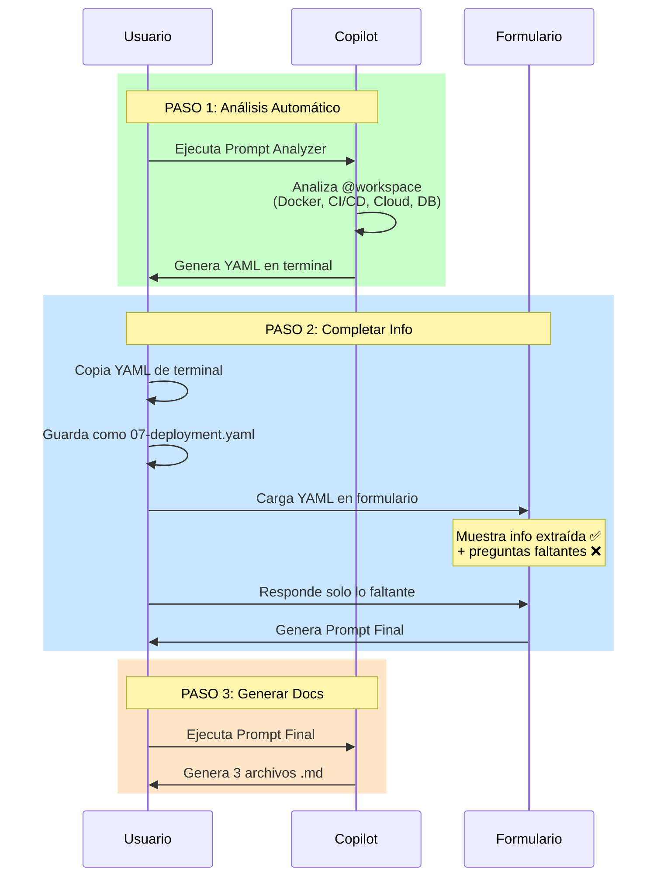
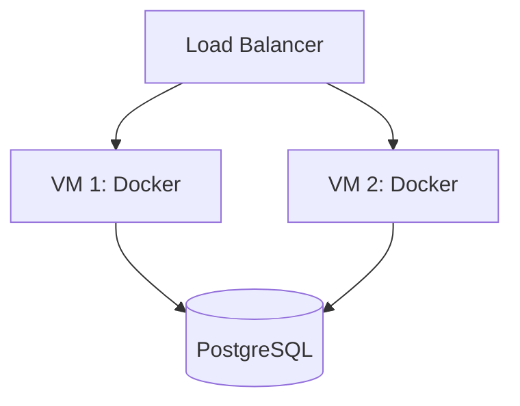

# 📋 Prompt 07: Deployment & Infraestructura - Guía Completa

## 🎯 Objetivo

Documentar deployment, CI/CD, infraestructura y monitoreo de forma **automatizada y personalizada**.

---

## ✨ Cómo Funciona (Sistema de 2 Pasos)



---

## 🚀 PASO 1: Análisis Automático

### 1.1 Ejecutar el Prompt Analyzer

Copia el prompt de análisis:

📄 **Archivo**: [`07-deployment-analyzer.md`](../ai_prompts/07-deployment-analyzer.md)

**Cómo usarlo**:

1. Abre el archivo `07-deployment-analyzer.md`

2. Copia TODO el contenido

3. Pega en Copilot Chat con `@workspace`

```
@workspace [pega aquí el contenido de 07-deployment-analyzer.md]
```

### 1.2 Qué Hace el Analyzer

El prompt analiza automáticamente:

- ✅ **Docker**: Dockerfile, docker-compose, imágenes, puertos

- ✅ **CI/CD**: GitHub Actions, GitLab CI, Jenkins, CircleCI

- ✅ **Cloud**: AWS, IBM Cloud, GCP, Azure (configs de terraform, cloudformation, etc)

- ✅ **Kubernetes**: Manifests, Helm charts, Kustomize

- ✅ **Base de Datos**: PostgreSQL, MySQL, MongoDB + ORMs (Prisma, TypeORM, etc)

- ✅ **Monitoreo**: Prometheus, Grafana, Datadog, CloudWatch

- ✅ **Variables**: .env.example, configs por ambiente

### 1.3 Output: YAML en Terminal

Copilot responderá con un **YAML completo** en la terminal:

```yaml
title: "Deployment & Infraestructura - mi-proyecto"
description: "Configuración generada analizando el código"

template: |
  # ✅ INFORMACIÓN EXTRAÍDA DEL CÓDIGO
  
  ## 🐳 Docker
  - Imagen base: node:18-alpine
  - Puertos: 3000, 8080
  - Servicios: app, postgres, redis
  
  ## 🔄 CI/CD
  - Herramienta: GitHub Actions
  - Archivo: .github/workflows/deploy.yml
  - Stages: build, test, deploy
  
  ## 🗄️ Base de Datos
  - Tipo: PostgreSQL
  - ORM: Prisma
  
  # ❌ INFORMACIÓN FALTANTE
  {{cloudProvider}}
  {{deployPlatform}}
  {{monitoringTools}}

sections:
  - icon: "☁️"
    title: "Cloud Provider"
    questions:
      - id: cloudProvider
        label: "¿Qué cloud provider?"
        options: [AWS, IBM, GCP, Azure]
```

### 1.4 Guardar el YAML

1. **Copia TODO el YAML** de la respuesta de Copilot

2. **Crea el archivo**: `docs/ai_prompts/07-deployment.yaml`

3. **Pega el contenido** completo

```bash
# Opción A: Crear con editor
nano docs/ai_prompts/07-deployment.yaml

# Opción B: Desde Copilot mismo
# Copiar y pegar en VS Code
```

---

## 📋 PASO 2: Completar Información Faltante

### 2.1 Cargar el Formulario

En la documentación, usa el botón para cargar el YAML generado:

```html
<button onclick="loadPromptForm('07-deployment')">
    📋 Cargar Cuestionario Personalizado
</button>
<div id="prompt-07-deployment-container"></div>
```

### 2.2 Revisar Info Auto-Extraída

El formulario mostrará una **caja verde** con toda la información encontrada:

```
┌────────────────────────────────────────────┐
│ ✅ INFORMACIÓN EXTRAÍDA AUTOMÁTICAMENTE    │
├────────────────────────────────────────────┤
│ Proyecto: mi-proyecto                      │
│ Docker: ✓ Detectado (node:18-alpine)      │
│ CI/CD: GitHub Actions                      │
│ Base de Datos: PostgreSQL (Prisma)        │
└────────────────────────────────────────────┘
```

### 2.3 Responder SOLO lo Faltante

El formulario muestra **solo preguntas sobre lo que NO se encontró**:

**Ejemplo**:

Si el analyzer detectó Docker pero NO cloud provider:

```
❌ Preguntas Necesarias:

☁️ Cloud Provider
   ¿Qué cloud provider usa el proyecto?
   □ AWS
   □ IBM Cloud
   □ GCP
   □ Azure
   ☑ On-Premise

🚀 Plataforma de Deployment
   ¿Dónde se despliega en producción?
   ( ) Kubernetes
   ( ) Docker Compose
   (•) VMs con Docker
```

### 2.4 Generar Prompt Final

Click en **"🚀 Generar Prompt Personalizado"**

El sistema combina:

- ✅ Info auto-extraída del código

- ❌ Respuestas del usuario

**Output**:

```markdown
# ROL
DevOps Engineer documentando infraestructura

# ✅ INFORMACIÓN DEL CÓDIGO

## Docker

- Imagen: node:18-alpine

- Puertos: 3000, 8080

- Servicios: app, postgres, redis

## CI/CD

- Tool: GitHub Actions

- Archivo: .github/workflows/deploy.yml

Instrucción: Analiza .github/workflows/deploy.yml
y documenta cada stage del pipeline.

# ❌ INFORMACIÓN MANUAL

## Cloud Provider
On-Premise

## Plataforma
VMs con Docker

# TAREA
Genera 3 archivos:

1. ai_docs/06-infraestructura/01-deployment.md

2. ai_docs/06-infraestructura/02-ci-cd.md

3. ai_docs/06-infraestructura/03-monitoreo.md
```

---

## 🎯 PASO 3: Generar Documentación Final

### 3.1 Ejecutar Prompt Final

1. **Copia el prompt** generado por el formulario

2. **Pega en Copilot** con `@workspace`

```
@workspace [prompt final combinado]
```

### 3.2 Output Esperado

Copilot generará **3 archivos Markdown**:

#### `ai_docs/06-infraestructura/01-deployment.md`
```markdown
# 🚀 Arquitectura de Deployment

## Diagrama de Infraestructura


## Ambientes

- Desarrollo: Docker Compose local

- Producción: 2 VMs on-premise con Docker

## Proceso de Deployment

1. Push a main → GitHub Actions

2. Build image

3. Push to registry

4. SSH a VMs

5. docker pull + restart
```

#### `ai_docs/06-infraestructura/02-ci-cd.md`
```markdown
# 🔄 Pipeline CI/CD

## GitHub Actions Workflow

### Stages

1. **Build**: Compila y crea imagen Docker

2. **Test**: Ejecuta tests unitarios

3. **Deploy**: Despliega a VMs
```

#### `ai_docs/06-infraestructura/03-monitoreo.md`
```markdown
# 📊 Monitoreo

## Herramientas

- Logs: Docker logs centralizados

- Métricas: Pendiente configurar
```

---

## 💡 Ventajas de Este Sistema

### Antes (Formulario Estático)
❌ 50+ preguntas genéricas  
❌ 15-20 minutos completar  
❌ Info duplicada (código vs respuestas)  
❌ Preguntas que no aplican

### Ahora (Análisis + Formulario Dinámico)
✅ 2-10 preguntas (solo faltantes)  
✅ 2-3 minutos completar  
✅ Código como fuente de verdad  
✅ Solo preguntas relevantes

### Comparación

| Aspecto | Antes | Ahora |
|---------|-------|-------|
| **Preguntas** | 50+ | 2-10 |
| **Tiempo** | 15-20 min | 2-3 min |
| **Precisión** | Media | Alta |
| **Esfuerzo** | Alto | Bajo |

**Mejora**: 80% menos tiempo, 100% más precisión

---

## 🔧 Troubleshooting

### El YAML no se genera correctamente

**Problema**: Copilot no responde con YAML

**Solución**:

1. Verifica que copiaste TODO el prompt analyzer

2. Usa `@workspace` al ejecutar

3. Si falla, pide explícitamente: "Genera el YAML de configuración"

### El formulario no carga el YAML

**Problema**: Error al cargar 07-deployment.yaml

**Solución**:

1. Verifica que el archivo está en `docs/ai_prompts/07-deployment.yaml`

2. Valida la sintaxis YAML con: https://www.yamllint.com/

3. Revisa que tenga las secciones `title`, `template` y `sections`

### Faltan preguntas en el formulario

**Problema**: El analyzer detectó todo y no genera preguntas

**Solución**:

- ¡Eso es BUENO! Significa que toda la info está en el código

- Revisa la sección `template` - ahí estará todo

- Si realmente falta algo, agrégalo manualmente al `sections`

---

## 📚 Archivos Relacionados

- 📄 **Prompt Analyzer**: [`07-deployment-analyzer.md`](../ai_prompts/07-deployment-analyzer.md)

- 📄 **YAML Generado**: `docs/ai_prompts/07-deployment.yaml` (creado por ti)

- 📘 **Sistema PromptBuilder**: [`12-formularios-interactivos.md`](12-formularios-interactivos.md)

---

## 🎯 Resumen del Flujo

```

1. Ejecutar 07-deployment-analyzer.md en Copilot
   ↓

2. Copilot analiza @workspace y genera YAML
   ↓

3. Copiar YAML → guardar como 07-deployment.yaml
   ↓

4. Cargar YAML en formulario interactivo
   ↓

5. Ver info extraída ✅ + responder faltantes ❌
   ↓

6. Generar prompt final combinado
   ↓

7. Ejecutar prompt final en Copilot
   ↓

8. Obtener 3 archivos .md de documentación
```

**Tiempo total**: 5-10 minutos (vs 20-30 minutos método tradicional)

---

## 🚀 Próximos Pasos

Una vez que tengas los 3 archivos generados:

1. Revisa y ajusta según necesidad

2. Agrega a la navegación de MkDocs

3. Ejecuta `mkdocs serve` para previsualizar

4. Commit y push al repositorio

**¡Tu documentación de deployment está completa!** 🎉
