# 🔧 Guía de Corrección de Formato

## 🎯 Objetivo

Esta guía te ayuda a corregir los dos errores más comunes en documentación generada por IA:

1. **Falta de saltos de línea antes de listas**

2. **Falta de comillas en labels de diagramas Mermaid**

---

## 📝 Problema #1: Listas Sin Salto de Línea

### Por Qué Ocurre

Markdown requiere una línea en blanco antes de una lista para renderizarla correctamente. Sin ella, la lista aparece como texto plano.

### Cómo Identificarlo

❌ **Se ve así** (texto plano, no lista):
```
Las tecnologías incluyen:

- Node.js

- PostgreSQL

- Redis
```

### Cómo Corregirlo

✅ **Debe quedar así**:
```markdown
Las tecnologías incluyen:

- Node.js

- PostgreSQL

- Redis
```

**Acción**: Agrega una línea en blanco entre el texto y la primera línea de la lista.

---

### Patrón de Búsqueda

Busca en tu editor (Regex):

```regex
^([^-\n\*1-9].+):$\n^[-\*]
```

Esto encuentra líneas que terminan en `:` seguidas inmediatamente de una lista.

---

## 🎨 Problema #2: Labels de Mermaid Sin Comillas

### Por Qué Ocurre

Mermaid interpreta espacios y caracteres especiales como delimitadores de sintaxis. Las comillas protegen el contenido del label.

### Cómo Identificarlo

El diagrama Mermaid:

- No se renderiza

- Muestra error de sintaxis

- Aparece en blanco

### Ejemplos Comunes de Errores

#### Caso 1: Espacios en Nombres

❌ **INCORRECTO**:
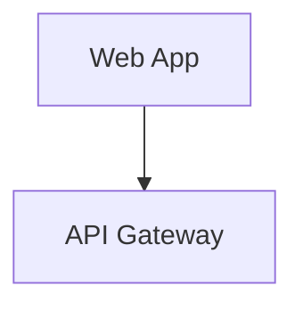

✅ **CORRECTO**:


---

#### Caso 2: Saltos de Línea con `<br/>`

❌ **INCORRECTO**:
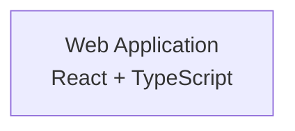

✅ **CORRECTO**:


---

#### Caso 3: Acentos y Caracteres Especiales

❌ **INCORRECTO**:
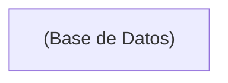

✅ **CORRECTO**:
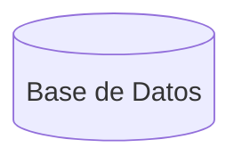

---

#### Caso 4: Diagramas de Secuencia

❌ **INCORRECTO**:
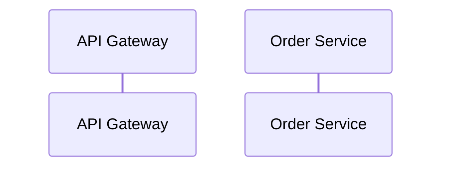

✅ **CORRECTO**:
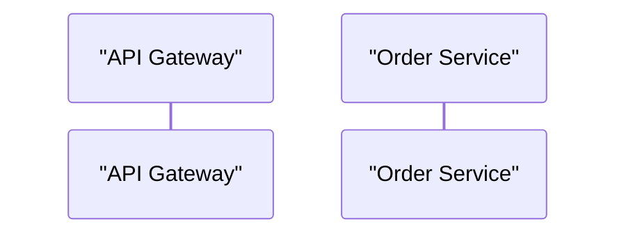

---

### Regla Simple

**Si el label contiene alguno de estos, DEBE tener comillas dobles:**

- ✅ Espacios: `"Web App"`

- ✅ Acentos: `"Gestión de Usuarios"`

- ✅ Símbolos: `"API-Gateway"`

- ✅ Números con texto: `"Node.js 18"`

- ✅ Saltos de línea: `"App<br/>React"`

- ✅ Paréntesis en el contenido: `"Servicio (Beta)"`

**No necesitan comillas:**

- ❌ IDs de nodos: `A`, `B`, `Controller`, `DB`

- ❌ Flechas con texto simple: `-->|OK|`

---

## 🔍 Cómo Revisar Tu Documentación

### Checklist de Revisión

1. **Abre cada archivo `.md`**

2. **Busca listas** (líneas que empiezan con `-`, `*`, `1.`)

3. **Verifica** que haya una línea en blanco antes

4. **Busca bloques** ` ```mermaid `

5. **Revisa cada label** dentro de `[ ]` o `( )`

6. **Si tiene espacios/acentos**, agrega comillas dobles

---

### Script de Ayuda (Bash)

Guarda esto como `check-format.sh`:

```bash
#!/bin/bash

echo "🔍 Revisando formato de documentación..."
echo ""

# Buscar listas sin salto de línea previo
echo "📝 Buscando listas sin salto de línea:"
grep -rn --include="*.md" -B1 "^- " docs/ | grep -v "^--$" | grep -v "^docs.*:$" | grep -E "^docs.*:[^:]*:$"

echo ""
echo "🎨 Archivos con diagramas Mermaid (revisar manualmente):"
grep -rl --include="*.md" "```mermaid" docs/

echo ""
echo "✅ Revisión completa. Verifica los resultados arriba."
```

Ejecútalo:
```bash
chmod +x check-format.sh
./check-format.sh
```

---

## 🛠️ Herramientas de Validación

### Validar Diagramas Mermaid

1. **Mermaid Live Editor**: https://mermaid.live/
   - Copia tu código Mermaid
   - Pégalo en el editor
   - Si hay error, corrige la sintaxis

2. **VS Code Extension**:
   - Instala "Mermaid Preview"
   - Abre archivo `.md`
   - Presiona `Ctrl+Shift+P` → "Mermaid: Preview"

3. **MkDocs Local**:
   ```bash
   mkdocs serve
   # Abre http://127.0.0.1:8000
   # Navega a la página con el diagrama
   ```

---

## 📋 Ejemplos de Corrección Completos

### Ejemplo 1: Documento Técnico

**Antes** (❌ incorrecto):

```markdown
## Stack Tecnológico

El proyecto utiliza las siguientes tecnologías:

- Node.js 18

- PostgreSQL 15

- Redis 7

## Arquitectura

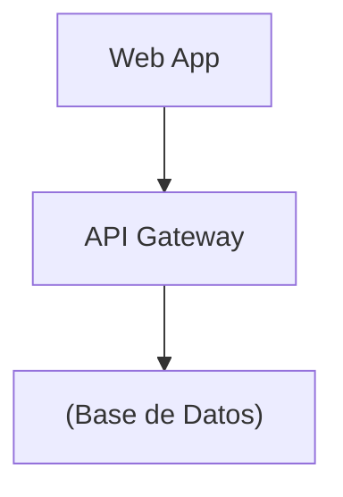
```

**Después** (✅ correcto):

```markdown
## Stack Tecnológico

El proyecto utiliza las siguientes tecnologías:

- Node.js 18

- PostgreSQL 15

- Redis 7

## Arquitectura

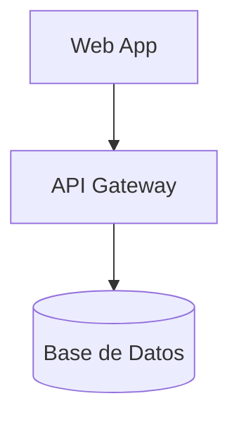
```

---

### Ejemplo 2: Diagrama C4 Completo

**Antes** (❌ incorrecto):

```markdown
### Diagrama de Contenedores

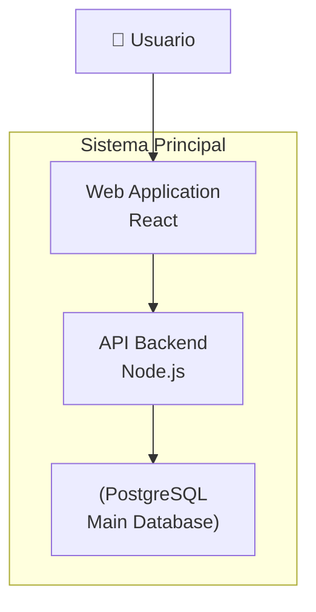
```

**Después** (✅ correcto):

```markdown
### Diagrama de Contenedores

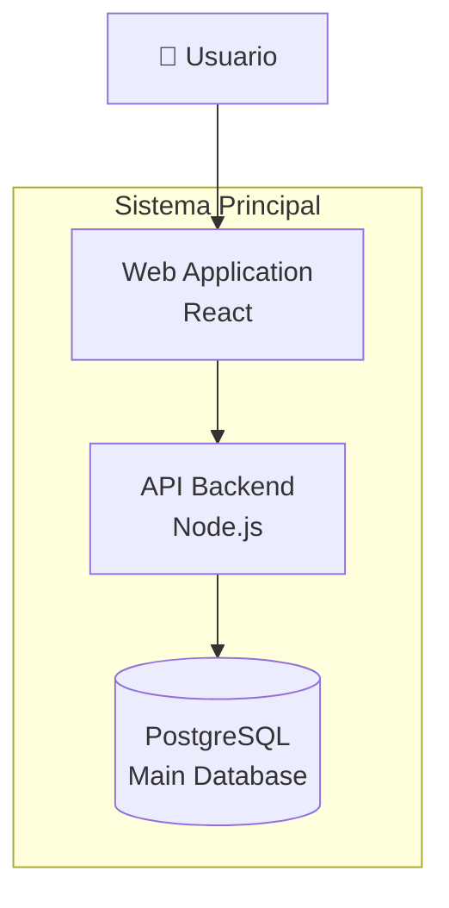
```

**Cambios**:

1. Agregamos comillas a `"Sistema Principal"` (subgraph con espacios)

2. Agregamos comillas a todos los labels con `<br/>`

3. Agregamos comillas a label con emoji y espacio

---

## 💡 Tips para Prevenir Errores

### Al Usar Prompts de IA

1. **Incluye en tu prompt**:
   ```
   IMPORTANTE: 
   - Deja una línea en blanco antes de cada lista
   - Usa comillas dobles en todos los labels de Mermaid con espacios
   ```

2. **Revisa el output antes de copiar**:
   - Escanea visualmente las listas
   - Busca diagramas Mermaid
   - Valida en https://mermaid.live/

3. **Itera si es necesario**:
   - Si el diagrama no funciona, pide corrección
   - Proporciona el ejemplo correcto al agente

---

## 🎓 Entrenando al Agente IA

Si trabajas frecuentemente con un agente IA (ChatGPT, Claude), puedes "entrenarlo" en la conversación:

```
Antes de continuar, recuerda estas reglas para todo lo que generes:

1. MARKDOWN: Siempre deja una línea en blanco antes de listas (-, *, 1.)

2. MERMAID: Siempre usa comillas dobles en labels con espacios o <br/>

Ejemplos:
✅ CORRECTO (markdown):
```
Tecnologías:

- Node.js

- React
```

✅ CORRECTO (mermaid):
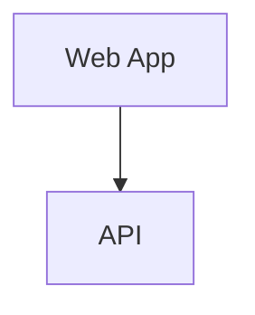

¿Entendido?
```

Después de que confirme, continuará aplicando estas reglas.

---

## 📚 Referencias

- **Markdown Spec**: https://spec.commonmark.org/

- **Mermaid Docs**: https://mermaid.js.org/

- **MkDocs Material**: https://squidfunk.github.io/mkdocs-material/

---

## 🚀 Próximos Pasos

1. **Lee esta guía completa**

2. **Revisa tu documentación existente** con el checklist

3. **Corrige los errores encontrados**

4. **Usa los prompts actualizados** para nuevos proyectos

5. **Valida siempre** antes de hacer commit

---

<div style="text-align: center; margin-top: 50px;">
    <p><strong>Con estas correcciones, tus diagramas renderizarán perfectamente ✨</strong></p>
    <small>Última actualización: 2025-12-10</small>
</div>
