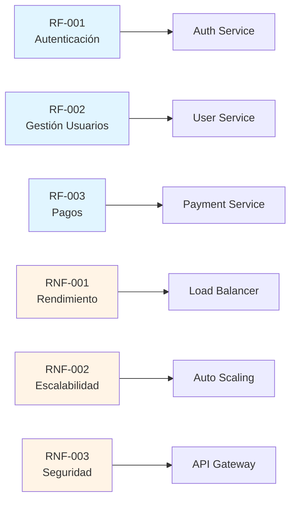
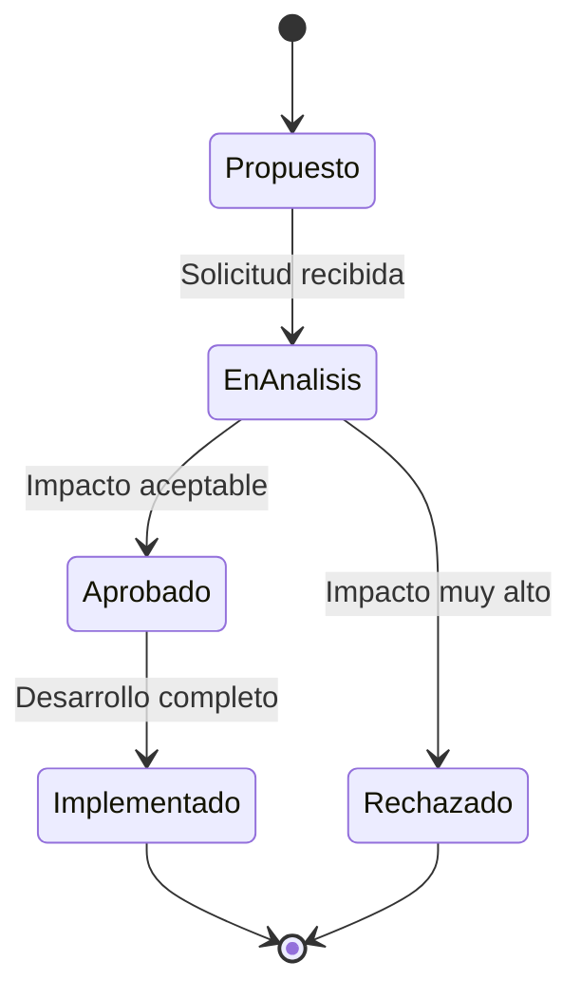

# 📋 Análisis y Documentación de Requerimientos

## 🎯 Propósito

El análisis de requerimientos es la base fundamental de cualquier proyecto de software. Esta sección define cómo capturar, analizar y documentar tanto los **requisitos funcionales** como los **requisitos no funcionales** de forma estructurada y completa.

---

## 📊 Estructura del Documento de Requerimientos

Cada proyecto debe incluir un documento `01-requerimientos.md` con la siguiente estructura:

```
01-requerimientos.md
├── Requisitos Funcionales
│   ├── Historias de Usuario
│   ├── Casos de Uso
│   └── Funcionalidades Core
├── Requisitos No Funcionales
│   ├── Rendimiento
│   ├── Seguridad
│   ├── Escalabilidad
│   ├── Disponibilidad
│   ├── Mantenibilidad
│   └── Usabilidad
└── Matriz de Trazabilidad
```

---

## 🔍 Metodología de Captura de Requisitos

### 1. Requisitos Funcionales

Los requisitos funcionales describen **QUÉ** debe hacer el sistema:

#### Formato de Historia de Usuario

```markdown
**Como** [tipo de usuario]
**Quiero** [realizar una acción]
**Para** [obtener un beneficio]

**Criterios de Aceptación:**

- [ ] Criterio 1

- [ ] Criterio 2

- [ ] Criterio 3
```

#### Ejemplo Completo

```markdown
### RF-001: Autenticación de Usuarios

**Como** usuario del sistema
**Quiero** iniciar sesión con mi correo y contraseña
**Para** acceder a las funcionalidades de la aplicación

**Criterios de Aceptación:**

- [ ] El sistema valida formato de email

- [ ] La contraseña debe tener mínimo 8 caracteres

- [ ] Bloqueo de cuenta después de 3 intentos fallidos

- [ ] Tiempo de sesión: 24 horas

- [ ] Opción de "Recordar sesión" por 30 días

**Prioridad:** Alta
**Módulo:** Autenticación
**Estimación:** 5 puntos
```

---

## ❓ Cuestionario para Requisitos No Funcionales

Este cuestionario debe aplicarse al inicio de cada proyecto para definir los requisitos no funcionales:

### 🚀 Rendimiento

1. **¿Cuál es el tiempo de respuesta máximo aceptable para las operaciones principales?**
   - [ ] < 200ms (Crítico)
   - [ ] < 500ms (Importante)
   - [ ] < 1s (Estándar)
   - [ ] < 3s (Aceptable)

2. **¿Cuántos usuarios concurrent esperamos?**
   - Usuarios simultáneos mínimos: _____
   - Usuarios simultáneos promedio: _____
   - Usuarios simultáneos pico: _____

3. **¿Cuál es el throughput esperado?**
   - Transacciones por segundo (TPS): _____
   - Requests por minuto (RPM): _____

4. **¿Qué tamaño de datos manejará el sistema?**
   - Registros iniciales: _____
   - Crecimiento mensual: _____
   - Tamaño máximo esperado en 3 años: _____

### 🔒 Seguridad

5. **¿Qué nivel de seguridad requiere el proyecto?**
   - [ ] Básico (autenticación simple)
   - [ ] Medio (autenticación + autorización + HTTPS)
   - [ ] Alto (compliance, auditoría, encriptación end-to-end)
   - [ ] Crítico (certificaciones de seguridad requeridas)

6. **¿Qué datos sensibles maneja el sistema?**
   - [ ] Datos personales (PII)
   - [ ] Datos financieros
   - [ ] Datos de salud
   - [ ] Datos de menores
   - [ ] Otros: _____

7. **¿Requiere cumplimiento normativo?**
   - [ ] GDPR (protección de datos EU)
   - [ ] PCI-DSS (pagos con tarjeta)
   - [ ] HIPAA (datos de salud)
   - [ ] SOC 2
   - [ ] ISO 27001
   - [ ] Otros: _____

8. **¿Qué mecanismos de autenticación se requieren?**
   - [ ] Usuario/contraseña
   - [ ] Multi-factor authentication (MFA)
   - [ ] Single Sign-On (SSO)
   - [ ] OAuth2 / OpenID Connect
   - [ ] Biométricos
   - [ ] Certificados digitales

### 📈 Escalabilidad

9. **¿El sistema debe escalar horizontalmente?**
   - [ ] Sí, automáticamente
   - [ ] Sí, manualmente
   - [ ] No necesario

10. **¿Cuál es el crecimiento esperado de usuarios?**
    - Usuarios año 1: _____
    - Usuarios año 2: _____
    - Usuarios año 3: _____

11. **¿Necesita soportar múltiples regiones geográficas?**
    - [ ] Sí, desde el inicio
    - [ ] Sí, en el futuro
    - [ ] No

### ⏱️ Disponibilidad

12. **¿Cuál es el SLA (Service Level Agreement) requerido?**
    - [ ] 99.9% (8.76 horas downtime/año)
    - [ ] 99.95% (4.38 horas downtime/año)
    - [ ] 99.99% (52.56 minutos downtime/año)
    - [ ] 99.999% (5.26 minutos downtime/año)

13. **¿Requiere operación 24/7?**
    - [ ] Sí, crítico
    - [ ] Solo horario laboral
    - [ ] Con ventanas de mantenimiento programadas

14. **¿Qué estrategia de backup se requiere?**
    - Frecuencia de backups: _____
    - Retención de backups: _____
    - RPO (Recovery Point Objective): _____
    - RTO (Recovery Time Objective): _____

### 🔧 Mantenibilidad

15. **¿Qué nivel de documentación se requiere?**
    - [ ] Básica (README + comentarios)
    - [ ] Estándar (esta guía completa)
    - [ ] Extensiva (incluye videos, training)

16. **¿Requiere capacidad de debugging/troubleshooting en producción?**
    - [ ] Logs básicos
    - [ ] Logs estructurados + métricas
    - [ ] Observabilidad completa (logs + metrics + traces)

17. **¿Necesita versionado de API?**
    - [ ] Sí, múltiples versiones simultáneas
    - [ ] Sí, con deprecación gradual
    - [ ] No necesario

### 👥 Usabilidad

18. **¿Qué dispositivos debe soportar?**
    - [ ] Desktop
    - [ ] Tablet
    - [ ] Mobile
    - [ ] Todos (responsive)

19. **¿Requiere accesibilidad (WCAG)?**
    - [ ] Nivel A
    - [ ] Nivel AA
    - [ ] Nivel AAA
    - [ ] No requerido

20. **¿Qué navegadores debe soportar?**
    - [ ] Chrome (últimas 2 versiones)
    - [ ] Firefox (últimas 2 versiones)
    - [ ] Safari (últimas 2 versiones)
    - [ ] Edge (últimas 2 versiones)
    - [ ] IE11 (legacy)

21. **¿Requiere soporte multiidioma?**
    - Idiomas requeridos: _____
    - [ ] i18n desde el inicio
    - [ ] Planificado para el futuro

### 🌐 Integración

22. **¿Con qué sistemas externos debe integrarse?**
    - Sistema 1: _____ (Protocolo: _____)
    - Sistema 2: _____ (Protocolo: _____)
    - Sistema 3: _____ (Protocolo: _____)

23. **¿Debe exponer APIs para terceros?**
    - [ ] REST API pública
    - [ ] GraphQL API
    - [ ] Webhooks
    - [ ] No necesario

### 💰 Costo

24. **¿Cuál es el presupuesto de infraestructura mensual?**
    - Presupuesto inicial: _____
    - Presupuesto en producción: _____
    - Límite máximo: _____

25. **¿Preferencia de hosting?**
    - [ ] Cloud (AWS, Azure, GCP)
    - [ ] On-premise
    - [ ] Híbrido
    - [ ] Sin preferencia

---

## 📑 Plantilla de Requisitos No Funcionales

```markdown
## Requisitos No Funcionales

### RNF-001: Rendimiento

- Tiempo de respuesta promedio: < 300ms

- Tiempo de respuesta P95: < 500ms

- Throughput mínimo: 1000 TPS

- Usuarios concurrentes: 10,000

### RNF-002: Escalabilidad

- Autoescalado horizontal basado en CPU (>70%)

- Soportar hasta 100,000 usuarios concurrentes

- Base de datos con read replicas

### RNF-003: Disponibilidad

- SLA: 99.9% uptime

- Operación 24/7

- RPO: 1 hora

- RTO: 4 horas

### RNF-004: Seguridad

- Autenticación: OAuth2 + JWT

- Encriptación: TLS 1.3 en tránsito, AES-256 en reposo

- MFA obligatorio para roles administrativos

- Auditoría completa de acciones críticas

- Cumplimiento: GDPR, SOC 2

### RNF-005: Mantenibilidad

- Cobertura de tests: > 80%

- Documentación actualizada en cada release

- Logs estructurados (JSON)

- Métricas en tiempo real (Prometheus)

### RNF-006: Usabilidad

- Responsive design (mobile-first)

- Accesibilidad WCAG 2.1 AA

- Soporte: Chrome, Firefox, Safari, Edge

- Tiempos de carga < 2s

### RNF-007: Compatibilidad

- API REST versionada (v1, v2)

- Backward compatibility garantizada 6 meses

- Integración con: Stripe, SendGrid, Auth0
```

---

## 🔗 Matriz de Trazabilidad

La matriz de trazabilidad conecta requisitos con componentes de la arquitectura:



### Tabla de Trazabilidad

| ID Requisito | Tipo | Componente | Test ID | Estado |
|--------------|------|------------|---------|--------|
| RF-001 | Funcional | Auth Service | TS-001 | ✅ Implementado |
| RF-002 | Funcional | User Service | TS-002 | 🚧 En desarrollo |
| RNF-001 | No Funcional | Load Balancer | TN-001 | ✅ Implementado |
| RNF-002 | No Funcional | Auto Scaling | TN-002 | ✅ Implementado |

---

## 🎯 Priorización de Requisitos

Utiliza el framework **MoSCoW** para priorizar:

### **Must Have** (Debe tener) 🔴

Requisitos críticos sin los cuales el sistema no funciona.

Ejemplo: Autenticación, operaciones core del negocio

### **Should Have** (Debería tener) 🟡

Requisitos importantes pero no críticos para el MVP.

Ejemplo: Reportes avanzados, notificaciones por email

### **Could Have** (Podría tener) 🟢

Requisitos deseables que añaden valor pero son opcionales.

Ejemplo: Dashboard personalizable, temas custom

### **Won't Have** (No tendrá) ⚪

Requisitos explícitamente excluidos de esta versión.

Ejemplo: Integración con blockchain, AI generativa

---

## 📊 Diagrama de Priorización

```mermaid
quadrantChart
    title Matriz de Priorización de Requisitos
    x-axis "Bajo Esfuerzo" --> "Alto Esfuerzo"
    y-axis "Bajo Impacto" --> "Alto Impacto"
    quadrant-1 "Planificar"
    quadrant-2 "Hacer Ya"
    quadrant-3 "Descartar"
    quadrant-4 "Quick Wins"
    "Autenticación": ["0.3, 0.9"]
    "Dashboard": ["0.7, 0.8"]
    "Reportes PDF": ["0.5, 0.4"]
    "AI Chatbot": ["0.9, 0.7"]
    "Temas Custom": ["0.6, 0.3"]
    "Notificaciones": ["0.2, 0.7"]
```

---

## ✅ Checklist de Requisitos Completos

Antes de iniciar el desarrollo, verifica:

- [ ] Requisitos funcionales documentados con criterios de aceptación

- [ ] Cuestionario de requisitos no funcionales completado

- [ ] Requisitos no funcionales cuantificados (números específicos)

- [ ] Matriz de trazabilidad creada

- [ ] Priorización MoSCoW aplicada

- [ ] Stakeholders han revisado y aprobado

- [ ] Requisitos ambiguos clarificados

- [ ] Dependencias entre requisitos identificadas

- [ ] Riesgos técnicos evaluados

- [ ] Estimaciones de esfuerzo realizadas

---

## 🔄 Actualización de Requisitos

Los requisitos evolucionan. Proceso de cambio:

1. **Solicitud de cambio** - Stakeholder propone modificación

2. **Análisis de impacto** - Equipo evalúa esfuerzo y dependencias

3. **Aprobación** - Product Owner aprueba/rechaza

4. **Actualización de documentación** - Se actualiza este documento

5. **Comunicación** - Se notifica al equipo

6. **Trazabilidad** - Se actualiza la matriz



---

## 📚 Referencias y Recursos

- **IEEE 830**: Estándar para especificación de requisitos

- **BABOK**: Body of Knowledge para análisis de negocio

- **User Story Mapping**: Técnica de Jeff Patton

- **Impact Mapping**: Técnica de Gojko Adzic

---

## 💡 Mejores Prácticas

1. **Sé específico**: "Tiempo de respuesta < 300ms" mejor que "Debe ser rápido"

2. **Sé medible**: Define métricas cuantificables

3. **Sé testeable**: Cada requisito debe poder verificarse

4. **Evita ambigüedades**: "Todos los usuarios" vs "Usuarios con rol admin"

5. **Documenta el "por qué"**: Ayuda a tomar decisiones futuras

6. **Mantén actualizado**: Requisitos obsoletos confunden

7. **Involucra a stakeholders**: Valida constantemente

8. **Piensa en no funcionales desde el día 1**: No son "después"
