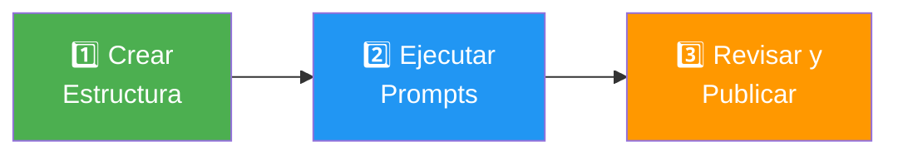

# 🚀 Inicio Rápido - Documentar un Proyecto Nuevo

## 📋 Prerequisitos

Antes de empezar, asegúrate de tener:

- ✅ Acceso al repositorio del proyecto a documentar

- ✅ GitHub Copilot activo en VS Code

- ✅ **Modo agente de Copilot activado** (OBLIGATORIO)

- ✅ 30-60 minutos de tiempo disponible

!!! warning "⚠️ IMPORTANTE: Activa el Modo Agente"
    Todos los prompts de esta guía están diseñados para **GitHub Copilot en MODO AGENTE** (`@workspace`).
    
    **Cómo activar:**
    
    1. Abre el Chat de Copilot (`Ctrl+Shift+I` o `Cmd+Shift+I`)
    2. En el input de chat, escribe `@workspace` al inicio de tu mensaje
    3. Esto permite a Copilot:
       - ✅ Analizar TODO el repositorio
       - ✅ Crear archivos en rutas específicas
       - ✅ Generar contenido basado en el código real
    
    **Sin modo agente, los prompts NO funcionarán correctamente.**

---

## 🎯 Proceso en 3 Pasos



---

## 1️⃣ PASO 1: Crear Estructura Inicial

### Opción A: Script Automático (Recomendado)

Copia y ejecuta este comando en la terminal del proyecto:

```bash
# Desde la raíz de tu proyecto
mkdir -p ai_docs/{03-arquitectura,04-tecnico,05-procesos-negocio,06-infraestructura}

# Crear archivos vacíos si lo deseas (opcional, Copilot los creará automáticamente)
touch ai_docs/01-requerimientos.md
touch ai_docs/02-vista-ejecutiva.md
touch ai_docs/03-arquitectura/{01-contexto,02-contenedores,03-componentes,04-decisiones}.md
touch ai_docs/04-tecnico/{01-stack-tecnologico,02-modelo-datos,03-apis,04-integraciones}.md
touch ai_docs/05-procesos-negocio/{01-casos-uso,02-flujos-funcionales}.md
touch ai_docs/06-infraestructura/{01-deployment,02-ci-cd,03-monitoreo}.md
```

**⚠️ IMPORTANTE:** Todos los archivos se guardarán en la carpeta `ai_docs/` en la raíz de tu proyecto.

### Opción B: Dejar que Copilot Cree Todo

No necesitas crear la estructura manualmente. Copilot creará las carpetas y archivos automáticamente al ejecutar cada prompt.

---

## 2️⃣ PASO 2: Ejecutar Prompts con Copilot Agent

Ahora vas a usar GitHub Copilot en modo agente para generar la documentación automáticamente.

### 📝 Cómo Usar los Prompts

!!! info "🎯 Flujo de Trabajo con Copilot Agent"
    Cada prompt tiene una estructura clara:
    
    1. **Campos a completar** → `[COMPLETAR: información]`
    2. **Instrucciones** → Qué debe generar Copilot
    3. **ARCHIVO DE SALIDA** → Ruta exacta donde se guardará el archivo

**Pasos para ejecutar cada prompt:**

1. **Abre el Chat de Copilot** en VS Code
   - Atajo: `Ctrl+Shift+I` (Windows/Linux) o `Cmd+Shift+I` (Mac)

2. **ACTIVA MODO AGENTE** escribiendo `@workspace` al inicio ⚠️
   ```
   @workspace [aquí irá el prompt]
   ```

3. **Copia el prompt completo** de esta guía

4. **Completa TODOS los campos** marcados con `[COMPLETAR: ...]`
   - Ejemplo: `[COMPLETAR: "E-commerce API"]` → escribes `"E-commerce API"`

5. **Pega el prompt después de @workspace**

6. **Copilot analizará el repositorio** y generará el archivo
   - ✅ El archivo se guardará AUTOMÁTICAMENTE en la ruta especificada
   - ✅ Copilot creará las carpetas necesarias si no existen

7. **Revisa el archivo generado** antes de continuar al siguiente prompt

---

### 💡 Ejemplo Visual: Antes y Después

!!! success "Ejemplo: Cómo completar un prompt"
    **❌ Prompt SIN completar (NO funcionará):**
    ```
    @workspace
    
    Genera el archivo de requerimientos.
    Nombre del proyecto: [COMPLETAR: nombre]
    ARCHIVO DE SALIDA: ai_docs/01-requerimientos.md
    ```
    
    **✅ Prompt COMPLETADO correctamente:**
    ```
    @workspace
    
    Genera el archivo de requerimientos.
    Nombre del proyecto: ecommerce-backend
    Propósito: API REST para tienda de ropa online
    SLA: 99.9%
    Usuarios concurrentes: 5000
    
    ARCHIVO DE SALIDA: ai_docs/01-requerimientos.md
    
    IMPORTANTE: Crea el archivo EXACTAMENTE en esta ruta.
    ```
    
    ✅ **Resultado:** Copilot generará el archivo `ai_docs/01-requerimientos.md` automáticamente.

---

### 📊 Prompt 01: Análisis Inicial

!!! example "📍 Información del Prompt"
    - **Modo:** `@workspace` (OBLIGATORIO)
    - **Propósito:** Entender el proyecto completo
    - **Genera archivo:** ❌ NO (solo análisis)
    - **Tiempo estimado:** 2-3 minutos

**Cómo completar:**

```
ROL: Eres un Arquitecto Senior analizando un proyecto de software.

TAREA: Analiza completamente el repositorio actual y genera un resumen ejecutivo.

INFORMACIÓN DEL PROYECTO:

- Nombre del proyecto: [COMPLETAR: ej. "E-commerce API"]

- Propósito principal: [COMPLETAR: ej. "API REST para tienda online"]

- Repositorio: [COMPLETAR: URL del repo si está disponible]

ENTREGABLE: 
Genera un resumen ejecutivo en formato markdown que incluya:

1. **Descripción del Sistema** (3-4 párrafos)

2. **Stack Tecnológico Identificado** (tabla con tecnología y propósito)

3. **Componentes Principales** (lista con descripción)

4. **Patrones Arquitectónicos Detectados**

5. **Dependencias Externas** (sistemas, APIs, servicios)

6. **Usuarios y Casos de Uso Principales** (inferidos del código)

ANALIZA:

- Archivos de configuración (package.json, requirements.txt, etc.)

- Estructura de carpetas

- Código fuente principal

- Variables de entorno (.env.example)

- README.md existente

- Tests (para entender casos de uso)

NO GENERES NINGÚN ARCHIVO AÚN. Solo entrega el análisis.
```

**✅ Acción:** Lee el análisis que Copilot genera. Valida que entendió correctamente el proyecto.

---

### 📋 Prompt 02: Generar Requerimientos

!!! example "📍 Información del Prompt"
    - **Modo:** `@workspace` (OBLIGATORIO)
    - **Propósito:** Documentar requisitos funcionales y no funcionales
    - **Genera archivo:** ✅ `ai_docs/01-requerimientos.md`
    - **Tiempo estimado:** 5-7 minutos

**Cómo completar:**

```
ROL: Eres un Business Analyst Senior especializado en ingeniería de requisitos.

CONTEXTO: 
Has analizado el proyecto "[NOMBRE-PROYECTO]" y ahora debes documentar todos sus requisitos.

TAREA: 
Genera el archivo `ai_docs/01-requerimientos.md` siguiendo la plantilla de requerimientos.

CUESTIONARIO DE REQUISITOS NO FUNCIONALES A RESPONDER:

🚀 RENDIMIENTO:

- Tiempo de respuesta esperado: [COMPLETAR: ej. "< 300ms" o "inferir del código"]

- Usuarios concurrentes: [COMPLETAR: ej. "1000" o "a definir"]

- Throughput: [COMPLETAR: ej. "500 TPS" o "inferir del stack"]

🔒 SEGURIDAD:

- Nivel requerido: [COMPLETAR: "Básico/Medio/Alto/Crítico"]

- Datos sensibles: [COMPLETAR: ej. "PII, datos financieros" o "analizar del modelo de datos"]

- Cumplimiento: [COMPLETAR: ej. "GDPR, PCI-DSS" o "ninguno específico"]

- Autenticación: [COMPLETAR: ej. "OAuth2 + JWT" o "inferir del código"]

📈 ESCALABILIDAD:

- Escalado horizontal: [COMPLETAR: "Sí/No" o "inferir de la arquitectura"]

- Regiones múltiples: [COMPLETAR: "Sí/No" o "a definir"]

⏱️ DISPONIBILIDAD:

- SLA: [COMPLETAR: ej. "99.9%" o "a definir con stakeholders"]

- Operación: [COMPLETAR: "24/7" o "horario laboral"]

- RPO/RTO: [COMPLETAR: ej. "1h/4h" o "a definir"]

GENERA:

1. **15-20 Requisitos Funcionales** (basados en el código existente)
   - Usa formato de Historia de Usuario
   - Incluye criterios de aceptación
   - Prioriza con MoSCoW

2. **Especificaciones de RNF** (7 categorías mínimo)
   - Rendimiento (con números específicos)
   - Seguridad (con mecanismos concretos)
   - Escalabilidad
   - Disponibilidad
   - Mantenibilidad
   - Usabilidad
   - Compatibilidad

3. **Matriz de Trazabilidad** (tabla completa)

4. **Diagrama de Trazabilidad** (Mermaid con labels entre comillas dobles)

REGLAS DE FORMATO:

- Línea en blanco antes de cada lista

- Labels de Mermaid con espacios DEBEN tener comillas dobles

- Valores numéricos específicos (no "rápido", sino "< 300ms")

ARCHIVO DE SALIDA: ai_docs/01-requerimientos.md

⚠️ IMPORTANTE: Crea el archivo EXACTAMENTE en esta ruta. Si la carpeta ai_docs/ no existe, créala primero.
```

**✅ Qué esperar:**
- Copilot analizará el código del repositorio
- Generará el archivo `01-requerimientos.md` en la carpeta del proyecto
- El archivo aparecerá automáticamente en el explorador de VS Code
- **Revisa** que los requisitos tengan sentido para tu proyecto antes de continuar

---

### 📊 Prompt 03: Generar Vista Ejecutiva

!!! example "📍 Información del Prompt"
    - **Modo:** `@workspace` (OBLIGATORIO)
    - **Propósito:** Documentación para stakeholders ejecutivos
    - **Genera archivo:** ✅ `ai_docs/02-vista-ejecutiva.md`
    - **Tiempo estimado:** 5-7 minutos

**Cómo completar:**

```
ROL: Eres un Business Analyst traduciendo sistemas técnicos a lenguaje ejecutivo.

CONTEXTO:
Proyecto "[NOMBRE-PROYECTO]" ya analizado y con requerimientos documentados.

INFORMACIÓN DE NEGOCIO (completa lo que sepas):

- Product Owner: [COMPLETAR: nombre o "a definir"]

- Objetivo de negocio: [COMPLETAR: ej. "Reducir tiempo de procesamiento en 50%"]

- Métricas KPI: [COMPLETAR: ej. "Transacciones/día, tiempo respuesta" o "inferir"]

- Presupuesto mensual: [COMPLETAR: ej. "$2000" o "a definir"]

- ROI esperado: [COMPLETAR: ej. "recuperar inversión en 6 meses" o "a definir"]

TAREA:
Genera el archivo `ai_docs/02-vista-ejecutiva.md`

DEBE INCLUIR:

1. **Resumen Ejecutivo** (4 párrafos, lenguaje de negocio, sin tecnicismos)

2. **Valor de Negocio** (objetivos estratégicos y KPIs con números)

3. **ROI** (tabla con inversión y retornos estimados)

4. **Usuarios y Casos de Uso** (en lenguaje simple)

5. **Diagrama de Contexto C4** (alto nivel, Mermaid)

6. **Riesgos y Dependencias** (tabla con mitigación)

7. **Roadmap** (completado, en progreso, planificado)

REGLAS:

- Sin jerga técnica (explica como si fuera para tu CEO)

- Enfoque en valor de negocio, no en tecnología

- Diagramas simples y claros

- Labels de Mermaid entre comillas dobles

ARCHIVO DE SALIDA: ai_docs/02-vista-ejecutiva.md

⚠️ IMPORTANTE: Crea el archivo EXACTAMENTE en esta ruta. Si la carpeta ai_docs/ no existe, créala primero.
```

**✅ Qué esperar:**
- Copilot generará el archivo `02-vista-ejecutiva.md` con lenguaje de negocio
- Incluirá métricas, ROI y diagramas de contexto
- **Revisa** que los números de negocio sean realistas antes de continuar

---

### 🏗️ Prompt 04: Generar Arquitectura C4

!!! example "📍 Información del Prompt"
    - **Modo:** `@workspace` (OBLIGATORIO)
    - **Propósito:** Diagramas C4 completos (Contexto, Contenedores, Componentes, ADRs)
    - **Genera archivos:** ✅ 4 archivos en `ai_docs/03-arquitectura/`
      - `01-contexto.md`
      - `02-contenedores.md`
      - `03-componentes.md`
      - `04-decisiones.md`
    - **Tiempo estimado:** 8-10 minutos

**Propósito:** Crear los 4 archivos en `03-arquitectura/`

```
ROL: Eres un Arquitecto de Software Senior documentando arquitectura con C4 Model.

CONTEXTO: Proyecto "[NOMBRE-PROYECTO]"

TAREA: 
Genera 4 archivos de arquitectura completos:

1. `ai_docs/03-arquitectura/01-contexto.md`
   - Diagrama C4 Nivel 1 (Contexto)
   - Usuarios externos
   - Sistemas externos
   - Propósito de cada interacción

2. `ai_docs/03-arquitectura/02-contenedores.md`
   - Diagrama C4 Nivel 2 (Contenedores)
   - Aplicaciones web/móviles
   - APIs/servicios
   - Bases de datos
   - Caches/colas
   - Protocolos de comunicación

3. `ai_docs/03-arquitectura/03-componentes.md`
   - Diagrama C4 Nivel 3 (Componentes)
   - Componentes internos del contenedor principal
   - Responsabilidades de cada componente
   - Patrones aplicados

4. `ai_docs/03-arquitectura/04-decisiones.md`
   - ADRs (Architecture Decision Records)
   - Formato: Contexto → Decisión → Consecuencias
   - Mínimo 5 decisiones arquitectónicas

ANALIZA EL CÓDIGO PARA:

- Detectar componentes reales (controllers, services, repositories)

- Identificar patrones (MVC, hexagonal, microservicios, etc.)

- Encontrar dependencias (package.json, requirements.txt)

- Descubrir integraciones (configuraciones, SDKs)

REGLAS:

- Diagramas Mermaid con labels entre comillas dobles

- Colores consistentes por tipo (ver guía)

- Leyendas claras

- Explicación en texto de cada diagrama

ARCHIVOS DE SALIDA: 

- ai_docs/03-arquitectura/01-contexto.md

- ai_docs/03-arquitectura/02-contenedores.md

- ai_docs/03-arquitectura/03-componentes.md

- ai_docs/03-arquitectura/04-decisiones.md

⚠️ IMPORTANTE: Crea los 4 archivos EXACTAMENTE en estas rutas. Si las carpetas no existen, créalas.
```

**✅ Qué esperar:**
- Copilot generará los 4 archivos de arquitectura
- Incluirá diagramas C4 niveles 1, 2 y 3, más ADRs
- **Revisa** que los diagramas reflejen la arquitectura real del proyecto

---

### 💻 Prompt 05: Generar Documentación Técnica

!!! example "📍 Información del Prompt"
    - **Modo:** `@workspace` (OBLIGATORIO)
    - **Propósito:** Documentación técnica completa para desarrolladores
    - **Genera archivos:** ✅ 4 archivos en `ai_docs/04-tecnico/`
      - `01-stack-tecnologico.md`
      - `02-modelo-datos.md`
      - `03-apis.md`
      - `04-integraciones.md`
    - **Tiempo estimado:** 7-9 minutos

**Propósito:** Crear los 4 archivos en `04-tecnico/`

```
ROL: Eres un Tech Lead documentando aspectos técnicos para desarrolladores.

CONTEXTO: Proyecto "[NOMBRE-PROYECTO]"

TAREA:
Genera 4 archivos técnicos completos:

1. `ai_docs/04-tecnico/01-stack-tecnologico.md`
   - Tabla completa de tecnologías (lenguaje, framework, BD, etc.)
   - Versiones específicas
   - Justificación de elección
   - Alternativas consideradas

2. `ai_docs/04-tecnico/02-modelo-datos.md`
   - Diagrama ER completo (Mermaid)
   - Descripción de cada entidad
   - Relaciones y cardinalidad
   - Índices importantes
   - Estrategia de particionamiento (si aplica)

3. `ai_docs/04-tecnico/03-apis.md`
   - Lista completa de endpoints
   - Request/Response examples (JSON)
   - Códigos de error
   - Autenticación requerida
   - Rate limits

4. `ai_docs/04-tecnico/04-integraciones.md`
   - Sistemas externos con los que integra
   - Protocolo de comunicación
   - Autenticación
   - Datos intercambiados
   - Diagrama de flujo

ANALIZA:

- package.json / requirements.txt / pom.xml (dependencias)

- Archivos de modelos/entidades

- Controllers/Routes (para APIs)

- Configuraciones de BD

- Archivos .env.example (integraciones)

REGLAS:

- Ejemplos de código reales del proyecto

- Diagramas Mermaid correctos

- Tablas bien formateadas

- Links a documentación externa

ARCHIVOS DE SALIDA:

- ai_docs/04-tecnico/01-stack-tecnologico.md

- ai_docs/04-tecnico/02-modelo-datos.md

- ai_docs/04-tecnico/03-apis.md

- ai_docs/04-tecnico/04-integraciones.md

⚠️ IMPORTANTE: Crea los 4 archivos EXACTAMENTE en estas rutas. Si las carpetas no existen, créalas.
```

**✅ Qué esperar:**
- Copilot generará los 4 archivos técnicos
- Incluirá stack, modelos de datos, APIs e integraciones
- **Revisa** que las tecnologías y endpoints sean correctos

---

### 🔄 Prompt 06: Generar Procesos de Negocio

!!! example "📍 Información del Prompt"
    - **Modo:** `@workspace` (OBLIGATORIO)
    - **Propósito:** Casos de uso y flujos funcionales
    - **Genera archivos:** ✅ 2 archivos en `ai_docs/05-procesos-negocio/`
      - `01-casos-uso.md`
      - `02-flujos-funcionales.md`
    - **Tiempo estimado:** 6-8 minutos

**Propósito:** Crear los 2 archivos en `05-procesos-negocio/`

```
ROL: Eres un Business Analyst documentando procesos de negocio.

CONTEXTO: Proyecto "[NOMBRE-PROYECTO]"

TAREA:
Genera 2 archivos:

1. `ai_docs/05-procesos-negocio/01-casos-uso.md`
   - 10-15 casos de uso principales
   - Formato: Actor → Precondiciones → Flujo → Postcondiciones
   - Flujos alternativos
   - Flujos de excepción

2. `ai_docs/05-procesos-negocio/02-flujos-funcionales.md`
   - Diagramas de secuencia Mermaid
   - Un diagrama por cada caso de uso crítico
   - Interacciones entre componentes
   - Llamadas a APIs externas

ANALIZA:

- Tests (revelan casos de uso)

- Controllers/Services (flujos de negocio)

- Validaciones (reglas de negocio)

- Estados/Workflows

REGLAS:

- Diagramas de secuencia completos

- Labels entre comillas dobles

- Descripción clara de cada paso

- Manejo de errores visible

ARCHIVOS DE SALIDA:

- ai_docs/05-procesos-negocio/01-casos-uso.md

- ai_docs/05-procesos-negocio/02-flujos-funcionales.md

⚠️ IMPORTANTE: Crea los 2 archivos EXACTAMENTE en estas rutas. Si las carpetas no existen, créalas.
```

**✅ Qué esperar:**
- Copilot generará casos de uso y flujos funcionales
- Incluirá diagramas de secuencia de los procesos principales
- **Revisa** que los flujos representen correctamente la lógica de negocio

---

### 🚀 Prompt 07: Generar Infraestructura

!!! example "📍 Información del Prompt"
    - **Modo:** `@workspace` (OBLIGATORIO)
    - **Propósito:** Documentación de deployment, CI/CD y monitoreo
    - **Genera archivos:** ✅ 3 archivos en `ai_docs/06-infraestructura/`
      - `01-deployment.md`
      - `02-ci-cd.md`
      - `03-monitoreo.md`
    - **Tiempo estimado:** 6-8 minutos

**Propósito:** Crear los 3 archivos en `06-infraestructura/`

```
ROL: Eres un DevOps/SRE documentando infraestructura y operaciones.

CONTEXTO: Proyecto "[NOMBRE-PROYECTO]"

INFORMACIÓN DE INFRAESTRUCTURA (completa lo que sepas):

- Cloud provider: [COMPLETAR: "AWS/Azure/GCP" o "inferir de configs"]

- Ambiente de producción: [COMPLETAR: URL o "a definir"]

- CI/CD tool: [COMPLETAR: "GitHub Actions/Jenkins/GitLab" o "inferir"]

TAREA:
Genera 3 archivos:

1. `ai_docs/06-infraestructura/01-deployment.md`
   - Diagrama de arquitectura de deployment
   - Componentes de infraestructura
   - Redes y seguridad
   - Escalado y HA

2. `ai_docs/06-infraestructura/02-ci-cd.md`
   - Diagrama del pipeline
   - Stages (build, test, deploy)
   - Variables de entorno
   - Estrategia de deployment (blue/green, canary, etc.)

3. `ai_docs/06-infraestructura/03-monitoreo.md`
   - Métricas monitoreadas
   - Alertas configuradas
   - Dashboards
   - Logs y trazas

ANALIZA:

- .github/workflows o similar (CI/CD)

- Dockerfile, docker-compose.yml

- Kubernetes manifests

- Scripts de deployment

- Configuraciones de monitoreo

ARCHIVOS DE SALIDA:

- ai_docs/06-infraestructura/01-deployment.md

- ai_docs/06-infraestructura/02-ci-cd.md

- ai_docs/06-infraestructura/03-monitoreo.md

⚠️ IMPORTANTE: Crea los 3 archivos EXACTAMENTE en estas rutas. Si las carpetas no existen, créalas.
```

**✅ Qué esperar:**
- Copilot generará documentación de infraestructura
- Incluirá deployment, pipelines CI/CD y monitoreo
- **Revisa** que refleje la configuración real de tu infraestructura

---

### 📚 Prompt 08: Generar Apéndices

!!! example "📍 Información del Prompt"
    - **Modo:** `@workspace` (OBLIGATORIO)
    - **Propósito:** Glosario, referencias y changelog
    - **Genera archivos:** ✅ 3 archivos en `ai_docs/07-apendices/`
      - `01-glosario.md`
      - `02-referencias.md`
      - `03-changelog.md`
    - **Tiempo estimado:** 4-5 minutos

**Propósito:** Crear los 3 archivos finales en `07-apendices/`

```
ROL: Eres un Technical Writer completando la documentación.

CONTEXTO: Proyecto "[NOMBRE-PROYECTO]"

TAREA:
Genera los últimos 3 archivos:

1. `ai_docs/07-apendices/01-glosario.md`
   - Términos técnicos del proyecto
   - Acrónimos
   - Definiciones de dominio
   - Orden alfabético

2. `ai_docs/07-apendices/02-referencias.md`
   - Links a documentación externa
   - APIs de terceros
   - Tutoriales útiles
   - RFCs y estándares

3. `ai_docs/07-apendices/03-changelog.md`
   - Historial de versiones
   - Cambios principales por versión
   - Migraciones requeridas

ANALIZA:

- README.md

- CHANGELOG.md existente

- package.json (versión)

- Commits recientes

ARCHIVOS DE SALIDA:

- ai_docs/07-apendices/01-glosario.md

- ai_docs/07-apendices/02-referencias.md

- ai_docs/07-apendices/03-changelog.md

⚠️ IMPORTANTE: Crea los 3 archivos EXACTAMENTE en estas rutas. Si las carpetas no existen, créalas.
```

**✅ Qué esperar:**
- Copilot generará los últimos 3 archivos de apéndices
- Incluirá glosario, referencias y changelog
- **Revisa** que el glosario incluya todos los términos importantes

---

### 📦 Prompt 09: Generar Archivos Complementarios del Repositorio

!!! example "📍 Información del Prompt"
    - **Modo:** `@workspace` (OBLIGATORIO)
    - **Propósito:** Generar archivos esenciales del repo basándose en ai_docs/
    - **Genera archivos:** ✅ 5 archivos en raíz del proyecto
      - `README.md`
      - `.gitignore`
      - `CHANGELOG.md`
      - `.env.example` (si aplica)
      - `CONTRIBUTING.md`
    - **Tiempo estimado:** 8-10 minutos

**Propósito:** Generar archivos complementarios del repositorio basándose en la documentación AI

**Ver prompt completo en:** [05-prompts.md - Prompt 09](/guia-documentacion/05-prompts/#-prompt-09-generar-archivos-complementarios-del-repositorio)

**Cómo completar:**

```
ROL: Eres un Senior Developer preparando un repositorio completo y profesional.

CONTEXTO: Proyecto "[COMPLETAR: nombre del proyecto]"

Ya existe documentación completa en la carpeta ai_docs/

TAREA: Genera archivos complementarios del repositorio.

ARCHIVOS A GENERAR:

1. README.md (completo con arquitectura, setup, ejecución local, variables de entorno)
2. .gitignore (apropiado para el stack + site/ para MkDocs)
3. CHANGELOG.md (formato Keep a Changelog)
4. .env.example (si aplica - detectar del código)
5. CONTRIBUTING.md (guía de contribución)

INSTRUCCIONES ESPECIALES:
- Analiza primero qué archivos ya existen
- NO sobrescribas archivos completos sin avisar
- Complementa archivos existentes si están incompletos
- Extrae información de ai_docs/ para coherencia
- Detecta el stack para generar .gitignore apropiado

ARCHIVOS DE SALIDA:
- README.md (raíz)
- .gitignore (raíz) - asegurar que incluya site/
- CHANGELOG.md (raíz)
- .env.example (raíz, solo si aplica)
- CONTRIBUTING.md (raíz)
```

**✅ Qué esperar:**
- Copilot generará README.md completo con toda la info del proyecto
- Actualizará o creará .gitignore con `site/` incluido
- Generará CHANGELOG.md siguiendo estándares
- Creará .env.example si detecta variables de entorno en el código
- Creará CONTRIBUTING.md con guía de contribución
- **Revisa** que el README tenga sentido y esté completo antes de publicar

---

## 3️⃣ PASO 3: Revisar y Publicar

### Checklist de Revisión

- [ ] Todos los archivos generados están en sus rutas correctas (ai_docs/)

- [ ] Los diagramas Mermaid renderizan correctamente

- [ ] No hay campos `[COMPLETAR: ...]` pendientes

- [ ] Los requisitos tienen sentido para el proyecto

- [ ] Las métricas y números son realistas

- [ ] Se mencionan las tecnologías reales del stack

### Validar Formato

```bash
# Ejecuta el script de validación
python3 fix-format.py
```

### Integrar al Hub Central

1. Abre el archivo `mkdocs.yml` del hub de documentación

2. Agrega la navegación del nuevo proyecto:

```yaml
nav:
  # ... navegación existente ...
  
  - [Nombre del Proyecto]:
      - Inicio: [nombre-proyecto]/00-intro.md
      - Requerimientos: [nombre-proyecto]/01-requerimientos.md
      - Vista Ejecutiva: [nombre-proyecto]/02-vista-ejecutiva.md
      - Arquitectura:
          - Contexto: [nombre-proyecto]/03-arquitectura/01-contexto.md
          - Contenedores: [nombre-proyecto]/03-arquitectura/02-contenedores.md
          - Componentes: [nombre-proyecto]/03-arquitectura/03-componentes.md
          - Decisiones: [nombre-proyecto]/03-arquitectura/04-decisiones.md
      - Técnico:
          - Stack: [nombre-proyecto]/04-tecnico/01-stack-tecnologico.md
          - Modelo de Datos: [nombre-proyecto]/04-tecnico/02-modelo-datos.md
          - APIs: [nombre-proyecto]/04-tecnico/03-apis.md
          - Integraciones: [nombre-proyecto]/04-tecnico/04-integraciones.md
      - Procesos:
          - Casos de Uso: [nombre-proyecto]/05-procesos-negocio/01-casos-uso.md
          - Flujos: [nombre-proyecto]/05-procesos-negocio/02-flujos-funcionales.md
      - Infraestructura:
          - Deployment: [nombre-proyecto]/06-infraestructura/01-deployment.md
          - CI/CD: [nombre-proyecto]/06-infraestructura/02-ci-cd.md
          - Monitoreo: [nombre-proyecto]/06-infraestructura/03-monitoreo.md
      - Apéndices:
          - Glosario: [nombre-proyecto]/07-apendices/01-glosario.md
          - Referencias: [nombre-proyecto]/07-apendices/02-referencias.md
          - Changelog: [nombre-proyecto]/07-apendices/03-changelog.md
```

### Publicar

```bash
# Previsualizar localmente
mkdocs serve

# Navega a http://localhost:8000 y valida que todo se vea bien

# Publicar
mkdocs build
# O usa tu pipeline de CI/CD
```

---

## 💡 Tips y Mejores Prácticas

### ✅ DO

- **Completa todos los campos `[COMPLETAR: ...]`** antes de ejecutar el prompt

- **Revisa el output** de cada prompt antes de continuar al siguiente

- **Ajusta las respuestas** si Copilot infiere algo incorrecto

- **Valida los diagramas** en la vista previa de MkDocs

- **Pide refinamiento** si algo no está claro: "Agrega más detalle a la sección X"

### ❌ DON'T

- No ejecutes todos los prompts de golpe sin revisar

- No dejes campos sin completar (usa "a definir" si no sabes)

- No asumas que Copilot adivinará todo correctamente

- No olvides validar que los números/métricas sean realistas

- No publiques sin revisar primero localmente

---

## 🆘 Solución de Problemas

### Copilot no genera el archivo en la ruta correcta

**Solución:** Sé más explícito en el prompt:

```
IMPORTANTE: Genera el archivo EXACTAMENTE en esta ruta:
ai_docs/01-requerimientos.md

Crea la carpeta ai_docs/ si no existe.
```

### Los diagramas Mermaid no renderizan

**Causa:** Labels sin comillas dobles cuando contienen espacios.

**Solución:** Ejecuta `python3 fix-format.py` o corrige manualmente:

```markdown
# ❌ Incorrecto
A[Web App] --> B[API Gateway]

# ✅ Correcto
A["Web App"] --> B["API Gateway"]
```

### Copilot genera información genérica

**Solución:** Dale más contexto en el prompt:

```
CONTEXTO ADICIONAL:

- Este es un sistema de gestión de inventario para retail

- Usamos PostgreSQL porque necesitamos transacciones ACID

- El frontend es React porque el equipo tiene experiencia

Genera documentación ESPECÍFICA para este contexto.
```

---

## ⏱️ Tiempo Estimado

- **PASO 1** (Crear estructura): 5 minutos

- **PASO 2** (Ejecutar prompts): 30-40 minutos

- **PASO 3** (Revisar y publicar): 15-20 minutos

**Total:** ⏱️ **50-65 minutos** para documentar un proyecto completo

---

## 🎉 ¡Listo!

Ahora tienes documentación completa, consistente y profesional de tu proyecto.

**Próximos pasos:**

1. Comparte el link de la documentación con tu equipo

2. Establece un proceso de actualización (re-ejecutar prompts cuando hay cambios)

3. Repite para los demás proyectos de la organización

---

<div style="text-align: center; margin-top: 50px;">
    <p>¿Dudas? Consulta la <a href="../05-prompts/">Guía Completa de Prompts</a></p>
</div>
