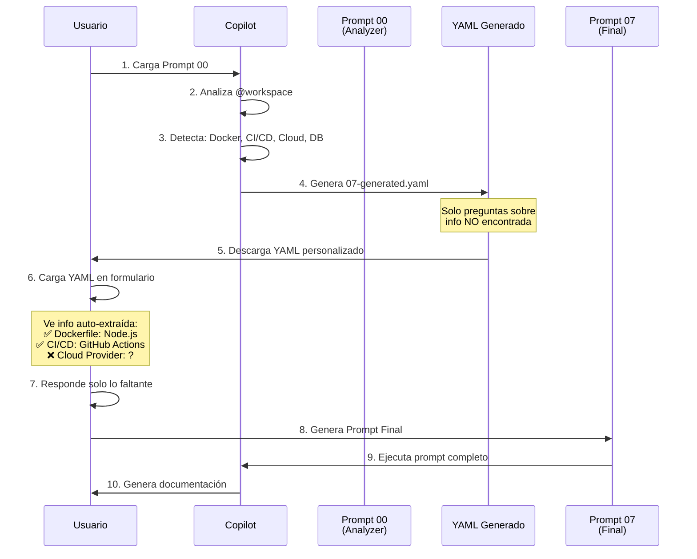

# 🔄 Sistema de 2 Fases: Análisis + Formulario Dinámico

## ✨ ¿Qué es?

Un sistema revolucionario que **analiza tu código primero** y genera un cuestionario personalizado con **solo las preguntas necesarias**.

### Problema Tradicional

❌ Formularios genéricos con 50+ preguntas  
❌ La mayoría no aplica a tu proyecto  
❌ Tedioso responder cosas obvias  
❌ Información duplicada (código + respuestas)

### Solución de 2 Fases

✅ **Fase 1**: Copilot analiza tu código → genera YAML personalizado  
✅ **Fase 2**: Solo respondes lo que falta → prompt completo  
✅ Información del código pre-llenada  
✅ Cuestionario adaptado a tu proyecto

---

## 🎯 Flujo Completo



---

## 🚀 Paso a Paso

### **FASE 1: Análisis Inicial**

#### 1. Carga el Prompt de Análisis

<button onclick="loadPromptForm('00', 'container-00')">
    🔍 Cargar Prompt de Análisis
</button>
<div id="container-00"></div>

!!! info "Sin Formulario"
    El Prompt 00 **NO tiene preguntas**. Es un prompt directo que se copia y pega en Copilot.

#### 2. Copia el Prompt

El prompt 00 le dice a Copilot:

```markdown
ROL: Senior Software Architect

TAREA:
1. Analiza @workspace completo
2. Detecta:
   - Dockerfile, docker-compose
   - Cloud provider (AWS/IBM/GCP/Azure)
   - CI/CD (GitHub Actions, GitLab CI, Jenkins)
   - Base de datos (PostgreSQL, MongoDB, MySQL)
   - Monitoreo (Prometheus, Datadog, CloudWatch)
3. Genera archivo YAML con:
   - auto_extracted: información encontrada
   - sections: SOLO preguntas sobre lo NO encontrado
   - template: pre-llenado con info del código
```

#### 3. Ejecuta en Copilot

```
@workspace [Pega aquí el Prompt 00]
```

Copilot analizará TODO el proyecto y responderá con algo como:

```yaml
# ============================================
# CUESTIONARIO GENERADO - mi-proyecto
# Fecha: 2025-12-12
# ============================================

title: "Cuestionario de mi-proyecto"
description: "Completa la información faltante"

# ✅ INFORMACIÓN AUTO-EXTRAÍDA
auto_extracted:
  project_name: "mi-proyecto"
  
  # Docker
  has_dockerfile: true
  dockerfile_base_image: "node:18-alpine"
  dockerfile_ports: [3000, 8080]
  has_compose: true
  compose_services: ["app", "postgres", "redis"]
  
  # CI/CD
  cicd_tool_detected: "github-actions"
  cicd_file_found: ".github/workflows/deploy.yml"
  
  # Base de Datos
  database_type: "postgresql"
  orm_detected: "prisma"
  
  # Cloud Provider
  cloud_providers_detected:
    aws: false
    ibm: false
    gcp: false
    azure: false

# ❌ SOLO 2 PREGUNTAS (resto está en auto_extracted)
sections:
  - icon: "☁️"
    title: "Cloud Provider"
    description: "No se detectó cloud provider"
    questions:
      - id: cloudProvider
        type: checkbox
        label: "¿Qué cloud providers usa?"
        options:
          - value: aws
            label: "AWS"
          - value: ibm
            label: "IBM Cloud"
          - value: onpremise
            label: "On-Premise"
  
  - icon: "🚀"
    title: "Deployment"
    questions:
      - id: deployPlatform
        type: select
        label: "¿Dónde se despliega?"
        options:
          - value: kubernetes
            label: "Kubernetes"
          - value: ec2
            label: "EC2"
          - value: serverless
            label: "Serverless"

# Template con info encontrada + variables pendientes
template: |
  # DOCUMENTACIÓN DE DEPLOYMENT
  
  ## ✅ Información del Código
  
  Proyecto: {{auto_extracted.project_name}}
  
  ### Docker
  - Dockerfile: SÍ
  - Imagen base: {{auto_extracted.dockerfile_base_image}}
  - Puertos: {{auto_extracted.dockerfile_ports}}
  
  ### Docker Compose
  - Servicios: {{auto_extracted.compose_services}}
  
  ### CI/CD
  - Herramienta: {{auto_extracted.cicd_tool_detected}}
  - Archivo: {{auto_extracted.cicd_file_found}}
  
  ### Base de Datos
  - Tipo: {{auto_extracted.database_type}}
  - ORM: {{auto_extracted.orm_detected}}
  
  ## ❌ Información Completada Manualmente
  
  ### Cloud Provider
  {{cloudProvider}}
  
  ### Plataforma de Deployment
  {{deployPlatform}}
  
  [GENERAR DOCUMENTACIÓN COMPLETA...]
```

#### 4. Guarda el YAML

Copia la respuesta de Copilot y guárdala en:

```bash
docs/ai_prompts/07-generated.yaml
```

---

### **FASE 2: Completar Información**

#### 5. Carga el YAML Generado

<button onclick="loadPromptForm('07-generated', 'container-07-gen')">
    📋 Cargar Cuestionario Personalizado
</button>
<div id="container-07-gen"></div>

#### 6. Ver Información Auto-Extraída

El formulario mostrará:

<div class="pb-auto-extracted" style="background: #e7f5e7; padding: 15px; border-left: 4px solid #4caf50; border-radius: 4px; margin: 20px 0;">
    <h4>✅ Información Extraída Automáticamente</h4>
    <p style="color: #558b2f;">Esta información fue detectada analizando el código. Solo completa lo que falta.</p>
    <div style="display: grid; gap: 10px; margin-top: 15px;">
        <div style="background: white; padding: 10px; border-radius: 4px;">
            <strong>Proyecto:</strong> mi-proyecto
        </div>
        <div style="background: white; padding: 10px; border-radius: 4px;">
            <strong>Dockerfile:</strong> <span style="color: #4caf50;">✓ Detectado</span> (node:18-alpine)
        </div>
        <div style="background: white; padding: 10px; border-radius: 4px;">
            <strong>Docker Compose:</strong> <span style="color: #4caf50;">✓ Detectado</span> (app, postgres, redis)
        </div>
        <div style="background: white; padding: 10px; border-radius: 4px;">
            <strong>CI/CD:</strong> github-actions (.github/workflows/deploy.yml)
        </div>
        <div style="background: white; padding: 10px; border-radius: 4px;">
            <strong>Base de Datos:</strong> postgresql (prisma)
        </div>
    </div>
</div>

#### 7. Responde Solo lo Faltante

En lugar de 50 preguntas, **solo 2**:

1. ☁️ **Cloud Provider**: AWS / IBM / On-Premise
2. 🚀 **Plataforma**: Kubernetes / EC2 / Serverless

#### 8. Genera Prompt Final

Click en **"🚀 Generar Prompt Personalizado"**

El template combinará:
- ✅ Info auto-extraída (Docker, CI/CD, DB)
- ❌ Tus respuestas (Cloud, Platform)

#### 9. Copia y Ejecuta

El prompt final incluye **TODA la información**:

```markdown
# DOCUMENTACIÓN DE DEPLOYMENT

## ✅ Información del Código

Proyecto: mi-proyecto

### Docker
- Dockerfile: SÍ
- Imagen base: node:18-alpine
- Puertos: [3000, 8080]

### Docker Compose
- Servicios: [app, postgres, redis]

### CI/CD
- Herramienta: github-actions
- Archivo: .github/workflows/deploy.yml

### Base de Datos
- Tipo: postgresql
- ORM: prisma

## ❌ Información Completada Manualmente

### Cloud Provider
AWS

### Plataforma de Deployment
Kubernetes

[GENERAR DOCUMENTACIÓN COMPLETA BASADA EN ESTA INFO...]
```

---

## 🎨 Ventajas del Sistema

### Antes (Sistema Tradicional)

```yaml
# 07.yaml estático - 1094 líneas
sections:
  - questions: # 50+ preguntas genéricas
    - ¿Usas Docker? (ya está en Dockerfile)
    - ¿Qué imagen base? (ya está en Dockerfile)
    - ¿Tienes CI/CD? (ya está en .github/workflows)
    - ¿Qué tool? (ya está GitHub Actions)
    - ... 46 preguntas más
```

❌ **50 preguntas** (la mayoría innecesarias)  
❌ Usuario responde info que **ya está en el código**  
❌ Tedioso y repetitivo  
❌ Propenso a errores (contradice el código)

### Después (Sistema de 2 Fases)

```yaml
# 07-generated.yaml personalizado - 200 líneas
auto_extracted:
  has_dockerfile: true
  dockerfile_base_image: "node:18-alpine"
  cicd_tool: "github-actions"
  database: "postgresql"
  orm: "prisma"

sections:
  - questions: # Solo 2 preguntas faltantes
    - ¿Cloud Provider?
    - ¿Plataforma de deployment?
```

✅ **Solo 2 preguntas** (lo que falta)  
✅ Info del código **pre-llenada**  
✅ Rápido y preciso  
✅ Sin contradicciones (usa el código como fuente de verdad)

---

## 📊 Comparación

| Aspecto | Tradicional | 2 Fases |
|---------|------------|---------|
| **Preguntas** | 50+ | 2-10 (solo faltantes) |
| **Tiempo** | 15-20 min | 2-3 min |
| **Precisión** | Media (errores manuales) | Alta (código + validación) |
| **Mantenimiento** | Manual (al cambiar código) | Auto (re-analiza código) |
| **Adaptabilidad** | Genérico | Personalizado por proyecto |

---

## 🛠️ Templates con Condicionales

El sistema usa **Handlebars** para templates dinámicos:

### Ejemplo: Mostrar Info Solo si Existe

```yaml
template: |
  ## Docker
  {{#if auto_extracted.has_dockerfile}}
  ✅ Dockerfile detectado:
  - Imagen base: {{auto_extracted.dockerfile_base_image}}
  - Puertos: {{auto_extracted.dockerfile_ports}}
  {{else}}
  ❌ No se encontró Dockerfile
  {{/if}}
  
  ## CI/CD
  {{#if auto_extracted.cicd_tool_detected}}
  ✅ CI/CD detectado:
  - Tool: {{auto_extracted.cicd_tool_detected}}
  - Archivo: {{auto_extracted.cicd_file_found}}
  
  ### Analizar Pipeline
  @workspace Analiza el archivo {{auto_extracted.cicd_file_found}}
  y documenta los stages, triggers y secrets.
  {{else}}
  ❌ No se detectó CI/CD configurado
  
  Recomendación: Implementar {{cicd_tool_deseado}}
  {{/if}}
```

### Iteraciones con `{{#each}}`

```yaml
template: |
  ## Servicios Docker Compose
  {{#each auto_extracted.compose_services}}
  - {{this}}
  {{/each}}
  
  ## Cloud Providers
  {{#each cloudProvider}}
  ### {{this}}
  [Documentar configuración de {{this}}]
  {{/each}}
```

---

## 🔧 Crear Tu Propio Prompt de Análisis

### Estructura Básica

```yaml
title: "Análisis Inicial - [Tu Dominio]"
description: "Analiza el código para generar cuestionario personalizado"

template: |
  # ROL
  Eres un experto en [tu dominio]
  
  # TAREA
  
  ## PASO 1: Analizar Proyecto
  
  Busca en @workspace:
  - [ ] Archivo X → Extrae info Y
  - [ ] Patrón Z → Identifica tecnología W
  
  ## PASO 2: Clasificar
  
  - ✅ ENCONTRADO → Incluir en auto_extracted
  - ❌ NO ENCONTRADO → Generar pregunta
  
  ## PASO 3: Generar YAML
  
  ```yaml
  auto_extracted:
    campo_encontrado: "valor del código"
  
  sections:
    - questions:
      - id: campo_faltante
        label: "¿Cuál es el valor?"
  
  template: |
    Campo encontrado: {{auto_extracted.campo_encontrado}}
    Campo faltante: {{campo_faltante}}
  ```
```

---

## 📚 Casos de Uso

### 1. Documentación de Infraestructura

```yaml
# 00-infra-analyzer.yaml
Analiza:
- Terraform files → cloud provider, recursos
- Kubernetes manifests → deployments, services
- Helm charts → valores, dependencias
```

### 2. Documentación de APIs

```yaml
# 00-api-analyzer.yaml
Analiza:
- OpenAPI/Swagger → endpoints, schemas
- Código fuente → controllers, servicios
- Tests → casos de uso, validaciones
```

### 3. Documentación de Seguridad

```yaml
# 00-security-analyzer.yaml
Analiza:
- Dependencias → vulnerabilidades conocidas
- Secrets → configuración de vaults
- Autenticación → JWT, OAuth, SAML
```

---

## ⚡ Tips y Mejores Prácticas

### ✅ DO

- **Re-analiza cuando cambia el código** - Genera nuevo YAML
- **Combina análisis automático + conocimiento del equipo**
- **Usa condicionales** para templates adaptativos
- **Marca incertidumbres** - Si no estás seguro, pregunta

### ❌ DON'T

- No asumas información no encontrada
- No generes preguntas sobre info obvia en el código
- No uses templates estáticos cuando puedes usar condicionales
- No olvides validar el YAML generado antes de usarlo

---

## 🔗 Recursos

- [Prompt 00 - Analyzer](../ai_prompts/00-analyzer.yaml)
- [Documentación de Handlebars](https://handlebarsjs.com/)
- [Formularios Interactivos](12-formularios-interactivos.md)
- [Prompts para IA](05-prompts.md)

---

## 🎯 Próximos Pasos

1. ✅ [Carga Prompt 00](#fase-1-analisis-inicial) y analiza tu proyecto
2. ✅ Guarda el YAML generado
3. ✅ Carga el formulario personalizado
4. ✅ Genera documentación completa

**¡El futuro de la documentación es automático y personalizado!** 🚀
