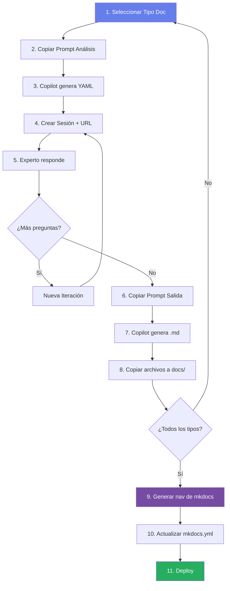

# 🚀 Flujo Completo del Sistema de Documentación con IA

## 📋 Descripción General

Este sistema permite generar documentación técnica completa de un proyecto mediante un proceso iterativo con GitHub Copilot, donde un experto responde preguntas específicas sobre el proyecto.

---

## 🔄 Flujo del Sistema

### **Fase 1: Preparación**

#### 1.1 Seleccionar Tipo de Documentación

En el **Panel de Proyectos** (`/admin/panel-proyectos/`):

- ✅ Crea o selecciona un proyecto existente
- 📚 Elige el tipo de documentación a generar:
  - 📊 **Vista Ejecutiva** (recomendado empezar por aquí)
  - 📋 **Requerimientos**
  - 🏗️ **Arquitectura**
  - 📐 **ADR (Decisiones)**
  - ⚙️ **Documentación Técnica**
  - 💼 **Procesos de Negocio**
  - 🚀 **Deployment/Infraestructura**
  - 📖 **API Reference (Swagger)**

**💡 Recomendación:** Hazlas secuencialmente siguiendo el orden numérico. Sin embargo, **puedes hacerlas todas en paralelo** si necesitas velocidad.

---

### **Fase 2: Generación de Preguntas**

#### 2.1 Copiar Prompt de Análisis

1. En el tipo de documentación seleccionado, copia el **Prompt de Análisis**
2. Ejemplo: `/prompts/vista-ejecutiva/01-analisis/`

#### 2.2 Ejecutar en Copilot (Workspace del Proyecto)

1. Abre **GitHub Copilot** en el **workspace del proyecto a documentar** (NO en el proyecto de documentación)
2. Pega el prompt de análisis
3. Copilot analizará el código y generará un **YAML con preguntas específicas**

```yaml
title: "Análisis de Vista Ejecutiva"
sections:
  - icon: "📊"
    title: "Información General"
    questions:
      - id: proyecto_nombre
        type: text
        label: "¿Cuál es el nombre del proyecto?"
        ...
```

---

### **Fase 3: Crear Sesión de Análisis**

#### 3.1 Crear Nueva Sesión

En el **Panel de Proyectos**:

1. Selecciona tu proyecto
2. Click en **"➕ Crear Nueva Sesión"**
3. Completa:
   - 📝 **Nombre de la sesión** (nuevo): Ej: "Vista Ejecutiva - Sprint 1"
   - 📚 **Tipo de documentación**
   - 📄 **YAML de preguntas** (pega el que generó Copilot)
4. Se generará una **URL de análisis**: `/answer?token=abc123...`

#### 3.2 Compartir con Experto

- 🔗 Copia la URL generada
- 📧 Envíala al experto del proyecto
- 👤 El experto puede ser tú mismo, un desarrollador, PM, arquitecto, etc.

---

### **Fase 4: Responder Preguntas**

#### 4.1 El Experto Responde

1. El experto abre la URL: `/answer?token=abc123`
2. Completa el formulario con las respuestas
3. Click en **"✅ Enviar Respuestas"** o **"🔄 Actualizar Respuestas"**

**✨ Mejora implementada:** Ahora puedes **copiar las respuestas** directamente desde el formulario con el botón **"📋 Copiar Respuestas"**

---

### **Fase 5: Copiar Respuestas**

#### 5.1 Desde el Panel de Proyectos

En el **Panel de Proyectos**, encuentra la sesión y:

1. Click en **"📋 Copiar Respuestas"**
2. **✨ NUEVO:** Las respuestas se copian con el formato:

```
━━━━━━━━━━━━━━━━━━━━━━━━━━━━━━━━━━━━━━━━━━━━━━━━━━━━━━━━━━━━━━━━━━
📌 PREGUNTA [proyecto_nombre]:
¿Cuál es el nombre del proyecto?
💡 Ayuda: Nombre corto sin espacios

✅ RESPUESTA:
Sistema de Atención WhatsApp

━━━━━━━━━━━━━━━━━━━━━━━━━━━━━━━━━━━━━━━━━━━━━━━━━━━━━━━━━━━━━━━━━━
...
```

**🔥 Ventaja:** Copilot tiene el **contexto completo** (pregunta + respuesta) para generar mejor documentación.

---

### **Fase 6: Proceso Iterativo con Copilot**

#### 6.1 Pegar Respuestas en Copilot

1. En el **mismo chat** donde pegaste el prompt de análisis
2. Pega las respuestas copiadas
3. Copilot evaluará si necesita más información

#### 6.2 Iteraciones (si son necesarias)

Si Copilot necesita más información:

1. ✅ Generará un **nuevo YAML con preguntas adicionales**
2. 🔄 **PRÓXIMAMENTE:** Podrás crear una nueva iteración desde el Panel de Proyectos
3. 🔁 Repite desde la **Fase 3** con el nuevo YAML

Si Copilot tiene suficiente información:

4. ✅ Responderá: **"continuemos al siguiente paso"**

---

### **Fase 7: Generar Documentación**

#### 7.1 Copiar Prompt de Salida

1. En el **Panel de Proyectos**, click en **"📄 Copiar Prompt de Salida"**
2. Ejemplo: `/prompts/vista-ejecutiva/02-salida/`

#### 7.2 Generar Archivos Markdown

1. Pega el prompt de salida en el **mismo chat** de Copilot
2. Copilot generará archivos `.md` completos con:
   - 📊 Diagramas Mermaid
   - 📝 Contenido estructurado
   - 🎨 Formato Markdown profesional

#### 7.3 Copiar Archivos al Proyecto de Documentación

**Manualmente (por ahora):**

1. Copia los archivos `.md` generados
2. Pégalos en: `docs/projects/{nombre-proyecto}/{tipo-documentacion}/`
3. Ejemplo: `docs/projects/whatshelp/01-vista-ejecutiva/resumen-ejecutivo.md`

---

### **Fase 8: Generar Navegación MkDocs** ⭐ NUEVO

#### 8.1 Usar Prompt de Navegación

Una vez que hayas generado **todos los tipos de documentación**:

1. Ve a `/prompts/mkdocs-nav/01-analisis/`
2. Copia el **Prompt de Navegación**
3. Pega en Copilot (workspace del **proyecto de documentación**)

#### 8.2 Obtener Configuración `nav`

Copilot analizará todos los archivos `.md` y generará:

```yaml
nav:
  - Inicio: index.md
  - Proyectos:
    - WhatsHelp:
      - 📊 Vista Ejecutiva:
        - projects/whatshelp/01-vista-ejecutiva/resumen-ejecutivo.md
      - 📋 Requerimientos:
        - Funcionales: projects/whatshelp/02-requerimientos/01-funcionales.md
        ...
```

#### 8.3 Actualizar mkdocs.yml

1. Copia la sección `nav` generada
2. Pégala en `mkdocs.yml` (reemplazando la sección de Proyectos)
3. Guarda el archivo

---

### **Fase 9: Deployment**

#### 9.1 Probar Localmente

```bash
mkdocs serve
```

Abre: `http://localhost:8000`

#### 9.2 Desplegar

```bash
git add .
git commit -m "docs: Add {tipo-documentacion} for {proyecto}"
git push
```

---

## 🎯 Flujo Paralelo (Optimizado)

Si necesitas velocidad, puedes generar **todos los tipos de documentación en paralelo**:

### Estrategia Paralela

1. **Día 1:** Genera TODOS los YAMLs de preguntas (8 tipos de doc)
2. **Día 2:** Crea 8 sesiones de análisis simultáneas
3. **Día 3:** Comparte las 8 URLs con expertos
4. **Día 4:** Recolecta todas las respuestas
5. **Día 5:** Envía todas las respuestas a 8 chats separados de Copilot
6. **Día 6:** Genera todos los archivos `.md`
7. **Día 7:** Usa el prompt de navegación y despliega

**⚡ Ventaja:** Reduces de **~2 semanas a 1 semana** el proceso completo.

**💡 Nota:** Las respuestas de una sesión pueden servir para otra (reutilización de contexto).

---

## 🔧 Mejoras Implementadas

### ✅ Completadas

- [x] **Copiar respuestas con pregunta + respuesta** (Panel de Proyectos)
- [x] **Copiar respuestas con pregunta + respuesta** (Formulario `/answer`)
- [x] **Prompt para generar nav de mkdocs.yml**

### 🚧 Próximamente

- [ ] **Campo de nombre en sesiones** (para identificarlas fácilmente)
- [ ] **Crear iteraciones desde el Panel** (sin necesidad de crear nueva sesión)
- [ ] **Reutilización de respuestas** entre sesiones
- [ ] **Exportar todo a ZIP** (archivos .md listos para copiar)

---

## 📊 Diagrama del Flujo



---

## 🆘 Soporte

¿Dudas? Consulta:

- [Panel de Proyectos](/admin/panel-proyectos/)
- [Biblioteca de Prompts](/prompts/introduccion/)
- [Inicio Rápido](/guia-documentacion/10-inicio-rapido/)
