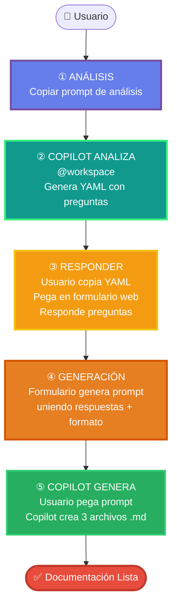

# 🚀 Sistema de Documentación de Deployment e Infraestructura

Sistema inteligente en **5 pasos** que genera documentación técnica completa combinando análisis automático del código con conocimiento del equipo.

---

## 📊 Flujo del Sistema



---

## ¿Por qué este sistema?

### ✅ Ventajas

- **Inteligente**: Copilot analiza el código y solo pregunta lo que NO encuentra

- **Visual**: Formulario web interactivo para responder (no editar YAML manualmente)

- **Completo**: Genera 3 archivos de documentación detallada

- **Específico**: Usa configuraciones reales del proyecto, no templates genéricos

- **Rápido**: ~10 minutos vs horas de documentación manual

### 🎯 Qué genera

**3 archivos markdown completos:**

1. **`01-deployment.md`** → Arquitectura, ambientes, Docker, K8s, seguridad

2. **`02-ci-cd.md`** → Pipeline completo, stages, deploy, secrets

3. **`03-monitoreo.md`** → Logs, métricas, alertas, dashboards

---

## 📋 PASO 1: Copiar Prompt de Análisis

<div style="text-align: center; margin: 30px 0;">
    <button 
        id="copy-analysis-btn"
        onclick="copyPromptFile('/ai_prompts/07_pre_deployment/', 'copy-analysis-btn')" 
        style="background: linear-gradient(135deg, #667eea 0%, #764ba2 100%); 
               color: white; 
               border: none; 
               padding: 20px 40px; 
               font-size: 20px; 
               font-weight: bold; 
               border-radius: 16px; 
               cursor: pointer; 
               box-shadow: 0 6px 20px rgba(102, 126, 234, 0.5);
               transition: all 0.3s ease;
               display: inline-flex;
               align-items: center;
               gap: 12px;
               margin-right: 15px;">
        <span style="font-size: 28px;">📋</span>
        Copiar Prompt de Análisis
    </button>
    <button 
        onclick="window.open('/ai_prompts/07_pre_deployment/', '_blank')" 
        style="background: linear-gradient(135deg, #a8edea 0%, #fed6e3 100%); 
               color: #333; 
               border: none; 
               padding: 20px 40px; 
               font-size: 20px; 
               font-weight: bold; 
               border-radius: 16px; 
               cursor: pointer; 
               box-shadow: 0 6px 20px rgba(168, 237, 234, 0.5);
               transition: all 0.3s ease;
               display: inline-flex;
               align-items: center;
               gap: 12px;">
        <span style="font-size: 28px;">👁️</span>
        Ver Prompt
    </button>
</div>

!!! info "¿Qué hace este prompt?"
    **Analiza el `@workspace` completo** buscando:
    
    - 🐳 Dockerfile, docker-compose
    - ☁️ Cloud providers (AWS, GCP, Azure, IBM Cloud)
    - ☸️ Kubernetes manifests, Helm charts
    - 🔄 CI/CD configs (GitHub Actions, GitLab CI, Jenkins, etc.)
    - 🗄️ Bases de datos y ORMs
    - 📊 Monitoreo (Prometheus, Datadog, Sentry, etc.)
    - 🌍 Ambientes (.env files, configs)
    
    **Output:**
    
    1. ✅ Reporte en consola con hallazgos categorizados
    2. 📄 YAML con preguntas sobre lo que NO encontró

---

## 🤖 PASO 2: Ejecutar en Copilot

1. **Abre Copilot** en el proyecto que quieres documentar

2. **Pega el prompt** que copiaste

3. **Ejecuta** y espera el análisis

!!! tip "Tip"
    Copilot tardará ~1-2 minutos en analizar el workspace completo.

### Output esperado:

```
================================================================================
📊 ANÁLISIS DE INFRAESTRUCTURA - Mi Proyecto
================================================================================

🐳 CONTENEDORIZACIÓN
✅ YA_SABEMOS:
   - Dockerfile encontrado: node:18-alpine
   - docker-compose con: app, postgres, redis

⚠️ VALIDAR:
   - Docker registry: Parece Docker Hub

❓ NO_SABEMOS:
   - Proceso de build por ambiente

☁️ CLOUD PROVIDER
✅ YA_SABEMOS:
   - AWS (Terraform detectado)
   - Servicios: EC2, RDS, S3

❓ NO_SABEMOS:
   - Región principal
   - Cuenta AWS

[...]

# ============================================
# PREGUNTAS PARA COMPLETAR DOCUMENTACIÓN
# ============================================

conocido:
  docker:
    imagen_base: "node:18-alpine"
    puerto: 3000
  [...]

preguntas:
  - categoria: "Cloud - Configuración"
    items:
      - "¿Región principal de AWS?"
      - "¿Cuenta AWS?"
  [...]
```

---

## ✏️ PASO 3: Pegar YAML en Formulario Web

### Copiar el YAML generado por Copilot

Copilot te habrá generado un YAML como este:

```yaml
# ============================================
# PREGUNTAS PARA COMPLETAR DOCUMENTACIÓN
# Proyecto: Mi Proyecto API
# ============================================

conocido:
  proyecto:
    nombre: "Mi Proyecto API"
    tipo: "backend"
  
  docker:
    tiene_dockerfile: true
    imagen_base: "node:18-alpine"
    puerto: 3000
  
  # ... más información detectada

validar:
  - categoria: "Docker Registry"
    pregunta: "¿Qué registry usan?"
    opciones:
      - "Docker Hub"
      - "AWS ECR"
  
preguntas:
  - categoria: "Cloud - Configuración"
    items:
      - "¿Región principal de AWS?"
      - "¿Cuenta AWS?"
  # ... más preguntas
```

### Cargar en el Formulario

<div style="background: linear-gradient(135deg, #f093fb 0%, #f5576c 100%); padding: 30px; border-radius: 16px; margin: 30px 0;">
    <h3 style="color: white; margin-top: 0;">📝 Formulario Interactivo</h3>
    
    <div style="background: white; padding: 20px; border-radius: 12px; margin: 20px 0;">
        <label style="display: block; font-weight: bold; margin-bottom: 10px; color: #333;">
            Pega aquí el YAML generado por Copilot:
        </label>
        <textarea 
            id="yaml-input-deployment"
            placeholder="Pega aquí el YAML completo..."
            style="width: 100%; 
                   min-height: 200px; 
                   padding: 15px; 
                   border: 2px solid #ddd; 
                   border-radius: 8px; 
                   font-family: 'Courier New', monospace;
                   font-size: 14px;
                   resize: vertical;">
        </textarea>
        
        <button 
            onclick="loadPromptFromYAML('yaml-input-deployment', 'form-container-deployment', 'deployment-form')"
            style="background: linear-gradient(135deg, #11998e 0%, #38ef7d 100%); 
                   color: white; 
                   border: none; 
                   padding: 15px 35px; 
                   font-size: 18px; 
                   font-weight: bold; 
                   border-radius: 10px; 
                   cursor: pointer; 
                   margin-top: 15px;
                   box-shadow: 0 4px 15px rgba(17, 153, 142, 0.4);
                   transition: all 0.3s ease;">
            🚀 Cargar Formulario
        </button>
    </div>
    
    <div id="form-container-deployment" style="margin-top: 20px;">
        <!-- El formulario se generará aquí dinámicamente -->
    </div>
</div>

!!! tip "¿Qué pasa después de cargar?"
    El sistema:
    
    1. ✅ **Pre-llena** el formulario con todo lo que Copilot encontró (sección `conocido:`)
    2. ⚠️ **Muestra opciones** para preguntas de validación (sección `validar:`)
    3. ❓ **Pide respuestas** para lo que no encontró (sección `preguntas:`)
    
    Tú solo completas los campos vacíos.

---

## 🎯 PASO 4: Generar Prompt Final

Una vez completado el formulario, haz clic en **"Generar Prompt Personalizado"**.

!!! success "¿Qué hace el botón?"
    El sistema automáticamente:
    
    1. 📋 Toma todas tus respuestas del formulario
    2. 🔗 Las une con el prompt de generación (que tiene las instrucciones de formato)
    3. 📄 Genera un prompt final completo
    4. 📋 **Lo copia automáticamente** a tu clipboard
    
    **¡Solo pégalo en Copilot!**

---

## 🤖 PASO 5: Copilot Genera los Archivos

1. **Pega el prompt** generado en Copilot

2. **Ejecuta** y espera (~1-2 minutos)

3. **Copilot creará** automáticamente los 3 archivos:
   - `ai_docs/06-infraestructura/01-deployment.md`
   - `ai_docs/06-infraestructura/02-ci-cd.md`
   - `ai_docs/06-infraestructura/03-monitoreo.md`

!!! success "Listo!"
    Ahora tienes documentación completa y específica de tu infraestructura.

---

## 📦 Archivos Generados

### 1. `ai_docs/06-infraestructura/01-deployment.md`

**Contiene:**

- 📊 Diagrama de arquitectura completa

- 🌍 Configuración de ambientes (dev, staging, prod)

- 🐳 Detalles de Docker y registry

- ☸️ Configuración de Kubernetes (si aplica)

- 📈 Estrategias de escalabilidad y HA

- 🔒 Seguridad: Load Balancer, SSL, WAF

- 💾 Base de datos, backups, disaster recovery

### 2. `ai_docs/06-infraestructura/02-ci-cd.md`

**Contiene:**

- 📊 Diagrama del pipeline completo

- ⚙️ Stages detallados (build, test, deploy, etc.)

- 🌿 Estrategia de branching (GitFlow, trunk-based, etc.)

- 🚀 Proceso de deployment paso a paso

- 🔐 Secrets y variables de entorno

- ↩️ Procedimientos de rollback

### 3. `ai_docs/06-infraestructura/03-monitoreo.md`

**Contiene:**

- 🛠️ Stack de herramientas de monitoreo

- 📈 Métricas monitoreadas (infra, app, BD, negocio)

- 🚨 Configuración de alertas

- 📝 Estrategia de logging

- 🔍 Tracing distribuido (si aplica)

- 📊 Dashboards y SLIs/SLOs

- ⚠️ Recomendaciones si no hay monitoreo

---

## 🎓 Consejos y Buenas Prácticas

### ✅ Haz esto

- **Copia TODO el YAML** que genera Copilot (incluyendo comentarios)

- **Revisa lo pre-llenado** antes de generar (Copilot puede equivocarse)

- **Sé específico** en las respuestas (URLs exactas, nombres reales, no "example.com")

- **Completa todos los campos** del formulario (o marca explícitamente "No aplica")

### ❌ Evita esto

- Copiar solo parte del YAML (el formulario no cargará)

- Dejar campos vacíos sin explicación

- Usar placeholders genéricos ("mi-app", "localhost")

- Editar manualmente el YAML (usa el formulario)

---

## 🔄 Actualizaciones

Este sistema es **versionado y mantenido**. Si la infraestructura cambia:

1. Ejecuta nuevamente el **Prompt de Análisis**

2. Actualiza las respuestas necesarias

3. Regenera los archivos

---

## 📚 Referencias

- [Prompt de Análisis](/ai_prompts/07_pre_deployment/) - Analiza @workspace y genera YAML

- [Prompt de Generación](/ai_prompts/07_generation/) - Genera los 3 archivos de documentación

---

## ❓ FAQ

??? question "¿Por qué usar un formulario web en vez de responder en el chat?"
    El formulario es más visual y amigable. Además, el sistema puede validar
    respuestas y generar automáticamente el prompt final uniendo todo.

??? question "¿Qué pasa si Copilot se equivoca en el análisis?"
    Puedes corregirlo en el formulario. Revisa siempre lo que se pre-llenó
    antes de generar el prompt final.

??? question "¿Puedo guardar el YAML para después?"
    Sí, copia el YAML generado por Copilot y guárdalo. Cuando quieras continuar,
    simplemente pégalo nuevamente en el formulario.

---

<div style="background: linear-gradient(135deg, #667eea 0%, #764ba2 100%); padding: 30px; border-radius: 16px; color: white; text-align: center; margin: 40px 0;">
    <h2 style="color: white; margin-top: 0;">🚀 ¿Listo para empezar?</h2>
    <p style="font-size: 18px; margin-bottom: 30px;">
        Documenta tu infraestructura en 10 minutos
    </p>
    <button 
        onclick="copyPromptFile('/ai_prompts/07_pre_deployment/', 'final-cta-btn')" 
        id="final-cta-btn"
        style="background: white; 
               color: #667eea; 
               border: none; 
               padding: 20px 50px; 
               font-size: 22px; 
               font-weight: bold; 
               border-radius: 12px; 
               cursor: pointer; 
               box-shadow: 0 6px 20px rgba(0,0,0,0.3);
               transition: all 0.3s ease;">
        📋 Copiar Prompt de Análisis
    </button>
</div>
