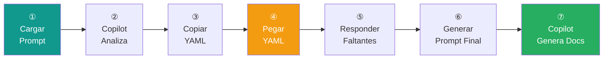

# 🚀 Sistema de Generación de Documentación en 2 Fases

Genera documentación de deployment e infraestructura combinando análisis automático del código con preguntas específicas.

---

## 📊 Flujo del Sistema

---

## ① Cargar Prompt de Análisis Inicial

    <button 
        id="copy-initial-prompt-btn"
        onclick="copyPromptFile('/ai_prompts/07_pre_deployment/', 'copy-initial-prompt-btn')" 
        style="background: linear-gradient(135deg, #11998e 0%, #38ef7d 100%); 
               color: white; 
               border: none; 
               padding: 16px 32px; 
               font-size: 18px; 
               font-weight: bold; 
               border-radius: 12px; 
               cursor: pointer; 
               box-shadow: 0 4px 15px rgba(17, 153, 142, 0.4);
               transition: all 0.3s ease;
               display: inline-flex;
               align-items: center;
               gap: 10px;
               margin-right: 10px;">
        📋
        Copiar Prompt de Análisis
    </button>
    <button 
        onclick="window.open('/ai_prompts/07_pre_deployment/', '_blank')" 
        style="background: linear-gradient(135deg, #667eea 0%, #764ba2 100%); 
               color: white; 
               border: none; 
               padding: 16px 32px; 
               font-size: 18px; 
               font-weight: bold; 
               border-radius: 12px; 
               cursor: pointer; 
               box-shadow: 0 4px 15px rgba(102, 126, 234, 0.4);
               transition: all 0.3s ease;
               display: inline-flex;
               align-items: center;
               gap: 10px;">
        👁️
        Ver Prompt
    </button>

!!! info "¿Qué hace este prompt?"
    - Analiza el workspace completo (`@workspace`)
    - Busca: Dockerfile, CI/CD, cloud providers, bases de datos, monitoreo
    - Extrae información de archivos de configuración
    - Genera YAML solo con preguntas sobre lo que NO encontró

---

## ② Ejecutar en Copilot

1. **Copia el prompt completo** del archivo que se abrió

2. **Abre Copilot en el proyecto** que quieres documentar

3. **Pega el prompt** y ejecuta

4. **Espera el análisis** (30-60 segundos)

!!! warning "Importante"
    Ejecuta en el **workspace del proyecto** a documentar, NO en este proyecto.

---

## ③ Copiar YAML Generado

Copilot devolverá un YAML en la terminal. **Cópialo completo**.

---

## ④ Pegar YAML en el Formulario

    <label for="yaml-input" style="display: block; font-weight: bold; margin-bottom: 10px;">
        Pega aquí el YAML generado por Copilot:
    </label>
    <textarea 
        id="yaml-input" 
        placeholder="title: &quot;Deployment &amp; Infraestructura - [PROYECTO]&quot;
description: &quot;...&quot;
template: |
  # ROL
  ...
sections:
  - icon: &quot;☁️&quot;
    ..."
        style="width: 100%; 
               min-height: 200px; 
               font-family: 'Courier New', monospace; 
               font-size: 13px;
               padding: 15px; 
               border: 2px solid #3498db; 
               border-radius: 8px;
               background: #f8f9fa;
               resize: vertical;">
    </textarea>
    

        <button 
            onclick="loadPromptFromYAML('yaml-input', 'prompt-yaml-container', 'yaml-generated')" 
            style="background: linear-gradient(135deg, #3498db 0%, #2980b9 100%); 
                   color: white; 
                   border: none; 
                   padding: 12px 28px; 
                   font-size: 16px; 
                   font-weight: bold; 
                   border-radius: 8px; 
                   cursor: pointer; 
                   box-shadow: 0 4px 12px rgba(52, 152, 219, 0.4);
                   transition: all 0.3s ease;">
            🚀 Cargar Formulario
        </button>
    

!!! tip "Ventaja del Sistema"
    El formulario **solo muestra preguntas necesarias**. No pregunta por información ya extraída del código.

---

## ⑤ Responder Preguntas Faltantes

Completa las preguntas que aparecen en el formulario.

**Ejemplo:**

- Si Copilot NO encontró cloud provider → Responde cuál usas

- Si SÍ encontró Docker → No pregunta por Docker

---

## ⑥ Generar Prompt Final

Click en **🚀 Generar y Copiar Prompt**

El sistema:

1. Combina info extraída del código + tus respuestas

2. **Copia automáticamente** el prompt al portapapeles

3. Muestra el prompt con opción de ver/ocultar

---

## ⑦ Ejecutar Prompt Final en Copilot

1. **Copia el prompt final** generado

2. **Pega en Copilot** (en el proyecto original)

3. **Espera la generación** de los 3 archivos `.md`

**Archivos generados:**

- `ai_docs/06-infraestructura/01-deployment.md`

- `ai_docs/06-infraestructura/02-ci-cd.md`

- `ai_docs/06-infraestructura/03-monitoreo.md`

---

## 📊 Ventajas del Sistema

| Aspecto | Sistema Tradicional | Sistema 2 Fases |
|---------|---------------------|-----------------|
| Preguntas | ~40 preguntas | ~10-15 (solo faltantes) |
| Tiempo | 15-20 min | 3-5 min |
| Precisión | Depende del usuario | Código + Usuario |

---

## 🚨 Troubleshooting

### ❌ Error: "YAML inválido"

**Solución:**

1. Copia TODO el YAML desde `title:` hasta el final

2. Revisa la indentación (YAML usa espacios)

---

### ❌ El formulario está vacío

**Causa**: Copilot extrajo TODA la información

**Solución**: Ve directo al prompt final (ya pre-llenado)

---

## 📚 Recursos

- [Prompt de Análisis Inicial](/ai_prompts/07_pre_deployment.md)

- [Formularios Interactivos](12-formularios-interactivos.md)

- [Sistema de 2 Fases (Técnico)](13-sistema-dos-fases.md)

---

