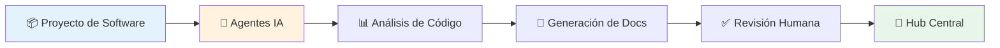

# 🏢 Hub Central de Documentación

## Bienvenido al Sistema de Documentación Empresarial

Este es el **Hub Central** donde se consolida toda la documentación de los proyectos de software de la organización.

!!! success "Documentación Potenciada por IA"
    Toda la documentación en este sitio ha sido generada y mantenida mediante agentes de inteligencia artificial que analizan el código fuente y generan documentación estandarizada, completa y actualizada.

---

## 🎯 Objetivo

Centralizar la documentación técnica y de arquitectura de todos los proyectos de software de la empresa, proporcionando:

- ✅ **Visibilidad completa** para todos los stakeholders

- ✅ **Formato estándar** en todos los proyectos

- ✅ **Diagramas visuales** con Mermaid

- ✅ **Actualización automatizada** mediante IA

- ✅ **Navegación intuitiva** por proyecto y tipo de información

---

## 📚 Proyectos Documentados

A continuación encontrarás la lista de proyectos documentados. Cada proyecto sigue la misma estructura estándar para facilitar la navegación.

| Proyecto | Descripción | Estado | Última Actualización |
|----------|-------------|--------|----------------------|
| **Guía de Documentación** | Lineamientos y formato estándar | ✅ Activo | 2025-12-10 |
| _Próximamente más proyectos..._ | | | |

---

## 🧭 Cómo Navegar

### Por Audiencia

Dependiendo de tu rol, encontrarás información específica en cada proyecto:

- **👔 Ejecutivos/Gerentes**: Vista ejecutiva, objetivos de negocio, ROI

- **🏗️ Arquitectos**: Diagramas C4, decisiones arquitectónicas, patrones

- **👨‍💻 Desarrolladores**: Detalles técnicos, APIs, flujos de datos

- **🔧 DevOps/SRE**: Infraestructura, despliegue, monitoreo

- **📊 Analistas de Negocio**: Casos de uso, procesos de negocio, flujos funcionales

### Por Tipo de Información

Cada proyecto está estructurado en secciones estándar:

1. **Vista Ejecutiva**: Resumen para stakeholders no técnicos

2. **Arquitectura**: Diagramas C4 (Contexto → Contenedor → Componente → Código)

3. **Documentación Técnica**: APIs, modelos de datos, integraciones

4. **Procesos de Negocio**: Flujos funcionales y casos de uso

5. **Infraestructura**: Deployment, CI/CD, monitoreo

6. **Apéndices**: Glosario, decisiones de arquitectura (ADRs), referencias

---

## 🤖 Metodología de Generación

La documentación se genera siguiendo este flujo:

### Proceso

1. **Análisis Automatizado**: Agentes IA analizan el repositorio del proyecto

2. **Generación Estructurada**: Se generan archivos markdown siguiendo el formato estándar

3. **Integración**: La carpeta `docs/` se copia al Hub Central

4. **Publicación**: El sitio se actualiza automáticamente

---

## 📖 Para Empezar

!!! info "Primera vez aquí?"
    1. Lee la **[Guía de Documentación](/guia-documentacion/00-intro/)** para entender el formato y estructura
    2. Navega por los proyectos usando el menú lateral
    3. Usa el buscador (arriba) para encontrar información específica
    4. Cambia entre modo claro/oscuro según tu preferencia

---

## 🔗 Enlaces Importantes

- 📘 [Guía de Documentación Estándar](/guia-documentacion/00-intro/) - **Empieza aquí**

- 🎨 [Prompts para IA](/guia-documentacion/05-prompts/) - Para generar documentación

- 📊 [Ejemplos de Diagramas](/guia-documentacion/03-diagramas/) - Plantillas Mermaid

---

## 💡 Contribuir

¿Tienes un proyecto que documentar?

1. Revisa la [Guía de Documentación](/guia-documentacion/00-intro/)

2. Usa los [Prompts de IA](/guia-documentacion/05-prompts/) 

3. Genera tu documentación automáticamente

4. Contacta al equipo para integrarla al Hub

---

    <small>Última actualización: 2025-12-10 | Generado con ❤️ usando MkDocs + Mermaid + IA</small>

