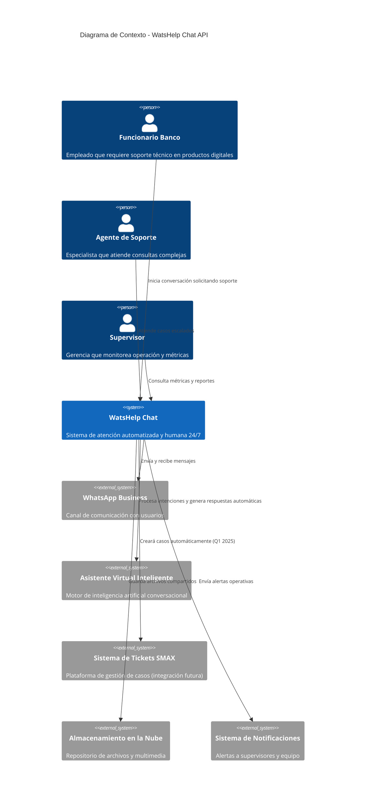
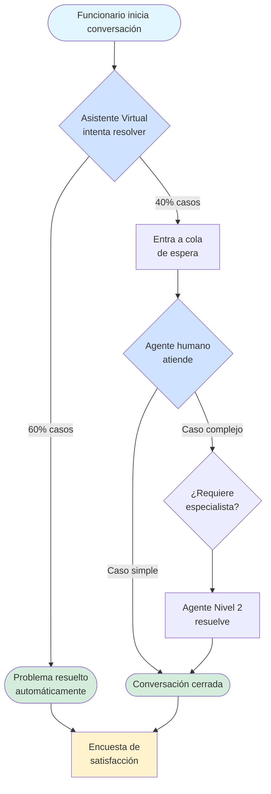

# 📊 Vista Ejecutiva: WatsHelp Chat API

## 🎯 Resumen Ejecutivo

WatsHelp es el sistema de atención al cliente multicanal del Banco de Bogotá, diseñado para proporcionar soporte automatizado y humano a los funcionarios del banco en temas relacionados con productos digitales y errores de autenticación web. El sistema atiende principalmente consultas sobre productos como Tarjetas de Crédito, Libranza y Vivienda, así como problemas técnicos en flujos digitales.

La solución combina inteligencia artificial conversacional con un equipo de especialistas humanos, permitiendo resolver el 60% de las consultas de forma completamente automatizada, mientras que el 40% restante es atendido por 4 agentes de nivel 1 y 2 agentes especializados de nivel 2. Actualmente, el sistema gestiona aproximadamente 2,500 conversaciones mensuales, operando de lunes a domingo en horario de 7:00 AM a 10:00 PM, exclusivamente a través del canal WhatsApp.

El valor principal para la organización radica en la reducción de costos operativos mediante la autogestión, permitiendo que los funcionarios resuelvan sus problemas sin intervención humana. Esto libera recursos del área de soporte para enfocarse en casos complejos que realmente requieren experiencia especializada. El sistema ha alcanzado un nivel de satisfacción de 8.0 sobre 10, cumpliendo el objetivo establecido.

Las métricas clave de éxito incluyen: tiempo de primera respuesta menor a 30 segundos (actualmente 3 segundos), tasa de automatización del 70% (actualmente 60%), tiempo de respuesta de agente humano menor a 2 minutos (actualmente cumpliendo), y mantener un NPS positivo superior a 8.0 (actualmente en objetivo).

---

## 💼 Valor de Negocio

### Objetivos Estratégicos

- **Autogestión Digital**: Permitir que los funcionarios resuelvan problemas en productos digitales sin depender de soporte humano, aumentando la tasa de automatización del 60% al 70%

- **Excelencia en Servicio**: Mantener un Acuerdo de Nivel de Servicio (SLA) de respuesta de agente humano menor a 15 minutos, con objetivo operativo de 2 minutos

- **Satisfacción del Usuario**: Alcanzar y mantener un NPS (Net Promoter Score) positivo superior a 8.0/10.0

- **Disponibilidad Continua**: Proporcionar soporte todos los días de la semana (lunes a domingo) en horario de 7:00 AM a 10:00 PM para minimizar el impacto de problemas técnicos en la operación bancaria

### Métricas de Éxito (KPIs)

| Métrica | Objetivo | Actual | Estado |
|---------|----------|--------|--------|
| Tasa de Automatización | 70% | 60% | ⚠️ |
| NPS (Satisfacción) | > 8.0/10 | 8.0/10 | ✅ |
| Tiempo Respuesta Bot | < 30 seg | 3 seg | ✅ |
| Tiempo Respuesta Agente | 2 min | 2 min | ✅ |
| Tiempo Primer Mensaje | < 3 seg | ~7 seg | ⚠️ |
| Volumen Mensual | 2,500 conv/mes | 2,500 conv/mes | ✅ |
| Disponibilidad Sistema | > 99% | 99.97% (proveedor) | ✅ |
| Pérdida de Mensajes | 0% | 0.1% | ⚠️ |

### ROI y Beneficios Cuantificables

- **Ahorro operativo**: Reducción de costos por autogestión de funcionarios sin intervención de agente humano

- **Eficiencia del equipo de soporte**: 6 agentes gestionan 2,500 conversaciones mensuales con un 60% de automatización en horario de 7:00 AM a 10:00 PM

- **Disponibilidad ampliada**: Cobertura de lunes a domingo (15 horas diarias) sin necesidad de turnos nocturnos

- **Tiempo de resolución**: Respuesta inmediata (3 segundos) para el 60% de casos vs tiempos tradicionales de espera en mesa de ayuda

---

## 👥 Usuarios y Casos de Uso

### Funcionarios del Banco (Usuarios Finales)

**Perfil:** Empleados del Banco de Bogotá que utilizan productos digitales y requieren soporte técnico para resolver problemas en sus operaciones diarias.

**Volumen:** Aproximadamente 2,500 consultas mensuales, distribuidas en horario de lunes a domingo de 7:00 AM a 10:00 PM.

**Casos de Uso Principales:**

1. **Resolver errores en productos digitales**: Solución de problemas relacionados con Tarjeta de Crédito, Libranza, Vivienda y otros productos bancarios digitales

2. **Solucionar problemas de autenticación**: Asistencia con errores en el flujo de autenticación web y acceso a sistemas

3. **Consultar estado de solicitudes**: Verificación del estado de casos previamente reportados

4. **Obtener guías de autogestión**: Acceso a instrucciones paso a paso para resolver problemas comunes

5. **Escalar problemas complejos**: Transferencia automática a especialista humano cuando el asistente virtual no puede resolver

**Beneficios Tangibles:**

- Resolución inmediata (en 3 segundos) del 60% de consultas sin espera

- Disponibilidad de lunes a domingo en horario de 7:00 AM a 10:00 PM, cubriendo toda la jornada laboral

- Tiempo promedio de atención de 2 minutos cuando requiere agente humano

---

### Agentes de Nivel 1 (Soporte Técnico)

**Perfil:** 4 agentes especializados en temas digitales que atienden conversaciones que el asistente virtual no puede resolver.

**Casos de Uso Principales:**

1. **Atender consultas escaladas**: Resolver casos transferidos automáticamente desde el asistente virtual

2. **Gestionar múltiples conversaciones**: Atención simultánea de hasta 3-5 conversaciones por agente

3. **Documentar soluciones**: Registro de casos para mejorar la base de conocimiento

4. **Transferir casos complejos**: Escalar a nivel 2 cuando se requiere experiencia especializada

5. **Aplicar protocolos de atención**: Uso de mensajes predefinidos para casos comunes

**Beneficios Tangibles:**

- Interfaz centralizada para gestionar todas las conversaciones activas

- Notificaciones en tiempo real de nuevos mensajes

- Acceso al historial completo de cada conversación

- Métricas de rendimiento individual en tiempo real

---

### Agentes de Nivel 2 (Especialistas)

**Perfil:** 2 agentes especializados en soporte avanzado del canal digital para casos complejos que requieren conocimiento técnico profundo.

**Casos de Uso Principales:**

1. **Resolver casos complejos**: Atención de problemas técnicos avanzados escalados desde nivel 1

2. **Análisis de problemas recurrentes**: Identificación de patrones en errores del sistema

3. **Soporte especializado**: Asistencia en integraciones, flujos críticos y configuraciones avanzadas

**Beneficios Tangibles:**

- Enfoque en casos de alto valor que requieren experiencia

- Reducción de escalamientos innecesarios gracias a la automatización

- Acceso a métricas y reportes para análisis de tendencias

---

### Supervisores y Administradores

**Perfil:** Gerencia de TI del Banco de Bogotá, equipo I+D de IBM y proveedor de soporte en mesa de ayuda.

**Casos de Uso Principales:**

1. **Monitorear rendimiento del sistema**: Supervisión de métricas clave en tiempo real

2. **Gestionar configuraciones**: Administración de áreas de atención, protocolos y mensajes

3. **Generar reportes**: Análisis de tendencias, rendimiento de agentes y satisfacción

4. **Gestionar alertas masivas**: Difusión de mensajes importantes a múltiples usuarios

5. **Configurar encuestas de satisfacción**: Medición continua del NPS

**Beneficios Tangibles:**

- Visibilidad completa del estado operativo del servicio

- Capacidad de identificar cuellos de botella y oportunidades de mejora

- Reportes automatizados para toma de decisiones

---

## 📊 Vista General del Sistema

### Diagrama de Contexto

### Descripción del Sistema

WatsHelp permite a los funcionarios del Banco de Bogotá obtener soporte técnico inmediato a través de WhatsApp. Cuando un funcionario inicia una conversación, el sistema primero intenta resolver su problema mediante un asistente virtual inteligente que comprende la naturaleza de la consulta y proporciona respuestas automáticas.

Si el asistente virtual no puede resolver el problema (aproximadamente 40% de los casos), la conversación se transfiere automáticamente a un agente humano especializado que continúa la atención. El sistema gestiona una cola inteligente que asigna casos según disponibilidad y especialización de los agentes.

Para esto, se integra con WhatsApp Business (canal principal de comunicación), un motor de inteligencia artificial conversacional (comprensión y respuestas automáticas), almacenamiento en la nube (archivos y capturas de pantalla compartidas) y un sistema de notificaciones (alertas a supervisores). Se planea integración con SMAX para creación automática de tickets en Q1 2025.

---

### Flujo de Atención

---

## ⚠️ Riesgos y Dependencias

### Riesgos Principales

| Riesgo | Probabilidad | Impacto al Negocio | Mitigación Actual | Estado |
|--------|--------------|-------------------|-------------------|--------|
| Falla del Asistente Virtual | Media | Alto - 100% de casos requieren agente humano, saturación del equipo | Ninguna - se requiere plan de contingencia | ❌ |
| Falla del proveedor WhatsApp | Baja | Crítico - Canal 100% dependiente, servicio completamente inoperante | SLA 99.97% con proveedor Axede | ⚠️ |
| Escalamiento horizontal limitado | Alta | Medio - Condiciones de carrera con tareas programadas al escalar | En evaluación - migración a arquitectura de servicios separados | ⚠️ |
| Pérdida de mensajes | Media | Medio - Impacto en satisfacción del usuario (0.1% semanal) | Sistema de reintentos del proveedor (3 intentos) | ⚠️ |
| Notificaciones no llegan a agentes | Media | Alto - Agentes no atienden conversaciones a tiempo, impacto en SLA | Sin mitigación actual | ❌ |
| Transferencias duplicadas | Baja | Bajo - ~1 caso por semana, impacto menor | Sin mitigación sistemática | ⚠️ |
| Latencia primer mensaje | Media | Medio - Percepción de lentitud (7 seg vs objetivo 3 seg) | Optimizaciones recientes implementadas | ⚠️ |

### Dependencias Críticas

**Críticas (sistema no opera sin ellas):**

- **Motor de Inteligencia Artificial**: Si falla, el 100% de conversaciones deben ser atendidas por agentes humanos, saturando la capacidad del equipo y generando tiempos de espera inaceptables para los usuarios

- **Proveedor de WhatsApp (Axede)**: Canal 100% dependiente, si falla el servicio queda completamente inoperante. Cuenta con SLA de 99.97% de disponibilidad

- **Base de Datos Principal**: Almacena todas las conversaciones, usuarios y métricas. Si falla, se pierden conversaciones activas y no se puede consultar historial

**Importantes (funcionalidad reducida):**

- **Sistema de Caché**: Sin él, los tiempos de respuesta aumentan significativamente (15-35% más lento), pero el sistema sigue operando

- **Almacenamiento de Archivos en la Nube**: Se pierde la capacidad de compartir capturas de pantalla y documentos, limitando la calidad del soporte

- **Sistema de Notificaciones**: Los supervisores no reciben alertas de situaciones críticas (desconexión de agentes, abandono de conversaciones)

---

## 💰 Inversión y Presupuesto

### Estado Actual

**Presupuesto para mejoras técnicas**: En evaluación según propuestas específicas

**Equipo asignado**: 

- Equipo I+D de IBM (desarrollo y mejoras)

- Gerencia TI Banco de Bogotá (product owner)

- Proveedor de soporte en mesa de ayuda (operación)

- 6 agentes de soporte (4 nivel 1 + 2 nivel 2)

### Costos Operativos Principales

- **Licencias del motor de inteligencia artificial**: Costo variable según volumen de conversaciones procesadas

- **Proveedor de WhatsApp Business (Axede)**: Costo por mensaje enviado/recibido, SLA 99.97%

- **Infraestructura en la nube**: 1 instancia en producción, ambiente de QA separado

- **Personal de soporte**: 6 agentes operando 24/7

---

## 📈 Roadmap y Próximos Pasos

### Corto Plazo (Q1 2025)

- **Integración con SMAX (Alta Prioridad)**: Creación automática de casos desde el asistente virtual para seguimiento de problemas complejos y generación de base de conocimiento

- **Resolver problema de notificaciones**: Implementar solución para garantizar que todas las notificaciones lleguen a los agentes en tiempo real

- **Optimización de latencia**: Reducir tiempo de primer mensaje de 7 segundos a menos de 3 segundos

### Mediano Plazo (Q2 2025)

- **Migración de tareas programadas a servicio independiente**: Separar componentes críticos para permitir escalamiento horizontal sin condiciones de carrera

- **Implementación de sistema de caché distribuido**: Preparar infraestructura para escalamiento horizontal usando solución centralizada

- **Mejora en tasa de automatización**: Incrementar del 60% al 70% mediante entrenamiento adicional del asistente virtual

### Largo Plazo (H2 2025)

- **Evaluación de arquitectura de microservicios**: Análisis de viabilidad para migración gradual que permita escalar componentes de forma independiente

- **Integración de IA Generativa (watsonx.ai)**: Incorporar base de conocimiento con capacidades de generación de respuestas más naturales y contextuales

- **Expansión de capacidades de autogestión**: Desarrollar nuevos flujos automatizados para reducir dependencia de agentes humanos

---

## ✅ Conclusiones y Recomendaciones

### Fortalezas

- **Alto nivel de satisfacción**: NPS de 8.0/10.0 cumpliendo objetivo, indica buena percepción del servicio por parte de los usuarios

- **Cumplimiento de SLAs operativos**: Tiempo de respuesta del bot (3 seg) y de agentes (2 min) están dentro de objetivos establecidos

- **Tasa de automatización sólida**: 60% de resolución automática libera recursos del equipo para casos complejos

- **Disponibilidad del servicio**: 99.97% garantizado por proveedor, superando estándares de la industria

- **Equipo eficiente**: 6 agentes gestionando 2,500 conversaciones mensuales con buenos indicadores de servicio

### Áreas de Mejora

- **Brecha en automatización**: Diferencia de 10 puntos porcentuales (60% actual vs 70% objetivo) representa oportunidad de optimización de costos y mejora de experiencia

- **Escalabilidad limitada**: Arquitectura actual no permite crecer horizontalmente sin generar conflictos, limitando capacidad de crecimiento futuro del servicio

- **Fiabilidad de notificaciones**: Problema actual afecta capacidad de respuesta de agentes y puede impactar SLAs cuando el volumen aumente

- **Dependencia crítica sin respaldo**: No existe plan de contingencia si el motor de inteligencia artificial falla, generando riesgo operativo alto

### Recomendaciones Ejecutivas

1. **Priorizar integración SMAX (Q1 2025)**: Permitirá capturar casos para análisis, mejorar base de conocimiento del asistente virtual y aumentar tasa de automatización hacia el objetivo del 70%. ROI esperado en reducción de casos repetitivos.

2. **Implementar plan de contingencia para motor de IA**: Desarrollar respuestas predefinidas de emergencia y mecanismo de transferencia directa a agentes cuando el servicio falle. Esto mitiga el riesgo más crítico identificado y protege el SLA de servicio.

3. **Resolver problema de notificaciones antes de escalar**: Es un prerequisito para crecer el volumen de conversaciones. Sin notificaciones confiables, aumentar capacidad generará deterioro del servicio y afectará satisfacción del usuario.

4. **Evaluar ROI de migración a microservicios**: Realizar análisis costo-beneficio considerando proyección de crecimiento a 12 meses. Si se espera duplicar volumen, la inversión en arquitectura escalable se justifica; si no, enfocarse en optimizaciones puntuales.

---

📅 **Última actualización**: 18 de diciembre de 2025  
🤖 **Generado por análisis automático del sistema**
