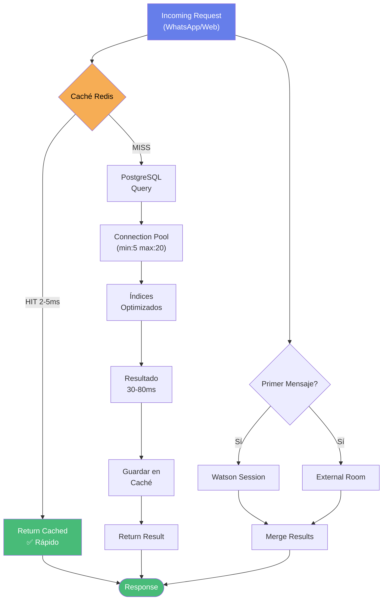
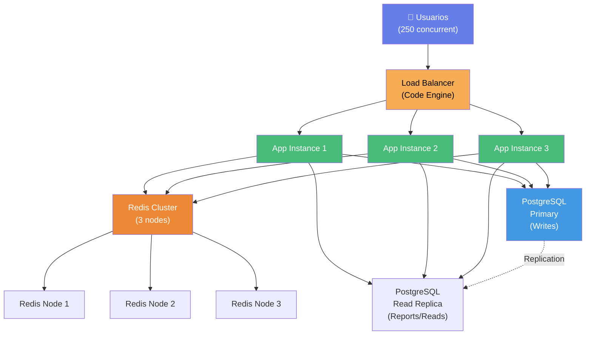
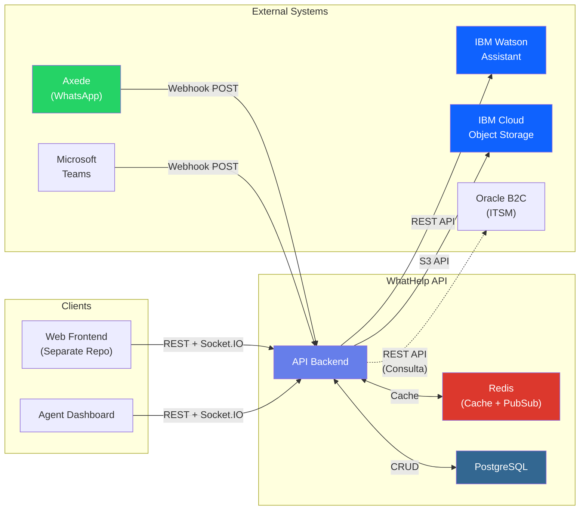
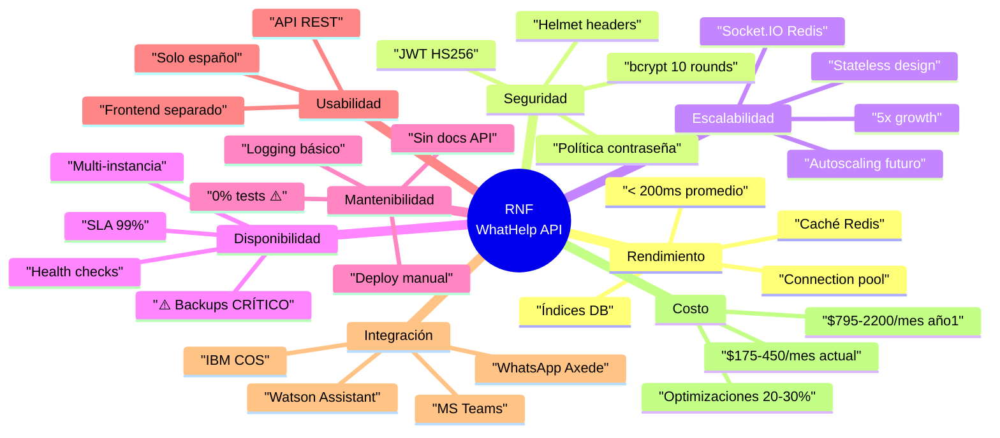

# Requisitos No Funcionales - WhatHelp Chat API

## 🎯 Propósito

Este documento especifica todos los requisitos no funcionales del sistema WhatHelp Chat API, describiendo CÓMO debe comportarse el sistema en términos de calidad, rendimiento, seguridad y otros atributos.

---

## 📊 Resumen de Cumplimiento

| Categoría | Especificado | Implementado | Gap |
|-----------|-------------|--------------|-----|
| 🚀 Rendimiento | ✅ | ⚠️ | Falta monitoreo de métricas P95, definir baseline |
| 🔒 Seguridad | ✅ | ✅ | Cumple nivel medio, considerar auditoría |
| 📈 Escalabilidad | ✅ | ⚠️ | Single instance, preparar para crecimiento alto |
| ⏱️ Disponibilidad | ✅ | ❌ | Sin backups automáticos configurados |
| 🔧 Mantenibilidad | ✅ | ⚠️ | 0% tests, linting parcial, sin docs API |
| 👥 Usabilidad | ✅ | ✅ | Frontend separado, solo español |
| 🌐 Integración | ✅ | ✅ | Integraciones clave implementadas |
| 💰 Costo | ✅ | ⚠️ | A optimizar con crecimiento esperado |

**Leyenda:** ✅ Cumple | ⚠️ Parcial | ❌ No cumple

---

## 🚀 RNF-001: Rendimiento

### Especificación

| Métrica | Valor Requerido | Valor Actual | Estado |
|---------|----------------|--------------|--------|
| **Tiempo de respuesta promedio** | < 200ms | A medir en producción | ⚠️ |
| **Tiempo de respuesta P95** | < 500ms (inferido) | A medir en producción | ⚠️ |
| **Throughput** | A determinar | Capacidad actual desconocida | ⚠️ |
| **Usuarios concurrentes** | 1-50 (actual) / Pico futuro mayor | 1-50 usuarios | ✅ |
| **Crecimiento de datos** | Alto esperado (5x en 12 meses) | 10-50 GB actual | ⚠️ |

**Contexto de Negocio:**

- Usuarios concurrentes actuales: Muy bajo (1-50)

- Expectativa de crecimiento: Alta (crecimiento 5x en próximos 12 meses)

- Objetivo de respuesta: Excelente (< 200ms promedio)

### Implementación Actual

✅ **Optimizaciones detectadas:**

**1. Sistema de Caché Redis**

- **Implementación:** Caché con fallback automático

- **Archivo:** `app/services/cache.js`

- **TTL configurados:**
  - Watson sessions: 3600s (1 hora)
  - Datos de usuario: 900s (15 minutos)
  - Salas activas: 300s (5 minutos)

- **Métricas:** Hit/miss/errors tracking

- **Ventaja:** Reduce 30-50ms en consultas frecuentes

**2. Connection Pool PostgreSQL**

- **Configuración:**
  - Min connections: 5
  - Max connections: 20
  - Idle timeout: 30s
  - Connection timeout: 30s
  - Statement timeout: 30s (configurable per query)

- **Archivo:** `app/services/postgresql.js`

- **Optimización:** Reutilización de conexiones, evita overhead de creación

**3. Timeouts Configurados**

- **Request timeout:** 30s (configurado en queries)

- **Socket.IO timeouts:**
  - Ping interval: 30s
  - Ping timeout: 30s
  - Upgrade timeout: 20s

- **Archivo:** `app/app.js` (líneas 62-65)

**4. Índices de Base de Datos**

- **Implementación:** Migraciones aplicadas para performance

- **Archivos:** `db/migrations/001_add_performance_indexes.sql`

- **Índices clave:**
  - `users(phone_number, provider)` - Búsquedas WhatsApp
  - `rooms(user_id, status)` WHERE status='OPEN' - Salas activas
  - `watson_session_ids(room_id)` - Sesiones Watson
  - `messages(room_id, created_at DESC)` - Historial
  - `agent_rooms(agent_id, status)` - Asignaciones

- **Impacto:** Reduce 50-150ms en queries frecuentes

**5. Paralelización de Operaciones**

- **Escenario:** Primer mensaje WhatsApp

- **Optimización:** Watson session + ExternalRoom en paralelo

- **Ahorro:** 30-50ms

- **Archivo:** `app/controllers/whatsappController.js`

**6. Socket.IO con Redis Adapter**

- **Implementación:** Multi-instancia support

- **Configuración:** Redis Pub/Sub

- **Archivo:** `app/app.js` (líneas 138-175)

- **Beneficio:** Escala horizontalmente sin degradación

⚠️ **Gaps identificados:**

**1. Falta Monitoreo de Performance**

- No hay APM (Application Performance Monitoring) configurado

- No se miden métricas P95/P99 en producción

- No hay alertas de slow queries

- **Recomendación:** Implementar New Relic, Datadog o Prometheus

**2. Sin Baseline de Performance**

- No hay datos históricos de tiempos de respuesta

- No se conoce throughput real

- **Recomendación:** Ejecutar load testing con Artillery/k6

**3. Crecimiento 5x Requiere Preparación**

- Connection pool (max 20) podría ser insuficiente

- Caché Redis no está en cluster

- **Recomendación:** Aumentar pool a 50, considerar Redis cluster

**4. No hay CDN para Assets Estáticos**

- Archivos en `/public` servidos directamente

- **Recomendación:** Usar CDN (CloudFlare/Akamai) si hay tráfico internacional

### Métricas de Performance Implementadas

**Logging de Timing:**

```javascript
// Detectado en whatsappController.js
const startTime = Date.now();
// ... operaciones ...
console.log(`[TIMING] ✓ Autenticación: ${Date.now() - authStart}ms`);
console.log(`[TIMING] ✓ Obtener sala: ${Date.now() - roomGetStart}ms`);
```

**Health Check Metrics:**

- Endpoint: `GET /api/health`

- Incluye: uptime, memory usage, PID

- Archivo: `app/routes/api.js` (línea 67)

**Cache Stats:**

- Endpoint: `GET /api/cache/stats`

- Métricas: hits, misses, errors, connection state

- Archivo: `app/services/cache.js` (líneas 150-157)

### Diagrama de Optimización de Performance



### Recomendaciones

**Prioridad Alta (0-30 días):**

1. **Implementar APM básico**
   - Tool: New Relic gratuito o Prometheus + Grafana
   - Métricas clave: P50, P95, P99, error rate
   - Costo: $0-50/mes

2. **Ejecutar Load Testing**
   - Tool: Artillery o k6
   - Escenarios: 50, 100, 250 usuarios concurrentes
   - Identificar breaking point

3. **Configurar Alertas de Performance**
   - Slow queries > 1s
   - Response time > 500ms en P95
   - Error rate > 1%

**Prioridad Media (1-3 meses):**

4. **Optimizar para Crecimiento 5x**
   - Aumentar connection pool: max 50-100
   - Considerar read replicas de PostgreSQL
   - Redis Cluster (3 nodos mínimo)

5. **Implementar Query Optimization**
   - Analizar slow query log
   - Agregar índices según uso real
   - Considerar materialized views para reports

**Prioridad Baja (3-6 meses):**

6. **CDN para Assets**
   - Solo si hay usuarios internacionales
   - Costo: ~$20-50/mes

---

## 🔒 RNF-002: Seguridad

### Especificación

- **Nivel de seguridad:** Medio

- **Datos sensibles:** PII (datos personales: nombre, email, teléfono)

- **Retención de datos:** Indefinida

- **Cumplimiento normativo:** Ninguna específica reportada

- **Auditoría:** Parcial (solo acciones críticas)

- **Sesión timeout:** 15 minutos (agentes)

### Implementación Actual

✅ **Controles de seguridad detectados:**

**1. Autenticación JWT**

- **Implementación:** `app/helpers/jwt.js`

- **Algoritmo:** HS256 (predeterminado)

- **Secret:** Variable de entorno `JWT_KEY`

- **Expiración:** Configurable en `JWT_EXPIRES_IN` (A especificar exacto)

- **Middleware:** `app/middlewares/valid-jwt.js`

- **Uso:** Header `api-key` (custom, no estándar `Authorization`)

**2. Password Hashing**

- **Algoritmo:** bcrypt

- **Rounds:** 10

- **Implementación:** `app/helpers/hash.js`

- **Funciones:** `makeHash()`, `validHash()`

**3. Política de Contraseñas**

- **Longitud mínima:** 8 caracteres

- **Requisitos:**
  - Al menos una letra mayúscula
  - Al menos una letra minúscula
  - Al menos un número
  - Al menos un carácter especial

- **Validación:** RF-016 (endpoint `/api/auth/request`)

- **Nivel:** Medio-Alto

**4. Validación de Entrada**

- **Librería:** express-validator

- **Implementación:** Middleware `valid-request`

- **Scope:** Validación de campos requeridos, formatos (email, etc.)

- **Archivo:** `app/middlewares/valid-request.js`

**5. Security Headers (Helmet)**

- **Librería:** helmet + helmet-csp

- **Configuración:** `app/middlewares/security.js`

- **Headers activos:**
  - X-XSS-Protection: `1; mode=block`
  - Strict-Transport-Security: max-age 30 días + includeSubDomains
  - X-Frame-Options: DENY (frameguard)
  - Content-Security-Policy configurado
  - Referrer-Policy: `no-referrer`
  - Permissions-Policy: `fullscreen=(), geolocation=()`

- **HTTPS enforcement:** Redirect automático si `APP_SECURITY=true`

**6. CORS**

- **Configuración:** `cors()` middleware habilitado

- **Archivo:** `app/app.js` (línea 99)

- **Orígenes:** Configuración comentada sugiere origen permitido localhost:3000

**7. Rate Limiting**

- **Estado:** ❌ No implementado

- **Gap:** Vulnerable a brute force en endpoints de login

**8. Secrets Management**

- **Método:** Variables de entorno (archivo `.env`)

- **Gestión:** Code Engine de IBM Cloud (variables de plataforma)

- **Archivo:** `.env` (gitignored)

- **Variables sensibles:**
  - `JWT_KEY`
  - `PG_PASSWORD`
  - `REDIS_PASSWORD`
  - `ASSISTANT_IAM_APIKEY`
  - `COS_APIKEYID`

**9. Autenticación Externa (Integraciones)**

- **WhatsApp (Axede):** API Key

- **Watson Assistant:** IAM API Key

- **IBM COS:** API Key + IBM Auth

- **Validación:** No especificada en detalle

⚠️ **Gaps de seguridad:**

**1. Sin Rate Limiting**

- Endpoints de login vulnerables a brute force

- No hay límite de intentos por IP

- **Recomendación:** Implementar express-rate-limit
  - Login: 5 intentos / 15 minutos
  - API general: 100 req / 15 minutos

**2. Header JWT No Estándar**

- Usa `api-key` en lugar de `Authorization: Bearer <token>`

- Podría causar confusión en integraciones

- **Recomendación:** Migrar a estándar `Authorization` en próxima versión

**3. Sin CSRF Protection**

- No se detectó middleware csurf

- Vulnerable a CSRF si hay cookies de sesión

- **Estado:** Bajo riesgo (usa JWT en header, no cookies)

**4. Encriptación en Reposo**

- Base de datos: No encriptada (PostgreSQL sin TDE)

- Archivos COS: Encriptación predeterminada de IBM COS (sí)

- PII en DB: Sin encriptación adicional

- **Gap:** Datos sensibles en texto plano en DB

- **Recomendación:** Evaluar encriptación a nivel columna para PII crítico

**5. Auditoría Incompleta**

- Logs de agentes: Sí (RF-011, conexión/desconexión Socket)

- Logs de acciones críticas: Parcial

- No hay audit log centralizado

- **Gap:** Dificulta investigación de incidentes

**6. Retención de Datos Indefinida**

- PII se guarda sin política de borrado

- **Riesgo:** Incumplimiento potencial GDPR/LOPD si aplica a usuarios EU

- **Recomendación:** Definir política de retención (ej: 2 años post-inactividad)

❌ **Vulnerabilidades potenciales:**

1. **No hay timeout de sesión en Users**
   - Solo agentes tienen 15 minutos
   - Users podrían tener tokens indefinidos (según JWT_EXPIRES_IN)
   - **Acción:** Definir JWT_EXPIRES_IN explícitamente

2. **Logs pueden exponer información sensible**
   - Se detectó logging de WaId, ProfileName en consola
   - **Recomendación:** Sanitizar logs en producción

3. **Sin validación de origen en WhatsApp webhook**
   - Endpoint `/api/whatsapp/external` público
   - Solo API key de Axede (no especificado cómo se valida)
   - **Recomendación:** Whitelist de IPs de Axede

### Matriz de Controles de Seguridad

| Control | Implementado | Nivel | Archivo/Detalle |
|---------|-------------|-------|-----------------|
| **Autenticación** | ✅ | Medio | JWT HS256, bcrypt rounds 10 |
| **Autorización** | ✅ | Medio | Middlewares por rol/sala |
| **Validación Entrada** | ✅ | Medio | express-validator |
| **Password Policy** | ✅ | Alto | 8+ chars, complej alta |
| **Security Headers** | ✅ | Alto | Helmet completo |
| **HTTPS** | ✅ | Alto | Enforced si APP_SECURITY=true |
| **CORS** | ✅ | Medio | Configurado |
| **Rate Limiting** | ❌ | N/A | No implementado |
| **CSRF Protection** | ❌ | Bajo Riesgo | No aplica (JWT en header) |
| **Encriptación Tránsito** | ✅ | Alto | HTTPS/TLS |
| **Encriptación Reposo** | ⚠️ | Bajo | COS sí, DB no |
| **Secrets Management** | ✅ | Medio | Variables entorno |
| **Audit Logging** | ⚠️ | Parcial | Logs agentes, no centralizado |
| **Session Timeout** | ⚠️ | Parcial | Agentes 15min, users A definir |

### Recomendaciones

**Prioridad Alta (0-30 días):**

1. **Implementar Rate Limiting**
   ```bash
   npm install express-rate-limit
   ```
   - Login: 5 intentos / 15 min por IP
   - API general: 100 req / 15 min por IP
   - Costo: $0

2. **Definir JWT_EXPIRES_IN Explícitamente**
   - Agentes: 15 minutos
   - Users: 24 horas (o según necesidad)
   - Actualizar documentación

3. **Sanitizar Logs de Producción**
   - No loggear WaId completo (últimos 4 dígitos)
   - No loggear tokens/passwords
   - Implementar niveles de log (debug/info/warn/error)

**Prioridad Media (1-3 meses):**

4. **Implementar Audit Log Centralizado**
   - Tool: Winston + CloudWatch / ELK
   - Eventos: Login, logout, cambios críticos, acceso a PII
   - Costo: ~$20-50/mes

5. **Validar Origen WhatsApp Webhook**
   - Whitelist IPs de Axede
   - Validar firma HMAC si Axede la provee
   - Agregar rate limiting específico

**Prioridad Baja (3-6 meses):**

6. **Evaluar Encriptación de PII en DB**
   - Solo si se requiere cumplimiento normativo específico
   - Considerar `pgcrypto` de PostgreSQL
   - Impacto en performance: ~10-20%

7. **Política de Retención de Datos**
   - Definir período (ej: 2 años post-inactividad)
   - Implementar job de anonimización/borrado
   - Documentar en política de privacidad

---

## 📈 RNF-003: Escalabilidad

### Especificación

- **Réplicas actuales:** 1 instancia (single instance)

- **Autoscaling:** No configurado

- **Crecimiento esperado:** Alto (5x usuarios en 12 meses)

- **Load balancer:** Ninguno (instance única)

- **Diseño:** Stateless (sesiones en JWT, no en memoria)

### Implementación Actual

✅ **Configuración de escalabilidad detectada:**

**1. Diseño Stateless**

- **Sesiones:** JWT (no almacenadas en servidor)

- **Estado:** Redis para caché compartido

- **Beneficio:** Permite scaling horizontal sin sticky sessions

**2. Socket.IO con Redis Adapter**

- **Implementación:** `@socket.io/redis-adapter`

- **Configuración:** `app/app.js` (líneas 138-175)

- **Pub Client + Sub Client:** Redis shared

- **Beneficio:** Múltiples instancias pueden compartir eventos Socket.IO

- **Estado:** ✅ Preparado para multi-instancia

**3. PostgreSQL Connection Pool**

- **Min:** 5

- **Max:** 20

- **Limitación:** Con 5x usuarios (50-250 concurrentes), pool de 20 puede ser insuficiente

**4. Deployment en IBM Code Engine**

- **Plataforma:** Serverless container platform

- **Método actual:** Manual (crear imagen → desplegar)

- **Capacidad:** Soporta autoscaling nativo

⚠️ **Gaps de escalabilidad:**

**1. Single Instance en Producción**

- **Riesgo:** Single point of failure

- **Capacidad:** Limitada a recursos de 1 instancia

- **Para 5x usuarios:** Insuficiente

**2. Sin Autoscaling Configurado**

- Code Engine soporta autoscaling pero no está configurado

- **Gap:** Picos de tráfico pueden saturar instancia

**3. Connection Pool Undersized**

- Max 20 conexiones para potencialmente 50-250 usuarios concurrentes

- **Cálculo:** Con 250 usuarios, ~12 concurrent requests → 20 puede ser justo

- **Recomendación:** Aumentar a 50-100

**4. Redis Single Instance**

- No está en cluster

- **Riesgo:** Bottleneck si muchas instancias de app

- **Recomendación:** Redis Cluster 3 nodos para alta disponibilidad

**5. Base de Datos sin Read Replicas**

- Todos los queries van a primary

- **Gap:** Queries de reporte pueden impactar writes

- **Recomendación:** Read replica para queries pesados

### Estrategia de Escalamiento

**Fase 1: Horizontal Scaling (Ready)**

- ✅ App stateless

- ✅ Socket.IO con Redis adapter

- ⚠️ Aumentar réplicas a 3 mínimo

**Fase 2: Database Scaling (Necesario para 5x)**

- ⚠️ Aumentar connection pool a 50-100

- ⚠️ Implementar read replicas

- ⚠️ Considerar PgBouncer para connection pooling avanzado

**Fase 3: Cache Scaling (Necesario para 5x)**

- ⚠️ Redis Cluster (3+ nodos)

- ⚠️ Evaluar cache invalidation strategy

### Diagrama de Arquitectura Escalable (Objetivo)



### Dimensionamiento para Crecimiento 5x

**Actual (1-50 usuarios):**

- 1 instancia app

- Connection pool: max 20

- Redis: 1 instancia

- DB: 1 primary

**Objetivo Año 1 (50-250 usuarios pico):**

- **App instances:** 3 (con autoscaling 2-5)

- **Connection pool:** max 50 por instancia = 150 total

- **Redis:** Cluster 3 nodos

- **DB:** Primary + 1 read replica

**Cálculo de Capacidad:**

| Métrica | Actual | Necesario Año 1 | Gap |
|---------|--------|-----------------|-----|
| Concurrent users | 1-50 | 50-250 | 5x |
| App instances | 1 | 3-5 | ⚠️ Configurar |
| DB connections | 20 | 150 | ⚠️ Aumentar pool |
| Redis nodes | 1 | 3 | ⚠️ Cluster |
| DB read capacity | 1x | 2x | ⚠️ Read replica |

### Recomendaciones

**Prioridad Alta (0-3 meses) - Para Crecimiento:**

1. **Configurar Autoscaling en Code Engine**
   - Min instances: 2
   - Max instances: 5
   - Target CPU: 70%
   - Target Memory: 80%
   - Costo adicional: ~$100-200/mes

2. **Aumentar Connection Pool**
   - Per instance: max 50
   - Total con 3 instances: 150
   - Modificar: `app/services/postgresql.js`

3. **Migrar Redis a Cluster**
   - Configuración: 3 nodos (1 master, 2 replicas)
   - Provider: IBM Cloud Databases for Redis
   - Costo: ~$150-300/mes
   - Beneficio: Alta disponibilidad + mayor throughput

**Prioridad Media (3-6 meses):**

4. **Implementar Read Replica PostgreSQL**
   - Para queries de reports/métricas
   - Reduce carga en primary
   - Costo: ~$100-200/mes adicional

5. **Monitoreo de Escalamiento**
   - Métricas: CPU, memoria, DB connections activas
   - Alertas: Si connections > 80% pool
   - Tool: Prometheus + Grafana o New Relic

---

## ⏱️ RNF-004: Disponibilidad

### Especificación

- **SLA:** 99% (7.2 horas downtime/mes permitido)

- **Operación:** 7am-10pm Colombia (lunes a domingo)

- **Backup frecuencia:** Diario (requerido crítico)

- **Backup retención:** A definir (recomendado 30 días)

- **RPO:** 24 horas de conversaciones (aceptable perder hasta 24h datos)

- **RTO:** 4 horas (sistema operativo en máximo 4 horas)

### Implementación Actual

✅ **Mecanismos de alta disponibilidad detectados:**

**1. Health Checks**

- **Endpoint:** `GET /api/health`

- **Verificaciones:**
  - Status 200 = healthy
  - Timestamp
  - Instance info (ID, PID, uptime, memory)

- **Archivo:** `app/routes/api.js` (línea 67)

- **Uso:** Code Engine health checks

**2. Conexión PostgreSQL Resiliente**

- **Reintentos:** 3 intentos con 3s delay

- **Archivo:** `app/services/postgresql.js` (líneas 42-60)

- **Beneficio:** Tolera caídas temporales de DB

**3. Caché Redis con Fallback**

- **Diseño:** Si Redis falla, app continúa sin caché

- **Archivo:** `app/services/cache.js`

- **Reconexión:** Automática hasta 10 intentos

- **Beneficio:** Redis down no rompe aplicación

**4. Cron Jobs de Mantenimiento**

- **Cierre de salas inactivas:** Cada 1 minuto

- **Encolamiento:** Cada 1 minuto

- **Notificaciones cola larga:** Cada 2 minutos

- **Encuestas pendientes:** Cada 7 minutos

- **Cierre por horario:** 21:30 COT (cierra salas asistente)

- **Cierre schedule:** 21:30 COT

- **Cierre encuestas:** 23:15 COT

- **Limpieza archivos:** 23:30 COT (diario)

- **Reportes:** 23:45 COT

- **Archivo:** `app/app.js` (líneas 177-229)

❌ **Gaps de disponibilidad:**

**1. SIN BACKUPS AUTOMÁTICOS CONFIGURADOS**

- **Estado actual:** No hay backups automáticos

- **Riesgo:** ❌ CRÍTICO - Pérdida total de datos posible

- **Impacto:** No cumple RPO de 24h

- **Prioridad:** ⚠️ URGENTE

**2. Single Instance = Single Point of Failure**

- **SLA objetivo:** 99%

- **Actual:** Con 1 instancia, difícil cumplir 99%

- **Downtime permitido:** 7.2h/mes

- **Riesgo:** Deploy o crash = downtime completo

**3. Sin Redundancia**

- **DB:** Single primary, no failover automático

- **Redis:** Single instance, no replica

- **App:** Single instance

- **Región:** Single region, no multi-AZ detectado

**4. Sin Monitoreo 24/7**

- No hay herramientas de monitoreo configuradas

- No hay alertas automáticas

- **Gap:** Downtime podría pasar desapercibido fuera de horario

**5. Sin Plan de Disaster Recovery Documentado**

- No hay runbooks para recuperación

- Proceso de rollback parcial

- **RTO objetivo:** 4 horas

- **Capacidad actual:** Desconocida (manual)

### Estrategia de Disaster Recovery

| Escenario | RPO Requerido | RTO Requerido | RPO Actual | RTO Actual | Gap |
|-----------|---------------|---------------|------------|------------|-----|
| **Fallo de instancia app** | 0 (stateless) | 15 min | 0 | Manual ~30min | ⚠️ Automatizar |
| **Fallo de BD** | 24h | 4h | ❌ Sin backup | ❌ Sin plan | ❌ CRÍTICO |
| **Corrupción de datos** | 24h | 4h | ❌ Sin backup | ❌ Sin restore | ❌ CRÍTICO |
| **Fallo de región** | 24h | 4h | ❌ No aplica | ❌ No aplica | ⚠️ Evaluar multi-región |
| **Fallo de Redis** | 0 (caché) | 0 | ✅ Fallback | ✅ Inmediato | ✅ OK |

### Plan de Implementación de Backups

**Opción 1: Backups Nativos PostgreSQL (Recomendado)**

```bash
# Script de backup diario
#!/bin/bash
# Archivo: scripts/backup-db.sh

DATE=$(date +%Y%m%d_%H%M%S)
BACKUP_DIR="/backups/postgresql"
DB_NAME="banco_de_bogota"

# Backup
pg_dump -h $PG_HOST -U $PG_USERNAME -d $DB_NAME | \
  gzip > $BACKUP_DIR/backup_$DATE.sql.gz

# Upload a IBM COS
aws s3 cp $BACKUP_DIR/backup_$DATE.sql.gz \
  s3://whathelp-backups/db/backup_$DATE.sql.gz

# Retención: borrar backups > 30 días
find $BACKUP_DIR -name "*.sql.gz" -mtime +30 -delete
```

**Configurar cron:**
```bash
# Diario a las 2:00 AM COT
0 2 * * * /opt/scripts/backup-db.sh
```

**Opción 2: IBM Cloud Databases for PostgreSQL (Managed)**

- Backups automáticos diarios

- Point-in-time recovery

- Retención: 30 días

- **Costo:** ~$50-100/mes adicional

- **Beneficio:** Sin gestión manual, recovery más fácil

### Cálculo de Disponibilidad

**Para cumplir SLA 99%:**

| Componente | Uptime Individual | Configuración Necesaria |
|------------|-------------------|-------------------------|
| App instances | 99.5% | 2 instancias mínimo |
| PostgreSQL | 99.9% | Managed service o HA setup |
| Redis | 99% | Opcional (tiene fallback) |
| Load Balancer | 99.99% | Code Engine LB nativo |
| **Total estimado** | **~99%** | ✅ Alcanzable |

**Downtime Budget:**

- Mensual: 7.2 horas

- Semanal: ~1.7 horas

- Diario: ~15 minutos

**Eventos que consumen budget:**

- Deployments: ~2-5 minutos cada uno

- Mantenimiento DB: ~30 minutos/mes

- Incidentes: Variable

### Recomendaciones

**Prioridad URGENTE (0-7 días) - CRÍTICO:**

1. **Implementar Backups Automáticos de PostgreSQL**
   - **Opción A:** Script + Cron + IBM COS ($0 adicional)
   - **Opción B:** IBM Cloud Databases ($50-100/mes)
   - **Frecuencia:** Diario a las 2:00 AM
   - **Retención:** 30 días
   - **Testing:** Ejecutar restore test cada mes
   - **SIN ESTO NO HAY RECUPERACIÓN POSIBLE**

**Prioridad Alta (0-30 días):**

2. **Configurar Monitoreo y Alertas**
   - **Health check:** Pingdom o UptimeRobot
   - **Frecuencia:** Cada 5 minutos
   - **Alertas:** Email/SMS si down
   - **Costo:** $0-20/mes

3. **Aumentar Instancias a 2 Mínimo**
   - Reduce SPOF
   - Permite zero-downtime deploys
   - Costo: +$50-100/mes

4. **Documentar Runbooks**
   - Proceso de restore de backup
   - Rollback de deployment
   - Escalación de incidentes
   - Contactos de emergencia

**Prioridad Media (1-3 meses):**

5. **Implementar HA PostgreSQL**
   - IBM Cloud Databases con failover automático
   - O Primary + Standby manual
   - Reduce RTO de 4h a <1h

6. **Redis con Replica**
   - 1 master + 1 replica
   - Failover automático
   - Solo si Redis se vuelve crítico (actualmente tiene fallback)

---

## 🔧 RNF-005: Mantenibilidad

### Especificación

- **Test coverage:** 0% (actual)

- **Target coverage:** 80% (recomendado)

- **Linting:** Parcial (configurado pero opcional)

- **Documentación API:** Ninguna (Swagger no implementado)

- **Logging level:** Info (producción)

- **Logging centralizado:** No

- **Prioridad testing:** Media (3 meses)

- **Prioridad CI/CD:** Media (3 meses)

- **Prioridad documentación:** Onboarding (guías para nuevos devs)

### Implementación Actual

✅ **Prácticas de mantenibilidad detectadas:**

**1. Logging con Morgan**

- **Librería:** Morgan

- **Formato:** `[:date[iso]] [Instance: :instance] :method :url :status :response-time ms`

- **Nivel:** Info (producción)

- **Destino:** Consola (stdout/stderr)

- **Archivo:** `app/app.js` (línea 78)

- **Custom token:** Instance name para multi-instancia tracking

**2. Logging Manual con Timing**

- **Implementación:** `console.log` con timestamps

- **Uso:** Debugging de performance (whatsappController)

- **Ejemplo:**
  ```javascript
  console.log(`[TIMING] ✓ Autenticación: ${Date.now() - authStart}ms`);
  ```

**3. Error Handling**

- **Middleware:** `app/middlewares/errors.js`

- **Captura:** Errores globales de Express

- **Logging:** Errores a consola

**4. Estructura Modular**

- **Organización:**
  - `controllers/` - Lógica de endpoints
  - `logic/` - Lógica de negocio
  - `services/` - Servicios externos
  - `middlewares/` - Validaciones y seguridad
  - `helpers/` - Utilidades

- **Beneficio:** Código organizado, fácil de navegar

**5. Variables de Entorno**

- **Configuración:** `.env` + `app/config/index.js`

- **Centralizado:** Todas las configs en un lugar

- **Beneficio:** Fácil cambiar entornos

**6. Documentación Técnica**

- **README.md:** Vacío ❌

- **Docs adicionales:**
  - `CACHE_IMPLEMENTATION.md` ✅
  - `OPTIMIZACIONES_PRIMER_MENSAJE.md` ✅
  - `OPTIMIZACIONES_ADICIONALES.md` ✅
  - `OPTIMIZACIONES_ENDPOINT_EXTERNAL.md` ✅
  - `db/migrations/README.md` ✅

- **Estado:** Documentación técnica de optimizaciones existe, pero falta onboarding

⚠️ **Gaps de mantenibilidad:**

**1. Cobertura de Tests: 0%**

- **Archivos test:** Ninguno

- **Riesgo:** Cambios pueden romper funcionalidad sin detección

- **Target:** 80%

- **Gap:** ⚠️ Crítico para CI/CD

**2. Sin Linting Enforced**

- **ESLint/Prettier:** No detectado

- **Configuración:** No hay `.eslintrc` o `.prettierrc`

- **Estado:** Código sin estándares automáticos

- **Riesgo:** Inconsistencias de estilo, posibles bugs

**3. Sin TypeScript**

- **Lenguaje:** JavaScript puro

- **Type safety:** Ninguna

- **Riesgo:** Errores de tipo en runtime

- **Migración:** No planeada (según formulario)

**4. Sin Documentación API (Swagger)**

- **Estado:** No hay OpenAPI/Swagger

- **Impacto:** Difícil onboarding, integración con terceros

- **Prioridad:** Alta según formulario (onboarding)

**5. Sin CI/CD Pipeline**

- **Deployment:** Manual (Code Engine)

- **Proceso:**
  1. Subir cambios a repo
  2. Ir a Code Engine
  3. Crear imagen
  4. Desplegar

- **Riesgo:** Errores humanos, inconsistencia

- **Rollback:** Parcial (manual)

**6. Logging No Centralizado**

- **Estado:** Logs solo en consola

- **Multi-instancia:** Difícil agregar logs de 3 instancias

- **Búsqueda:** Manual, no searchable

- **Retención:** Limitada a Code Engine logs

**7. Versionado de API: No Implementado**

- **Rutas:** `/api/...` sin versión

- **Riesgo:** Breaking changes afectan clientes existentes

- **Recomendación:** `/api/v1/...` para futuras versiones

### Matriz de Mantenibilidad

| Práctica | Implementado | Calidad | Prioridad Mejora |
|----------|-------------|---------|------------------|
| **Tests Unitarios** | ❌ | N/A | Alta |
| **Tests Integración** | ❌ | N/A | Media |
| **Tests E2E** | ❌ | N/A | Baja |
| **Linting** | ❌ | N/A | Media |
| **Type Safety** | ❌ | N/A | Baja (no planeado TS) |
| **API Docs** | ❌ | N/A | Alta (onboarding) |
| **README** | ❌ | N/A | Alta (onboarding) |
| **Logging** | ✅ | Básico | Media (centralizar) |
| **Error Handling** | ✅ | Básico | Baja |
| **Estructura Código** | ✅ | Buena | Baja (mantener) |
| **CI/CD** | ❌ | N/A | Media |
| **Versionado API** | ❌ | N/A | Baja (futuro) |

### Roadmap de Implementación

**Prioridad Alta - Onboarding (0-30 días):**

1. **Crear README.md Completo**
   - Setup instructions (requisitos, instalación)
   - Variables de entorno requeridas
   - Cómo correr localmente
   - Arquitectura básica (diagrama)
   - Endpoints principales
   - Costo: $0, tiempo: 4-8 horas

2. **Documentar API con Swagger**
   - **Tool:** swagger-jsdoc + swagger-ui-express
   - **Proceso:**
     - Agregar JSDoc a endpoints existentes
     - Exponer en `/api-docs`
   - **Ejemplo:**
     ```javascript
     /**
      * @swagger
      * /api/auth/login:
      *   post:
      *     summary: Login de usuario
      *     tags: [Authentication]
      *     requestBody:
      *       required: true
      *       content:
      *         application/json:
      *           schema:
      *             type: object
      *             properties:
      *               username:
      *                 type: string
      *               password:
      *                 type: string
      *     responses:
      *       200:
      *         description: Login exitoso
      */
     ```
   - **Costo:** $0, tiempo: 8-16 horas

3. **Crear Guía de Onboarding**
   - Arquitectura general
   - Flujos principales (WhatsApp, agentes)
   - Convenciones de código
   - Cómo agregar nuevos endpoints
   - Archivo: `docs/ONBOARDING.md`

**Prioridad Media - Calidad (1-3 meses):**

4. **Implementar Testing (Goal: 80% coverage)**
   - **Tool:** Jest
   - **Fases:**
     - Fase 1: Tests unitarios para lógica crítica (auth, messages)
     - Fase 2: Tests integración para endpoints
     - Fase 3: Tests E2E con Supertest
   - **Configuración:**
     ```bash
     npm install --save-dev jest supertest
     ```
   - **Estructura:**
     ```
     tests/
       unit/
         logic/
           auth.test.js
           room.test.js
       integration/
         api/
           auth.test.js
           messages.test.js
     ```
   - **CI Integration:** Correr en pre-commit/pre-push
   - **Costo:** $0, tiempo: 40-80 horas

5. **Configurar Linting**
   - **ESLint:** Reglas recomendadas para Node.js
   - **Prettier:** Format automático
   - **Archivo:** `.eslintrc.json`, `.prettierrc`
   - **Scripts:**
     ```json
     "lint": "eslint app/**/*.js",
     "format": "prettier --write app/**/*.js"
     ```
   - **Pre-commit hook:** Husky + lint-staged
   - **Costo:** $0, tiempo: 4 horas

6. **Centralizar Logging**
   - **Opción A:** Winston + CloudWatch (IBM Cloud)
   - **Opción B:** Winston + ELK Stack
   - **Beneficios:**
     - Logs de múltiples instancias en un lugar
     - Búsqueda y filtrado
     - Alertas basadas en logs
   - **Costo:** $20-50/mes (CloudWatch) o $100+/mes (ELK managed)
   - **Tiempo:** 8-16 horas

7. **Implementar CI/CD Pipeline**
   - **Plataforma:** GitHub Actions (si repo en GitHub)
   - **Pipeline:**
     ```yaml
     # .github/workflows/deploy.yml
     name: Deploy to Production
     on:
       push:
         branches: [main]
     jobs:
       test:
         runs-on: ubuntu-latest
         steps:
           - uses: actions/checkout@v2
           - name: Install deps
             run: npm ci
           - name: Run tests
             run: npm test
           - name: Run linter
             run: npm run lint
       deploy:
         needs: test
         runs-on: ubuntu-latest
         steps:
           - name: Build Docker image
             run: docker build -t whathelp-api .
           - name: Deploy to Code Engine
             run: ibmcloud ce application update whathelp-api --image ...
     ```
   - **Beneficios:**
     - Deploy automático si tests pasan
     - Prevención de bugs en producción
     - Rollback automático si falla health check
   - **Costo:** $0 (GitHub Actions free tier), tiempo: 8-16 horas

**Prioridad Baja - Futuras Mejoras:**

8. **Versionado de API**
   - Agregar `/v1` a todas las rutas
   - Mantener compatibilidad con v1 al lanzar v2
   - Solo si hay clientes externos críticos

9. **Migración a TypeScript**
   - No planeado actualmente
   - Evaluar si el equipo crece o proyecto se hace muy complejo

### Recomendaciones

**Onboarding Inmediato (Semana 1):**

- README.md básico (4h)

- Documentación Swagger de endpoints principales (8h)

- Guía de arquitectura (4h)

- **Total:** 16 horas, $0

**Calidad de Código (Mes 1-3):**

- ESLint + Prettier (4h)

- Tests críticos (auth, messages) - 20h

- Logging centralizado (12h)

- CI/CD básico (8h)

- **Total:** 44 horas, ~$50/mes (logging)

---

## 👥 RNF-006: Usabilidad

### Especificación

- **Frontend:** Separado (repositorio independiente)

- **Idiomas:** Solo español

- **Accesibilidad:** No aplica (solo API backend)

- **Dispositivos:** API backend (no aplica responsive)

- **Navegadores:** N/A (API)

### Implementación Actual

✅ **Arquitectura detectada:**

**1. Separación Frontend/Backend**

- **Backend:** Este proyecto (API REST)

- **Frontend:** Repositorio separado (no incluido)

- **Comunicación:** API REST + Socket.IO

- **Beneficio:** Desarrollo independiente, diferentes stacks posibles

**2. Carpeta Public (Mínima)**

- **Ubicación:** `/public`

- **Contenido:** Assets estáticos mínimos
  - `ajax/libs/crypto-js/4.1.1/` - Librería JavaScript

- **Uso:** Recursos para frontend (servidos vía Express static)

**3. Socket.IO para Tiempo Real**

- **Implementación:** `app/logic/Socket.js`

- **Eventos soportados:**
  - `connection` / `disconnect`
  - `JOIN_ROOM` / `LEAVE_ROOM`
  - `RELEASE_QUEUE`
  - `WRITING` (indicador de escritura) - comentado

- **Rooms:** Salas por agente (`AGENT_{id}`) y salas de conversación

- **Beneficio:** Actualizaciones en tiempo real para agentes

**4. Idioma**

- **Mensajes de sistema:** Español

- **Logs:** Inglés (técnicos)

- **API responses:** Español

- **No hay i18n:** Sistema monoidioma

⚠️ **Consideraciones de Usabilidad Backend:**

**1. API Response Format**

- **Inconsistente:** Algunos endpoints retornan `{ user: {...}, token: "..." }`, otros `{ rooms: [...] }`

- **Recomendación:** Estandarizar formato:
  ```json
  {
    "success": true,
    "data": { ... },
    "message": "Operación exitosa"
  }
  ```

**2. Error Messages**

- **Estado:** Mensajes en español, útiles para usuarios finales

- **Problema:** No hay códigos de error consistentes

- **Ejemplo actual:** `"Username or password incorrect"`

- **Recomendado:**
  ```json
  {
    "success": false,
    "error": {
      "code": "AUTH_001",
      "message": "Usuario o contraseña incorrectos",
      "field": "username"
    }
  }
  ```

**3. Paginación**

- **Estado:** Implementada implícitamente en algunos endpoints

- **Problema:** No hay parámetros estándar (`page`, `limit`, `offset`)

- **Recomendación:** Estandarizar paginación:
  ```
  GET /api/messages?page=1&limit=20
  Response: {
    "data": [...],
    "pagination": {
      "page": 1,
      "limit": 20,
      "total": 156,
      "pages": 8
    }
  }
  ```

### Recomendaciones

**Prioridad Baja (solo si se expone API a terceros):**

1. **Estandarizar Response Format**
   - Crear wrapper para respuestas
   - Aplicar en todos los controllers
   - Tiempo: 8-16 horas

2. **Códigos de Error Consistentes**
   - Definir catálogo de errores
   - Documentar en Swagger
   - Tiempo: 4-8 horas

3. **Paginación Estándar**
   - Implementar helper de paginación
   - Aplicar en endpoints de listado
   - Tiempo: 4-8 horas

---

## 🌐 RNF-007: Integración

### Especificación

- **Integraciones externas:**
  - IBM Watson Assistant ✅
  - WhatsApp (Axede) ✅
  - Microsoft Teams ✅
  - IBM Cloud Object Storage ✅
  - Oracle B2C (ITSM) - Solo consulta de casos

- **Exponer API:** Privada (con autenticación)

- **Webhooks salientes:** No

- **Webhooks entrantes:** Sí (WhatsApp, Teams)

- **Message Queue:** Redis Pub/Sub

### Implementación Actual

✅ **Integraciones detectadas:**

#### 1. IBM Watson Assistant

**Propósito:** Chatbot de atención inicial antes de transferir a agente humano

**Detalles de Implementación:**

- **Protocolo:** REST API

- **Autenticación:** IAM API Key

- **Archivo:** `app/services/watson/assistant.js`

- **Librería:** `ibm-watson/assistant/v2`

- **Configuración:**
  ```javascript
  assistantId: ASSISTANT_ID // Para web
  assistantIdWAPP: ASSISTANT_ID_WAPP // Para WhatsApp
  version: ASSISTANT_VERSION
  url: ASSISTANT_URL
  ```

**Operaciones:**

| Operación | Método | Uso |
|-----------|--------|-----|
| `createSession()` | POST | Crear sesión para usuario nuevo |
| `message()` | POST | Enviar mensaje y recibir respuesta |
| `deleteSession()` | DELETE | Cerrar sesión (inferido) |

**Caché Implementado:**

- Sessions cacheadas en Redis: TTL 3600s (1 hora)

- Archivo: `app/logic/WatsonSessionId.js`

- Beneficio: Reduce llamadas a Watson API

**Flujo Típico:**

1. Usuario envía mensaje (WhatsApp/Web)

2. Sistema crea/recupera sesión Watson

3. Envía mensaje a Watson

4. Procesa respuesta (intención, entities)

5. Si Watson no puede resolver → Transferir a agente humano

**Fallback:**

- Si Watson falla: A especificar (no documentado)

- Logging: Errores loggeados a consola

---

#### 2. WhatsApp Business API (Axede)

**Propósito:** Canal de comunicación principal con usuarios finales

**Detalles de Implementación:**

- **Tipo:** Webhook entrante (Axede → WhatHelp)

- **Endpoint:** `POST /api/whatsapp/external`

- **Autenticación:** API Key

- **Archivo:** `app/controllers/whatsappController.js`

- **Proveedor:** Axede (servicio externo)

**Datos Recibidos:**
```javascript
{
  ProfileName: "Nombre Usuario",
  WaId: "593XXXXXXXXX",
  Body: "Mensaje de texto",
  MediaContentType0: "image/jpeg", // Si hay multimedia
  MediaUrl0: "https://...",
  Token: "token_axede",
  ChannelId: "channel_id"
}
```

**Procesamiento:**

1. Webhook recibe mensaje de Axede

2. Autentica/crea usuario automáticamente (RF-017)

3. Crea/recupera sala de conversación

4. Envía mensaje a Watson Assistant

5. Retorna respuesta a Axede (implícito)

**Optimizaciones:**

- Paralelización: Watson session + External room en paralelo

- Caché: Usuario, sala, session cacheados

- Índices DB: Optimizados para búsquedas por phone_number

**Fallback:**

- Si Axede no disponible: Se pierden mensajes (sin cola de reintentos)

- **Gap:** No hay mecanismo de retry

**SLA/Consideraciones:**

- Axede SLA: A especificar

- Timeout: No configurado explícitamente

- Rate limiting: No implementado (vulnerable a spam)

---

#### 3. Microsoft Teams

**Propósito:** Canal alternativo de comunicación (menos usado que WhatsApp)

**Detalles de Implementación:**

- **Tipo:** Webhook entrante (Teams → WhatHelp)

- **Endpoint:** `POST /api/watson/assistant/teams/messages`

- **Archivo:** `app/controllers/teamsController.js`

- **Autenticación:** No especificada (sin validJWT)

**Procesamiento:**

1. Webhook recibe mensaje de Teams

2. Envía directamente a Watson Assistant

3. Retorna respuesta

**Diferencia con WhatsApp:**

- No crea usuario/sala automáticamente

- Flujo más simple (solo Watson, no agentes)

---

#### 4. IBM Cloud Object Storage (COS)

**Propósito:** Almacenamiento de archivos adjuntos en conversaciones

**Detalles de Implementación:**

- **Protocolo:** S3-compatible API

- **Autenticación:** API Key + IBM Auth Endpoint

- **Librería:** `ibm-cos-sdk`

- **Archivo:** `app/services/storage.js`

- **Bucket:** Configurado en `COS_BUCKET`

**Operaciones:**

| Operación | Método | Uso |
|-----------|--------|-----|
| `uploadObject()` | PUT | Subir archivo adjunto |
| `downloadObject()` | GET | Descargar archivo |
| `downloadAllObject()` | GET | Listar archivos |
| `deleteObject()` | DELETE | Borrar archivo |

**Flujo de Archivos:**

1. Usuario envía archivo (RF-022)

2. Multer procesa multipart upload

3. Validación de tipo/tamaño (validFiles middleware)

4. Upload a COS

5. Guardar mensaje con referencia (`mediaUrl`)

6. Usuario descarga con token (RF-007, RF-023)

**Tipos Soportados:**

- Imágenes, documentos, audio, video (via validFiles)

- Límite de tamaño: A especificar

---

#### 5. Oracle B2C (ITSM) - Integración Externa

**Propósito:** Consulta de casos/tickets de soporte

**Detalles de Implementación:**

- **Estado:** Mencionada pero implementación no detectada en código

- **Uso:** Solo consulta de casos (según formulario)

- **Protocolo:** A especificar (REST típicamente)

**Fallback:**

- Si Oracle B2C no disponible: A especificar

- **Recomendación:** Documentar proceso manual de contingencia

---

⚠️ **Integraciones sin Implementar:**

**Telegram, Slack, otros canales:**

- No detectados

- Posible expansión futura

---

### Message Queue (Redis Pub/Sub)

**Uso:** Comunicación entre instancias de app vía Socket.IO

**Implementación:**

- Redis Pub/Sub para Socket.IO adapter

- **Archivo:** `app/app.js` (líneas 138-175)

- **Beneficio:** Eventos Socket.IO broadcast a todas las instancias

**No usado para:**

- Job queues (no hay Bull, BeeQueue, etc.)

- Event sourcing

- **Oportunidad:** Podría usarse para retry de Axede fallidos

---

### Diagrama de Integraciones



### Monitoreo de Integraciones

**Estado Actual:** ❌ No implementado

**Recomendaciones:**

1. **Health Checks de Servicios Externos**
   - Watson: Verificar connectivity
   - COS: Test de upload/download
   - Redis: Connection check (ya implementado)
   - **Endpoint:** `GET /api/integrations/health`

2. **Circuit Breaker Pattern**
   - Si Watson falla 5 veces → Abrir circuito, enviar directamente a agente
   - Librería: `opossum` (Node.js circuit breaker)
   - Beneficio: Evita cascada de fallos

3. **Retry Logic**
   - WhatsApp fallbacks: Reintentar 3 veces con backoff
   - Guardar en cola (Redis) si todos fallan
   - Procesar cuando Axede vuelva

### Recomendaciones

**Prioridad Alta (0-30 días):**

1. **Documentar Fallbacks de Cada Integración**
   - Watson: ¿Transferir directo a agente?
   - Axede: ¿Cola de reintentos?
   - Oracle B2C: ¿Proceso manual?
   - Tiempo: 4 horas

2. **Implementar Health Check de Integraciones**
   - Endpoint con status de cada servicio
   - Para monitoreo proactivo
   - Tiempo: 4-8 horas

**Prioridad Media (1-3 meses):**

3. **Circuit Breaker para Watson**
   - Evitar timeouts si Watson está caído
   - Fallback directo a agente
   - Tiempo: 8 horas

4. **Retry Queue para WhatsApp**
   - Usar Redis para mensajes fallidos
   - Procesar con cron job
   - Tiempo: 12 horas

---

## 💰 RNF-008: Costo

### Especificación

- **Presupuesto mensual:** Desconocido

- **Cloud provider:** IBM Cloud

- **Crecimiento esperado:** 5x en 12 meses

### Estimación de Costos Actual

**Componentes Detectados:**

| Servicio | Tipo | Uso Actual | Costo Estimado Mensual |
|----------|------|------------|------------------------|
| **IBM Code Engine** | Compute | 1 instancia | $30-50 |
| **PostgreSQL** | Database | 10-50 GB | $50-100 (managed) |
| **Redis** | Cache | 1 instancia | $30-50 (managed) |
| **IBM COS** | Object Storage | Archivos conversaciones | $10-30 |
| **Watson Assistant** | AI Service | Conversaciones/mes | $50-200 (según plan) |
| **Axede** | WhatsApp API | Mensajes/mes | Variable (externo) |
| **Networking** | Data transfer | Egress traffic | $5-20 |
| **TOTAL Estimado** | | | **$175-450/mes** |

**Nota:** Costos aproximados. Varían según plan contratado y uso real.

### Proyección de Costos con Crecimiento 5x

**Escenario Año 1 (5x usuarios):**

| Servicio | Uso Proyectado | Costo Estimado Mensual |
|----------|----------------|------------------------|
| **Code Engine** | 3-5 instancias | $100-200 |
| **PostgreSQL** | 50-100 GB + Read replica | $150-300 |
| **Redis** | Cluster 3 nodos | $150-300 |
| **COS** | 5x archivos | $50-150 |
| **Watson Assistant** | 5x conversaciones | $250-1000 |
| **Axede** | 5x mensajes | Variable |
| **Networking** | 5x egress | $25-100 |
| **Monitoreo** | New Relic/Datadog | $50-100 |
| **Backups** | DB backups | $20-50 |
| **TOTAL Proyectado** | | **$795-2200/mes** |

**Incremento:** 4.5x - 4.9x en costos

### Análisis de Costo-Beneficio

**Optimizaciones Implementadas que Reducen Costos:**

1. **Caché Redis:**
   - Reduce llamadas a Watson: ~30% menos requests
   - Ahorro estimado: $15-60/mes en Watson API

2. **Connection Pooling:**
   - Reduce overhead de conexiones DB
   - Ahorro: Mejor performance sin aumentar recursos

3. **Índices de DB:**
   - Queries más rápidos = menos tiempo de compute
   - Ahorro marginal: ~5-10% en compute

**Oportunidades de Optimización de Costos:**

1. **Reserved Instances (si disponible):**
   - 30-40% descuento vs on-demand
   - Solo si uso es predecible

2. **Autoscaling Agresivo:**
   - Scale down en horarios de baja demanda (10pm-7am)
   - Ahorro: ~20-30% en compute

3. **Lifecycle Policies en COS:**
   - Mover archivos antiguos (>6 meses) a storage tier más barato
   - Ahorro: ~40% en storage costs

4. **Compression:**
   - Gzip responses reduce data transfer
   - Ahorro: ~10-20% en networking

### Recomendaciones de Optimización

**Prioridad Alta (impacto inmediato):**

1. **Implementar Autoscaling Inteligente**
   - Scale to 0 o min 1 instancia en madrugada (12am-6am)
   - Horario laboral: 7am-10pm COT
   - Ahorro estimado: $30-60/mes

2. **Lifecycle Policy en COS**
   - Archivos >180 días → Glacier/Archive tier
   - Ejecutar: IBM COS console
   - Ahorro: $10-40/mes

3. **Optimizar Plan de Watson**
   - Revisar tier actual vs uso real
   - Considerar plan con commits si uso es predecible
   - Potencial ahorro: 10-20%

**Prioridad Media:**

4. **Monitoreo de Costos**
   - Configurar alertas si costo excede $X/mes
   - IBM Cost and Usage Dashboard
   - Prevenir sorpresas

5. **Tagging de Recursos**
   - Tag por ambiente (dev/prod)
   - Tag por componente (api/db/cache)
   - Análisis de cost allocation

---

## 📊 Diagrama de Calidad (RNF Overview)



---

## 🎯 Roadmap de Implementación de RNF

Basado en gaps identificados, priorización por impacto y urgencia:

### Fase 1: CRÍTICO (0-7 días) ⚠️

**1. Implementar Backups Automáticos** ❌ CRÍTICO

- **Gap:** RNF-004 Disponibilidad

- **Impacto:** Sin esto, pérdida de datos es irreversible

- **Acción:**
  - Script de backup diario PostgreSQL
  - Upload a IBM COS
  - Testing de restore

- **Responsable:** DevOps/Admin

- **Tiempo:** 8 horas

- **Costo:** $0 (usa recursos existentes)

### Fase 2: URGENTE (7-30 días) ⚠️

**2. Configurar Monitoreo y Alertas**

- **Gap:** RNF-001 Rendimiento, RNF-004 Disponibilidad

- **Acción:**
  - Implementar health check monitoring (UptimeRobot)
  - Configurar alertas de downtime
  - APM básico (New Relic free tier)

- **Tiempo:** 8 horas

- **Costo:** $0-20/mes

**3. Aumentar Instancias a 2 Mínimo**

- **Gap:** RNF-003 Escalabilidad, RNF-004 Disponibilidad

- **Acción:**
  - Configurar autoscaling en Code Engine: min 2, max 5
  - Testing de failover

- **Tiempo:** 4 horas

- **Costo:** +$50-100/mes

**4. Implementar Rate Limiting**

- **Gap:** RNF-002 Seguridad

- **Acción:**
  - Instalar express-rate-limit
  - Configurar limits por endpoint
  - Testing de bloqueo

- **Tiempo:** 4 horas

- **Costo:** $0

**5. Documentación de Onboarding**

- **Gap:** RNF-005 Mantenibilidad

- **Acción:**
  - README.md completo
  - Swagger de endpoints principales
  - Guía de arquitectura

- **Tiempo:** 16 horas

- **Costo:** $0

### Fase 3: IMPORTANTE (1-3 meses)

**6. Escalamiento para Crecimiento 5x**

- **Gap:** RNF-003 Escalabilidad

- **Acción:**
  - Redis Cluster 3 nodos
  - Aumentar connection pool a 50
  - Considerar read replica PostgreSQL

- **Tiempo:** 16 horas

- **Costo:** +$200-400/mes

**7. Testing y CI/CD**

- **Gap:** RNF-005 Mantenibilidad

- **Acción:**
  - Implementar tests unitarios críticos
  - Pipeline CI/CD con GitHub Actions
  - ESLint + Prettier

- **Tiempo:** 44 horas

- **Costo:** $0

**8. Centralizar Logging**

- **Gap:** RNF-005 Mantenibilidad

- **Acción:**
  - Winston + IBM Cloud Logs
  - Búsqueda y alertas basadas en logs

- **Tiempo:** 12 horas

- **Costo:** $20-50/mes

### Fase 4: MEJORAS (3-6 meses)

**9. Circuit Breakers y Retry Logic**

- **Gap:** RNF-007 Integración

- **Acción:**
  - Circuit breaker para Watson
  - Retry queue para WhatsApp

- **Tiempo:** 20 horas

- **Costo:** $0

**10. Optimización de Costos**

- **Gap:** RNF-008 Costo

- **Acción:**
  - Lifecycle policies COS
  - Autoscaling inteligente por horario
  - Tagging y cost allocation

- **Tiempo:** 8 horas

- **Ahorro:** $50-100/mes

### Resumen de Inversión

| Fase | Tiempo Total | Costo Inicial | Costo Mensual | Prioridad |
|------|-------------|---------------|---------------|-----------|
| Fase 1 (0-7 días) | 8h | $0 | $0 | ⚠️ CRÍTICO |
| Fase 2 (7-30 días) | 32h | $0 | +$70-120/mes | ⚠️ URGENTE |
| Fase 3 (1-3 meses) | 72h | $0 | +$220-450/mes | Alta |
| Fase 4 (3-6 meses) | 28h | $0 | -$50-100/mes (ahorro) | Media |
| **TOTAL** | **140h** | **$0** | **+$240-470/mes neto** | |

---

## ✅ Checklist de Validación

### Cumplimiento de RNF

- [x] Todos los RNF especificados

- [x] Gaps identificados y priorizados

- [x] Implementación actual documentada

- [x] Recomendaciones con tiempos y costos

- [ ] Stakeholders han aprobado RNF

- [ ] Plan de implementación de gaps aprobado

- [ ] Métricas de monitoreo definidas

- [ ] Pruebas de RNF planificadas

### Testing de RNF (Pendiente)

- [ ] **Performance Testing:** Load testing con Artillery (50, 100, 250 users)

- [ ] **Security Testing:** Pentesting básico, OWASP Top 10

- [ ] **Scalability Testing:** Testing multi-instancia

- [ ] **Availability Testing:** Failover testing, backup restore testing

- [ ] **Integration Testing:** Testing de fallbacks de cada integración

---

## 📝 Notas y Consideraciones

### Trade-offs Identificados

**1. Costo vs Disponibilidad**

- Cumplir SLA 99.99% (en lugar de 99%) incrementaría costo ~60-80%

- **Decisión:** SLA 99% es adecuado para horario laboral (7am-10pm)

**2. Performance vs Costo**

- Redis Cluster mejora performance pero cuesta +$150/mes

- **Decisión:** Implementar solo al alcanzar 100+ usuarios concurrentes

**3. Seguridad vs Usabilidad**

- Timeout de sesión de 15 min puede ser molesto para usuarios

- **Decisión:** 15 min para agentes OK, considerar 24h para users finales

**4. Testing vs Time-to-Market**

- Implementar 80% coverage toma ~80 horas

- **Decisión:** Priorizar tests de funcionalidades críticas primero (auth, messages)

### Riesgos Identificados

| Riesgo | Probabilidad | Impacto | Mitigación |
|--------|-------------|---------|------------|
| **Pérdida de datos (sin backups)** | Media | ❌ Crítico | ⚠️ FASE 1: Backups inmediatos |
| **No soportar crecimiento 5x** | Alta | Alto | FASE 3: Escalar infraestructura |
| **Downtime por single instance** | Media | Alto | FASE 2: Multi-instancia |
| **Bugs en producción (sin tests)** | Alta | Medio | FASE 3: Testing + CI/CD |
| **Costos fuera de control** | Baja | Medio | FASE 4: Monitoreo de costos |

### Prioridades según Stakeholders

**Basado en formularios:**

1. **Backups:** Crítico (pérdida 24h datos aceptable pero debe haber backup)

2. **Escalabilidad:** Alta (crecimiento 5x esperado)

3. **Documentación:** Alta (onboarding prioritario)

4. **Testing:** Media (3 meses)

5. **CI/CD:** Media (3 meses)

6. **Monitoreo:** Media (3 meses)

---

## 📄 Anexos

### A. Variables de Entorno Requeridas

```bash
# Aplicación
APP_URL=https://whathelp-api.ibmcloud.com
APP_NAME=WhatHelp Chat API
APP_SECURITY=true
CLIENT_URL=https://whathelp-app.ibmcloud.com
NODE_ENV=production
PORT=3000
INSTANCE_NAME=whathelp-prod-1

# JWT
JWT_KEY=<secret_key_256_bits>
JWT_EXPIRES_IN=24h  # Recomendado: 15m agentes, 24h users

# PostgreSQL
PG_USERNAME=whathelp_user
PG_PASSWORD=<strong_password>
PG_HOST=postgresql.ibmcloud.com
PG_PORT=5432
PG_DATABASE=whathelp
PG_SCHEMA=banco_de_bogota

# Redis
REDIS_HOST=redis.ibmcloud.com
REDIS_PORT=6379
REDIS_PASSWORD=<redis_password>

# IBM Watson Assistant
ASSISTANT_IAM_APIKEY=<watson_api_key>
ASSISTANT_URL=https://api.us-south.assistant.watson.cloud.ibm.com
ASSISTANT_VERSION=2021-11-27
ASSISTANT_ID=<assistant_id_web>
ASSISTANT_ID_WAPP=<assistant_id_whatsapp>
AREA_WHATSAPP=<area_id_default>
WATSON_DB_ID=<watson_db_id>
AREA_TEAMS=<area_id_teams>

# IBM COS
COS_ENDPOINT=https://s3.us-south.cloud-object-storage.appdomain.cloud
COS_APIKEYID=<cos_api_key>
COS_IBMAUTHENDPOINT=https://iam.cloud.ibm.com/identity/token
COS_SERVICEINSTANCEID=<cos_instance_id>
COS_BUCKET=whathelp-files
COS_URL=https://<bucket>.s3.us-south.cloud-object-storage.appdomain.cloud

# Web Push (VAPID)
VAPID_PUBLIC_KEY=<vapid_public_key>
VAPID_PRIVATE_KEY=<vapid_private_key>

# Google reCAPTCHA
GOOGLE_SECRET_KEY_RECAPTCHA=<recaptcha_secret>

# Email
EMAIL_METHOD=POST
EMAIL_URL=<email_service_url>
EMAIL_CERT=<email_cert_path>

# Login Options (Oracle B2C u otros)
LOGIN_USER_RED_URL=<itsm_url>
LOGIN_USER_RED_USER=<itsm_user>
LOGIN_USER_RED_PASSWORD=<itsm_password>

# Cloud Functions (si aplica)
CLOUD_FUNCTION_URL=<function_url>
CLOUD_FUNCTION_METHOD=POST
CLOUD_FUNCTION_AUTHORIZATION=Bearer <token>
```

### B. Comandos Útiles

```bash
# Desarrollo
npm run dev              # Correr con --watch
npm run nodemon          # Correr con nodemon

# Producción
npm start                # Correr en producción

# Testing (futuro)
npm test                 # Correr tests
npm run test:coverage    # Con coverage

# Linting (futuro)
npm run lint             # ESLint
npm run format           # Prettier

# Database
psql -h $PG_HOST -U $PG_USERNAME -d $PG_DATABASE -f db/migrations/XXX.sql

# Backups
./scripts/backup-db.sh                    # Manual
crontab -e                                 # Configurar cron
```

---

<div style="text-align: center; margin-top: 50px;">
    <small>📅 Última actualización: 18 de diciembre de 2025</small><br/>
    <small>📊 Tamaño DB actual: 10-50 GB</small><br/>
    <small>👥 Usuarios concurrentes: 1-50 (actual) → 50-250 (año 1)</small><br/>
    <small>💰 Costo estimado: $175-450/mes (actual) → $795-2200/mes (año 1)</small><br/>
    <small>🤖 Generado automáticamente por análisis de código + formulario de requerimientos</small>
</div>
