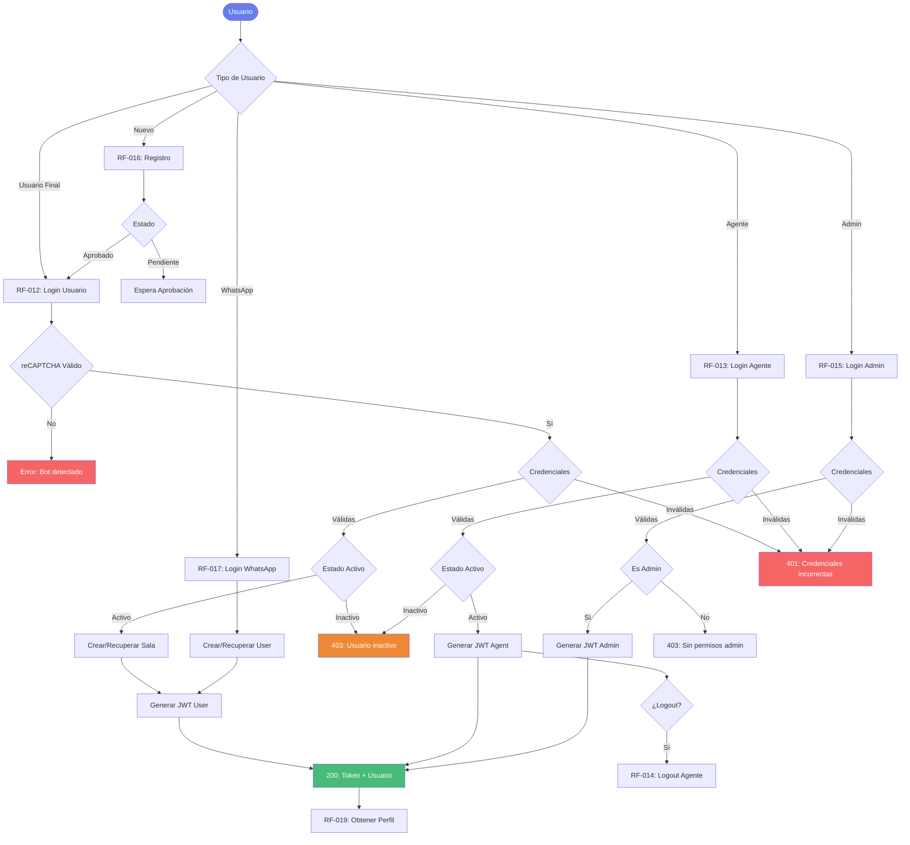

# Requisitos Funcionales - Autenticación

## Módulo: Autenticación y Gestión de Sesiones

### RF-012: Login de Usuario

**Historia de Usuario:**

- **Como** usuario final

- **Quiero** iniciar sesión con mis credenciales

- **Para** acceder a la plataforma de chat y conversar con el asistente

**Endpoint/Operación:**
```
POST /api/auth/login
```

**Criterios de Aceptación:**

- [ ] El endpoint acepta método POST

- [ ] Valida que el campo `username` sea requerido

- [ ] Valida que el campo `password` sea requerido

- [ ] Valida reCAPTCHA para prevenir bots

- [ ] Verifica credenciales contra la base de datos

- [ ] Verifica que el usuario esté activo (no inactivo ni pendiente)

- [ ] Requiere campo `areaId` para usuarios

- [ ] Crea o recupera sala de conversación

- [ ] Genera token JWT válido

- [ ] Retorna status 200 con usuario y token si es exitoso

- [ ] Retorna status 401 si credenciales incorrectas

- [ ] Retorna status 403 si usuario inactivo o pendiente

- [ ] Retorna status 404 si falta areaId

**Detalles Técnicos:**

- **Archivo:** `app/controllers/authController.js` (línea 8)

- **Autenticación:** No (este endpoint genera autenticación)

- **Roles permitidos:** Usuarios finales

- **Parámetros:**
  - **Body:** `username` (requerido), `password` (requerido), `areaId` (requerido para users)

- **Respuestas:**
  - `200`: Login exitoso con token JWT
  - `400`: Validación fallida
  - `401`: Credenciales incorrectas
  - `403`: Usuario inactivo o pendiente
  - `404`: areaId requerido

**Prioridad:** Must Have

**Estado:** ✅ Implementado

---

### RF-013: Login de Agente

**Historia de Usuario:**

- **Como** agente de atención

- **Quiero** iniciar sesión con mis credenciales de agente

- **Para** acceder al panel de atención y gestionar conversaciones

**Endpoint/Operación:**
```
POST /api/auth/agent/login
```

**Criterios de Aceptación:**

- [ ] El endpoint acepta método POST

- [ ] Valida que el campo `username` sea requerido

- [ ] Valida que el campo `password` sea requerido

- [ ] Verifica credenciales contra tabla de agentes

- [ ] Verifica que el agente esté activo

- [ ] Genera token JWT con modelo "agents"

- [ ] Retorna status 200 con datos del agente y token

- [ ] Retorna status 401 si credenciales incorrectas

- [ ] Retorna status 403 si agente inactivo

- [ ] No requiere reCAPTCHA (endpoint interno)

**Detalles Técnicos:**

- **Archivo:** `app/controllers/authController.js` (línea 48)

- **Autenticación:** No (este endpoint genera autenticación)

- **Roles permitidos:** Agentes

- **Parámetros:**
  - **Body:** `username` (requerido), `password` (requerido)

- **Respuestas:**
  - `200`: Login exitoso con token JWT
  - `400`: Validación fallida
  - `401`: Credenciales incorrectas
  - `403`: Agente inactivo

**Prioridad:** Must Have

**Estado:** ✅ Implementado

---

### RF-014: Logout de Agente

**Historia de Usuario:**

- **Como** agente de atención

- **Quiero** cerrar mi sesión

- **Para** registrar mi desconexión y liberar salas asignadas

**Endpoint/Operación:**
```
DELETE /api/auth/agent/logout/:agent
```

**Criterios de Aceptación:**

- [ ] El endpoint acepta método DELETE

- [ ] Registra el logout del agente en logs

- [ ] Actualiza estado del agente a offline

- [ ] Libera salas asignadas

- [ ] Retorna confirmación de logout exitoso

**Detalles Técnicos:**

- **Archivo:** `app/routes/api.js` (línea 159)

- **Autenticación:** No requerida

- **Roles permitidos:** Sistema

- **Parámetros:**
  - **Path:** `agent` (ID del agente)

- **Respuestas:**
  - `200`: Logout exitoso
  - `500`: Error en logout

**Prioridad:** Must Have

**Estado:** ✅ Implementado

---

### RF-015: Login de Administrador

**Historia de Usuario:**

- **Como** administrador del sistema

- **Quiero** iniciar sesión con credenciales de administrador

- **Para** acceder al panel de administración y configurar el sistema

**Endpoint/Operación:**
```
POST /api/auth/admin/login
```

**Criterios de Aceptación:**

- [ ] El endpoint acepta método POST

- [ ] Valida que el campo `username` sea requerido

- [ ] Valida que el campo `password` sea requerido

- [ ] Verifica que el usuario tenga rol de administrador

- [ ] Genera token JWT con privilegios de admin

- [ ] Retorna status 200 con datos y token

- [ ] Retorna status 401 si credenciales incorrectas

- [ ] Retorna status 403 si no tiene rol admin

**Detalles Técnicos:**

- **Archivo:** `app/routes/api.js` (línea 160)

- **Autenticación:** No (este endpoint genera autenticación)

- **Roles permitidos:** Administradores

- **Parámetros:**
  - **Body:** `username` (requerido), `password` (requerido)

- **Respuestas:**
  - `200`: Login exitoso con token JWT
  - `400`: Validación fallida
  - `401`: Credenciales incorrectas
  - `403`: Sin permisos de admin

**Prioridad:** Must Have

**Estado:** ✅ Implementado

---

### RF-016: Solicitud de Registro de Usuario

**Historia de Usuario:**

- **Como** usuario nuevo

- **Quiero** solicitar registro en el sistema

- **Para** crear una cuenta y esperar aprobación

**Endpoint/Operación:**
```
POST /api/auth/request
```

**Criterios de Aceptación:**

- [ ] El endpoint acepta método POST

- [ ] Valida que `uid` sea requerido

- [ ] Valida que `fullname` sea requerido

- [ ] Valida que `password` sea requerido y cumpla política:
  - Mínimo 8 caracteres
  - Al menos una letra mayúscula
  - Al menos una letra minúscula
  - Al menos un número
  - Al menos un carácter especial

- [ ] Valida que `email` sea requerido y tenga formato válido

- [ ] Valida que `phone_number` sea requerido

- [ ] Crea usuario con estado "pending"

- [ ] Hashea la contraseña con bcrypt (10 rounds)

- [ ] Retorna status 201 si se crea exitosamente

- [ ] Retorna status 400 si validación falla

- [ ] Retorna status 409 si el email ya existe

**Detalles Técnicos:**

- **Archivo:** `app/routes/api.js` (línea 168)

- **Autenticación:** No

- **Roles permitidos:** Público

- **Parámetros:**
  - **Body:** `uid` (requerido), `fullname` (requerido), `password` (requerido, política estricta), `email` (requerido, formato email), `phone_number` (requerido)

- **Respuestas:**
  - `201`: Usuario registrado, pendiente de aprobación
  - `400`: Validación fallida
  - `409`: Email duplicado

**Prioridad:** Must Have

**Estado:** ✅ Implementado

**Nota de Seguridad:** Política de contraseña cumple con estándares de seguridad media-alta.

---

### RF-017: Solicitud de Login Simplificado (WhatsApp)

**Historia de Usuario:**

- **Como** usuario nuevo desde WhatsApp

- **Quiero** registrarme automáticamente con datos básicos

- **Para** acceder rápidamente al servicio de chat sin proceso manual

**Endpoint/Operación:**
```
POST /api/auth/request/login
```

**Criterios de Aceptación:**

- [ ] El endpoint acepta método POST

- [ ] Valida que `uid` sea requerido

- [ ] Valida que `fullname` sea requerido

- [ ] Valida que `email` sea requerido y tenga formato válido

- [ ] Valida que `area_id` sea requerido

- [ ] Crea o recupera usuario automáticamente

- [ ] No requiere contraseña (usuarios de WhatsApp)

- [ ] Asigna estado activo directamente

- [ ] Retorna status 200 con usuario creado/recuperado

- [ ] Retorna status 400 si validación falla

**Detalles Técnicos:**

- **Archivo:** `app/routes/api.js` (línea 178)

- **Autenticación:** No

- **Roles permitidos:** Público (WhatsApp)

- **Parámetros:**
  - **Body:** `uid` (requerido), `fullname` (requerido), `email` (requerido, formato email), `area_id` (requerido)

- **Respuestas:**
  - `200`: Usuario creado/recuperado
  - `400`: Validación fallida

**Prioridad:** Must Have

**Estado:** ✅ Implementado

---

### RF-018: Obtener Áreas Activas (Público)

**Historia de Usuario:**

- **Como** usuario que va a registrarse

- **Quiero** ver las áreas de atención disponibles

- **Para** seleccionar el área correcta al crear mi cuenta

**Endpoint/Operación:**
```
GET /api/auth/areas
```

**Criterios de Aceptación:**

- [ ] El endpoint acepta método GET

- [ ] Retorna solo áreas activas

- [ ] No requiere autenticación

- [ ] Retorna status 200 con lista de áreas

- [ ] Filtra áreas por estado activo

- [ ] Incluye información básica de cada área (id, nombre, bot asociado)

**Detalles Técnicos:**

- **Archivo:** `app/routes/api.js` (línea 188)

- **Autenticación:** No

- **Roles permitidos:** Público

- **Parámetros:** Ninguno

- **Respuestas:**
  - `200`: Lista de áreas activas

**Prioridad:** Must Have

**Estado:** ✅ Implementado

---

### RF-019: Obtener Perfil de Usuario Autenticado

**Historia de Usuario:**

- **Como** usuario autenticado

- **Quiero** consultar mi información de perfil

- **Para** verificar mis datos y configuración actual

**Endpoint/Operación:**
```
GET /api/auth/profile
```

**Criterios de Aceptación:**

- [ ] El endpoint acepta método GET

- [ ] Requiere autenticación JWT válida

- [ ] Retorna datos del perfil del usuario autenticado

- [ ] Retorna status 200 con perfil

- [ ] Retorna status 401 si no está autenticado

- [ ] No expone información sensible (password hasheado oculto)

- [ ] Incluye datos de usuario, área asignada, estado

**Detalles Técnicos:**

- **Archivo:** `app/routes/api.js` (línea 206)

- **Autenticación:** Sí (validJWT)

- **Roles permitidos:** Usuarios autenticados (users, agents, admins)

- **Parámetros:** Ninguno (usa token JWT del header)

- **Respuestas:**
  - `200`: Perfil del usuario
  - `401`: No autenticado

**Prioridad:** Must Have

**Estado:** ✅ Implementado

---

### RF-027: Guardar Suscripción Web Push

**Historia de Usuario:**

- **Como** usuario autenticado

- **Quiero** suscribirme a notificaciones push del navegador

- **Para** recibir alertas en tiempo real sobre mensajes nuevos

**Endpoint/Operación:**
```
POST /api/webpush/subscribe
```

**Criterios de Aceptación:**

- [ ] El endpoint acepta método POST

- [ ] Requiere autenticación JWT válida

- [ ] Valida objeto de suscripción Push API

- [ ] Guarda endpoint, keys y expirationTime

- [ ] Asocia suscripción con usuario autenticado

- [ ] Retorna confirmación de suscripción

- [ ] Retorna status 200 si suscripción exitosa

- [ ] Retorna status 401 si no autenticado

**Detalles Técnicos:**

- **Archivo:** `app/controllers/authController.js` (línea 274)

- **Autenticación:** Sí (validJWT)

- **Roles permitidos:** Users, Agents autenticados

- **Parámetros:**
  - **Body:** Objeto de suscripción Push API (endpoint, keys, expirationTime)

- **Respuestas:**
  - `200`: Suscripción almacenada
  - `400`: Suscripción inválida
  - `401`: No autenticado

**Prioridad:** Must Have

**Estado:** ✅ Implementado

---

## Seguridad de Autenticación

### Mecanismos Implementados

**Password Hashing:**

- Algoritmo: bcrypt

- Rounds: 10

- Archivo: `app/helpers/hash.js`

**JWT:**

- Algoritmo: HS256 (predeterminado jsonwebtoken)

- Expiración: Configurada en `JWT_EXPIRES_IN`

- Secret: Almacenado en variable de entorno `JWT_KEY`

- Archivo: `app/helpers/jwt.js`

**Política de Contraseñas:**

- Longitud mínima: 8 caracteres

- Requiere: Mayúscula, minúscula, número, carácter especial

- Validada en: RF-016 (registro de usuario)

**Timeout de Sesión:**

- Agentes: 15 minutos de inactividad

- Implementado mediante JWT expiration

**Protección Anti-Bot:**

- reCAPTCHA en login de usuarios (RF-012)

- No requerido en login de agentes (acceso interno)

---

## Flujo de Autenticación



---

<div style="text-align: center; margin-top: 50px;">
    <small>📅 Última actualización: 18 de diciembre de 2025</small><br/>
    <small>🔐 Módulo: Autenticación y Gestión de Sesiones</small>
</div>
