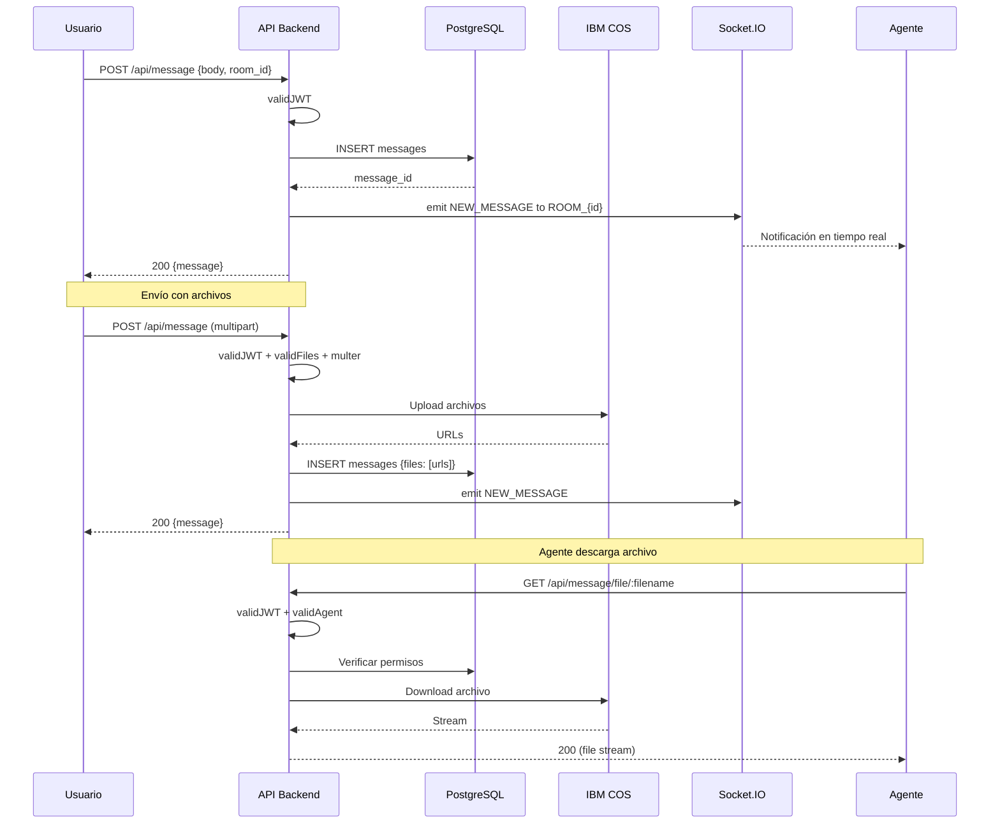

# 💬 RF-002: Mensajes

## Módulo de Gestión de Mensajes

**Endpoints relacionados:** 6 endpoints
**Archivos principales:** `app/controllers/messageController.js`, `app/logic/Message.js`

---

## RF-020: Enviar Mensaje de Usuario

**Prioridad:** Alta  
**Estado:** ✅ Implementado  
**Complejidad:** Media

### Descripción

Permitir a usuarios autenticados enviar mensajes de texto en una sala de conversación. El mensaje se almacena en DB y se notifica en tiempo real vía Socket.IO.

### Criterios de Aceptación

- [x] Usuario autenticado puede enviar mensaje

- [x] Mensaje se guarda en tabla `messages`

- [x] Socket.IO notifica a agentes conectados a la sala

- [x] Validación de campos requeridos (body, room_id)

- [x] Rate limiting: No implementado (⚠️ gap)

### Implementación Actual

**Endpoint:** `POST /api/message`  
**Middleware:** `validJWT`  
**Request Body:**
```json
{
  "body": "Mensaje de texto",
  "room_id": 123,
  "files": ["url1", "url2"]  // Opcional
}
```

**Response:**
```json
{
  "message": {
    "id": 456,
    "body": "Mensaje de texto",
    "room_id": 123,
    "user_id": 1,
    "created_at": "2025-12-18T10:30:00Z"
  }
}
```

**Lógica:**

1. Validación de JWT

2. Extraer user_id del token

3. Crear mensaje en DB

4. Emitir evento Socket.IO a sala

5. Retornar mensaje creado

**Socket Event:** `NEW_MESSAGE` emitido a `ROOM_{room_id}`

**Archivos involucrados:**

- `app/routes/api.js` (línea 37)

- `app/controllers/messageController.js` → `createMessage()`

- `app/logic/Message.js` → `create()`

### Gaps Identificados

- ⚠️ **No hay rate limiting:** Usuario puede spam infinito

- ⚠️ **No valida que usuario esté en la sala**

- ⚠️ **No valida contenido malicioso** (XSS, SQL injection parcialmente mitigado por ORM)

### Recomendaciones

**Prioridad Alta:**

1. Validar que user_id esté autorizado en room_id antes de enviar

2. Rate limiting: 10 mensajes/minuto por usuario

**Prioridad Media:**

3. Sanitizar contenido del mensaje (XSS)

---

## RF-021: Enviar Mensaje de Agente

**Prioridad:** Alta  
**Estado:** ✅ Implementado  
**Complejidad:** Media

### Descripción

Permitir a agentes autenticados enviar mensajes en salas asignadas. Incluye validación de que el agente esté asignado a la sala.

### Criterios de Aceptación

- [x] Agente autenticado puede enviar mensaje

- [x] Validación de asignación agente-sala

- [x] Socket.IO notifica a usuario y otros agentes

- [x] Mensaje marca sala como "en atención"

### Implementación Actual

**Endpoint:** `POST /api/message/agent`  
**Middleware:** `validJWT`, `validAgent`  
**Request Body:**
```json
{
  "body": "Respuesta del agente",
  "room_id": 123
}
```

**Validaciones:**

- `validAgent` verifica que `role === 'Agent'`

- Verifica que agente esté asignado a sala (via `room.agent_id`)

**Diferencia con RF-020:**

- Requiere middleware `validAgent`

- Actualiza timestamp de última actividad del agente

- Notifica a supervisores si es sala prioritaria

---

## RF-022: Enviar Mensaje con Archivos Adjuntos

**Prioridad:** Alta  
**Estado:** ✅ Implementado  
**Complejidad:** Alta

### Descripción

Permitir envío de mensajes con archivos multimedia (imágenes, documentos, audio, video). Los archivos se suben a IBM COS y se referencian en el mensaje.

### Criterios de Aceptación

- [x] Soporte de multipart/form-data

- [x] Validación de tipo de archivo (whitelist)

- [x] Límite de tamaño: A especificar

- [x] Upload a IBM COS

- [x] URL firmada con expiración (opcional)

### Implementación Actual

**Endpoint:** `POST /api/message` (mismo que RF-020)  
**Middleware:** `validJWT`, `validFiles`, `multer`  
**Request:** `multipart/form-data`

**Validaciones (`validFiles` middleware):**

- Tipos permitidos: `image/*`, `application/pdf`, `audio/*`, `video/*`, etc.

- Límite de tamaño: Especificado en middleware (archivo: `app/middlewares/valid-files.js`)

**Flujo:**

1. Multer procesa archivos

2. `validFiles` valida tipo y tamaño

3. Upload a IBM COS (via `storage.js`)

4. Guardar mensaje con referencia a URLs

5. Socket.IO notifica con metadata de archivos

**Archivos involucrados:**

- `app/middlewares/valid-files.js` - Validación

- `app/services/storage.js` - Upload a COS

**Tipos de archivos soportados (inferido):**
```javascript
{
  image: ['jpeg', 'jpg', 'png', 'gif', 'webp'],
  document: ['pdf', 'doc', 'docx', 'xls', 'xlsx'],
  audio: ['mp3', 'wav', 'ogg'],
  video: ['mp4', 'avi', 'mov']
}
```

### Gaps Identificados

- ⚠️ **Límite de tamaño no documentado**

- ⚠️ **No hay escaneo de virus** (Clamd, VirusTotal)

- ⚠️ **No hay watermark en imágenes** (posible para compliance)

---

## RF-023: Descargar Archivos Adjuntos

**Prioridad:** Alta  
**Estado:** ✅ Implementado  
**Complejidad:** Media

### Descripción

Permitir a usuarios/agentes autenticados descargar archivos adjuntos de mensajes en sus salas.

### Criterios de Aceptación

- [x] Requiere autenticación

- [x] Validación de permisos (usuario debe estar en sala)

- [x] Download desde IBM COS

- [x] Content-Type correcto

### Implementación Actual

**Endpoint:** `GET /api/message/file/:filename`  
**Middleware:** `validJWT`  

**Lógica:**

1. Validar JWT

2. Extraer filename de params

3. Verificar que usuario tenga acceso (via mensaje → sala)

4. Download de COS

5. Stream a cliente con Content-Type adecuado

**Archivos involucrados:**

- `app/controllers/messageController.js` → `downloadFile()`

- `app/services/storage.js` → `downloadObject()`

### Gaps Identificados

- ⚠️ **No valida que usuario esté en la sala del mensaje**

- ⚠️ **Posible leak si filename es adivinado**

### Recomendaciones

**Prioridad Alta:**

1. Validar que user_id está en room_id antes de permitir download

2. Usar UUIDs en lugar de filenames predecibles

---

## RF-024: Listar Mensajes de una Sala

**Prioridad:** Alta  
**Estado:** ✅ Implementado  
**Complejidad:** Baja

### Descripción

Obtener historial de mensajes de una sala de conversación. Soporta paginación implícita.

### Criterios de Aceptación

- [x] Usuario/agente autenticado puede listar mensajes

- [x] Solo mensajes de salas propias

- [x] Ordenado por fecha descendente

- [x] Incluye metadata de usuario/agente

### Implementación Actual

**Endpoint:** `GET /api/message/:room_id`  
**Middleware:** `validJWT`  
**Response:**
```json
{
  "messages": [
    {
      "id": 456,
      "body": "Mensaje",
      "room_id": 123,
      "user_id": 1,
      "agent_id": null,
      "created_at": "2025-12-18T10:30:00Z",
      "user": { "name": "Juan", "phone_number": "593..." }
    }
  ]
}
```

**Lógica:**

1. Validar JWT

2. Query mensajes de room_id

3. JOIN con users/agents para metadata

4. Ordenar por created_at DESC

5. Retornar lista

**Optimización:**

- Caché de mensajes recientes (últimos 20) - TTL 300s

- Índice en `(room_id, created_at DESC)`

### Gaps Identificados

- ⚠️ **No hay paginación explícita** (limit, offset)

- ⚠️ **Posible memory issue** si sala tiene miles de mensajes

### Recomendaciones

**Prioridad Media:**

1. Implementar paginación: `?page=1&limit=50`

2. Límite máximo: 100 mensajes por request

---

## RF-025: Marcar Mensajes como Leídos

**Prioridad:** Media  
**Estado:** ❓ No documentado (posible implementación parcial)  
**Complejidad:** Media

### Descripción

Marcar mensajes como leídos cuando agente/usuario visualiza la sala. Ayuda a gestionar notificaciones.

### Criterios de Aceptación

- [ ] Endpoint para marcar como leído

- [ ] Campo `read_at` en tabla messages

- [ ] Socket.IO notifica lectura a otros participantes

- [ ] Contador de mensajes no leídos

### Implementación Actual

**Estado:** No detectado en código revisado.

**Posible implementación:**

- Campo `read_at` puede existir en DB pero no detectado en queries

- Sin endpoint explícito `/api/message/read`

### Recomendaciones

**Prioridad Media:**

1. Implementar RF completo si no existe

2. Agregar a Socket.IO evento `MESSAGE_READ`

---

## 📊 Diagrama de Flujo de Mensajes



---

## 🔍 Análisis de Código

### Métodos Clave en `Message.js`

```javascript
// app/logic/Message.js

static async create({ body, room_id, user_id, agent_id, files }) {
  // 1. Validar campos requeridos
  // 2. INSERT en tabla messages
  // 3. Retornar mensaje creado
}

static async getByRoom(room_id) {
  // 1. Query mensajes de sala
  // 2. JOIN con users/agents
  // 3. ORDER BY created_at DESC
}

static async downloadFile(filename, user_id) {
  // 1. Verificar permisos
  // 2. Download de COS
  // 3. Stream a cliente
}
```

### Optimizaciones Implementadas

**1. Caché de Mensajes Recientes:**
```javascript
// app/services/cache.js
const key = `messages:room:${room_id}:recent`;
const cached = await cache.get(key);
if (cached) return JSON.parse(cached);

const messages = await db.query(...);
await cache.set(key, JSON.stringify(messages), 300); // TTL 5min
```

**2. Índices de Base de Datos:**
```sql
-- db/migrations/002_add_performance_indexes_real_schema.sql
CREATE INDEX idx_messages_room_created 
ON banco_de_bogota.messages(room_id, created_at DESC);

CREATE INDEX idx_messages_user 
ON banco_de_bogota.messages(user_id);
```

**3. Paralelización (en whatsappController):**
```javascript
// Crear mensaje y Watson session en paralelo
const [message, watsonSession] = await Promise.all([
  Message.create({ body, room_id, user_id }),
  WatsonSession.get(user_id)
]);
```

---

## ⚠️ Gaps y Riesgos

| Gap | Severidad | Impacto |
|-----|-----------|---------|
| No rate limiting en mensajes | Alta | Spam, abuso |
| No validación permisos en download | Alta | Leak de archivos |
| No paginación en listado | Media | Performance |
| No escaneo de virus en uploads | Media | Seguridad |
| No sanitización XSS | Media | XSS attacks |
| No marca como leído implementado | Baja | UX |

---

## 📝 Resumen del Módulo

**Funcionalidades Implementadas:**

- ✅ Envío de mensajes (usuario/agente)

- ✅ Upload de archivos adjuntos a COS

- ✅ Download de archivos con autenticación

- ✅ Listado de mensajes de sala

- ✅ Notificaciones Socket.IO en tiempo real

**Pendientes:**

- ❌ Rate limiting

- ❌ Paginación explícita

- ❌ Validación de permisos en download

- ❌ Marcar como leído (RF-025)

- ❌ Escaneo de virus

**Prioridades de Mejora:**

1. **Alta:** Rate limiting + validación permisos download

2. **Media:** Paginación + sanitización XSS

3. **Baja:** Marcar como leído + escaneo virus

---

*Última actualización: 18 de diciembre de 2025*
