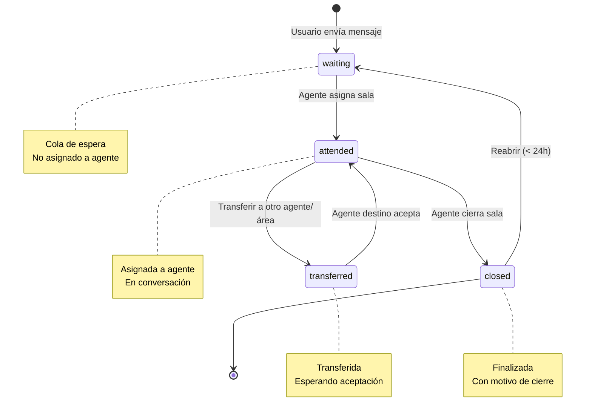
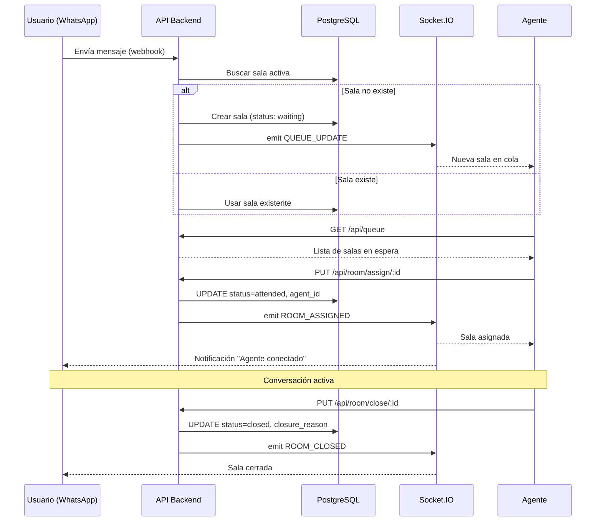

# 🏢 RF-003: Salas de Conversación

## Módulo de Gestión de Salas (Rooms)

**Endpoints relacionados:** 12 endpoints
**Archivos principales:** `app/controllers/roomController.js`, `app/logic/Room.js`, `app/logic/ExternalRoom.js`

---

## RF-026: Crear Sala de Conversación

**Prioridad:** Alta  
**Estado:** ✅ Implementado  
**Complejidad:** Alta

### Descripción

Crear una nueva sala de conversación cuando un usuario inicia contacto vía WhatsApp o Web. Si ya existe sala activa, se reutiliza.

### Criterios de Aceptación

- [x] Crear sala automáticamente al recibir mensaje

- [x] Validar que no exista sala activa para el usuario

- [x] Asignar área predeterminada (Watson)

- [x] Estado inicial: `waiting` (en cola)

- [x] Reutilizar sala si existe y está activa

### Implementación Actual

**Endpoint:** Implícito en `POST /api/whatsapp/external`  
**Lógica:**

1. Recibir mensaje de WhatsApp

2. Buscar sala activa para `phone_number`

3. Si no existe → Crear nueva sala

4. Si existe → Reutilizar sala

5. Crear mensaje en sala

6. Enviar a Watson Assistant

**Archivo:** `app/logic/ExternalRoom.js` → `getOrCreate()`

**Estados de Sala:**

- `waiting`: En cola, esperando agente

- `attended`: Asignada a agente

- `closed`: Cerrada

- `transferred`: Transferida a otro agente/área

**Campos clave:**
```javascript
{
  id: 123,
  user_id: 1,
  agent_id: null,  // null hasta asignación
  area_id: 2,      // Área Watson por defecto
  status: 'waiting',
  created_at: '2025-12-18T10:00:00Z',
  closed_at: null,
  closure_reason_id: null
}
```

### Gaps Identificados

- ⚠️ **No hay límite de salas activas por usuario** (posible abuso)

- ⚠️ **Sala "activa" no tiene timeout** (puede quedar abierta indefinidamente)

### Recomendaciones

**Prioridad Media:**

1. Implementar timeout de inactividad: cerrar sala si no hay mensajes en 24h

2. Límite de 1 sala activa por usuario

---

## RF-027: Asignar Sala a Agente

**Prioridad:** Alta  
**Estado:** ✅ Implementado  
**Complejidad:** Media

### Descripción

Asignar manualmente o automáticamente una sala en cola a un agente disponible. Actualiza estado a `attended`.

### Criterios de Aceptación

- [x] Agente puede tomar sala de cola

- [x] Actualizar `agent_id` y `status = attended`

- [x] Notificar vía Socket.IO a agente

- [x] Validar que sala esté en estado `waiting`

- [x] Validar disponibilidad del agente

### Implementación Actual

**Endpoint:** `PUT /api/room/assign/:id`  
**Middleware:** `validJWT`, `validAgent`  
**Request Body:**
```json
{
  "agent_id": 5  // Opcional, si omitido se usa JWT
}
```

**Lógica:**

1. Validar que sala esté en `waiting`

2. Validar que agente esté disponible (no en pausa)

3. Actualizar sala: `agent_id`, `status = attended`, `assigned_at`

4. Socket.IO notifica a agente: `ROOM_ASSIGNED`

5. Retornar sala actualizada

**Archivo:** `app/logic/Room.js` → `assign()`

**Validaciones:**

- Sala no puede estar en `closed` o `transferred`

- Agente debe tener status `available`

- Solo agentes del área correcta pueden tomar sala (opcional según config)

### Recomendaciones

**Prioridad Baja:**

1. Agregar asignación automática por carga de trabajo (round-robin)

---

## RF-028: Listar Salas en Cola

**Prioridad:** Alta  
**Estado:** ✅ Implementado  
**Complejidad:** Baja

### Descripción

Listar todas las salas con estado `waiting` para que agentes puedan tomarlas.

### Criterios de Aceptación

- [x] Filtrar por status = `waiting`

- [x] Ordenar por prioridad y fecha (FIFO)

- [x] Incluir metadata de usuario

- [x] Caché de 30 segundos

### Implementación Actual

**Endpoint:** `GET /api/queue` o `GET /api/room/queue`  
**Middleware:** `validJWT`, `validAgent`  
**Response:**
```json
{
  "queue": [
    {
      "id": 123,
      "user": { "name": "Juan", "phone_number": "593..." },
      "created_at": "2025-12-18T10:00:00Z",
      "waiting_time": 120,  // segundos
      "priority": "normal"
    }
  ]
}
```

**Lógica:**

1. Query salas con `status = 'waiting'`

2. JOIN con users para metadata

3. Calcular `waiting_time = NOW() - created_at`

4. Ordenar por prioridad DESC, created_at ASC

5. Caché 30s

**Archivo:** `app/logic/Queue.js` → `getQueue()`

**Optimización:**

- Índice en `(status, created_at)`

- Caché Redis con TTL 30s

- Push de actualizaciones vía Socket.IO (no polling)

---

## RF-029: Listar Salas Asignadas a Agente

**Prioridad:** Alta  
**Estado:** ✅ Implementado  
**Complejidad:** Baja

### Descripción

Listar salas activas asignadas a un agente específico.

### Criterios de Aceptación

- [x] Filtrar por `agent_id` y `status = 'attended'`

- [x] Incluir metadata de usuario

- [x] Incluir último mensaje

- [x] Ordenar por actividad reciente

### Implementación Actual

**Endpoint:** `GET /api/room/agent/:agent_id` o `GET /api/room/mine`  
**Middleware:** `validJWT`, `validAgent`  
**Response:**
```json
{
  "rooms": [
    {
      "id": 123,
      "user": { "name": "Juan" },
      "last_message": { "body": "Hola", "created_at": "..." },
      "status": "attended",
      "assigned_at": "2025-12-18T10:30:00Z"
    }
  ]
}
```

**Lógica:**

1. Query salas con `agent_id` y `status IN ('attended', 'transferred')`

2. JOIN con messages para último mensaje

3. Ordenar por `last_message.created_at DESC`

4. Caché 60s

**Optimización:**

- Índice en `(agent_id, status)`

- Subquery optimizada para último mensaje

---

## RF-030: Transferir Sala a Otro Agente

**Prioridad:** Media  
**Estado:** ✅ Implementado  
**Complejidad:** Media

### Descripción

Permitir a un agente transferir una sala a otro agente o área.

### Criterios de Aceptación

- [x] Agente actual puede transferir

- [x] Validar que agente destino esté disponible

- [x] Actualizar `agent_id` o `area_id`

- [x] Estado cambia a `transferred`

- [x] Notificar a ambos agentes vía Socket.IO

### Implementación Actual

**Endpoint:** `PUT /api/room/transfer/:id`  
**Middleware:** `validJWT`, `validAgent`  
**Request Body:**
```json
{
  "target_agent_id": 6,    // Opcional
  "target_area_id": 3      // Opcional
}
```

**Lógica:**

1. Validar que agente actual sea dueño de sala

2. Si `target_agent_id`: Transferir directo a agente

3. Si `target_area_id`: Transferir a cola de área

4. Actualizar sala: `status = 'transferred'`, `transferred_at`, `transferred_by`

5. Socket.IO notifica:
   - Agente original: `ROOM_TRANSFERRED_OUT`
   - Agente destino: `ROOM_TRANSFERRED_IN`

**Archivo:** `app/logic/Room.js` → `transfer()`

**Validaciones:**

- Agente destino debe estar disponible

- Área destino debe existir

- Sala no puede estar cerrada

---

## RF-031: Cerrar Sala de Conversación

**Prioridad:** Alta  
**Estado:** ✅ Implementado  
**Complejidad:** Media

### Descripción

Cerrar una sala cuando la conversación finaliza. Requiere motivo de cierre.

### Criterios de Aceptación

- [x] Agente puede cerrar sala

- [x] Requiere `closure_reason_id`

- [x] Actualizar `status = 'closed'`, `closed_at`

- [x] Notificar a usuario vía Socket.IO

- [x] Opcional: Enviar encuesta de satisfacción

### Implementación Actual

**Endpoint:** `PUT /api/room/close/:id`  
**Middleware:** `validJWT`, `validAgent`  
**Request Body:**
```json
{
  "closure_reason_id": 2,
  "notes": "Problema resuelto"  // Opcional
}
```

**Lógica:**

1. Validar que agente sea dueño de sala

2. Validar que `closure_reason_id` exista

3. Actualizar sala: `status = 'closed'`, `closed_at`, `closure_reason_id`, `notes`

4. Socket.IO notifica a usuario: `ROOM_CLOSED`

5. Opcional: Enviar encuesta (RF-070)

**Archivo:** `app/logic/Room.js` → `close()`

**Motivos de Cierre (closure_reasons):**

- Problema resuelto

- Información proporcionada

- Transferido a otro canal

- Usuario no responde

- Spam/Abuso

**Campos adicionales:**
```javascript
{
  closure_reason_id: 2,
  closed_at: '2025-12-18T11:00:00Z',
  notes: 'Usuario satisfecho',
  closed_by: 5  // agent_id
}
```

---

## RF-032: Reabrir Sala Cerrada

**Prioridad:** Baja  
**Estado:** ❓ No documentado  
**Complejidad:** Baja

### Descripción

Reabrir una sala cerrada si usuario envía nuevo mensaje en ventana de tiempo (ej. 24h).

### Criterios de Aceptación

- [ ] Detectar mensaje a sala cerrada

- [ ] Si < 24h desde cierre → Reabrir sala

- [ ] Si > 24h → Crear nueva sala

- [ ] Notificar a agente vía Socket.IO

### Implementación Actual

**Estado:** No detectado en código.

**Posible implementación:**

- Lógica en `ExternalRoom.js` al recibir mensaje

- Verificar `closed_at` y decidir reabrir o crear nueva

### Recomendaciones

**Prioridad Baja:**

1. Implementar lógica de reapertura con ventana de 24h

2. Agregar RF completo

---

## RF-033: Historial de Salas de Usuario

**Prioridad:** Media  
**Estado:** ✅ Implementado  
**Complejidad:** Baja

### Descripción

Listar todas las salas (activas y cerradas) de un usuario específico.

### Criterios de Aceptación

- [x] Listar salas por `user_id`

- [x] Incluir salas cerradas

- [x] Ordenar por fecha descendente

- [x] Incluir metadata de agente

### Implementación Actual

**Endpoint:** `GET /api/room/user/:user_id`  
**Middleware:** `validJWT`  
**Response:**
```json
{
  "rooms": [
    {
      "id": 123,
      "status": "closed",
      "agent": { "name": "Ana" },
      "created_at": "2025-12-18T10:00:00Z",
      "closed_at": "2025-12-18T11:00:00Z",
      "closure_reason": { "name": "Problema resuelto" }
    }
  ]
}
```

**Lógica:**

1. Query salas con `user_id`

2. JOIN con agents, closure_reasons

3. Ordenar por created_at DESC

4. Caché 300s

**Optimización:**

- Índice en `(user_id, created_at DESC)`

---

## RF-034: Listar Salas por Área

**Prioridad:** Media  
**Estado:** ✅ Implementado  
**Complejidad:** Baja

### Descripción

Listar salas de una área específica. Útil para supervisores.

### Criterios de Aceptación

- [x] Filtrar por `area_id`

- [x] Incluir salas en todos los estados

- [x] Paginación

### Implementación Actual

**Endpoint:** `GET /api/room/area/:area_id`  
**Middleware:** `validJWT`, `validPermission('supervisor')`  
**Query Params:** `?status=waiting&page=1&limit=20`

**Lógica:**

1. Query salas con `area_id`

2. Filtros opcionales: status, date range

3. Paginación

4. JOIN con users, agents

---

## RF-035: Métricas de Salas

**Prioridad:** Media  
**Estado:** ✅ Implementado  
**Complejidad:** Media

### Descripción

Obtener métricas agregadas de salas: total en cola, tiempo promedio de espera, salas cerradas hoy, etc.

### Criterios de Aceptación

- [x] Total salas en cola

- [x] Tiempo promedio de espera

- [x] Salas cerradas en rango de fechas

- [x] Salas por estado

### Implementación Actual

**Endpoint:** `GET /api/metrics/rooms`  
**Middleware:** `validJWT`, `validAgent`  
**Response:**
```json
{
  "queue_length": 5,
  "avg_wait_time": 180,  // segundos
  "closed_today": 23,
  "by_status": {
    "waiting": 5,
    "attended": 12,
    "closed": 23
  }
}
```

**Lógica:**

1. Query agregada con GROUP BY status

2. Cálculo de AVG(wait_time)

3. Caché 60s

**Archivo:** `app/logic/Metrics.js` → `getRoomMetrics()`

---

## RF-036: Búsqueda de Salas

**Prioridad:** Media  
**Estado:** ✅ Implementado  
**Complejidad:** Media

### Descripción

Buscar salas por criterios: nombre de usuario, teléfono, fecha, agente, área.

### Criterios de Aceptación

- [x] Búsqueda por teléfono (LIKE)

- [x] Búsqueda por nombre (LIKE)

- [x] Filtro por rango de fechas

- [x] Filtro por agente

- [x] Paginación

### Implementación Actual

**Endpoint:** `GET /api/room/search`  
**Middleware:** `validJWT`, `validAgent`  
**Query Params:**
```
?phone=593123456
&name=Juan
&agent_id=5
&date_from=2025-12-01
&date_to=2025-12-18
&page=1&limit=20
```

**Lógica:**

1. Construir query dinámica con filtros

2. JOIN con users, agents

3. Paginación

4. Índices en phone_number, name, agent_id

**Optimización:**

- Índice compuesto en `(agent_id, created_at DESC)`

- Índice en phone_number (parcial, primeros 10 dígitos)

---

## RF-037: Priorizar Sala

**Prioridad:** Baja  
**Estado:** ❓ No documentado  
**Complejidad:** Baja

### Descripción

Marcar sala como prioritaria para que sea atendida primero.

### Criterios de Aceptación

- [ ] Campo `priority` en tabla rooms

- [ ] Valores: `low`, `normal`, `high`, `urgent`

- [ ] Queue ordenada por prioridad primero, luego FIFO

- [ ] Solo supervisores pueden priorizar

### Implementación Actual

**Estado:** No detectado en código.

**Recomendación:**

1. Agregar campo `priority` a tabla rooms

2. Modificar query de cola para ordenar por prioridad

---

## 📊 Diagrama de Estados de Sala



---

## 📊 Diagrama de Flujo de Asignación



---

## 🔍 Análisis de Código

### Métodos Clave en `Room.js`

```javascript
// app/logic/Room.js

static async getOrCreate(user_id, area_id) {
  // Buscar sala activa (waiting o attended)
  // Si no existe, crear nueva
  // Retornar sala
}

static async assign(room_id, agent_id) {
  // Validar estado waiting
  // Validar agente disponible
  // UPDATE status = attended
  // Socket.IO notifica
}

static async transfer(room_id, target_agent_id, target_area_id) {
  // Validar permisos
  // UPDATE agent_id o area_id
  // UPDATE status = transferred
  // Notificar a ambos agentes
}

static async close(room_id, closure_reason_id, notes) {
  // Validar permisos
  // UPDATE status = closed, closed_at
  // Socket.IO notifica
  // Opcional: trigger encuesta
}
```

### Optimizaciones Implementadas

**1. Caché de Cola:**
```javascript
// app/services/cache.js
const queue = await cache.get('queue:waiting');
if (queue) return JSON.parse(queue);

const rooms = await db.query('SELECT * FROM rooms WHERE status = ?', ['waiting']);
await cache.set('queue:waiting', JSON.stringify(rooms), 30); // TTL 30s
```

**2. Índices de BD:**
```sql
-- Para búsquedas rápidas
CREATE INDEX idx_rooms_status ON rooms(status);
CREATE INDEX idx_rooms_agent ON rooms(agent_id, status);
CREATE INDEX idx_rooms_user ON rooms(user_id, created_at DESC);
CREATE INDEX idx_rooms_area ON rooms(area_id, status);

-- Índice compuesto para cola ordenada
CREATE INDEX idx_rooms_queue ON rooms(status, created_at ASC)
WHERE status = 'waiting';
```

**3. Socket.IO Room-based Broadcasting:**
```javascript
// Notificar solo a agentes del área
io.to(`AREA_${area_id}`).emit('QUEUE_UPDATE', { room });

// Notificar al agente específico
io.to(`AGENT_${agent_id}`).emit('ROOM_ASSIGNED', { room });
```

---

## ⚠️ Gaps y Riesgos

| Gap | Severidad | Impacto |
|-----|-----------|---------|
| No timeout de inactividad en salas | Media | Salas abiertas indefinidamente |
| No límite de salas por usuario | Media | Abuso, spam |
| No reapertura automática (RF-032) | Baja | UX |
| No priorización de salas (RF-037) | Baja | Gestión de urgencias |
| No asignación automática | Baja | Eficiencia |

---

## 📝 Resumen del Módulo

**Funcionalidades Implementadas:**

- ✅ Creación automática de salas (WhatsApp/Web)

- ✅ Asignación manual de salas a agentes

- ✅ Cola de salas en espera

- ✅ Transferencia entre agentes/áreas

- ✅ Cierre con motivo

- ✅ Historial de salas por usuario

- ✅ Búsqueda avanzada

- ✅ Métricas de salas

**Pendientes:**

- ❌ Timeout de inactividad

- ❌ Reapertura automática (< 24h)

- ❌ Priorización de salas

- ❌ Asignación automática (round-robin)

**Prioridades de Mejora:**

1. **Media:** Timeout de inactividad + límite de salas por usuario

2. **Baja:** Reapertura automática + priorización

---

*Última actualización: 18 de diciembre de 2025*
