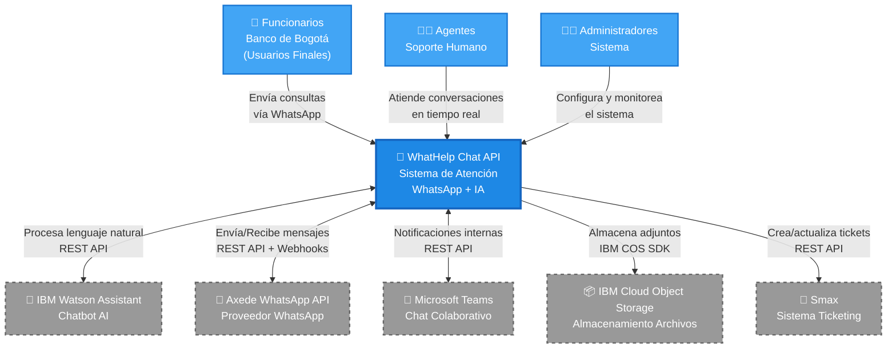

# 🌐 Arquitectura - Nivel 1: Contexto

## 🎯 Objetivo

Mostrar el sistema WhatHelp Chat API en su contexto: usuarios finales, agentes de soporte y sistemas externos con los que interactúa para brindar atención al cliente del Banco de Bogotá vía WhatsApp.

---

## 📊 Diagrama de Contexto (C4 - Nivel 1)

**Interpretación:**

WhatHelp Chat API es el sistema central que orquesta la atención al cliente digital del Banco de Bogotá. Los funcionarios del banco interactúan con el sistema a través de WhatsApp (canal externo gestionado por Axede), donde inicialmente son atendidos por un asistente virtual basado en IBM Watson Assistant. Cuando Watson no puede resolver la consulta o el usuario lo requiere, la conversación es transferida a un agente humano que opera desde una interfaz web con comunicación en tiempo real vía Socket.IO.

El sistema actúa como intermediario entre múltiples plataformas: procesa el lenguaje natural de los mensajes usando Watson, gestiona el envío/recepción de mensajes a través de la API de Axede (proveedor WhatsApp), permite notificaciones internas vía Microsoft Teams, almacena archivos adjuntos en IBM Cloud Object Storage, y registra casos en el sistema de ticketing Smax para seguimiento formal.

Esta arquitectura permite escalar la atención al cliente combinando automatización (IA) con intervención humana, mientras mantiene integración con los sistemas corporativos existentes del banco, todo bajo el ecosistema IBM Cloud.

---

## 👥 Actores del Sistema

### Funcionarios del Banco de Bogotá (Usuarios Finales)
**Rol:** Empleados del banco que necesitan soporte técnico para productos digitales y autenticación web.

**Interacciones:**

- Inician conversaciones vía WhatsApp enviando consultas

- Reciben respuestas del chatbot Watson o de agentes humanos

- Envían archivos adjuntos (capturas de pantalla, documentos)

- Completan encuestas de satisfacción post-atención

- Esperan en cola virtual cuando no hay agentes disponibles

**Volumen:** 1-1,000 mensajes/día

---

### Agentes de Soporte (Operadores Humanos)
**Rol:** Personal de soporte técnico que atiende conversaciones escaladas o que requieren intervención humana.

**Interacciones:**

- Se autentican en la plataforma web (login con JWT + reCAPTCHA)

- Reciben notificaciones en tiempo real de nuevas conversaciones (Socket.IO)

- Leen el historial de conversación con Watson antes de tomar el caso

- Responden mensajes de texto y multimedia

- Transfieren conversaciones entre agentes (basado en áreas/especialidades)

- Cierran conversaciones con motivos de cierre predefinidos

- Envían encuestas de satisfacción

- Gestionan alertas masivas para comunicados importantes

**Roles detectados:**

- `admin`: Control total del sistema

- `level_two`: Permisos elevados (supervisores)

- `regular`: Agentes de primer nivel

---

### Administradores del Sistema
**Rol:** Personal técnico y de gestión que configura y mantiene la plataforma.

**Interacciones:**

- Configuran áreas de atención y equipos

- Gestionan permisos de usuarios (RBAC)

- Monitorean métricas y reportes de atención

- Configuran razones de cierre y encuestas

- Administran colas de espera y prioridades

- Ejecutan tareas manuales de mantenimiento (cron jobs)

- Consultan reportes de performance (tiempos de respuesta, CSAT)

---

## 🔗 Sistemas Externos

### IBM Watson Assistant - IBM Cloud
**Propósito:** Asistente virtual que atiende la primera línea de soporte, capturando información inicial y resolviendo consultas frecuentes antes de escalar a agentes humanos.

**Protocolo:** REST API (IBM Watson SDK v10.0.0)

**Criticidad:** **Alta** - Es el primer punto de contacto; si falla, todos los mensajes deben ir directo a agentes.

**Datos intercambiados:**

- Mensajes de usuario (texto)

- Contexto de sesión (variables de estado)

- Intenciones detectadas (clasificación NLU)

- Respuestas generadas por el bot

**Planes futuros:** En evaluación de migración a otra plataforma (respuesta del formulario: `watson_migration_plans: evaluating`)

---

### Axede WhatsApp API - Proveedor WhatsApp Business
**Propósito:** Puente de comunicación con WhatsApp Business API para enviar y recibir mensajes, gestionar estados de conversación y procesar webhooks.

**Protocolo:** REST API + Webhooks

**Criticidad:** **Crítica** - Sin este servicio, no hay comunicación con usuarios finales.

**Datos intercambiados:**

- Mensajes de texto entrantes/salientes

- Mensajes multimedia (imágenes, documentos, audio)

- Estados de entrega (enviado, entregado, leído)

- Webhooks de eventos (nuevo mensaje, cambio de estado)

**Alternativa considerada:** Twilio (según respuesta del formulario)

---

### Microsoft Teams - Microsoft 365
**Propósito:** Canal secundario de comunicación para notificaciones internas entre agentes y coordinadores, facilitando colaboración.

**Protocolo:** REST API (Microsoft Teams SDK)

**Criticidad:** **Media** - Útil para coordinación interna, pero no crítico para el flujo principal de atención.

**Datos intercambiados:**

- Notificaciones de conversaciones urgentes

- Mensajes de coordinación entre equipos

- Alertas de sistema

---

### IBM Cloud Object Storage (COS) - IBM Cloud
**Propósito:** Almacenamiento persistente de archivos adjuntos enviados por usuarios y agentes (imágenes, PDFs, documentos).

**Protocolo:** IBM COS SDK v1.14.1 (S3-compatible API)

**Criticidad:** **Media** - Si falla, los mensajes de texto siguen funcionando, solo se pierde capacidad de adjuntos.

**Datos almacenados:**

- Archivos de conversaciones (imágenes, documentos)

- Logos y recursos estáticos

- Archivos temporales de reportes

**Razón de elección:** Aplicación nativa de IBM Cloud (según respuesta del formulario)

---

### Smax - Sistema de Ticketing
**Propósito:** Integración con sistema de gestión de tickets corporativo para registro formal de casos de soporte.

**Protocolo:** REST API (detalles no especificados en formulario)

**Criticidad:** **Media** - Complementa el sistema, pero WhatHelp puede operar independientemente.

**Datos intercambiados:**

- Creación de tickets desde conversaciones

- Actualización de estados de casos

- Sincronización de información de seguimiento

**Estado:** Integración activa (mencionada en respuesta del formulario)

---

## 📋 Resumen de Dependencias

| Sistema Externo | Criticidad | Protocolo | Fallback Detectado |
|----------------|------------|-----------|-------------------|
| Axede WhatsApp API | 🔴 Crítica | REST + Webhooks | ❌ No detectado en código |
| IBM Watson Assistant | 🟠 Alta | REST (SDK) | ✅ Try-catch en código |
| IBM Cloud Object Storage | 🟡 Media | S3-compatible SDK | ✅ Try-catch en código |
| Microsoft Teams | 🟡 Media | REST API | ✅ Try-catch en código |
| Smax | 🟡 Media | REST API | ⚠️ No confirmado |

---

## 🔄 Flujos de Negocio Principales

### Flujo 1: Atención Inicial con Bot

1. **Funcionario** envía mensaje por WhatsApp

2. **Axede** recibe mensaje y envía webhook a WhatHelp

3. **WhatHelp** envía mensaje a **Watson Assistant**

4. **Watson** procesa y retorna respuesta automática

5. **WhatHelp** envía respuesta vía **Axede** a WhatsApp

6. Ciclo se repite hasta resolver o escalar

### Flujo 2: Escalamiento a Agente Humano

1. Watson detecta necesidad de escalamiento (o usuario lo solicita)

2. **WhatHelp** notifica a **Agentes** disponibles vía Socket.IO

3. Agente acepta conversación desde interfaz web

4. **Agente** lee historial completo (Watson + mensajes previos)

5. Conversación continúa en modo humano-usuario

6. Al finalizar, agente cierra con motivo de cierre

7. Sistema envía encuesta de satisfacción

8. (Opcional) Se crea ticket en **Smax** para seguimiento

### Flujo 3: Gestión de Cola de Espera

1. Usuario espera agente disponible

2. Sistema coloca en cola virtual (tabla `queues`)

3. Cron job (`queue.js`) ejecuta cada 30s

4. Asigna conversaciones a agentes libres por prioridad

5. Usuario recibe notificación de conexión

---

## 📈 Contexto de Negocio

**Cliente:** Banco de Bogotá  
**Propósito:** Soporte al canal digital de la entidad, enfocado en productos digitales y autenticación web  
**Canal:** WhatsApp  
**Usuarios finales:** Funcionarios del banco  
**Volumen:** 1-1,000 mensajes/día  
**Despliegue:** IBM Cloud (1 instancia en producción)

---
