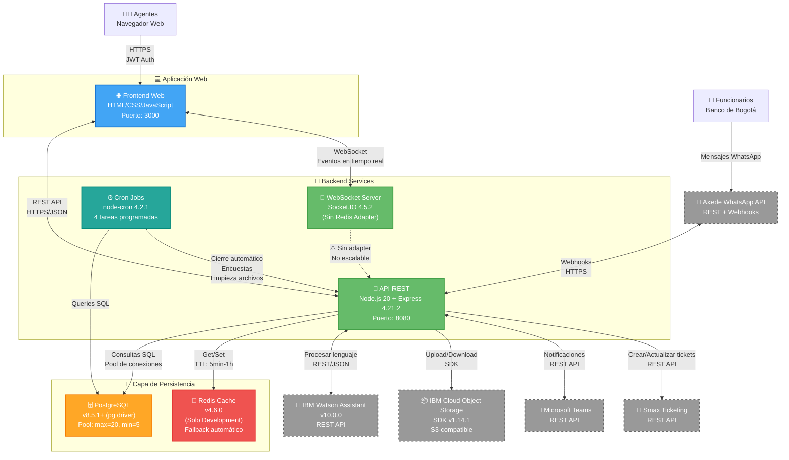
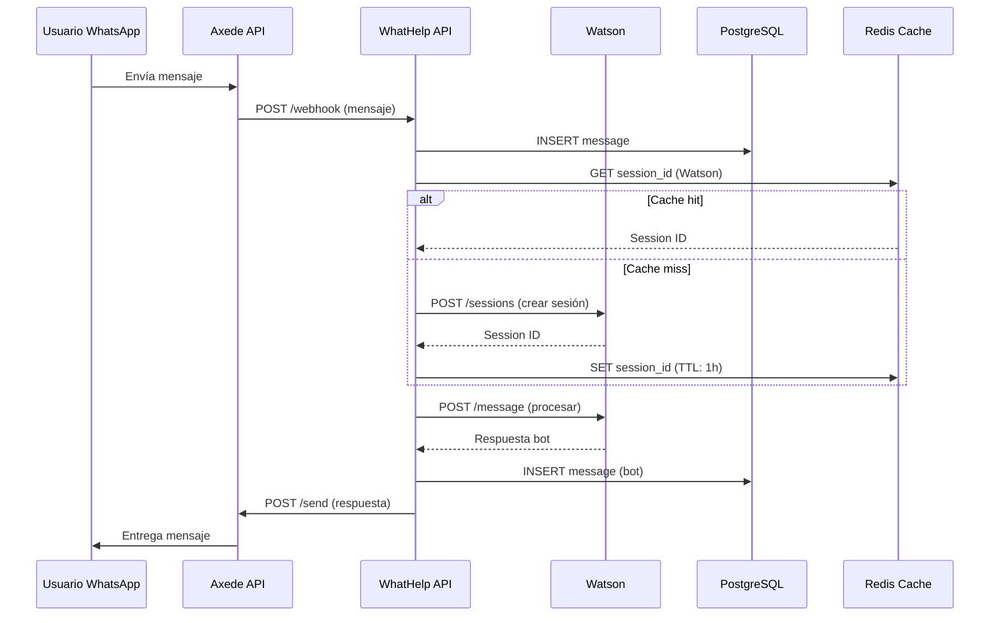
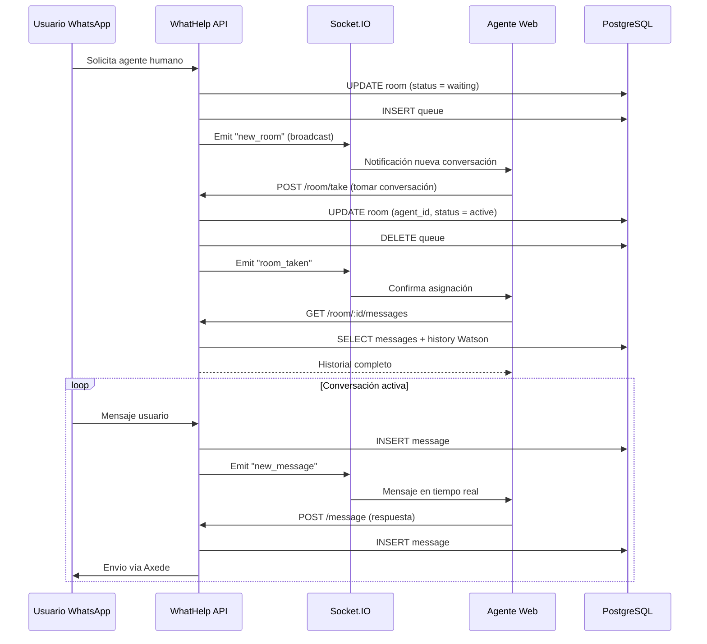
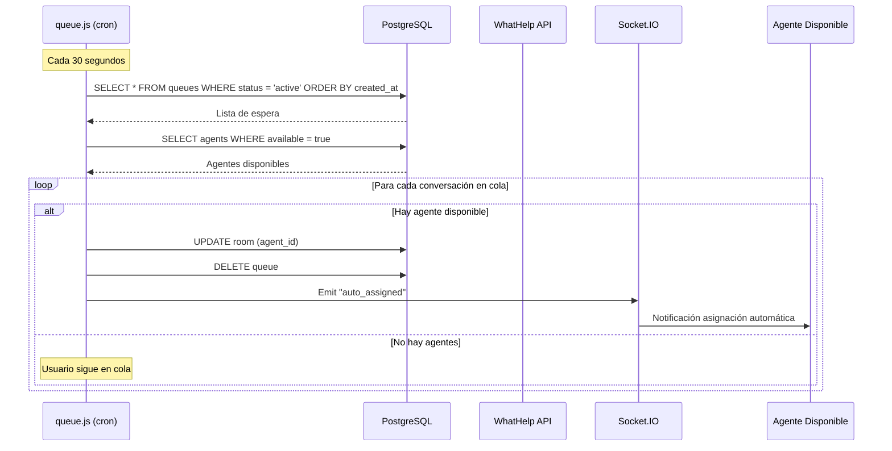
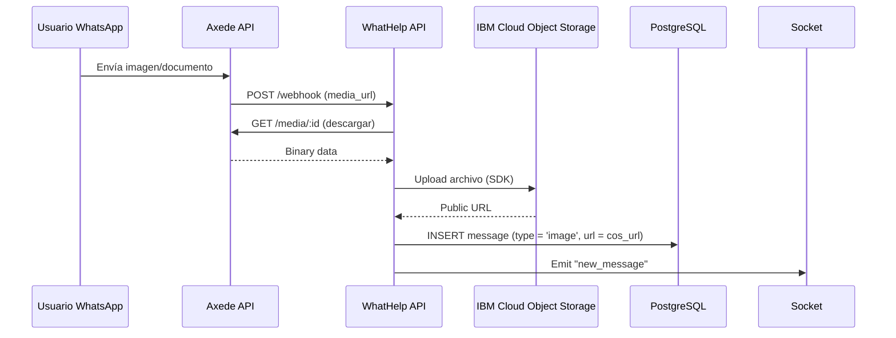

# 📦 Arquitectura - Nivel 2: Contenedores

## 🎯 Objetivo

Mostrar las aplicaciones y servicios que componen el sistema WhatHelp Chat API, incluyendo tecnologías, versiones y protocolos de comunicación.

---

## 📊 Diagrama de Contenedores (C4 - Nivel 2)



**Interpretación:**

El sistema sigue una arquitectura de **monolito modular** desplegado en IBM Cloud con un único proceso Node.js que integra múltiples responsabilidades:

1. **API REST** (Express 4.21.2) como punto de entrada principal para operaciones CRUD y coordinación de servicios

2. **WebSocket Server** (Socket.IO 4.5.2) para comunicación bidireccional en tiempo real con los agentes

3. **Cron Jobs** (node-cron 4.2.1) que ejecutan tareas programadas dentro del mismo proceso

La persistencia se basa en **PostgreSQL** como base de datos principal con pool de conexiones optimizado (max: 20, min: 5), mientras que **Redis Cache** está implementado únicamente en ambiente de desarrollo con planes de integración en Q1 2026. El cache tiene fallback automático: si Redis falla, el sistema continúa operando consultando directamente a PostgreSQL.

**Problema identificado:** Socket.IO no tiene Redis Adapter configurado, lo que impide escalar horizontalmente sin perder mensajes en tiempo real. Esto se resolverá en Q1 2026 junto con la división del backend en dos servicios: uno para API/WebSockets (múltiples instancias) y otro exclusivo para Cron Jobs (instancia única).

---

## 🖥️ Contenedores Detectados

### Frontend Web - Interfaz de Agentes

**Tecnología:** HTML/CSS/JavaScript (vanilla, sin framework detectado)

**Responsabilidad:**

- Interfaz de autenticación de agentes (login con reCAPTCHA)

- Dashboard de conversaciones activas

- Chat en tiempo real con usuarios finales

- Gestión de transferencias entre agentes

- Envío de encuestas y cierre de conversaciones

- Visualización de métricas y reportes

**Puerto:** 3000 (default en código)

**Escalabilidad:** Stateless - puede servirse desde CDN o múltiples servidores web

**Comunicación:**

- REST API con backend (JSON over HTTPS)

- WebSocket (Socket.IO) para eventos en tiempo real

- JWT para autenticación (almacenado en localStorage/cookies)

**Librerías detectadas:**

- Socket.IO Client 4.5.2

- Crypto-js 4.1.1 (encriptación client-side)

- Web Push API (notificaciones)

---

### API REST - Node.js Backend

**Tecnología:** Node.js 20 + Express 4.21.2

**Responsabilidad:**

- Gestión de autenticación (JWT + bcrypt)

- CRUD de entidades (rooms, messages, agents, users, queues)

- Orquestación de servicios externos (Watson, Axede, Teams, COS, Smax)

- Procesamiento de webhooks de WhatsApp

- Lógica de negocio (asignación de conversaciones, colas, encuestas)

- Validación de requests (express-validator 6.15.0)

- Seguridad (Helmet 6.2.0, CORS)

**Puerto:** 8080 (Dockerfile) / 3000 (fallback en código)

**Escalabilidad:** **Parcialmente stateless** 

- ⚠️ Problema: Socket.IO sin Redis Adapter impide múltiples instancias

- ✅ API REST pura es stateless y puede escalar

**Middlewares:**

- `valid-jwt.js` - Autenticación JWT

- `valid-agent.js` - Validación de agentes activos

- `validPermission.js` - RBAC (admin, level_two, regular)

- `valid-recaptchar.js` - Google reCAPTCHA v2

- `valid-files.js` - Validación de archivos adjuntos

- `valid-request.js` - Validación de schemas de request

- `security.js` - Helmet + CSP

- `errors.js` - Manejo centralizado de errores

**Dependencias principales:**
```json
{
  "express": "4.21.2",
  "socket.io": "4.5.2",
  "pg": "8.5.1",
  "redis": "4.6.0",
  "jsonwebtoken": "9.0.2",
  "bcryptjs": "3.0.2",
  "helmet": "6.2.0",
  "express-validator": "6.15.0",
  "ibm-watson": "10.0.0",
  "ibm-cos-sdk": "1.14.1",
  "axios": "0.26.1",
  "node-cron": "4.2.1"
}
```

---

### WebSocket Server - Socket.IO

**Tecnología:** Socket.IO 4.5.2 (sin Redis Adapter)

**Responsabilidad:**

- Comunicación bidireccional en tiempo real con agentes

- Notificaciones push de nuevos mensajes

- Eventos de estado (agente conectado/desconectado)

- Sincronización de estado de conversaciones

- Broadcast de alertas masivas

**Puerto:** Mismo puerto que API (compartido con Express)

**Escalabilidad:** ⚠️ **NO escalable horizontalmente** 

- Sin Redis Adapter, cada instancia tiene sus propias conexiones

- Al escalar, los agentes se conectan a diferentes instancias y pierden eventos

**Configuración:**
```javascript
pingInterval: 30000,  // 30 segundos
pingTimeout: 30000,   // 30 segundos
```

**Eventos detectados en código:**

- `connection` - Cliente conectado

- `disconnect` - Cliente desconectado

- `message_agent` - Mensaje de agente

- `typing` - Agente escribiendo

- `read_message` - Mensaje leído

- `transfer_room` - Transferencia de conversación

- `close_room` - Cierre de conversación

**Plan de mejora:** Implementar Redis Adapter en Q1 2026 para permitir escalado horizontal

---

### Cron Jobs - Tareas Programadas

**Tecnología:** node-cron 4.2.1

**Responsabilidad:**

- **queue.js**: Asignación automática de conversaciones en cola (cada 30s)

- **rooms.js**: Cierre automático de salas, activación de asistente, envío de encuestas (horarios específicos)

- **room_files.js**: Limpieza de archivos temporales (23:30 diario)

- **report.js**: Generación de reportes de métricas (23:45 diario)

**Escalabilidad:** ❌ **NO escalable** 

- Problema de race condition al tener múltiples instancias

- Tabla `general_configurations` usa flags (IN_PROGRESS/FINALIZED) pero no es 100% confiable

**Plan de mejora:** 

- Q1 2026: Dividir backend en 2 servicios
  - Servicio 1: API + WebSockets (múltiples instancias con Redis Adapter)
  - Servicio 2: Cron Jobs (instancia única)

- Futuro: Migrar a Kafka con IBM (fase 2)

**Tareas programadas:**

| Tarea | Frecuencia | Archivo | Descripción |
|-------|-----------|---------|-------------|
| Gestión de Cola | Cada 30s | `queue.js` | Asigna conversaciones en espera a agentes disponibles |
| Cierre Automático | Configurable | `rooms.js` | Cierra salas inactivas después de X minutos |
| Activar Asistente | Configurable | `rooms.js` | Transfiere a Watson si usuario no responde |
| Envío Encuestas | Configurable | `rooms.js` | Envía encuestas de satisfacción post-cierre |
| Limpieza Archivos | 23:30 diario | `room_files.js` | Elimina archivos temporales antiguos |
| Reportes | 23:45 diario | `report.js` | Genera reportes consolidados de métricas |

---

### PostgreSQL - Base de Datos Principal

**Tecnología:** PostgreSQL (driver pg v8.5.1+)

**Responsabilidad:**

- Almacenamiento de todas las entidades del sistema

- Gestión transaccional (ACID)

- Historial completo de conversaciones

- Métricas y reportes

**Puerto:** 5432 (estándar)

**Escalabilidad:** Stateful - requiere estrategia de replicación/backup

**Configuración del Pool:**
```javascript
{
  max: 20,           // Máximo 20 conexiones simultáneas
  min: 5,            // Mínimo 5 conexiones activas
  idleTimeoutMillis: 30000,  // 30s timeout
  connectionTimeoutMillis: 2000  // 2s timeout
}
```

**Características:**

- ✅ Retry automático (3 intentos, 3s delay)

- ✅ Monitoring de eventos (connect, error, remove)

- ✅ 8 índices estratégicos aplicados (mejora 50-150ms)

**Tablas principales (36 detectadas):**

| Categoría | Tablas | Propósito |
|-----------|--------|-----------|
| Chat | `rooms`, `messages`, `pmessages`, `room_logs` | Conversaciones y mensajes |
| Usuarios | `agents`, `users`, `teams`, `areas` | Gestión de usuarios |
| IA/Bot | `watson_session_ids`, `intentions` | Sesiones Watson |
| Cola | `queues` | Cola de espera |
| Encuestas | `surveys`, `general_surveys` | Satisfacción |
| Alertas | `alerts`, `mass_alerts`, `notifications` | Notificaciones |
| Reportes | `reports`, `metrics` | Analytics |
| Config | `closure_reasons`, `general_configurations` | Configuración |
| Legacy | `membership`, `ubicaciones_ada` | Tablas heredadas (uso incierto) |

**Índices aplicados:**

- `rooms`: `idx_rooms_active_agent`, `idx_rooms_status`, `idx_rooms_created`

- `messages`: `idx_messages_room`, `idx_messages_created`

- `queues`: `idx_queues_active`, `idx_queues_created`

- `agents`: `idx_agents_email`, `idx_agents_active`

- `room_logs`: `idx_room_logs_room`

- `users`: `idx_users_identification`

**Ubicación:** IBM Cloud (mismo proveedor que la aplicación - respuesta del formulario)

**Retención de datos:** No especificado en respuestas

---

### Redis Cache - Caché en Memoria

**Tecnología:** Redis 4.6.0 (solo en desarrollo)

**Responsabilidad:**

- Cache de sesiones Watson (TTL: 1h)

- Cache de usuarios (TTL: 15min)

- Cache de salas activas (TTL: 5min)

- Reducción de queries a PostgreSQL (15-35% mejora)

**Puerto:** 6379 (estándar)

**Escalabilidad:** Stateful

**Estado actual:** 

- ✅ Implementado en **desarrollo**

- ❌ **NO en producción aún**

- 📅 Plan: Integración en Q1 2026

**Configuración:**
```javascript
{
  socket: {
    reconnectStrategy: (retries) => Math.min(retries * 50, 500)
  }
}
```

**Características:**

- ✅ Fallback automático: si falla, consulta PostgreSQL

- ✅ No rompe la aplicación si no está disponible

- ✅ Mejora de performance: 80-200ms (15-35% según CACHE_IMPLEMENTATION.md)

**TTLs configurados:**

| Tipo de Dato | TTL | Justificación |
|--------------|-----|---------------|
| Watson Sessions | 1 hora | Sesiones estables durante conversación |
| Usuarios | 15 minutos | Cambios poco frecuentes |
| Salas Activas | 5 minutos | Datos muy dinámicos |

**Plan futuro:** Redis con Sentinel o ElastiCache para alta disponibilidad

---

## 🔗 Integraciones Externas

### IBM Watson Assistant

**Propósito:** Chatbot de primera línea que captura información inicial y resuelve consultas frecuentes.

**Tecnología:** IBM Watson SDK v10.0.0 (REST API wrapper)

**Protocolo:** REST/JSON sobre HTTPS

**Autenticación:** API Key de IBM Cloud

**Endpoints usados:**

- `POST /v2/assistants/{assistant_id}/sessions` - Crear sesión

- `POST /v2/assistants/{assistant_id}/sessions/{session_id}/message` - Enviar mensaje

**Datos en cache:** Session IDs (1h TTL en Redis)

**Failover:** Try-catch básico (no circuit breaker)

---

### Axede WhatsApp API

**Propósito:** Envío y recepción de mensajes WhatsApp Business.

**Tecnología:** Axios 0.26.1 (cliente HTTP)

**Protocolo:** REST API + Webhooks

**Endpoints:**

- Envío de mensajes de texto

- Envío de mensajes multimedia (imágenes, documentos, audio)

- Webhook para recepción de mensajes

- Webhook para estados de entrega

**Alternativa evaluada:** Twilio (según respuesta del formulario)

---

### Microsoft Teams

**Propósito:** Notificaciones internas y coordinación entre agentes.

**Tecnología:** REST API

**Protocolo:** HTTPS/JSON

**Uso:** Envío de notificaciones de conversaciones urgentes o coordinación.

---

### IBM Cloud Object Storage (COS)

**Propósito:** Almacenamiento de archivos adjuntos.

**Tecnología:** IBM COS SDK v1.14.1 (S3-compatible)

**Protocolo:** SDK propietario (REST bajo el capó)

**Operaciones:**

- Upload de archivos (imágenes, PDFs, documentos)

- Download de archivos

- Generación de URLs firmadas (presigned URLs)

**Razón de elección:** Aplicación nativa de IBM Cloud (respuesta del formulario)

---

### Smax Ticketing

**Propósito:** Creación/actualización de tickets de soporte formal.

**Tecnología:** REST API (detalles no especificados)

**Protocolo:** REST/JSON (asumido)

**Integración:** Activa según respuesta del formulario

**Detalles técnicos:** No especificados en código ni respuestas

---

## 🔄 Flujos de Comunicación

### Flujo 1: Recepción de Mensaje WhatsApp



**Descripción:**

1. Usuario envía mensaje por WhatsApp

2. Axede recibe y envía webhook a WhatHelp

3. Sistema guarda mensaje en PostgreSQL

4. Busca session_id de Watson en cache (Redis)

5. Si no existe en cache, crea sesión nueva en Watson y cachea

6. Envía mensaje a Watson para procesamiento NLU

7. Watson retorna respuesta automática

8. Sistema guarda respuesta del bot

9. Envía respuesta a usuario vía Axede

**Optimización aplicada:** Cache de session IDs reduce latencia 80-200ms (OPTIMIZACIONES_ADICIONALES.md)

---

### Flujo 2: Escalamiento a Agente Humano



**Descripción:**

1. Usuario solicita o Watson escala a humano

2. Sistema marca sala como "waiting" y crea registro en cola

3. Emite evento Socket.IO a todos los agentes conectados

4. Agente acepta la conversación desde su interfaz

5. Sistema actualiza sala con agent_id y elimina de cola

6. Agente recibe historial completo (mensajes + contexto Watson)

7. Inicia conversación bidireccional en tiempo real vía Socket.IO

---

### Flujo 3: Gestión Automática de Cola (Cron Job)



**Descripción:**

1. Cron job ejecuta cada 30 segundos

2. Consulta conversaciones en cola ordenadas por antigüedad

3. Consulta agentes disponibles

4. Asigna automáticamente por FIFO (First In, First Out)

5. Notifica a agente vía Socket.IO

**Problema:** Con múltiples instancias, hay race condition. Se resolverá moviendo cron jobs a servicio separado (Q1 2026).

---

### Flujo 4: Almacenamiento de Archivos



**Descripción:**

1. Usuario envía archivo por WhatsApp

2. Axede envía webhook con media_url

3. WhatHelp descarga archivo de Axede

4. Sube archivo a IBM COS

5. Guarda URL pública en PostgreSQL

6. Notifica a agente con URL del archivo

---

## 🏗️ Infraestructura y Deployment

### Ambiente de Desarrollo

**Contenedores Docker (docker-compose.yml esperado):**

- Node.js API (puerto 8080 → 3000)

- PostgreSQL (puerto 5432)

- Redis (puerto 6379) ✅ Activo en dev

**Hot Reload:** Habilitado (nodemon detectado en package.json)

---

### Ambiente de Producción

**Proveedor:** IBM Cloud (respuesta del formulario)

**Instancias actuales:**

- **1 instancia** de Node.js API (respuesta del formulario)

- PostgreSQL en IBM Cloud (mismo proveedor)

- Redis **NO desplegado aún** (Q1 2026)

**Load Balancer:** Ninguno actualmente (respuesta del formulario: `load_balancer: none`)

**Orquestación:** 

- PM2 (ecosystem.config.js) - **En desuso, se puede eliminar** (respuesta del formulario)

- Dockerfile con Node.js 20

**Plan de Escalado Horizontal:**

- Q1 2026: Implementar Redis Adapter para Socket.IO

- Q1 2026: Dividir backend en 2 servicios:
  1. API + WebSockets (múltiples instancias)
  2. Cron Jobs (instancia única)

- Futuro: Migración a Kafka con IBM (fase 2)

---

## 📊 Monitoreo y Observabilidad

**Herramienta de monitoreo:** Ninguna automatizada actualmente (respuesta del formulario: `monitoring_tool: none`)

**Logs centralizados:** No (respuesta del formulario: `logging_centralized: no`)

**Logs locales:**

- Console.log en desarrollo

- PM2 logs (si está activo)

- Logs de aplicación (no estandarizados)

**Métricas del sistema:**

- Endpoint `/instance` - Info de instancia (INSTANCE_ID, INSTANCE_NAME)

- Headers custom: `X-Instance-ID`, `X-Instance-Name`

- Tabla `metrics` en PostgreSQL (métricas de negocio)

**Recomendación:** Implementar ELK Stack, Prometheus + Grafana, o IBM Cloud Monitoring para visibilidad en producción.

---

## 🔒 Seguridad

### Autenticación y Autorización

**Método:** JWT (jsonwebtoken 9.0.2)

**Flujo:**

1. Login con email/password

2. Verificación reCAPTCHA v2 (Google)

3. Hash bcrypt para passwords (bcryptjs 3.0.2)

4. Generación de token JWT

5. Middleware `valid-jwt.js` valida token en cada request protegido

6. RBAC con `validPermission.js` (roles: admin, level_two, regular)

---

### Seguridad HTTP

**Helmet 6.2.0:**

- Content Security Policy (CSP)

- X-Frame-Options: DENY

- X-Content-Type-Options: nosniff

- Strict-Transport-Security (HSTS)

- X-XSS-Protection

**CORS:**

- Configurado (cors package)

- Origins permitidos configurables

---

### Validación de Inputs

**Express-validator 6.15.0:**

- Validación de schemas en requests

- Sanitización de inputs

- Prevención de SQL injection

- Validación de archivos adjuntos

---

### Compliance

**Normativas:** No especificado en respuesta del formulario (campo `compliance_requirements` vacío)

**Retención de datos:** No especificado en respuesta del formulario (campo `data_retention` vacío)

**Manejo de PII:** No especificado en respuesta del formulario (campo `pii_handling` vacío)

---

## 📈 Métricas de Performance

### Performance Actual (con optimizaciones aplicadas)

**Cache Redis (solo dev):**

- Mejora: 80-200ms (15-35%) según CACHE_IMPLEMENTATION.md

- Watson session IDs: Hit rate alto esperado

**Índices de base de datos:**

- Mejora: 50-150ms en queries principales

- 8 índices estratégicos aplicados

**Paralelización de operaciones:**

- Mejora: 30-50ms (Watson + ExternalRoom en paralelo)

---

### Límites y Capacidad

**Pool PostgreSQL:**

- Max: 20 conexiones simultáneas

- Min: 5 conexiones activas

- Timeout: 30s idle, 2s connection

**Socket.IO:**

- Ping interval: 30s

- Ping timeout: 30s

**Volumen actual:**

- 1-1,000 mensajes/día

- 1 instancia suficiente para el volumen actual

---

## 🚀 Roadmap Técnico

### Q1 2026

- ✅ Implementar Redis Cache en producción

- ✅ Implementar Redis Adapter para Socket.IO

- ✅ Dividir backend en 2 servicios (API/WebSockets vs Cron Jobs)

- ✅ Eliminar PM2 (según respuesta del formulario)

### Futuro (Fase 2)

- 🔄 Migración a Kafka con IBM

- 🔄 Refactorizar Room.js (750 líneas, según respuesta: `room_refactor: yes`)

- 🔄 Evaluar migración de Watson a otra plataforma

---
