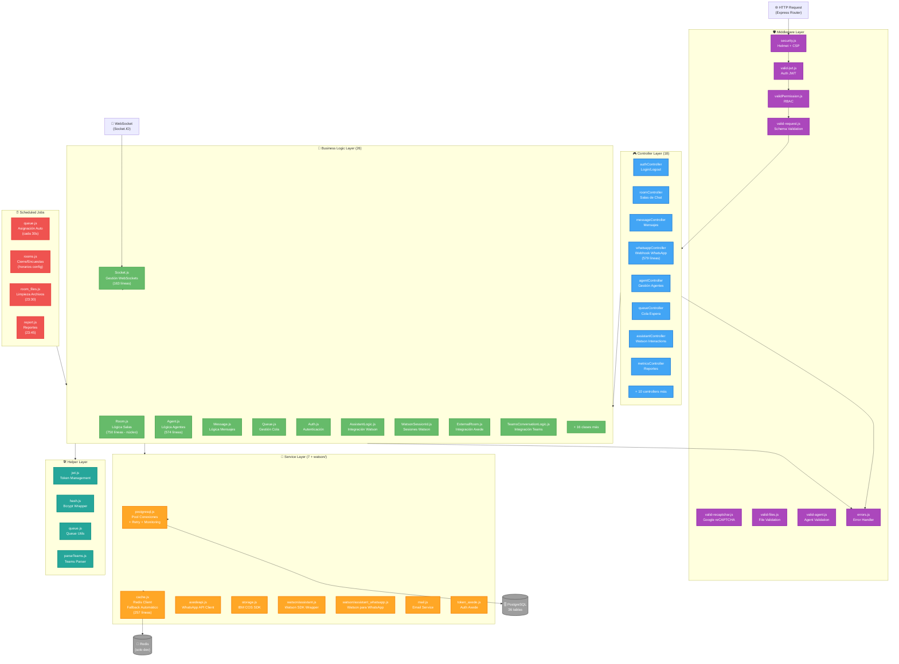
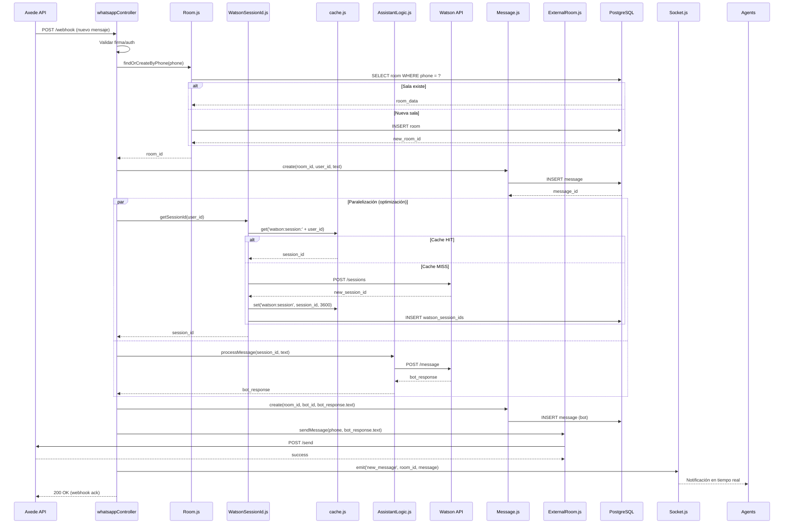
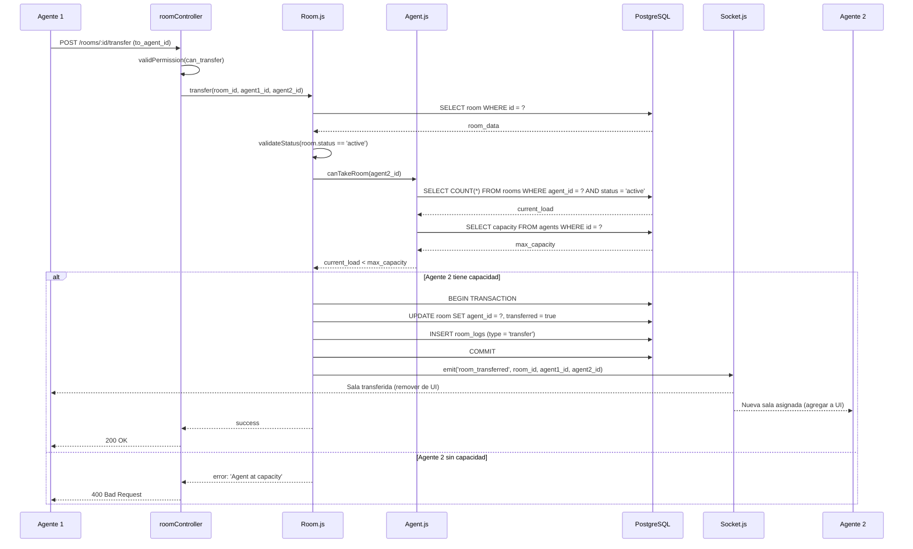
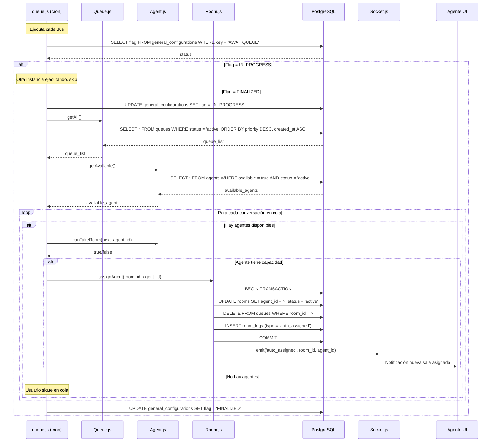

# 🧩 Arquitectura - Nivel 3: Componentes

## 🎯 Objetivo

Detallar la estructura interna del componente más complejo del sistema: **Backend API (Node.js + Express)**, mostrando la organización de responsabilidades, flujo de datos y patrones arquitectónicos aplicados.

---

## 📊 Diagrama de Componentes (C4 - Nivel 3)



**Interpretación:**

El backend sigue un **patrón arquitectónico en capas (Layered Architecture)** con clara separación de responsabilidades, evolucionado desde un MVC tradicional hacia un modelo de 3 capas + servicios:

1. **Middleware Layer**: Primera línea de defensa, maneja concerns transversales (seguridad, autenticación, validación)

2. **Controller Layer**: Punto de entrada HTTP/WebSocket, orquestación mínima, delegación a lógica de negocio

3. **Business Logic Layer**: Núcleo del sistema, contiene reglas de negocio, validaciones complejas y coordinación de servicios

4. **Service Layer**: Abstracciones de integraciones externas y recursos compartidos (DB, cache, APIs)

El componente más complejo es **Room.js (750 líneas)**, que gestiona el ciclo de vida completo de conversaciones: creación, asignación, transferencia, cierre, y coordinación con Watson/Axede. Según respuestas del formulario, está identificado para refactorización (`room_refactor: yes`).

---

## 🏗️ Patrón Arquitectónico

**Patrón detectado:** **Layered Architecture (Arquitectura en Capas)** con elementos de **MVC** y **Repository Pattern**

**Características:**

- ✅ Separación clara de responsabilidades

- ✅ Dependencias unidireccionales (top-down)

- ✅ Capa de servicios como abstracción de recursos externos

- ✅ Lógica de negocio centralizada (no distribuida entre controllers)

- ⚠️ Algunos controllers muy grandes (whatsappController: 579 líneas)

- ⚠️ Algunas clases Logic muy grandes (Room: 750 líneas, Agent: 574 líneas)

**Justificación:** 
Aplicación heredada con esta arquitectura (respuesta del formulario: `why_monolith: "Aplicación heredada con esta arquitectura"`). El patrón funciona bien para el volumen actual (1-1,000 mensajes/día) y equipo pequeño, pero presenta deuda técnica en clases grandes que requieren refactorización.

---

## 📦 Componentes Principales

### 🛡️ Middleware Layer

Middlewares ejecutados en orden (definido en `app/routes/api.js`) que interceptan requests antes de llegar a controllers.

---

#### security.js
**Responsabilidad:** Configurar headers de seguridad HTTP usando Helmet.

**Ubicación:** `app/middlewares/security.js`

**Dependencias:** helmet@6.2.0

**Características:**

- Content Security Policy (CSP)

- X-Frame-Options: DENY

- X-Content-Type-Options: nosniff

- Strict-Transport-Security (HSTS)

- X-XSS-Protection

**Aplicación:** Global en todas las rutas

---

#### valid-jwt.js
**Responsabilidad:** Validar token JWT en header `Authorization: Bearer <token>`.

**Ubicación:** `app/middlewares/valid-jwt.js`

**Dependencias:** 

- jsonwebtoken@9.0.2

- `app/helpers/jwt.js`

**Lógica:**

1. Extrae token del header

2. Verifica firma y expiración

3. Decodifica payload (user_id, role, etc.)

4. Adjunta datos de usuario a `req.user`

5. Si falla, retorna 401 Unauthorized

**Aplicación:** Rutas protegidas (mayoría del API excepto `/auth/login`)

---

#### validPermission.js
**Responsabilidad:** Implementar RBAC (Role-Based Access Control).

**Ubicación:** `app/middlewares/validPermission.js`

**Roles detectados:**

- `admin`: Acceso total

- `level_two`: Supervisor (permisos elevados)

- `regular`: Agente básico

**Lógica:**

1. Lee `req.user.role` (seteado por valid-jwt)

2. Compara con roles permitidos para la ruta

3. Si no tiene permiso, retorna 403 Forbidden

**Ejemplo de uso:**
```javascript
router.post('/agents', validJWT, validPermission(['admin']), agentController.create)
```

---

#### valid-request.js
**Responsabilidad:** Validar schemas de request body usando express-validator.

**Ubicación:** `app/middlewares/valid-request.js`

**Dependencias:** express-validator@6.15.0

**Validaciones:**

- Tipos de datos (string, number, boolean, email)

- Rangos numéricos

- Formatos (email, URL, UUID)

- Campos requeridos vs opcionales

- Sanitización (trim, escape)

---

#### valid-recaptchar.js
**Responsabilidad:** Verificar token de Google reCAPTCHA v2 en login.

**Ubicación:** `app/middlewares/valid-recaptchar.js`

**Dependencias:** axios (para llamar a Google API)

**Lógica:**

1. Extrae token reCAPTCHA del body

2. Envía a Google API: `POST https://www.google.com/recaptcha/api/siteverify`

3. Verifica respuesta `success: true`

4. Si falla, retorna 400 Bad Request

**Aplicación:** Solo en `/auth/login` (prevención de bots)

---

#### valid-files.js
**Responsabilidad:** Validar archivos adjuntos (tamaño, tipo MIME).

**Ubicación:** `app/middlewares/valid-files.js`

**Validaciones:**

- Tamaño máximo permitido

- Extensiones permitidas (jpg, png, pdf, docx, etc.)

- Tipo MIME válido

- Prevención de path traversal

---

#### valid-agent.js
**Responsabilidad:** Verificar que el agente existe y está activo.

**Ubicación:** `app/middlewares/valid-agent.js`

**Lógica:**

1. Lee `agent_id` de params o body

2. Consulta tabla `agents`

3. Verifica `status = 'active'`

4. Si no existe o inactivo, retorna 404

---

#### errors.js
**Responsabilidad:** Manejo centralizado de errores (error handler de Express).

**Ubicación:** `app/middlewares/errors.js`

**Lógica:**

- Captura errores de toda la aplicación

- Formatea respuesta de error consistente

- Log de errores (console.error)

- Diferencia entre errores operacionales y programáticos

- Oculta detalles internos en producción

**Formato de respuesta:**
```json
{
  "error": true,
  "message": "Descripción del error",
  "code": "ERROR_CODE",
  "details": {} // Solo en desarrollo
}
```

---

### 🎮 Controller Layer (18 Controllers)

Controllers son handlers de rutas HTTP/WebSocket que orquestan flujos pero **delegan lógica de negocio** a la Logic Layer.

---

#### authController.js
**Responsabilidad:** Autenticación de usuarios (agentes, usuarios finales, admins).

**Ubicación:** `app/controllers/authController.js`

**Endpoints:**

- `POST /auth/login` - Login de agentes

- `POST /auth/login/user` - Login de usuarios finales

- `POST /auth/login/admin` - Login de administradores

- `POST /auth/logout` - Cerrar sesión

- `POST /auth/refresh` - Renovar token

**Flujo típico:**

1. Recibe credenciales (email, password)

2. Verifica reCAPTCHA (middleware)

3. Delega validación a `Auth.js` (Logic Layer)

4. Si válido, genera JWT usando `helpers/jwt.js`

5. Retorna token + datos de usuario

**Dependencias:**

- `app/logic/Auth.js`

- `app/helpers/jwt.js`

- `app/helpers/hash.js`

---

#### roomController.js
**Responsabilidad:** Gestión de salas de chat (crear, listar, transferir, cerrar).

**Ubicación:** `app/controllers/roomController.js`

**Endpoints principales:**

- `GET /rooms` - Listar salas (con filtros)

- `GET /rooms/:id` - Detalle de sala

- `POST /rooms/:id/take` - Agente toma conversación

- `POST /rooms/:id/transfer` - Transferir a otro agente

- `POST /rooms/:id/close` - Cerrar conversación

- `GET /rooms/:id/messages` - Historial de mensajes

**Delegación:** 

- Toda la lógica compleja está en `app/logic/Room.js` (750 líneas)

---

#### messageController.js
**Responsabilidad:** Envío y recepción de mensajes.

**Ubicación:** `app/controllers/messageController.js`

**Endpoints:**

- `POST /messages` - Enviar mensaje (agente → usuario)

- `GET /messages/:room_id` - Historial de mensajes

- `PUT /messages/:id/read` - Marcar como leído

**Flujo de envío:**

1. Recibe mensaje de agente

2. Valida permisos (agente pertenece a la sala)

3. Delega a `Message.js` → `ExternalRoom.js` → `axedeapi.js`

4. Guarda en DB

5. Emite evento Socket.IO a otros agentes

---

#### whatsappController.js (579 líneas)
**Responsabilidad:** Procesar webhooks de WhatsApp (Axede API).

**Ubicación:** `app/controllers/whatsappController.js`

**Endpoints:**

- `POST /webhook/whatsapp` - Recibir eventos de WhatsApp

- `GET /webhook/whatsapp` - Verificación de webhook (Axede handshake)

**Eventos procesados:**

- Mensaje nuevo de usuario

- Estado de entrega (sent, delivered, read)

- Mensaje multimedia (imagen, audio, documento)

- Errores de envío

**Flujo complejo:**

1. Recibe webhook de Axede

2. Valida firma/autenticación

3. Parsea tipo de evento

4. Busca/crea sala en DB

5. Busca sesión Watson en cache (Redis)

6. Envía mensaje a Watson (si bot está activo)

7. Guarda respuesta Watson en DB

8. Envía respuesta a usuario vía Axede

9. Notifica a agentes vía Socket.IO (si humano)

**Problema identificado:** 579 líneas, muy complejo, candidato a refactorización.

**Optimización aplicada:** Paralelización de Watson + ExternalRoom (30-50ms ganados, según OPTIMIZACIONES_ADICIONALES.md)

---

#### agentController.js
**Responsabilidad:** CRUD de agentes y gestión de disponibilidad.

**Ubicación:** `app/controllers/agentController.js`

**Endpoints:**

- `GET /agents` - Listar agentes

- `POST /agents` - Crear agente (solo admin)

- `PUT /agents/:id` - Actualizar agente

- `DELETE /agents/:id` - Desactivar agente

- `PUT /agents/:id/availability` - Cambiar disponibilidad (online/offline)

---

#### queueController.js
**Responsabilidad:** Gestión de cola de espera.

**Ubicación:** `app/controllers/queueController.js`

**Endpoints:**

- `GET /queue` - Ver estado de cola

- `POST /queue/:room_id/priority` - Cambiar prioridad en cola

- `DELETE /queue/:room_id` - Remover de cola (cancelar)

---

#### assistantController.js
**Responsabilidad:** Interacciones manuales con Watson (testing, reentrenamiento).

**Ubicación:** `app/controllers/assistantController.js`

**Endpoints:**

- `POST /assistant/message` - Enviar mensaje de prueba a Watson

- `POST /assistant/session` - Crear sesión Watson manual

- `DELETE /assistant/session/:id` - Eliminar sesión

---

#### metricsController.js
**Responsabilidad:** Reportes y analytics.

**Ubicación:** `app/controllers/metricsController.js`

**Endpoints:**

- `GET /metrics/dashboard` - Métricas generales

- `GET /metrics/agents` - Performance por agente

- `GET /metrics/satisfaction` - CSAT (encuestas)

- `GET /metrics/response-time` - Tiempos de respuesta

- `GET /metrics/export` - Exportar a Excel/CSV

---

#### Otros Controllers (10 más)

- **teamsController.js**: Integración Microsoft Teams

- **surveyController.js**: Encuestas post-atención

- **generalSurveyController.js**: Encuestas generales

- **alertController.js**: Alertas individuales

- **massAlertController.js**: Alertas masivas (broadcast)

- **notificationController.js**: Web push notifications

- **userController.js**: CRUD usuarios finales

- **areaController.js**: Gestión de áreas/departamentos

- **closureReasonsController.js**: Motivos de cierre

- **manualController.js**: Operaciones manuales/admin

- **pmessageController.js**: Mensajes de protocolo (templates)

---

### 🧠 Business Logic Layer (26 Clases)

Núcleo del sistema, contiene reglas de negocio, validaciones complejas y coordinación entre servicios.

---

#### Room.js (750 líneas) - ⚠️ Núcleo del Sistema

**Responsabilidad:** Gestión completa del ciclo de vida de conversaciones.

**Ubicación:** `app/logic/Room.js`

**Dependencias:**

- `app/services/postgresql.js`

- `app/services/cache.js`

- `app/logic/Message.js`

- `app/logic/Queue.js`

- `app/logic/Agent.js`

- `app/logic/AssistantLogic.js`

- `app/logic/Socket.js`

**Métodos principales (inferidos):**

- `create(user, channel)` - Crear nueva sala

- `assignAgent(room_id, agent_id)` - Asignar agente

- `transfer(room_id, from_agent, to_agent, area)` - Transferir sala

- `close(room_id, reason, survey)` - Cerrar conversación

- `sendToWatson(room_id, message)` - Enviar a bot

- `escalateToHuman(room_id)` - Escalar a agente

- `addToQueue(room_id, priority)` - Agregar a cola

- `removeFromQueue(room_id)` - Remover de cola

- `getActive()` - Salas activas

- `getByAgent(agent_id)` - Salas de un agente

- `getHistory(room_id)` - Historial completo

**Problema identificado:** 750 líneas, complejidad ciclomática alta, dificulta mantenimiento.

**Plan de refactorización (según respuesta del formulario: `room_refactor: yes`):**

- Dividir en submódulos: RoomCreation, RoomAssignment, RoomTransfer, RoomClosure

- Extraer lógica de Watson a AssistantLogic

- Aplicar patrón State (estados de sala: waiting, active, closed, etc.)

---

#### Agent.js (574 líneas)

**Responsabilidad:** Lógica de agentes (disponibilidad, capacity, performance).

**Ubicación:** `app/logic/Agent.js`

**Dependencias:**

- `app/services/postgresql.js`

- `app/services/cache.js`

**Métodos principales:**

- `getAvailable()` - Agentes disponibles

- `setAvailability(agent_id, status)` - Online/Offline

- `getCapacity(agent_id)` - Salas simultáneas permitidas

- `getCurrentLoad(agent_id)` - Salas activas actuales

- `canTakeRoom(agent_id)` - Validar si puede tomar más salas

- `getByArea(area_id)` - Agentes por área/departamento

- `getMetrics(agent_id, date_range)` - Performance del agente

**Cache aplicado:**

- Agentes disponibles (TTL: 15min)

- Reducción de queries repetitivas

---

#### Message.js

**Responsabilidad:** Lógica de mensajes (crear, enviar, validar).

**Ubicación:** `app/logic/Message.js`

**Dependencias:**

- `app/services/postgresql.js`

- `app/logic/ExternalRoom.js` (envío vía Axede)

- `app/services/storage.js` (archivos adjuntos)

**Métodos:**

- `create(room_id, from, to, text, type)` - Crear mensaje

- `send(message_id)` - Enviar vía canal externo

- `markAsRead(message_id, user_id)` - Marcar leído

- `getHistory(room_id, limit, offset)` - Historial paginado

- `attachFile(message_id, file)` - Adjuntar archivo

---

#### Queue.js

**Responsabilidad:** Gestión de cola de espera.

**Ubicación:** `app/logic/Queue.js`

**Dependencias:**

- `app/services/postgresql.js`

**Métodos:**

- `add(room_id, priority)` - Agregar a cola

- `remove(room_id)` - Remover de cola

- `getNext(agent_id)` - Siguiente conversación a asignar

- `getPosition(room_id)` - Posición en cola

- `updatePriority(room_id, priority)` - Cambiar prioridad

- `getAll()` - Cola completa (para cron job)

**Lógica de priorización:**

- FIFO (First In, First Out) por defecto

- Priority override (VIP, urgente, etc.)

---

#### Auth.js

**Responsabilidad:** Validación de credenciales y autorización.

**Ubicación:** `app/logic/Auth.js`

**Dependencias:**

- `app/services/postgresql.js`

- `app/helpers/hash.js`

**Métodos:**

- `validateAgent(email, password)` - Login de agente

- `validateUser(identification, password)` - Login usuario final

- `validateAdmin(email, password)` - Login admin

- `checkPermission(user_id, resource, action)` - RBAC granular

---

#### AssistantLogic.js

**Responsabilidad:** Orquestación de Watson Assistant.

**Ubicación:** `app/logic/AssistantLogic.js`

**Dependencias:**

- `app/services/watson/assistant.js`

- `app/services/cache.js` (session IDs)

- `app/logic/WatsonSessionId.js`

**Métodos:**

- `processMessage(user_id, message)` - Procesar mensaje con Watson

- `getOrCreateSession(user_id)` - Gestión de sesiones (con cache)

- `detectIntent(message)` - Clasificar intención

- `shouldEscalate(watson_response)` - Decidir si escalar a humano

**Optimización:** Cache de session IDs (TTL: 1h, mejora 80-200ms según CACHE_IMPLEMENTATION.md)

---

#### Socket.js (163 líneas)

**Responsabilidad:** Gestión de eventos WebSocket (Socket.IO).

**Ubicación:** `app/logic/Socket.js`

**Dependencias:**

- Socket.IO server instance

**Eventos emitidos:**

- `new_room` - Nueva conversación disponible

- `room_taken` - Sala tomada por agente

- `new_message` - Nuevo mensaje en sala

- `room_transferred` - Sala transferida

- `room_closed` - Sala cerrada

- `agent_typing` - Agente escribiendo

- `user_typing` - Usuario escribiendo

**Eventos escuchados:**

- `join_room` - Agente se une a sala

- `leave_room` - Agente sale de sala

- `send_message` - Envío de mensaje

- `typing` - Notificación de escritura

**Problema identificado:** Sin Redis Adapter, eventos no se propagan entre instancias (se resolverá en Q1 2026)

---

#### WatsonSessionId.js

**Responsabilidad:** Gestión de sesiones Watson (tabla + cache).

**Ubicación:** `app/logic/WatsonSessionId.js`

**Dependencias:**

- `app/services/postgresql.js`

- `app/services/cache.js`

**Métodos:**

- `get(user_id)` - Obtener session_id (cache-first)

- `create(user_id, session_id)` - Crear nueva sesión

- `update(user_id, session_id)` - Actualizar sesión

- `delete(user_id)` - Eliminar sesión (timeout)

**Cache strategy:** Write-through (escribe en cache y DB simultáneamente)

---

#### ExternalRoom.js

**Responsabilidad:** Integración con Axede WhatsApp API.

**Ubicación:** `app/logic/ExternalRoom.js`

**Dependencias:**

- `app/services/axedeapi.js`

- `app/services/storage.js` (archivos)

**Métodos:**

- `sendMessage(phone, text)` - Enviar mensaje de texto

- `sendImage(phone, image_url)` - Enviar imagen

- `sendDocument(phone, document_url)` - Enviar documento

- `sendAudio(phone, audio_url)` - Enviar audio

- `getMediaUrl(media_id)` - Descargar media de Axede

---

#### TeamsConversationLogic.js

**Responsabilidad:** Integración con Microsoft Teams.

**Ubicación:** `app/logic/TeamsConversationLogic.js`

**Métodos:**

- `sendNotification(team_id, message)` - Enviar notificación

- `createConversation(participants)` - Crear conversación Teams

- `postMessage(conversation_id, text)` - Enviar mensaje

---

#### Otras Clases Logic (16 más)

- **Survey.js**: Lógica de encuestas post-atención

- **GeneralSurvey.js**: Encuestas generales del sistema

- **Alert.js**: Alertas individuales

- **MassAlert.js**: Alertas masivas (broadcast)

- **Notification.js**: Push notifications

- **User.js**: Lógica de usuarios finales

- **Area.js**: Gestión de áreas/departamentos

- **Teams.js**: Gestión de equipos de agentes

- **ClosureReason.js**: Motivos de cierre

- **Intention.js**: Intenciones Watson

- **Manual.js**: Operaciones manuales

- **ProtocolMessage.js**: Mensajes predefinidos (templates)

- **Metrics.js**: Cálculo de métricas

- **Report.js**: Generación de reportes

- **ErrorModel.js**: Manejo de errores de negocio

- **Roomwrong.js**: ¿Posible tabla legacy o errónea? (a investigar)

---

### 🔧 Service Layer

Abstracciones de recursos externos y compartidos, facilitan testing y cambio de proveedores.

---

#### postgresql.js
**Responsabilidad:** Pool de conexiones PostgreSQL con retry y monitoring.

**Ubicación:** `app/services/postgresql.js`

**Dependencias:** pg@8.5.1

**Configuración:**
```javascript
{
  max: 20,
  min: 5,
  idleTimeoutMillis: 30000,
  connectionTimeoutMillis: 2000
}
```

**Características:**

- ✅ Retry automático (3 intentos, delay 3s)

- ✅ Monitoring de eventos (connect, error, remove, acquire, release)

- ✅ Graceful shutdown

- ✅ Connection pooling óptimo

**API:**
```javascript
const { rows } = await db.query('SELECT * FROM rooms WHERE id = $1', [room_id]);
```

---

#### cache.js (257 líneas)
**Responsabilidad:** Cliente Redis con fallback automático.

**Ubicación:** `app/services/cache.js`

**Dependencias:** redis@4.6.0

**Características:**

- ✅ Fallback a PostgreSQL si Redis falla

- ✅ No rompe la aplicación (resiliente)

- ✅ Retry automático de conexión

- ✅ Logs detallados de cache hit/miss

**API:**
```javascript
// Get con fallback
const value = await cache.get('key', async () => {
  // Fallback: consultar DB
  return await db.query('SELECT ...');
});

// Set con TTL
await cache.set('key', value, 3600); // 1 hora
```

**TTLs configurados:**

- Watson sessions: 3600s (1h)

- Usuarios: 900s (15min)

- Salas activas: 300s (5min)

**Estado:** Solo en desarrollo, producción en Q1 2026

---

#### axedeapi.js
**Responsabilidad:** Cliente HTTP para Axede WhatsApp API.

**Ubicación:** `app/services/axedeapi.js`

**Dependencias:** axios@0.26.1

**Métodos:**

- `sendTextMessage(phone, text)`

- `sendImageMessage(phone, image_url, caption)`

- `sendDocumentMessage(phone, document_url, filename)`

- `sendAudioMessage(phone, audio_url)`

- `getMedia(media_id)` - Descargar archivo

- `getMessageStatus(message_id)` - Estado de entrega

**Autenticación:** Token Bearer (gestionado por `token_axede.js`)

---

#### storage.js
**Responsabilidad:** Upload/download de archivos en IBM Cloud Object Storage.

**Ubicación:** `app/services/storage.js`

**Dependencias:** ibm-cos-sdk@1.14.1

**Métodos:**

- `uploadFile(file, key)` - Subir archivo

- `downloadFile(key)` - Descargar archivo

- `deleteFile(key)` - Eliminar archivo

- `getPublicUrl(key)` - URL pública

- `getSignedUrl(key, expiration)` - URL firmada temporal

**Configuración:**

- Bucket: Configurado en variables de entorno

- Region: IBM Cloud región

- Credentials: API Key de IBM Cloud

---

#### watson/assistant.js
**Responsabilidad:** Wrapper del SDK de Watson Assistant.

**Ubicación:** `app/services/watson/assistant.js`

**Dependencias:** ibm-watson@10.0.0

**Métodos:**

- `createSession()` - Crear sesión Watson

- `deleteSession(session_id)` - Eliminar sesión

- `sendMessage(session_id, text)` - Enviar mensaje

- `getIntents(session_id)` - Obtener intenciones detectadas

---

#### watson/assistant_whatsapp.js
**Responsabilidad:** Adaptador Watson específico para WhatsApp.

**Ubicación:** `app/services/watson/assistant_whatsapp.js`

**Lógica adicional:**

- Formateo de respuestas Watson para WhatsApp

- Manejo de botones/opciones → texto plano

- Conversión de rich content a mensajes simples

---

#### mail.js
**Responsabilidad:** Envío de emails (notificaciones, reportes).

**Ubicación:** `app/services/mail.js`

**Dependencias:** nodemailer (asumido, no confirmado en package.json visible)

**Métodos:**

- `sendEmail(to, subject, body)`

- `sendTemplate(to, template_name, data)`

---

#### token_axede.js
**Responsabilidad:** Gestión de token de autenticación de Axede API.

**Ubicación:** `app/services/token_axede.js`

**Lógica:**

- Obtener token OAuth

- Refrescar token expirado

- Cachear token en memoria

---

### 🛠️ Helper Layer

Utilidades compartidas sin lógica de negocio.

---

#### jwt.js
**Responsabilidad:** Generación y verificación de tokens JWT.

**Ubicación:** `app/helpers/jwt.js`

**Dependencias:** jsonwebtoken@9.0.2

**Métodos:**

- `generateToken(payload)` - Crear token

- `verifyToken(token)` - Validar token

- `decodeToken(token)` - Decodificar sin validar

---

#### hash.js
**Responsabilidad:** Hashing de passwords con bcrypt.

**Ubicación:** `app/helpers/hash.js`

**Dependencias:** bcryptjs@3.0.2

**Métodos:**

- `hashPassword(plain_password)` - Generar hash

- `comparePassword(plain_password, hash)` - Validar password

---

#### queue.js (helper)
**Responsabilidad:** Utilidades para manejo de cola.

**Ubicación:** `app/helpers/queue.js`

**Métodos:**

- Sorting algorithms

- Priority calculators

- Queue position utils

---

#### parseTeams.js
**Responsabilidad:** Parser de datos de Microsoft Teams.

**Ubicación:** `app/helpers/parseTeams.js`

**Lógica:**

- Transformar payloads de Teams API

- Formateo de mensajes Teams

---

### ⏰ Scheduled Jobs (Cron)

Tareas programadas que ejecutan en background.

---

#### queue.js (cron)
**Responsabilidad:** Asignación automática de conversaciones en cola.

**Ubicación:** `app/cron/queue.js`

**Frecuencia:** Cada 30 segundos

**Lógica:**

1. Consulta tabla `queues` (conversaciones esperando)

2. Consulta agentes disponibles con capacidad

3. Asigna por FIFO + prioridad

4. Actualiza tabla `rooms` (asigna agent_id)

5. Elimina de tabla `queues`

6. Emite evento Socket.IO a agente

**Problema:** Race condition con múltiples instancias (se resolverá en Q1 2026 moviendo a servicio separado)

---

#### rooms.js (cron)
**Responsabilidad:** Cierre automático, activación de asistente, envío de encuestas.

**Ubicación:** `app/cron/rooms.js`

**Frecuencia:** Horarios configurables en `general_configurations`

**Tareas:**

- Cerrar salas inactivas (timeout configurable)

- Activar Watson si usuario no responde en X minutos

- Transferir a agente si Watson falla repetidamente

- Enviar encuestas de satisfacción post-cierre

---

#### room_files.js (cron)
**Responsabilidad:** Limpieza de archivos temporales.

**Ubicación:** `app/cron/room_files.js`

**Frecuencia:** 23:30 diario

**Lógica:**

- Busca archivos en IBM COS más antiguos que X días

- Elimina archivos de conversaciones cerradas

- Libera espacio de almacenamiento

---

#### report.js (cron)
**Responsabilidad:** Generación de reportes consolidados.

**Ubicación:** `app/cron/report.js`

**Frecuencia:** 23:45 diario

**Lógica:**

- Calcula métricas del día (total mensajes, CSAT, tiempo promedio)

- Inserta en tabla `reports`

- (Opcional) Envía email con reporte a administradores

---

## 🔄 Flujos Internos Detallados

### Operación: Recepción de Mensaje WhatsApp y Procesamiento Watson



**Optimización clave:** Paralelización de obtención de session_id y envío a Watson (30-50ms ganados, según OPTIMIZACIONES_ADICIONALES.md)

---

### Operación: Transferencia de Conversación Entre Agentes



---

### Operación: Asignación Automática desde Cola (Cron Job)



**Problema detectado:** Con múltiples instancias, el flag en DB no previene 100% race conditions. **Solución Q1 2026:** Mover cron jobs a servicio separado de instancia única.

---

## 📊 Análisis de Complejidad

### Archivos más grandes (candidatos a refactorización)

| Archivo | Líneas | Complejidad | Acción Recomendada |
|---------|--------|-------------|-------------------|
| `app/logic/Room.js` | 750 | 🔴 Alta | **Refactorizar** (confirmado en respuestas) |
| `app/controllers/whatsappController.js` | 579 | 🔴 Alta | Dividir en submódulos |
| `app/logic/Agent.js` | 574 | 🟠 Media-Alta | Revisar, posible split |
| `app/services/cache.js` | 257 | 🟢 Aceptable | OK, bien encapsulado |
| `app/logic/Socket.js` | 163 | 🟢 Aceptable | OK |

---

### Acoplamiento

**Alto acoplamiento detectado:**

- `Room.js` depende de casi todos los demás componentes (Agent, Message, Queue, Watson, Socket)

- `whatsappController.js` tiene lógica que debería estar en Logic Layer

**Recomendación:** 

- Aplicar **Dependency Injection** para facilitar testing

- Mover lógica de `whatsappController.js` a `ExternalRoom.js`

---

### Cohesión

**Alta cohesión:** ✅

- Cada clase Logic tiene responsabilidad única bien definida

- Services encapsulan correctamente integraciones externas

- Middlewares son modulares y reutilizables

---

## 🧪 Testing

**Estado actual:** Solo testing manual (respuesta del formulario: `testing_strategy: ['manual', 'none']`)

**Recomendaciones:**

1. **Unit tests** para Logic Layer (Jest)

2. **Integration tests** para Services (Supertest + Mock DB)

3. **E2E tests** para flujos críticos (Cypress)

**Cobertura prioritaria:**

- Room.js (núcleo crítico)

- whatsappController.js (webhook crítico)

- Queue.js (lógica compleja de asignación)

- cache.js (fallback logic)

---

## 🔧 Patrones de Diseño Detectados

| Patrón | Ubicación | Propósito |
|--------|-----------|-----------|
| **Repository Pattern** | Logic classes → Services | Abstracción de acceso a datos |
| **Singleton** | postgresql.js, cache.js | Pool único compartido |
| **Factory** | Room.js, Message.js | Creación de entidades |
| **Strategy** | Diferentes asignaciones de cola (FIFO, prioridad) | Algoritmos intercambiables |
| **Observer** | Socket.IO events | Notificación de cambios de estado |
| **Adapter** | watson/assistant_whatsapp.js | Adaptar Watson a WhatsApp |
| **Facade** | Services wrapping external APIs | Simplificar interfaces complejas |
| **Retry Pattern** | postgresql.js, cache.js | Resiliencia en conexiones |
| **Fallback Pattern** | cache.js | Degradación elegante |

---

## 🚀 Mejoras Planificadas

### Q1 2026

1. **División de Backend en 2 Servicios:**
   - Servicio 1: API + WebSockets (múltiples instancias con Redis Adapter)
   - Servicio 2: Cron Jobs (instancia única)

2. **Implementación Redis en Producción:**
   - Cache de sesiones Watson
   - Redis Adapter para Socket.IO
   - Posible Redis Sentinel para HA

3. **Refactorización de Room.js:**
   - Dividir en módulos: RoomCreation, RoomAssignment, RoomTransfer, RoomClosure
   - Aplicar patrón State para estados de sala
   - Reducir complejidad ciclomática

4. **Eliminar PM2:**
   - Según respuesta del formulario: "PM2 está en desuso se puede eliminar"
   - Migrar orquestación a Kubernetes o Docker Swarm (pendiente definir)

---

### Fase 2 (Futuro)

1. **Migración a Kafka con IBM:**
   - Event-driven architecture
   - Desacoplamiento total entre servicios
   - Escalabilidad horizontal completa

2. **Evaluación de Migración de Watson:**
   - Según respuesta: `watson_migration_plans: evaluating`
   - Posibles alternativas: Dialogflow, Rasa, OpenAI Assistant API

3. **Testing Automatizado:**
   - Unit tests (Jest)
   - Integration tests (Supertest)
   - E2E tests (Cypress)

4. **Observabilidad:**
   - Logs centralizados (ELK Stack o similar)
   - Métricas (Prometheus + Grafana)
   - Tracing distribuido (Jaeger)

---
