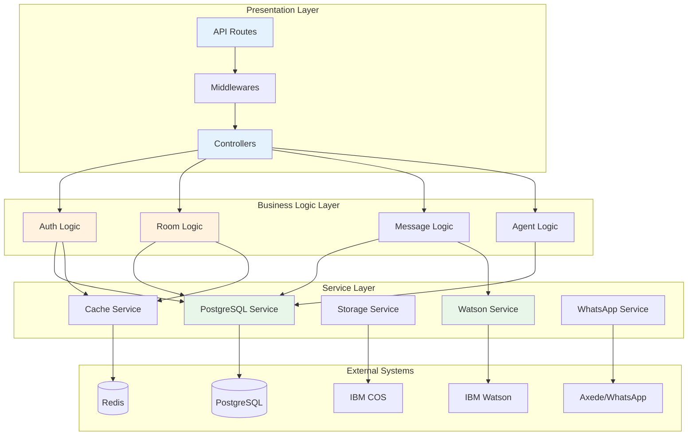

# ADR-008: Arquitectura en Capas (Layered Architecture)

**Estado:** ✅ Aceptada

**Fecha:** 2021-Q1 (Diseño inicial)

**Categoría:** Arquitectura de Software

**Autores:** Equipo IBM-I+D, TSS Colombia

---

## Contexto

### Situación

Al iniciar el proyecto, se necesitaba definir la estructura de código que permitiera:

- **Separación de responsabilidades** clara

- **Facilidad para testing** (unit tests, integration tests)

- **Abstracción de integraciones externas** (Watson, PostgreSQL, Storage, WhatsApp)

- **Mantenibilidad** a largo plazo

- **Onboarding rápido** de nuevos desarrolladores

- **Flexibilidad para cambiar** implementaciones sin afectar lógica de negocio

### Restricciones

**Equipo:**

- Equipo pequeño (2-4 desarrolladores)

- Sin experiencia en arquitecturas complejas (DDD, Hexagonal, CQRS)

- Necesidad de patrón simple y comprensible

**Proyecto:**

- Monolito (no microservicios)

- No se justifica complejidad arquitectural alta

- Prioridad: velocidad de desarrollo

**Negocio:**

- Timeline ajustado

- Requisitos claros pero evolutivos

- Necesidad de iterar rápidamente

---

## Decisión

**Se decidió:** Implementar **Arquitectura en Capas** con 3 capas principales:

### Implementación

```
app/
├── controllers/        ← CAPA 1: Presentación (HTTP)
│   ├── authController.js
│   ├── roomController.js
│   ├── messageController.js
│   └── ...
├── logic/             ← CAPA 2: Lógica de Negocio
│   ├── Auth.js
│   ├── Room.js
│   ├── Message.js
│   ├── Agent.js
│   └── ...
├── services/          ← CAPA 3: Servicios Externos
│   ├── postgresql.js
│   ├── cache.js
│   ├── storage.js
│   ├── watson/
│   │   ├── assistant.js
│   │   └── assistant_whatsapp.js
│   └── axedeapi.js
├── middlewares/       ← Transversal: Validación, Autenticación
│   ├── valid-jwt.js
│   ├── valid-agent.js
│   ├── errors.js
│   └── security.js
└── routes/            ← Rutas (orquestación)
    └── api.js
```

### Responsabilidades por Capa

**CAPA 1: Controllers (Presentación)**
```javascript
// app/controllers/roomController.js
const Room = require("../logic/Room");

class RoomController {
  static async getRooms(req, res, next) {
    try {
      // 1. Extraer parámetros del request
      const { id } = req.auth;
      
      // 2. Llamar lógica de negocio
      const room = new Room();
      const result = await room.get_rooms_agent(id);
      
      // 3. Formatear y retornar respuesta HTTP
      return res.status(200).json({
        success: true,
        rooms: result.rooms
      });
    } catch (err) {
      next(err); // Delegar al error handler
    }
  }
}
```

**Responsabilidades:**

- ✅ Manejar HTTP (request/response)

- ✅ Validar datos de entrada (con middlewares)

- ✅ Formatear respuestas

- ❌ NO contiene lógica de negocio

- ❌ NO accede directamente a BD/servicios

---

**CAPA 2: Logic (Lógica de Negocio)**
```javascript
// app/logic/Room.js
const Postgresql = require("../services/postgresql");
const cache = require("../services/cache");

class Room {
  constructor() {
    this.db = Postgresql;
  }

  async get_room_id(user_id) {
    // 1. Intentar caché
    const cached = await cache.get(`room:active:${user_id}`);
    if (cached) return cached;
    
    // 2. Lógica de negocio: buscar sala OPEN
    const sql = {
      text: `SELECT * FROM ${schema}.rooms 
             WHERE user_id = $1 AND status = 'OPEN' 
             ORDER BY created_at DESC LIMIT 1`,
      values: [user_id]
    };
    
    const result = await this.db.query(sql);
    
    // 3. Aplicar reglas de negocio
    if (result.rows.length > 0) {
      const roomData = result.rows[0];
      await cache.set(`room:active:${user_id}`, roomData, 300);
      return { status: true, ...roomData };
    }
    
    return { status: false };
  }

  async create_room(user_id, area_id, watson_id, io) {
    // Transacción compleja con lógica de negocio
    const client = await this.db.pool.connect();
    try {
      await client.query('BEGIN');
      
      // Crear sala
      const roomSQL = { ... };
      const room = await client.query(roomSQL);
      
      // Crear logs
      const logSQL = { ... };
      await client.query(logSQL);
      
      // Asignar agente si disponible
      // ... más lógica ...
      
      await client.query('COMMIT');
      
      // Notificar por Socket.IO
      io.emit('new_room', room.rows[0]);
      
      return room.rows[0];
    } catch (error) {
      await client.query('ROLLBACK');
      throw error;
    } finally {
      client.release();
    }
  }
}
```

**Responsabilidades:**

- ✅ Contiene toda la lógica de negocio

- ✅ Orquesta llamadas a servicios

- ✅ Aplica reglas de dominio

- ✅ Maneja transacciones complejas

- ❌ NO conoce HTTP (ni req, ni res)

- ❌ NO formatea respuestas

---

**CAPA 3: Services (Integración Externa)**
```javascript
// app/services/postgresql.js
const { Pool } = require("pg");

class PostgresqlService {
  constructor() {
    this.pool = new Pool({ ... });
  }

  async query(text, params, timeout = 5000) {
    const client = await this.pool.connect();
    try {
      await client.query(`SET statement_timeout TO ${timeout}`);
      const res = await client.query(text, params);
      return res;
    } catch (err) {
      console.error("Query error", err);
      throw err;
    } finally {
      client.release();
    }
  }
}

module.exports = new PostgresqlService();
```

**Responsabilidades:**

- ✅ Abstrae integraciones externas (BD, APIs, Storage)

- ✅ Maneja conexiones, errores, retry logic

- ✅ Proporciona interface simple para Logic layer

- ❌ NO contiene lógica de negocio

- ❌ NO conoce el dominio del problema

---

## Alternativas Consideradas

### Alternativa 1: MVC Clásico

**Descripción:** Model-View-Controller tradicional

**Pros:**

- ✅ Patrón muy conocido

- ✅ Simple de entender

- ✅ Frameworks lo soportan

**Contras:**

- ❌ Models suelen mezclar lógica + acceso a datos

- ❌ No hay abstracción clara de servicios externos

- ❌ Controllers tienden a engordarse

**Razón de rechazo:** Logic layer más explícita que Models, mejor separación

---

### Alternativa 2: Hexagonal / Ports & Adapters

**Descripción:** Arquitectura hexagonal con inversión de dependencias

**Pros:**

- ✅ Máxima testabilidad

- ✅ Independencia total de frameworks

- ✅ Cambiar adapters sin tocar core

**Contras:**

- ❌ Complejidad muy alta para equipo pequeño

- ❌ Overhead de interfaces/abstracciones

- ❌ Curva de aprendizaje muy alta

- ❌ Desarrollo más lento

**Razón de rechazo:** Demasiado complejo para proyecto y equipo, no justificado

---

### Alternativa 3: Microservicios

**Descripción:** Separar en servicios independientes

**Pros:**

- ✅ Escalabilidad independiente

- ✅ Deploy independiente

- ✅ Tecnologías diferentes por servicio

**Contras:**

- ❌ Complejidad operacional gigante

- ❌ Equipo pequeño no puede mantenerlo

- ❌ Overhead de comunicación entre servicios

- ❌ No justificado por tamaño del proyecto

**Razón de rechazo:** Proyecto no justifica complejidad, equipo muy pequeño, monolito suficiente

---

### Alternativa 4: Domain-Driven Design (DDD)

**Descripción:** Arquitectura basada en agregados y bounded contexts

**Pros:**

- ✅ Excelente para dominios complejos

- ✅ Ubiquitous language

- ✅ Agregados bien definidos

**Contras:**

- ❌ Dominio no tan complejo

- ❌ Curva de aprendizaje muy alta

- ❌ Requiere experiencia significativa

- ❌ Overhead conceptual

**Razón de rechazo:** Dominio relativamente simple (chat + tickets), no justifica DDD completo

---

## Tabla Comparativa de Alternativas

| Criterio | Layered (Elegido) | MVC | Hexagonal | Microservicios | DDD |
|----------|------------------|-----|-----------|----------------|-----|
| **Simplicidad** | ⭐⭐⭐⭐⭐ | ⭐⭐⭐⭐ | ⭐⭐ | ⭐ | ⭐⭐ |
| **Testabilidad** | ⭐⭐⭐⭐ | ⭐⭐⭐ | ⭐⭐⭐⭐⭐ | ⭐⭐⭐⭐ | ⭐⭐⭐⭐⭐ |
| **Mantenibilidad** | ⭐⭐⭐⭐ | ⭐⭐⭐ | ⭐⭐⭐⭐⭐ | ⭐⭐ | ⭐⭐⭐⭐ |
| **Curva aprendizaje** | ⭐⭐⭐⭐⭐ | ⭐⭐⭐⭐⭐ | ⭐⭐ | ⭐ | ⭐⭐ |
| **Escalabilidad** | ⭐⭐⭐ | ⭐⭐⭐ | ⭐⭐⭐ | ⭐⭐⭐⭐⭐ | ⭐⭐⭐⭐ |
| **Velocidad desarrollo** | ⭐⭐⭐⭐⭐ | ⭐⭐⭐⭐ | ⭐⭐ | ⭐ | ⭐⭐ |
| **Adecuado para equipo pequeño** | ✅ | ✅ | ⚠️ | ❌ | ⚠️ |

---

## Consecuencias

### ✅ Positivas

1. **Separación clara:** Cada capa tiene responsabilidad bien definida

2. **Testabilidad alta:** Logic layer testeable sin HTTP ni BD

3. **Abstracción de servicios:** Cambiar PostgreSQL → MySQL solo afecta Services layer

4. **Onboarding rápido:** Nuevos devs entienden estructura en < 1 día

5. **Reutilización de lógica:** Logic classes reutilizables (web + API + cron jobs)

6. **Mantenimiento sencillo:** Bugs fáciles de localizar por capa

7. **Escalabilidad gradual:** Fácil extraer servicios si fuera necesario

8. **Independencia de framework:** Logic layer no conoce Express

### ⚠️ Negativas (Trade-offs)

1. **No es la más "moderna":** Hexagonal/DDD más fashionable (pero innecesarios)

2. **Boilerplate moderado:** Crear 3 archivos por feature (controller + logic + route)

3. **Coupling entre capas:** Logic depende de Services (pero es aceptable)

4. **Sin inversión de dependencias:** Logic importa directamente Postgresql service

5. **Puede crecer "fat logic":** Si no se cuida, Logic classes crecen mucho

### 🔄 Neutral

1. **Testing requiere mocks:** Para testar Logic, mockear Services (aceptable)

2. **Nomenclatura:** "Logic" vs "Domain" vs "Use Cases" (decisión de naming)

3. **Estructura de folders:** Preferencia por tipo vs por feature (decisión de proyecto)

---

## Principios Aplicados

### 1. Separation of Concerns
Cada capa tiene una única responsabilidad:

- Controllers → HTTP

- Logic → Negocio

- Services → Integración

### 2. Dependency Rule
Flujo de dependencias:
```
Controllers → Logic → Services
     ↓          ↓         ↓
   HTTP     Business   External
```

### 3. Abstraction
Services abstraen complejidad de integraciones externas

### 4. Single Responsibility Principle
Una clase, una responsabilidad (ej: `Room.js` solo maneja salas)

---

## Riesgos y Mitigaciones

| Riesgo | Probabilidad | Impacto | Mitigación |
|--------|-------------|---------|------------|
| **Logic classes demasiado grandes** | Alta | Medio | Refactor periódico, dividir responsabilidades |
| **Lógica en Controllers** | Media | Medio | Code reviews, linters, tests |
| **Services acoplados** | Baja | Alto | Interfaces si fuera necesario (YAGNI actualmente) |
| **Duplicación de código** | Media | Bajo | Helpers/utils compartidos |

---

## Decisiones Relacionadas

- **Base para todas las features:** Toda funcionalidad sigue este patrón

- **Ver [ADR-003](../01-stack/ADR-003-express-framework.md):** Controllers usan Express

- **Ver [ADR-002](../01-stack/ADR-002-postgresql-database.md):** Service layer abstrae PostgreSQL

---

## Evolución y Lecciones Aprendidas

### ¿Funcionó bien?

✅ **Sí, absolutamente:** La arquitectura permitió:

- Agregar funcionalidades sin bloqueos

- Onboarding de nuevos devs en < 1 semana

- Refactorizar servicios (añadir caché) sin tocar lógica

- Testing razonablemente fácil

### ¿Qué mejoraría?

⚠️ **Dependency Injection:** Logic classes importan Services directamente

- **Problema:** Dificulta testing (requiere mocks complejos)

- **Solución:** Constructor injection (pasar services como parámetros)

- **Status:** No implementado (no crítico por ahora)

⚠️ **Feature-based folders:** Estructura actual por tipo (controllers/, logic/)

- **Problema:** Features relacionadas dispersas en múltiples folders

- **Alternativa:** Agrupar por feature (rooms/, messages/, auth/)

- **Status:** Considerado para proyectos futuros

### ¿Migrar a otra arquitectura?

**Hexagonal/Clean:**

- ❌ No justificado por complejidad

- ❌ Beneficio marginal

- ❌ Costo de migración alto

**Microservicios:**

- ❌ No justificado actualmente

- ✅ Posible en futuro si escala mucho (extract services gradualmente)

---

## Referencias

- [Layered Architecture Pattern](https://www.oreilly.com/library/view/software-architecture-patterns/9781491971437/ch01.html)

- [Clean Architecture - Robert C. Martin](https://blog.cleancoder.com/uncle-bob/2012/08/13/the-clean-architecture.html)

- [Hexagonal Architecture](https://alistair.cockburn.us/hexagonal-architecture/)

- [Node.js Best Practices - Project Structure](https://github.com/goldbergyoni/nodebestpractices#1-project-structure-practices)

---

## Diagrama de Arquitectura



---

📅 **Última actualización:** 18 de diciembre de 2025
