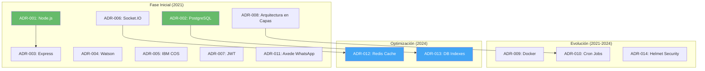

# 🏗️ Decisiones de Arquitectura (ADRs)

## 🎯 Objetivo

Documentar las decisiones arquitectónicas significativas del proyecto WhatHelp Chat API, su contexto, alternativas evaluadas y consecuencias.

---

## 📋 Índice de Decisiones

| ID | Título | Estado | Fecha | Categoría |
|----|--------|--------|-------|-----------|
| [ADR-001](./01-stack/ADR-001-nodejs-runtime.md) | Usar Node.js como Runtime | ✅ Aceptada | 2021-Q1 | Stack Tecnológico |
| [ADR-002](./01-stack/ADR-002-postgresql-database.md) | PostgreSQL como Base de Datos | ✅ Aceptada | 2021-Q1 | Base de Datos |
| [ADR-003](./01-stack/ADR-003-express-framework.md) | Express.js como Framework Web | ✅ Aceptada | 2021-Q1 | Stack Tecnológico |
| [ADR-004](./02-integraciones/ADR-004-ibm-watson.md) | IBM Watson Assistant para Bot | ✅ Aceptada | 2021-Q1 | Integración |
| [ADR-005](./02-integraciones/ADR-005-ibm-cos.md) | IBM Cloud Object Storage | ✅ Aceptada | 2021-Q1 | Integración |
| [ADR-006](./03-comunicacion/ADR-006-socketio.md) | Socket.IO para Real-time | ✅ Aceptada | 2021-Q1 | Comunicación |
| [ADR-007](./03-comunicacion/ADR-007-jwt-auth.md) | JWT para Autenticación | ✅ Aceptada | 2021-Q1 | Seguridad |
| [ADR-008](./04-arquitectura/ADR-008-layered-architecture.md) | Arquitectura en Capas | ✅ Aceptada | 2021-Q1 | Arquitectura |
| [ADR-009](./05-infraestructura/ADR-009-docker-deployment.md) | Docker para Deployment | ✅ Aceptada | 2021-Q2 | Infraestructura |
| [ADR-010](./05-infraestructura/ADR-010-cron-based-queues.md) | Sistema de Colas con Cron | ✅ Aceptada | 2021-Q2 | Infraestructura |
| [ADR-011](./02-integraciones/ADR-011-axede-whatsapp.md) | Axede como Proveedor WhatsApp | ✅ Aceptada | 2021-Q1 | Integración |
| [ADR-012](./06-optimizacion/ADR-012-redis-cache.md) | Redis para Caché y Escalabilidad | ✅ Aceptada | 2024-Q4 | Performance |
| [ADR-013](./06-optimizacion/ADR-013-database-indexes.md) | Índices de Performance en BD | ✅ Aceptada | 2024-Q4 | Performance |
| [ADR-014](./04-arquitectura/ADR-014-helmet-security.md) | Helmet para Headers de Seguridad | ✅ Aceptada | 2021-Q3 | Seguridad |

**Leyenda de Estados:**

- ✅ Aceptada - Implementada y en uso

- 🔄 En Revisión - Bajo evaluación

- ⚠️ Deprecated - Reemplazada por otra decisión

- ❌ Rechazada - Evaluada pero no implementada

---

## 📁 Organización

```
04-decisiones/
├── README.md (este archivo)
├── 01-stack/
│   ├── ADR-001-nodejs-runtime.md
│   ├── ADR-002-postgresql-database.md
│   └── ADR-003-express-framework.md
├── 02-integraciones/
│   ├── ADR-004-ibm-watson.md
│   ├── ADR-005-ibm-cos.md
│   └── ADR-011-axede-whatsapp.md
├── 03-comunicacion/
│   ├── ADR-006-socketio.md
│   └── ADR-007-jwt-auth.md
├── 04-arquitectura/
│   ├── ADR-008-layered-architecture.md
│   └── ADR-014-helmet-security.md
├── 05-infraestructura/
│   ├── ADR-009-docker-deployment.md
│   └── ADR-010-cron-based-queues.md
└── 06-optimizacion/
    ├── ADR-012-redis-cache.md
    └── ADR-013-database-indexes.md
```

---

## 📊 Diagrama de Evolución de Decisiones



---

## 📈 Impacto de Decisiones por Categoría

| Categoría | # Decisiones | Impacto en Complejidad | Impacto en Costo | Impacto en Performance |
|-----------|-------------|----------------------|-----------------|---------------------|
| Stack Tecnológico | 3 | Medio | Bajo | Alto |
| Base de Datos | 2 | Medio | Medio | Alto |
| Integración | 3 | Alto | Alto | Medio |
| Comunicación | 2 | Medio | Bajo | Alto |
| Arquitectura | 2 | Bajo | Bajo | Medio |
| Infraestructura | 2 | Medio | Medio | Medio |
| Performance | 2 | Bajo | Bajo | Muy Alto |

---

## 🔮 Decisiones Futuras en Consideración

### En Evaluación

#### Migración de Cron a BullMQ

- **Motivación:** Eliminar race conditions en múltiples instancias, mejor control de jobs

- **Estado:** 🔄 En investigación

- **Fecha estimada:** Q1 2026

- **Impacto:** Alto - Requiere infraestructura adicional (Redis ya disponible)

#### Alternativas a Socket.IO

- **Motivación:** Migrar sistema de notificaciones, reducir overhead

- **Estado:** 🔄 En evaluación inicial

- **Fecha estimada:** Q2 2026

- **Impacto:** Alto - Cambio significativo en comunicación real-time

#### Evaluación de Alternativas a Watson

- **Motivación:** Explorar opciones más económicas o con mejor performance

- **Estado:** 🔄 Investigación preliminar

- **Fecha estimada:** TBD

- **Impacto:** Crítico - Core del sistema conversacional

#### Actualización de Frontend (Vista Agente)

- **Motivación:** Modernizar repositorios front, mejorar UX

- **Estado:** 🔄 Planeado

- **Fecha estimada:** Q1-Q2 2026

- **Impacto:** Medio - No afecta backend

---

## 📝 Decisiones Lamentadas / Lecciones Aprendidas

### ADR-010: Sistema de Colas con Cron

- **Qué salió mal:** Race conditions al escalar horizontalmente, duplicación de jobs

- **Costo del cambio:** Alto - Requiere implementar message queue (BullMQ)

- **Lección:** Planificar escalabilidad horizontal desde el inicio, evitar cron para tareas críticas en sistemas distribuidos

- **Plan de acción:** Migración a BullMQ en Q1 2026

### Falta de PM2 en Container

- **Qué salió mal:** PM2 configurado en ecosystem.config.js pero no usado en Docker

- **Costo del cambio:** Bajo - Solo limpieza de código

- **Lección:** Mantener configuración sincronizada con estrategia de deployment

- **Plan de acción:** Eliminar PM2 del proyecto (completado)

### Variable ASSISTANT_ID_WAPP No Utilizada

- **Qué salió mal:** Variable de entorno definida pero no usada, confusión en configuración

- **Costo del cambio:** Bajo - Solo limpieza

- **Lección:** Eliminar configuraciones obsoletas proactivamente

- **Plan de acción:** Limpieza de variables de entorno

---

## ✅ Principios Arquitectónicos Emergentes

Basándose en las decisiones tomadas, los principios arquitectónicos que guían el proyecto son:

### 1. **Experiencia del Equipo sobre Tecnología de Moda**
> Priorizar tecnologías conocidas por el equipo sobre las más nuevas o performantes

**Evidencia:** ADR-001 (Node.js), ADR-003 (Express), ADR-007 (JWT)

**Fundamento:** Equipo con experiencia en JavaScript, decisión de usar Express aunque existen alternativas más modernas

---

### 2. **Integración IBM como Requisito de Negocio**
> Las decisiones de stack están influenciadas por contrato/ecosistema IBM

**Evidencia:** ADR-002 (PostgreSQL), ADR-004 (Watson), ADR-005 (IBM COS)

**Fundamento:** Tecnologías IBM obligatorias por contrato, PostgreSQL es estándar IBM

---

### 3. **Separación de Responsabilidades y Abstracción**
> Arquitectura en capas para abstraer integraciones externas y lógica de negocio

**Evidencia:** ADR-008 (Arquitectura en Capas)

**Fundamento:** Controllers → Logic → Services permite cambiar integraciones sin afectar negocio

---

### 4. **Simplicidad sobre Complejidad Prematura**
> Evitar microservicios y arquitecturas complejas innecesarias

**Evidencia:** ADR-008 (No microservicios), ADR-010 (Cron simple inicialmente)

**Fundamento:** Equipo pequeño, proyecto inicialmente simple, monolito suficiente

---

### 5. **Optimización Reactiva Basada en Evidencia**
> Las optimizaciones se implementan cuando hay problemas reales, no preventivamente

**Evidencia:** ADR-012 (Redis Cache - 2024), ADR-013 (Índices DB - 2024)

**Fundamento:** Optimizaciones implementadas después de detectar cuellos de botella reales

---

### 6. **Seguridad por Auditoría**
> Medidas de seguridad implementadas por requerimientos externos

**Evidencia:** ADR-014 (Helmet), ADR-007 (JWT)

**Fundamento:** Helmet por auditoría, JWT heredado de versión anterior

---

### 7. **Reutilización de Decisiones Heredadas**
> Mantener decisiones de arquitectos anteriores cuando funcionan

**Evidencia:** ADR-006 (Socket.IO heredado), ADR-007 (JWT desde el inicio)

**Fundamento:** Aplicación heredada de versión anterior, mantener lo que funciona

---

## 📚 Referencias Globales

- [ADR Template by Michael Nygard](https://github.com/joelparkerhenderson/architecture-decision-record)

- [Architecture Decision Records (ThoughtWorks)](https://www.thoughtworks.com/radar/techniques/lightweight-architecture-decision-records)

- [IBM Cloud Documentation](https://cloud.ibm.com/docs)

- [Node.js Best Practices](https://github.com/goldbergyoni/nodebestpractices)

---

📅 **Última actualización:** 18 de diciembre de 2025  
🏗️ **ADRs identificados y documentados automáticamente**  
👥 **Autores:** Equipo IBM-I+D, TSS Colombia
