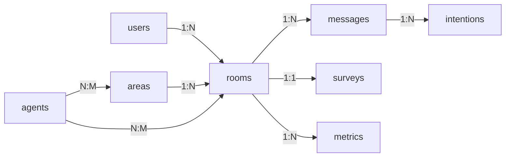

# 💾 Modelo de Datos

## 🎯 Objetivo

Documentar el esquema completo de la base de datos PostgreSQL del sistema WhatHelp Chat API.

---

## 📊 Diagrama Entidad-Relación

```mermaid
erDiagram
    agents ||--o{ agent_areas : "trabaja en"
    agents ||--o{ agent_rooms : "atiende"
    agents ||--o{ agent_logs : "genera"
    agents ||--o{ general_surveys : "recibe calificación"
    agents ||--o{ metrics : "tiene métricas"
    
    areas ||--o{ agent_areas : "tiene agentes"
    areas ||--o{ rooms : "recibe"
    areas ||--o{ queues : "gestiona cola"
    
    users ||--o{ rooms : "inicia"
    users ||--o{ general_surveys : "califica"
    users ||--o{ metrics : "genera métricas"
    users ||--o{ mass_alerts : "crea/elimina alertas"
    
    rooms ||--o{ messages : "contiene"
    rooms ||--o{ agent_rooms : "asignada a"
    rooms ||--o{ room_logs : "registra"
    rooms ||--o{ queues : "espera en"
    rooms ||--|| surveys : "tiene encuesta"
    rooms ||--|| watson_session_ids : "tiene sesión"
    rooms ||--|| teams_conversation : "integra Teams"
    rooms ||--o{ external_room : "canal externo"
    rooms ||--o{ metrics : "registra métricas"
    
    messages ||--o{ intentions : "tiene intenciones"
    
    agents {
        serial4 id PK
        varchar(150) fullname "NOT NULL"
        varchar(100) username "NOT NULL, UNIQUE"
        varchar(250) password
        varchar(200) email "UNIQUE"
        varchar(100) phone_number
        bool online "DEFAULT false"
        varchar(50) status "DEFAULT ACTIVE"
        int4 rooms "DEFAULT 0"
        int4 active_rooms "DEFAULT 0"
        bool bot "DEFAULT false"
        bool admin "DEFAULT false"
        varchar(100) provider "DEFAULT PASSWORD"
        timestamp created_at "DEFAULT CURRENT_TIMESTAMP"
        timestamp updated_at "DEFAULT CURRENT_TIMESTAMP"
        varchar(30) online_action
        bool request_disconnection "DEFAULT false"
    }
    
    users {
        serial4 id PK
        varchar(150) fullname "NOT NULL"
        varchar(100) username "NOT NULL, UNIQUE"
        varchar(250) password
        varchar(200) email
        varchar(50) status "DEFAULT PENDING"
        varchar(100) phone_number
        varchar(100) provider "DEFAULT PASSWORD"
        timestamp created_at "DEFAULT CURRENT_TIMESTAMP"
        timestamp updated_at "DEFAULT CURRENT_TIMESTAMP"
    }
    
    areas {
        serial4 id PK
        varchar(150) name "NOT NULL, UNIQUE"
        bool bot "DEFAULT false"
        varchar(100) status "DEFAULT ACTIVE"
        timestamp created_at "DEFAULT CURRENT_TIMESTAMP"
        timestamp updated_at "DEFAULT CURRENT_TIMESTAMP"
        varchar(200) assistant_id
    }
    
    rooms {
        serial4 id PK
        int8 area_id "FK, NOT NULL"
        int8 user_id "FK, NOT NULL"
        bool user_online "DEFAULT true"
        varchar(100) status "DEFAULT OPEN"
        timestamp created_at "DEFAULT CURRENT_TIMESTAMP"
        timestamp updated_at "DEFAULT CURRENT_TIMESTAMP"
        varchar(15) queue
    }
    
    messages {
        serial4 id PK
        int8 room_id "FK, NOT NULL"
        varchar(100) from_model
        int8 from
        varchar(100) type
        text body "NOT NULL"
        varchar(100) status
        bool read "DEFAULT false"
        timestamp created_at "DEFAULT CURRENT_TIMESTAMP"
    }
    
    agent_rooms {
        serial4 id PK
        int8 agent_id "FK, NOT NULL"
        int8 room_id "FK, NOT NULL"
        bool status "DEFAULT true"
        timestamp created_at "DEFAULT CURRENT_TIMESTAMP"
        timestamp updated_at "DEFAULT CURRENT_TIMESTAMP"
    }
    
    agent_areas {
        serial4 id PK
        int8 area_id "FK, NOT NULL"
        int8 agent_id "FK, NOT NULL"
        timestamp crated_at "DEFAULT CURRENT_TIMESTAMP"
    }
    
    queues {
        serial4 id PK
        int8 room_id "FK, NOT NULL, UNIQUE"
        int8 area_id "FK, NOT NULL"
        int4 position "DEFAULT 1"
        timestamp created_at "DEFAULT CURRENT_TIMESTAMP"
    }
    
    surveys {
        serial4 id PK
        int8 room_id "FK, NOT NULL, UNIQUE"
        varchar(2) score "NOT NULL"
        varchar(250) message "NOT NULL"
        varchar(200) comment
        timestamp created_at "DEFAULT CURRENT_TIMESTAMP"
    }
    
    general_surveys {
        serial4 id PK
        int4 room_id "FK, NOT NULL"
        int4 user_id "FK, NOT NULL"
        int4 agent_id "FK, NOT NULL"
        int4 question_cod "NOT NULL"
        varchar(50) type "NOT NULL"
        varchar(200) question "NOT NULL"
        varchar(200) answer "NOT NULL"
        timestamp created_at "DEFAULT CURRENT_TIMESTAMP"
    }
    
    metrics {
        serial4 id PK
        int4 room_id "FK, NOT NULL"
        timestamp start_date_room
        timestamp end_date_room_user
        timestamp end_date_room_agent
        timestamp transfer_date_room_bot
        timestamp transfer_date_room_direct
        int4 agent_id
        int4 user_id
        timestamp start_date_room_bot
        varchar(50) state
        varchar(10) area
        timestamp transfer_queue_date
        timestamp closed_room
    }
```



---

## 📋 Entidades

### agents (Agentes del Sistema)

**Descripción**: Representa a los agentes humanos que atienden las conversaciones de chat.

**Tabla**: `banco_bgta_chat.agents`

#### Campos

| Campo | Tipo | Constraints | Descripción |
|-------|------|-------------|-------------|
| id | serial4 | PK | Identificador único del agente |
| fullname | varchar(150) | NOT NULL | Nombre completo del agente |
| username | varchar(100) | NOT NULL, UNIQUE | Usuario para login |
| password | varchar(250) | - | Contraseña hasheada (bcrypt) |
| email | varchar(200) | UNIQUE | Email del agente |
| phone_number | varchar(100) | - | Teléfono de contacto |
| online | bool | DEFAULT false | Estado de conexión actual |
| status | varchar(50) | DEFAULT 'ACTIVE' | Estado del agente (ACTIVE, INACTIVE) |
| rooms | int4 | DEFAULT 0 | Cantidad máxima de salas simultáneas |
| active_rooms | int4 | DEFAULT 0 | Salas activas actualmente |
| bot | bool | DEFAULT false | Indica si es un agente bot |
| admin | bool | DEFAULT false | Permisos de administrador |
| provider | varchar(100) | DEFAULT 'PASSWORD' | Método de autenticación |
| created_at | timestamp | DEFAULT CURRENT_TIMESTAMP | Fecha de creación |
| updated_at | timestamp | DEFAULT CURRENT_TIMESTAMP | Última actualización |
| online_action | varchar(30) | - | Acción al conectarse |
| request_disconnection | bool | DEFAULT false | Solicitud de desconexión pendiente |

#### Relaciones

- **1:N** con `agent_areas`: Un agente puede pertenecer a múltiples áreas

- **1:N** con `agent_rooms`: Un agente puede atender múltiples salas

- **1:N** con `agent_logs`: Un agente genera múltiples logs

- **1:N** con `general_surveys`: Un agente recibe múltiples calificaciones

- **1:N** con `metrics`: Un agente tiene múltiples métricas

#### Índices

- `PK`: id

- `UNIQUE`: username, email

#### Reglas de Negocio

- Un agente no puede tener más `active_rooms` que `rooms` (capacidad máxima)

- El campo `password` debe estar hasheado con bcryptjs antes de guardar

- Solo agentes con `admin = true` pueden acceder a endpoints administrativos

---

### users (Usuarios Finales)

**Descripción**: Usuarios finales que inician conversaciones de chat.

**Tabla**: `banco_bgta_chat.users`

#### Campos

| Campo | Tipo | Constraints | Descripción |
|-------|------|-------------|-------------|
| id | serial4 | PK | Identificador único del usuario |
| fullname | varchar(150) | NOT NULL | Nombre completo |
| username | varchar(100) | NOT NULL, UNIQUE | Identificador único de usuario |
| password | varchar(250) | - | Contraseña hasheada |
| email | varchar(200) | - | Email del usuario |
| status | varchar(50) | DEFAULT 'PENDING' | Estado (PENDING, ACTIVE, INACTIVE) |
| phone_number | varchar(100) | - | Teléfono del usuario |
| provider | varchar(100) | DEFAULT 'PASSWORD' | Método de autenticación |
| created_at | timestamp | DEFAULT CURRENT_TIMESTAMP | Fecha de creación |
| updated_at | timestamp | DEFAULT CURRENT_TIMESTAMP | Última actualización |

#### Relaciones

- **1:N** con `rooms`: Un usuario puede tener múltiples conversaciones

- **1:N** con `general_surveys`: Un usuario puede enviar múltiples encuestas

- **1:N** con `metrics`: Un usuario genera múltiples métricas

- **1:N** con `mass_alerts`: Un usuario puede crear/eliminar alertas masivas

#### Índices

- `PK`: id

- `UNIQUE`: username

- `INDEX`: status (index_status_users)

---

### areas (Áreas de Atención)

**Descripción**: Departamentos o especialidades que agrupan agentes y conversaciones.

**Tabla**: `banco_bgta_chat.areas`

#### Campos

| Campo | Tipo | Constraints | Descripción |
|-------|------|-------------|-------------|
| id | serial4 | PK | Identificador único del área |
| name | varchar(150) | NOT NULL, UNIQUE | Nombre del área |
| bot | bool | DEFAULT false | Indica si tiene bot asignado |
| status | varchar(100) | DEFAULT 'ACTIVE' | Estado del área |
| created_at | timestamp | DEFAULT CURRENT_TIMESTAMP | Fecha de creación |
| updated_at | timestamp | DEFAULT CURRENT_TIMESTAMP | Última actualización |
| assistant_id | varchar(200) | - | ID del Watson Assistant asociado |

#### Relaciones

- **1:N** con `agent_areas`: Un área tiene múltiples agentes

- **1:N** con `rooms`: Un área recibe múltiples conversaciones

- **1:N** con `queues`: Un área gestiona su propia cola de espera

#### Índices

- `PK`: id

- `UNIQUE`: name

---

### rooms (Salas de Conversación)

**Descripción**: Representa una conversación entre un usuario y uno o más agentes.

**Tabla**: `banco_bgta_chat.rooms`

#### Campos

| Campo | Tipo | Constraints | Descripción |
|-------|------|-------------|-------------|
| id | serial4 | PK | Identificador único de la sala |
| area_id | int8 | FK → areas(id), NOT NULL | Área a la que pertenece |
| user_id | int8 | FK → users(id), NOT NULL | Usuario que inició la conversación |
| user_online | bool | DEFAULT true | Estado de conexión del usuario |
| status | varchar(100) | DEFAULT 'OPEN' | Estado (OPEN, CLOSED, TRANSFERRED) |
| created_at | timestamp | DEFAULT CURRENT_TIMESTAMP | Fecha de creación |
| updated_at | timestamp | DEFAULT CURRENT_TIMESTAMP | Última actualización |
| queue | varchar(15) | - | Estado en cola |

#### Relaciones

- **N:1** con `areas`: Una sala pertenece a un área

- **N:1** con `users`: Una sala pertenece a un usuario

- **1:N** con `messages`: Una sala contiene múltiples mensajes

- **1:N** con `agent_rooms`: Una sala puede tener múltiples agentes asignados

- **1:N** con `room_logs`: Una sala genera múltiples logs

- **1:1** con `queues`: Una sala puede estar en una cola

- **1:1** con `surveys`: Una sala puede tener una encuesta

- **1:1** con `watson_session_ids`: Una sala tiene una sesión de Watson

- **1:N** con `teams_conversation`: Una sala puede tener conversación de Teams

- **1:N** con `external_room`: Una sala puede tener canales externos

- **1:N** con `metrics`: Una sala genera métricas

#### Índices

- `PK`: id

- `INDEX`: area_id (index_area_id_rooms)

- `INDEX`: user_id (index_user_id_rooms)

#### Reglas de Negocio

- Una sala solo puede cerrarse si todos los mensajes han sido respondidos

- El cierre automático ocurre después de X minutos de inactividad del usuario

- Una sala puede transferirse entre áreas

---

### messages (Mensajes)

**Descripción**: Mensajes individuales dentro de una conversación.

**Tabla**: `banco_bgta_chat.messages`

#### Campos

| Campo | Tipo | Constraints | Descripción |
|-------|------|-------------|-------------|
| id | serial4 | PK | Identificador único del mensaje |
| room_id | int8 | FK → rooms(id), NOT NULL | Sala a la que pertenece |
| from_model | varchar(100) | - | Tipo de emisor (Agent, User, Bot) |
| from | int8 | - | ID del emisor |
| type | varchar(100) | - | Tipo de mensaje (text, image, file) |
| body | text | NOT NULL | Contenido del mensaje |
| status | varchar(100) | - | Estado del mensaje |
| read | bool | DEFAULT false | Indica si fue leído |
| created_at | timestamp | DEFAULT CURRENT_TIMESTAMP | Fecha de envío |

#### Relaciones

- **N:1** con `rooms`: Un mensaje pertenece a una sala

- **1:N** con `intentions`: Un mensaje puede tener múltiples intenciones (Watson)

#### Índices

- `PK`: id

- `INDEX`: room_id (index_room_id_messages)

---

### agent_rooms (Asignación Agente-Sala)

**Descripción**: Tabla intermedia N:M que relaciona agentes con salas.

**Tabla**: `banco_bgta_chat.agent_rooms`

#### Campos

| Campo | Tipo | Constraints | Descripción |
|-------|------|-------------|-------------|
| id | serial4 | PK | Identificador único |
| agent_id | int8 | FK → agents(id), NOT NULL | Agente asignado |
| room_id | int8 | FK → rooms(id), NOT NULL | Sala asignada |
| status | bool | DEFAULT true | Estado de la asignación |
| created_at | timestamp | DEFAULT CURRENT_TIMESTAMP | Fecha de asignación |
| updated_at | timestamp | DEFAULT CURRENT_TIMESTAMP | Última actualización |

#### Relaciones

- **N:1** con `agents`: Múltiples asignaciones por agente

- **N:1** con `rooms`: Múltiples asignaciones por sala

#### Índices

- `PK`: id

- `UNIQUE`: (agent_id, room_id) - Un agente solo puede estar asignado una vez a una sala

- `INDEX`: agent_id (index_agent_id_agent_logs)

- `INDEX`: room_id (index_room_id_agent_logs)

- `INDEX`: status (index_status_agent_rooms)

---

### agent_areas (Asignación Agente-Área)

**Descripción**: Tabla intermedia N:M que relaciona agentes con áreas de atención.

**Tabla**: `banco_bgta_chat.agent_areas`

#### Campos

| Campo | Tipo | Constraints | Descripción |
|-------|------|-------------|-------------|
| id | serial4 | PK | Identificador único |
| area_id | int8 | FK → areas(id), NOT NULL | Área asignada |
| agent_id | int8 | FK → agents(id), NOT NULL | Agente asignado |
| crated_at | timestamp | DEFAULT CURRENT_TIMESTAMP | Fecha de asignación (typo en schema) |

#### Relaciones

- **N:1** con `agents`: Múltiples asignaciones por agente

- **N:1** con `areas`: Múltiples asignaciones por área

#### Índices

- `PK`: id

- `UNIQUE`: (agent_id, area_id) - Un agente solo puede estar asignado una vez a un área

---

### queues (Cola de Espera)

**Descripción**: Gestión de salas en espera de ser atendidas por un agente.

**Tabla**: `banco_bgta_chat.queues`

#### Campos

| Campo | Tipo | Constraints | Descripción |
|-------|------|-------------|-------------|
| id | serial4 | PK | Identificador único |
| room_id | int8 | FK → rooms(id), NOT NULL, UNIQUE | Sala en espera |
| area_id | int8 | FK → areas(id), NOT NULL | Área de destino |
| position | int4 | DEFAULT 1 | Posición en la cola |
| created_at | timestamp | DEFAULT CURRENT_TIMESTAMP | Entrada a la cola |

#### Relaciones

- **N:1** con `rooms`: Una sala puede estar en una cola

- **N:1** con `areas`: Una cola pertenece a un área

#### Índices

- `PK`: id

- `UNIQUE`: room_id - Una sala solo puede estar una vez en cola

#### Reglas de Negocio

- Las salas se asignan a agentes por orden FIFO (First In, First Out)

- La posición se recalcula automáticamente cuando sale una sala

- Cron ejecuta cada 1 minuto para liberar salas de la cola

---

### agent_logs (Logs de Agentes)

**Descripción**: Registro de actividades y eventos de los agentes.

**Tabla**: `banco_bgta_chat.agent_logs`

#### Campos

| Campo | Tipo | Constraints | Descripción |
|-------|------|-------------|-------------|
| id | serial4 | PK | Identificador único |
| agent_id | int8 | FK → agents(id), NOT NULL | Agente que generó el log |
| category | varchar(100) | - | Categoría del log |
| description | varchar(250) | - | Descripción del evento |
| created_at | timestamp | DEFAULT CURRENT_TIMESTAMP | Fecha del evento |

#### Relaciones

- **N:1** con `agents`: Un agente genera múltiples logs

#### Índices

- `PK`: id

- `INDEX`: category (index_category_agent_logs)

---

### room_logs (Logs de Salas)

**Descripción**: Registro de eventos y cambios de estado en las salas.

**Tabla**: `banco_bgta_chat.room_logs`

#### Campos

| Campo | Tipo | Constraints | Descripción |
|-------|------|-------------|-------------|
| id | serial4 | PK | Identificador único |
| room_id | int8 | FK → rooms(id), NOT NULL | Sala que generó el log |
| category | varchar(100) | - | Categoría del evento |
| description | varchar(250) | - | Descripción del evento |
| created_at | timestamp | DEFAULT CURRENT_TIMESTAMP | Fecha del evento |

#### Relaciones

- **N:1** con `rooms`: Una sala genera múltiples logs

#### Índices

- `PK`: id

- `INDEX`: room_id (index_room_id_room_logs)

---

### intentions (Intenciones de Watson)

**Descripción**: Intenciones detectadas por Watson Assistant en los mensajes.

**Tabla**: `banco_bgta_chat.intentions`

#### Campos

| Campo | Tipo | Constraints | Descripción |
|-------|------|-------------|-------------|
| id | serial4 | PK | Identificador único |
| message_id | int8 | FK → messages(id), NOT NULL | Mensaje analizado |
| key | varchar(100) | - | Clave de la intención |
| value | varchar(150) | - | Valor/confianza de la intención |

#### Relaciones

- **N:1** con `messages`: Un mensaje puede tener múltiples intenciones

#### Índices

- `PK`: id

- `INDEX`: message_id (index_message_id_intentions)

---

### surveys (Encuestas de Satisfacción)

**Descripción**: Encuesta de satisfacción al finalizar una conversación.

**Tabla**: `banco_bgta_chat.surveys`

#### Campos

| Campo | Tipo | Constraints | Descripción |
|-------|------|-------------|-------------|
| id | serial4 | PK | Identificador único |
| room_id | int8 | FK → rooms(id), NOT NULL, UNIQUE | Sala calificada |
| score | varchar(2) | NOT NULL | Puntuación (1-10) |
| message | varchar(250) | NOT NULL | Mensaje predefinido |
| comment | varchar(200) | - | Comentario adicional del usuario |
| created_at | timestamp | DEFAULT CURRENT_TIMESTAMP | Fecha de la encuesta |

#### Relaciones

- **1:1** con `rooms`: Una sala tiene máximo una encuesta

#### Índices

- `PK`: id

- `UNIQUE`: room_id - Solo una encuesta por sala

---

### general_surveys (Encuestas Generales)

**Descripción**: Sistema de encuestas detalladas con múltiples preguntas.

**Tabla**: `banco_bgta_chat.general_surveys`

#### Campos

| Campo | Tipo | Constraints | Descripción |
|-------|------|-------------|-------------|
| id | serial4 | PK | Identificador único |
| room_id | int4 | FK → rooms(id), NOT NULL | Sala calificada |
| user_id | int4 | FK → users(id), NOT NULL | Usuario que responde |
| agent_id | int4 | FK → agents(id), NOT NULL | Agente calificado |
| question_cod | int4 | NOT NULL | Código de la pregunta |
| type | varchar(50) | NOT NULL | Tipo de pregunta |
| question | varchar(200) | NOT NULL | Texto de la pregunta |
| answer | varchar(200) | NOT NULL | Respuesta del usuario |
| created_at | timestamp | DEFAULT CURRENT_TIMESTAMP | Fecha de respuesta |

#### Relaciones

- **N:1** con `rooms`: Una sala puede tener múltiples respuestas

- **N:1** con `users`: Un usuario puede responder múltiples encuestas

- **N:1** con `agents`: Un agente puede recibir múltiples calificaciones

#### Índices

- `PK`: id

---

### protocol_messages (Mensajes de Protocolo)

**Descripción**: Mensajes predefinidos para uso de agentes (respuestas rápidas).

**Tabla**: `banco_bgta_chat.protocol_messages`

#### Campos

| Campo | Tipo | Constraints | Descripción |
|-------|------|-------------|-------------|
| id | serial4 | PK | Identificador único |
| position | int4 | DEFAULT 1 | Orden de visualización |
| title | varchar(100) | NOT NULL | Título del mensaje |
| message | varchar(300) | NOT NULL | Contenido del mensaje |
| created_at | timestamp | DEFAULT CURRENT_TIMESTAMP | Fecha de creación |
| updated_at | timestamp | DEFAULT CURRENT_TIMESTAMP | Última actualización |

#### Relaciones

Ninguna (tabla independiente)

#### Índices

- `PK`: id

---

### mass_alerts (Alertas Masivas)

**Descripción**: Sistema de alertas/banners para mostrar a todos los usuarios.

**Tabla**: `banco_bgta_chat.mass_alerts`

#### Campos

| Campo | Tipo | Constraints | Descripción |
|-------|------|-------------|-------------|
| id | serial4 | PK | Identificador único |
| message | varchar(200) | NOT NULL | Contenido de la alerta |
| created_at | timestamp | DEFAULT CURRENT_TIMESTAMP | Fecha de creación |
| deleted_at | timestamp | - | Fecha de eliminación (soft delete) |
| created_by | int4 | FK → users(id) | Usuario que creó la alerta |
| deleted_by | int4 | FK → users(id) | Usuario que eliminó la alerta |

#### Relaciones

- **N:1** con `users` (created_by): Usuario creador

- **N:1** con `users` (deleted_by): Usuario que eliminó

#### Índices

- `PK`: id

---

### metrics (Métricas de Rendimiento)

**Descripción**: Métricas y tiempos de atención para análisis y reportes.

**Tabla**: `banco_bgta_chat.metrics`

#### Campos

| Campo | Tipo | Constraints | Descripción |
|-------|------|-------------|-------------|
| id | serial4 | PK | Identificador único |
| room_id | int4 | FK → rooms(id), NOT NULL | Sala medida |
| start_date_room | timestamp | - | Inicio de la conversación |
| end_date_room_user | timestamp | - | Fin por parte del usuario |
| end_date_room_agent | timestamp | - | Fin por parte del agente |
| transfer_date_room_bot | timestamp | - | Transferencia a bot |
| transfer_date_room_direct | timestamp | - | Transferencia directa |
| agent_id | int4 | - | Agente que atendió |
| user_id | int4 | - | Usuario atendido |
| start_date_room_bot | timestamp | - | Inicio con bot |
| state | varchar(50) | - | Estado final |
| area | varchar(10) | - | Área de atención |
| transfer_queue_date | timestamp | - | Fecha de entrada a cola |
| closed_room | timestamp | - | Fecha de cierre |

#### Relaciones

- **N:1** con `rooms`: Una sala genera métricas

- **N:1** con `agents`: Un agente tiene métricas

- **N:1** con `users`: Un usuario genera métricas

#### Índices

- `PK`: id

---

### watson_session_ids (Sesiones de Watson)

**Descripción**: Gestión de sesiones de Watson Assistant por sala.

**Tabla**: `banco_bgta_chat.watson_session_ids`

#### Campos

| Campo | Tipo | Constraints | Descripción |
|-------|------|-------------|-------------|
| id | serial4 | PK | Identificador único |
| room_id | int8 | FK → rooms(id), NOT NULL, UNIQUE | Sala asociada |
| session_id | varchar(50) | NOT NULL | ID de sesión de Watson |
| created_at | timestamp | DEFAULT now() | Fecha de creación |
| updated_at | timestamp | DEFAULT now() | Última actualización |

#### Relaciones

- **1:1** con `rooms`: Una sala tiene una sesión de Watson

#### Índices

- `PK`: id

- `UNIQUE`: room_id - Solo una sesión por sala

---

### teams_conversation (Conversaciones de Teams)

**Descripción**: Integración con Microsoft Teams para conversaciones.

**Tabla**: `banco_bgta_chat.teams_conversation`

#### Campos

| Campo | Tipo | Constraints | Descripción |
|-------|------|-------------|-------------|
| id | int8 | PK, GENERATED | Identificador único |
| room_id | int8 | FK → rooms(id), NOT NULL | Sala asociada |
| activity_teams_id | varchar(50) | NOT NULL | ID de actividad en Teams |
| serviceurl_teams | varchar(100) | NOT NULL | URL del servicio de Teams |
| conversation_teams_id | varchar(200) | NOT NULL | ID de conversación en Teams |
| name_team_conversation | varchar(50) | - | Nombre de la conversación |
| bot_teams_id | varchar(50) | NOT NULL | ID del bot en Teams |
| bot_teams_name | varchar(50) | - | Nombre del bot |
| user_teams_id | varchar(100) | - | ID del usuario en Teams |

#### Relaciones

- **N:1** con `rooms`: Una sala puede tener conversación de Teams

#### Índices

- `PK`: id

---

### external_room (Salas de Canales Externos)

**Descripción**: Integración con canales externos (WhatsApp, etc.).

**Tabla**: `banco_bgta_chat.external_room`

#### Campos

| Campo | Tipo | Constraints | Descripción |
|-------|------|-------------|-------------|
| id | int8 | PK, GENERATED | Identificador único |
| room_id | int8 | FK → rooms(id), NOT NULL | Sala asociada |
| channel | varchar(50) | NOT NULL | Nombre del canal (WhatsApp) |
| token_channel | varchar(50) | NOT NULL | Token del canal |

#### Relaciones

- **N:1** con `rooms`: Una sala puede tener canales externos

#### Índices

- `PK`: id

---

### notifications (Notificaciones por Email)

**Descripción**: Emails registrados para recibir notificaciones del sistema.

**Tabla**: `banco_bgta_chat.notifications` (schema global, no banco_bgta_chat)

#### Campos

| Campo | Tipo | Constraints | Descripción |
|-------|------|-------------|-------------|
| id | serial4 | PK | Identificador único |
| email | varchar(150) | NOT NULL, UNIQUE | Email para notificaciones |
| created_at | timestamp | DEFAULT CURRENT_TIMESTAMP | Fecha de registro |

#### Relaciones

Ninguna (tabla independiente)

#### Índices

- `PK`: id

- `UNIQUE`: email

---

### errors (Registro de Errores)

**Descripción**: Log centralizado de errores del sistema.

**Tabla**: `banco_bgta_chat.errors`

#### Campos

| Campo | Tipo | Constraints | Descripción |
|-------|------|-------------|-------------|
| id | serial4 | PK | Identificador único |
| category | varchar(200) | - | Categoría del error |
| message | text | - | Mensaje de error completo |
| created_at | timestamp | DEFAULT CURRENT_TIMESTAMP | Fecha del error |

#### Relaciones

Ninguna (tabla independiente)

#### Índices

- `PK`: id

---

## 📊 Tablas Legacy (No Utilizadas)

### membership

**Descripción**: [LEGACY - No en uso según respuestas del formulario]

**Tabla**: `banco_bgta_chat.membership`

Datos de membresías (posiblemente relacionado con aliados/partners).

### ubicaciones_ada

**Descripción**: [LEGACY - No en uso según respuestas del formulario]

**Tabla**: `banco_bgta_chat.ubicaciones_ada`

Datos de ubicaciones geográficas (oficinas, sucursales).

---

## 🔄 Estrategia de Migraciones

**Método**: SQL Manual

**Ubicación**: `db/migrations/`

**Archivos detectados**:

- `001_add_performance_indexes.sql`

- `002_add_performance_indexes_real_schema.sql`

- `003_remaining_indexes_dev.sql`

- `INDEXES_APPLIED_REPORT.md`

- `README.md`

**Cómo aplicar**:

```bash
# Conectar a PostgreSQL
psql -U [usuario] -d [database] -h [host]

# Ejecutar migration
\i db/migrations/[nombre_archivo].sql
```

**Estado actual**: Índices de performance aplicados

---

## 📈 Índices Aplicados

**Total de índices optimizados**: 10+

**Propósito**: Optimización de queries frecuentes en:

- Búsquedas por `room_id` en mensajes, logs, agent_rooms

- Filtrado por `status` en users, agent_rooms

- Búsquedas por `area_id` en rooms

- Búsquedas por `category` en agent_logs

- Joins en tablas relacionales

---

## 🔗 Diagrama de Relaciones Principales



---

## 📝 Reglas de Integridad Referencial

- **ON DELETE**: No especificado en schema (default: NO ACTION)

- **ON UPDATE**: No especificado en schema (default: NO ACTION)

**Recomendación**: Implementar políticas de CASCADE/RESTRICT según reglas de negocio.

---

## 🎯 Consideraciones de Diseño

### Fortalezas

✅ Normalización adecuada (evita redundancia)
✅ Tablas intermedias para relaciones N:M
✅ Índices en foreign keys para performance
✅ Timestamps de auditoría (created_at, updated_at)
✅ Soft deletes en mass_alerts

### Áreas de Mejora

⚠️ Tablas legacy sin uso (`membership`, `ubicaciones_ada`)
⚠️ Typo en campo `crated_at` de agent_areas
⚠️ Falta de políticas ON DELETE/UPDATE explícitas
⚠️ Considerar particionamiento en `messages` si crece mucho
⚠️ Considerar archivado de `metrics` antiguas

---

## 🔐 Seguridad

- **Passwords**: Hasheados con bcryptjs (campo `password` en agents y users)

- **Tokens**: JWT almacenados en memoria, no en BD

- **Auditoría**: Campos created_at/updated_at en todas las tablas

- **Soft Deletes**: Implementado en mass_alerts

---

## 📦 Esquema Completo

**Schema principal**: `banco_bgta_chat`
**Schema global**: Default (para `notifications`)

**Total de tablas**: 18 (16 activas + 2 legacy)
**Total de relaciones FK**: 25+
**Total de índices**: 30+
