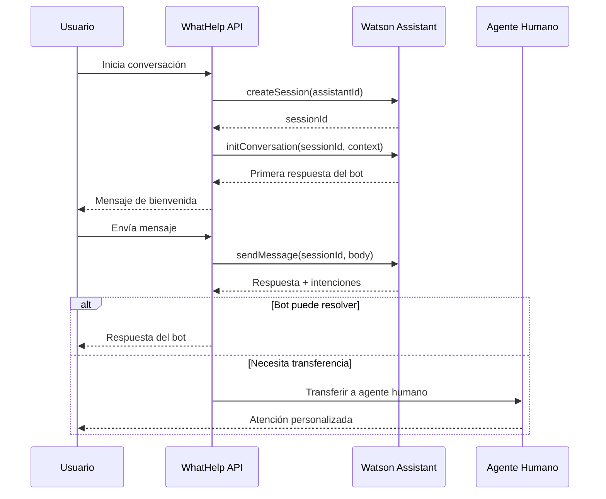
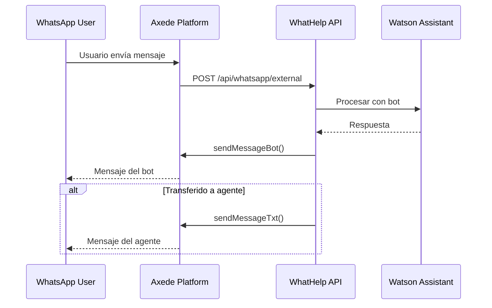
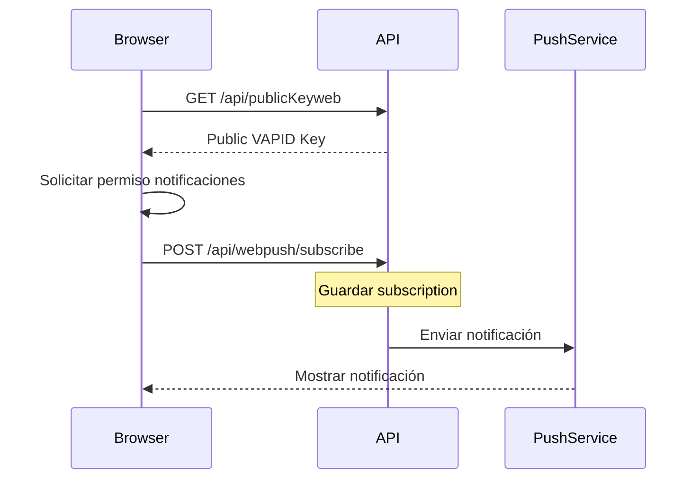
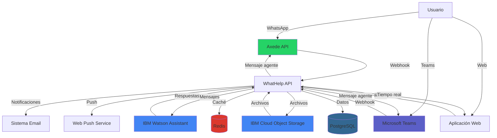
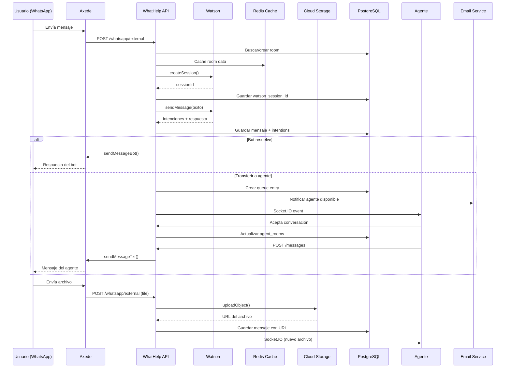

# 🌐 Integraciones Externas

## 🎯 Objetivo

Documentar todas las integraciones con servicios y APIs externas del sistema WhatHelp Chat API.

---

## 📊 Resumen de Integraciones

| Servicio | Propósito | Protocolo | Criticidad | Monitoreo |
|----------|-----------|-----------|------------|-----------|
| IBM Watson Assistant | Chatbot con IA | SDK ibm-watson | ⚠️ Alta | ✅ Activo |
| IBM Cloud Object Storage | Almacenamiento de archivos | SDK S3-compatible | ⚠️ Alta | ❌ No |
| WhatsApp (Axede API) | Canal de mensajería | REST API | ⚠️ Alta | ✅ Activo |
| Microsoft Teams | Canal de mensajería | REST API | 🟡 Media | ❌ No |
| Sistema de Email | Notificaciones | REST API | 🟡 Media | ❌ No |
| Redis | Caché + Socket.IO Adapter | Redis Protocol | 🟢 Baja | ❌ No |
| Web Push (VAPID) | Push notifications web | Web Push Protocol | 🟢 Baja | ❌ No |
| Google reCAPTCHA | Protección anti-bot | REST API | 🟡 Media | ❌ No |

**Total de integraciones**: 8

**Servicios con monitoreo activo**: 2 (Watson, WhatsApp)

---

## 🔗 Integraciones Detalladas

### 1. IBM Watson Assistant

**Proveedor**: IBM Cloud

**Propósito**: Chatbot con inteligencia artificial para atención automatizada inicial de usuarios.

**Criticidad**: ⚠️ Alta - Es el primer punto de contacto con usuarios

**Documentación oficial**: [IBM Watson Assistant Docs](https://cloud.ibm.com/docs/watson-assistant)

#### Configuración

**Autenticación**: IAM API Key

**Credenciales** (variables de entorno):
```bash
ASSISTANT_IAM_APIKEY=your-watson-api-key
ASSISTANT_URL=https://api.us-south.assistant.watson.cloud.ibm.com
ASSISTANT_VERSION=2021-06-14
ASSISTANT_ID=your-assistant-id
ASSISTANT_ID_WAPP=your-whatsapp-assistant-id
AREA_WHATSAPP=1
WATSON_DB_ID=watson-id
AREA_TEAMS=2
```

**SDK Utilizado**: `ibm-watson` v10.0.0

**Base URL**: Configurable por región (us-south, eu-de, etc.)

#### Endpoints Consumidos

| Endpoint Watson | Método | Propósito | Implementado en |
|----------------|--------|-----------|-----------------|
| `/v2/assistants/{assistant_id}/sessions` | POST | Crear sesión de conversación | `assistant.js::createSession()` |
| `/v2/assistants/{assistant_id}/sessions/{session_id}/message` | POST | Enviar/recibir mensajes | `assistant.js::sendMessage()` |

#### Flujo de Integración



#### Context Variables

Variables enviadas al iniciar conversación:

```javascript
context: {
  skills: {
    "actions skill": {
      skill_variables: {
        room: roomId,      // ID de la sala
        phone: phoneNumber // Teléfono del usuario
      }
    }
  },
  integrations: {
    channel: {
      name: "Web chat"  // o "WhatsApp", "Teams"
    }
  }
}
```

#### SLA y Performance

**SLA esperado**: 500 ms (tiempo máximo de respuesta)

**Timeout configurado**: 30 segundos (por defecto del SDK)

**Estrategia ante timeout**: 

- Reintentar una vez

- Si falla, transferir directamente a agente humano

#### Fallback

**Comportamiento si Watson falla**:
> "Se debería transferir directamente con el agente"

**Implementación recomendada**:
```javascript
try {
  const response = await watson.sendMessage(sessionId, body);
  return response;
} catch (error) {
  console.error('Watson error:', error);
  // Transferir automáticamente a agente
  await transferToAgent(roomId, areaId);
  return { transferred: true };
}
```

#### Rate Limits

**Límites de IBM Watson** (plan estándar):

- 1000 sesiones activas simultáneas

- 10 mensajes/segundo

**Manejo en código**: No implementado actualmente

#### Código de Ejemplo

**Ubicación**: `app/services/watson/assistant.js`

```javascript
class Assistant {
  constructor(assistantID) {
    this.assistantID = assistantID || config.watson.assistant.assistantId;
    this.assistant = new AssistantV2({
      version: config.watson.assistant.version,
      authenticator: new IamAuthenticator({
        apikey: config.watson.assistant.iam_apikey,
      }),
      serviceUrl: config.watson.assistant.url,
    });
  }

  createSession(auth, sendMessage = true, assistantID = this.assistantID) {
    return new Promise((resolve, reject) => {
      this.assistant
        .createSession({ assistantId: assistantID })
        .then((result) => {
          const { session_id } = result.result;
          if (!sendMessage) resolve(session_id);
          else
            this.initConversation(auth, session_id, assistantID)
              .then((message) => resolve(message.result))
              .catch(reject);
        })
        .catch(reject);
    });
  }

  sendMessage(auth, sessionId, body, variables = {}, assistantID = this.assistantID) {
    return new Promise((resolve, reject) => {
      this.assistant
        .message({
          assistantId: assistantID,
          sessionId: sessionId,
          input: {
            message_type: 'text',
            text: body,
            options: { return_context: true }
          },
          context: {
            skills: {
              "actions skill": {
                skill_variables: { ...variables }
              }
            }
          }
        })
        .then(resolve)
        .catch(reject);
    });
  }
}
```

#### Múltiples Asistentes

**Asistente principal**: `ASSISTANT_ID` (Web, Teams)

**Asistente WhatsApp**: `ASSISTANT_ID_WAPP` (optimizado para WhatsApp)

**Razón**: Diferentes flujos conversacionales según el canal

#### Monitoreo

✅ **Activo** según respuestas del formulario

**Métricas recomendadas**:

- Tiempo de respuesta

- Tasa de éxito/error

- Cantidad de sesiones activas

- Tasa de transferencia a agente

---

### 2. IBM Cloud Object Storage (COS)

**Proveedor**: IBM Cloud

**Propósito**: Almacenamiento de archivos e imágenes enviados en conversaciones.

**Criticidad**: ⚠️ Alta - Archivos de usuarios no pueden perderse

**Documentación oficial**: [IBM COS Docs](https://cloud.ibm.com/docs/cloud-object-storage)

#### Configuración

**Autenticación**: API Key + Service Instance ID

**Credenciales** (variables de entorno):
```bash
COS_ENDPOINT=s3.us-south.cloud-object-storage.appdomain.cloud
COS_APIKEYID=your-cos-api-key
COS_IBMAUTHENDPOINT=https://iam.cloud.ibm.com/identity/token
COS_SERVICEINSTANCEID=crn:v1:bluemix:public:cloud-object-storage...
COS_BUCKET=your-bucket-name
COS_URL=https://your-bucket.s3.us-south.cloud-object-storage.appdomain.cloud
```

**SDK Utilizado**: `ibm-cos-sdk` v1.14.1 (compatible con AWS S3 SDK)

#### Operaciones Soportadas

| Operación | Método | Propósito | Implementado en |
|-----------|--------|-----------|-----------------|
| Upload | `upload()` | Subir archivo | `storage.js::uploadObject()` |
| Download | `getObject()` | Descargar archivo | `storage.js::downloadObject()` |
| List | `listObjects()` | Listar archivos del bucket | `storage.js::downloadAllObject()` |
| Delete | `deleteObject()` | Eliminar archivo | `storage.js::deleteObject()` |

#### Código de Ejemplo

**Ubicación**: `app/services/storage.js`

```javascript
const COS = require("ibm-cos-sdk");

class Storage {
  constructor() {
    this.cos = new COS.S3(config.cos);
    this.bucket = config.cos.Bucket;
  }

  uploadObject(key, body, mimetype) {
    return new Promise((resolve, reject) => {
      const uploadParams = {
        Bucket: this.bucket,
        Key: key,
        Body: body,
        ContentType: mimetype,
      };
      this.cos.upload(uploadParams)
        .promise()
        .then(resolve)
        .catch(reject);
    });
  }

  downloadObject(key) {
    return new Promise((resolve, reject) => {
      const downloadParams = {
        Bucket: this.bucket,
        Key: key,
      };
      this.cos.getObject(downloadParams)
        .promise()
        .then(resolve)
        .catch(reject);
    });
  }
}
```

#### Estructura de Keys

**Patrón recomendado**: `rooms/{room_id}/files/{timestamp}_{filename}`

**Ejemplo**: `rooms/123/files/1702930800000_documento.pdf`

#### Límites y Costos

**Límites**:

- Tamaño máximo por archivo: 10 MB (configurado en multer)

- Sin límite de archivos por bucket

**Costos** (IBM COS Lite):

- Almacenamiento: 25 GB gratis/mes

- Transferencia salida: 25 GB gratis/mes

- Requests: Ilimitados

#### Fallback

**No hay fallback**: Si COS falla, el upload falla

**Recomendación**: Implementar almacenamiento local temporal

#### Monitoreo

❌ **No activo** según respuestas del formulario

**Métricas recomendadas**:

- Tasa de uploads exitosos/fallidos

- Tiempo de upload/download

- Espacio utilizado en bucket

---

### 3. WhatsApp (Axede API)

**Proveedor**: Axede (proveedor de WhatsApp Business API)

**Propósito**: Canal de comunicación WhatsApp para conversaciones con usuarios.

**Criticidad**: ⚠️ Alta - Canal principal de comunicación

**Documentación oficial**: [REQUIERE VERIFICACIÓN - proveedor personalizado]

#### Configuración

**Autenticación**: Bearer Token (renovado automáticamente)

**Credenciales** (variables de entorno):
```bash
AXEDE_BASE_URL=https://orchgt.app
AXEDE_MESSAGE_URL=https://axdstorage.app/Api/SendMsgWatsonHelpToWs
AXEDE_FILE_URL=https://axdstorage.app/Api/SendFileWatsonHelpToWs
AXEDE_BOT_URL=https://orchgt.app/Api/SendMsgWatsonHelpBotToWs
```

#### Endpoints Consumidos

| Endpoint Axede | Método | Propósito | Implementado en |
|----------------|--------|-----------|-----------------|
| `/Api/SendMsgWatsonHelpToWs` | POST | Enviar mensaje de texto | `axedeapi.js::sendMessageTxt()` |
| `/Api/SendFileWatsonHelpToWs` | POST | Enviar archivo | `axedeapi.js::sendMessageFile()` |
| `/Api/SendMsgWatsonHelpBotToWs` | POST | Enviar mensaje desde bot | `axedeapi.js::sendMessageBot()` |

#### Flujo de Integración



#### Webhook Entrante

**Endpoint**: `POST /api/whatsapp/external`

**Body esperado**:
```json
{
  "from": "+573001234567",
  "body": "Hola, necesito ayuda",
  "type": "text",
  "channelId": "whatsapp-channel-id",
  "messageId": "whatsapp-msg-id"
}
```

#### Envío de Mensajes

**Headers requeridos**:
```javascript
{
  Authorization: `Bearer ${token}`,
  ChannelId: channelToken,
  WaId: whatsappId,
  ConversationId: conversationId
}
```

#### Código de Ejemplo

**Ubicación**: `app/services/axedeapi.js`

```javascript
const axios = require("axios");
const { getToken } = require("./token_axede");

class AxedeApi {
  static async sendMessageTxt(body) {
    return axios
      .post(messageUrl, body)
      .catch(function (e) {
        console.log("++++++ ERROR AXEDE MESSAGE +++++");
        console.log("Response err", e.response);
        return { msg: "Error send message", error: true };
      });
  }

  static async sendMessageBot(body, data) {
    let tokenMessage = getToken();
    return axios
      .post(botUrl, body, {
        headers: {
          Authorization: `Bearer ${tokenMessage}`,
          ChannelId: data.Token,
          WaId: data.WaId,
          ConversationId: data.ChannelId
        },
      })
      .catch(function (e) {
        console.log("++++++ ERROR AXEDE BOT MESSAGE +++++");
        return { msg: "Error send message", error: true };
      });
  }
}
```

#### Token Management

**Ubicación**: `app/services/token_axede.js`

**Funcionalidad**:

- `getToken()`: Obtiene token actual

- `refreshToken()`: Renueva token antes de expiración

**Estrategia**: Token se renueva automáticamente antes de expirar

#### Rate Limits

**[REQUIERE VERIFICACIÓN con proveedor Axede]**

**Límites típicos de WhatsApp Business**:

- 1000 mensajes/segundo (tier empresarial)

- Limitación por ventana de 24h para mensajes proactivos

#### Fallback

**No implementado**: Si Axede falla, el mensaje falla

**Recomendación**: 

- Implementar cola de reintentos

- Notificar al agente del error

#### Monitoreo

✅ **Activo** según respuestas del formulario

**Métricas recomendadas**:

- Tasa de entrega de mensajes

- Tiempo de respuesta de Axede

- Errores por tipo

---

### 4. Microsoft Teams

**Proveedor**: Microsoft

**Propósito**: Canal de comunicación alternativo vía Microsoft Teams.

**Criticidad**: 🟡 Media - Canal secundario

**Documentación oficial**: [Microsoft Bot Framework](https://docs.microsoft.com/en-us/azure/bot-service/)

#### Configuración

**Autenticación**: Microsoft Bot Framework (OAuth)

**Credenciales**: [REQUIERE VERIFICACIÓN - no en .env público]

#### Webhook Entrante

**Endpoint**: `POST /api/watson/assistant/teams/messages`

**Controller**: `teamsController.message`

#### Datos Almacenados

**Tabla**: `teams_conversation`

**Campos guardados**:

- `activity_teams_id`: ID de actividad en Teams

- `serviceurl_teams`: URL del servicio

- `conversation_teams_id`: ID de conversación

- `bot_teams_id`: ID del bot

- `user_teams_id`: ID del usuario en Teams

#### Código de Ejemplo

**Ubicación**: `app/logic/Teams.js`, `app/logic/TeamsConversationLogic.js`

#### Monitoreo

❌ **No activo** según respuestas del formulario

---

### 5. Sistema de Email

**Proveedor**: Servicio interno/externo de email

**Propósito**: Envío de notificaciones a agentes y administradores.

**Criticidad**: 🟡 Media - No crítico para operación

**Documentación oficial**: [REQUIERE VERIFICACIÓN]

#### Configuración

**Autenticación**: JWT generado internamente

**Credenciales** (variables de entorno):
```bash
EMAIL_METHOD=post
EMAIL_URL=https://your-email-service.com/send
EMAIL_CERT=-----BEGIN CERTIFICATE-----...
```

#### Endpoint Consumido

| Endpoint | Método | Propósito |
|----------|--------|-----------|
| Configurable | POST | Enviar email |

#### Headers

```javascript
{
  "api-key": jwtToken,  // Generado con EMAIL_CERT
  "Content-Type": "application/json"
}
```

#### Body del Email

```json
{
  "to": "email1@example.com,email2@example.com",
  "subject": "Alerta del sistema",
  "html": "<h1>Contenido HTML</h1>"
}
```

#### Código de Ejemplo

**Ubicación**: `app/services/mail.js`

```javascript
const axios = require("axios");
const jwt = require("jsonwebtoken");

class Email {
  static async sendEmail(subject, body, to) {
    try {
      // Si no se especifica destinatario, usar lista de notifications
      if (!to) {
        const agents = await postgresql.query({
          text: `SELECT * FROM ${config.postgresql.schema}.notifications`
        });
        to = agents.rows.map(v => v.email).toString();
      }
      
      if (to) {
        let token = jwt.sign({}, config.email.cert, { expiresIn: 300 });
        await axios({
          method: "post",
          url: config.email.url,
          headers: {
            "api-key": token,
            "Content-Type": "application/json",
          },
          data: { to, subject, html: body }
        });
      }
      
      return { action: "sendEmail executed", status: true };
    } catch (error) {
      return { action: "sendEmail executed", status: false, error };
    }
  }
}
```

#### Suscriptores

**Tabla**: `notifications`

**Gestión**: Endpoints CRUD en `/api/notifications`

#### Rate Limits

**[REQUIERE VERIFICACIÓN con proveedor]**

#### Fallback

**Comportamiento**: Error silencioso (logged)

**No bloquea**: La operación principal continúa

#### Monitoreo

❌ **No activo**

---

### 6. Redis

**Proveedor**: Open Source (self-hosted o servicio en nube)

**Propósito**: 

1. Sistema de caché para optimizar performance

2. Adapter de Socket.IO para multi-instancia

**Criticidad**: 🟢 Baja - Fail-safe implementado

**Documentación oficial**: [Redis Documentation](https://redis.io/docs/)

#### Configuración

**Autenticación**: Password (opcional)

**Credenciales** (variables de entorno):
```bash
REDIS_HOST=localhost
REDIS_PORT=6379
REDIS_PASSWORD=your-redis-password  # Opcional
```

**Cliente**: `redis` v4.6.0

#### Estado Actual

**Versión en producción**: 0 (no utilizado actualmente)

**Configurado pero no activo**: Redis está configurado como failsafe

#### Funcionalidades Implementadas

##### 1. Sistema de Caché

**Ubicación**: `app/services/cache.js`

**Características**:

- Reconexión automática (hasta 10 reintentos)

- Fallback graceful (app continúa sin caché)

- Métricas de hit/miss

**Código**:
```javascript
class CacheService {
  constructor() {
    this.client = null;
    this.isConnected = false;
    this.stats = { hits: 0, misses: 0, errors: 0 };
  }

  async get(key) {
    if (!this.isConnected) {
      this.stats.misses++;
      return null;
    }
    try {
      const value = await this.client.get(key);
      if (value) this.stats.hits++;
      else this.stats.misses++;
      return value ? JSON.parse(value) : null;
    } catch (error) {
      this.stats.errors++;
      return null;
    }
  }

  async set(key, value, ttl = 3600) {
    if (!this.isConnected) return false;
    try {
      await this.client.setEx(key, ttl, JSON.stringify(value));
      return true;
    } catch (error) {
      this.stats.errors++;
      return false;
    }
  }

  getStats() {
    return { ...this.stats };
  }
}
```

##### 2. Socket.IO Adapter

**Ubicación**: `app/app.js::setupRedisAdapter()`

**Propósito**: Sincronizar eventos Socket.IO entre múltiples instancias

**Código**:
```javascript
async setupRedisAdapter() {
  const pubClient = createClient({ 
    socket: { host: redisHost, port: redisPort },
    password: redisPassword
  });
  
  const subClient = pubClient.duplicate();

  await Promise.all([
    pubClient.connect(),
    subClient.connect()
  ]);

  this.io.adapter(createAdapter(pubClient, subClient));
  console.log('✅ Socket.IO Redis Adapter configurado');
}
```

#### Endpoint de Estadísticas

**Endpoint**: `GET /api/cache/stats`

**Response**:
```json
{
  "cache": {
    "hits": 1234,
    "misses": 567,
    "errors": 12,
    "hitRate": 0.685
  },
  "timestamp": "2025-12-18T20:00:00.000Z"
}
```

#### Fallback Strategy

**Si Redis no está disponible**:

- ✅ Aplicación inicia normalmente

- ✅ Queries van directo a PostgreSQL

- ✅ Socket.IO funciona en modo single-instance

- ✅ No se lanzan errores

#### Monitoreo

❌ **No activo**

**Recomendación**: Activar cuando Redis se ponga en producción

---

### 7. Web Push (VAPID)

**Proveedor**: Estándar Web Push Protocol

**Propósito**: Notificaciones push en navegadores web.

**Criticidad**: 🟢 Baja - Feature opcional

**Documentación oficial**: [Web Push RFC](https://datatracker.ietf.org/doc/html/rfc8030)

#### Configuración

**Autenticación**: VAPID Keys (Voluntary Application Server Identification)

**Credenciales** (variables de entorno):
```bash
VAPID_PUBLIC_KEY=your-public-key
VAPID_PRIVATE_KEY=your-private-key
```

**Librería**: `web-push` v3.6.7

#### Setup

**Ubicación**: `app/routes/api.js`

```javascript
const webpush = require("web-push");

webpush.setVapidDetails(
  "mailto:Daniel.Collazos@ibm.com",
  vapidKeys.publicKey,
  vapidKeys.privateKey
);
```

#### Endpoints

**GET `/api/publicKeyweb`**: Obtener clave pública para suscripción

**POST `/api/webpush/subscribe`**: Registrar suscripción push

#### Flujo



#### Monitoreo

❌ **No activo**

---

### 8. Google reCAPTCHA

**Proveedor**: Google

**Propósito**: Protección anti-bot en formulario de login de usuarios.

**Criticidad**: 🟡 Media - Seguridad

**Documentación oficial**: [Google reCAPTCHA Docs](https://developers.google.com/recaptcha)

#### Configuración

**Autenticación**: Secret Key

**Credenciales** (variables de entorno):
```bash
GOOGLE_SECRET_KEY_RECAPTCHA=your-recaptcha-secret-key
```

#### Uso

**Middleware**: `valid-recaptchar.js`

**Aplicado en**: `POST /api/auth/login` (solo login de usuarios, no agentes)

#### Validación

**Endpoint Google**: `https://www.google.com/recaptcha/api/siteverify`

**Método**: POST

**Parámetros**:

- `secret`: Secret key

- `response`: Token de reCAPTCHA del cliente

#### Monitoreo

❌ **No activo**

---

## 🔄 Diagrama de Flujo de Integraciones



---

## 🔄 Flujo de Mensaje Completo



---

## 📊 Matriz de Dependencias

| Funcionalidad | Watson | COS | WhatsApp | Teams | Email | Redis | PostgreSQL |
|---------------|--------|-----|----------|-------|-------|-------|------------|
| Chat Web | ✅ | ✅ | ❌ | ❌ | 🔶 | 🔶 | ✅ |
| Chat WhatsApp | ✅ | ✅ | ✅ | ❌ | 🔶 | 🔶 | ✅ |
| Chat Teams | ✅ | ✅ | ❌ | ✅ | 🔶 | 🔶 | ✅ |
| Archivos | ❌ | ✅ | 🔶 | 🔶 | ❌ | ❌ | ✅ |
| Notificaciones | ❌ | ❌ | ❌ | ❌ | ✅ | ❌ | ✅ |
| Multi-instancia | ❌ | ❌ | ❌ | ❌ | ❌ | ✅ | ✅ |

**Leyenda**:

- ✅ Obligatorio

- 🔶 Opcional/Mejora

- ❌ No usado

---

## 🛡️ Circuit Breaker

**Estado actual**: ❌ No implementado

**Recomendación**: Implementar con `opossum` o similar

**Servicios prioritarios**:

1. Watson Assistant

2. WhatsApp (Axede)

3. Cloud Object Storage

**Ejemplo de implementación**:
```javascript
const CircuitBreaker = require('opossum');

const watsonBreaker = new CircuitBreaker(watson.sendMessage, {
  timeout: 3000,
  errorThresholdPercentage: 50,
  resetTimeout: 30000
});

watsonBreaker.fallback(() => {
  return transferToAgent();
});
```

---

## 📈 Recomendaciones de Mejora

### Alta Prioridad

1. **Implementar Circuit Breaker** en Watson y WhatsApp

2. **Activar monitoreo** en todas las integraciones críticas

3. **Documentar rate limits** de cada servicio

4. **Implementar cola de reintentos** para mensajes fallidos

### Media Prioridad

1. **Activar Redis** en producción para caché

2. **Implementar fallback local** para COS

3. **Agregar alertas** cuando servicios fallen

4. **Documentar SLAs** de cada proveedor

### Baja Prioridad

1. **Consolidar configuración** de URLs en un solo lugar

2. **Agregar health checks** para servicios externos

3. **Implementar dashboard** de estado de integraciones

---

## 🔗 Variables de Entorno Completas

```bash
# IBM Watson Assistant
ASSISTANT_IAM_APIKEY=
ASSISTANT_URL=
ASSISTANT_VERSION=2021-06-14
ASSISTANT_ID=
ASSISTANT_ID_WAPP=
AREA_WHATSAPP=1
WATSON_DB_ID=
AREA_TEAMS=2

# IBM Cloud Object Storage
COS_ENDPOINT=
COS_APIKEYID=
COS_IBMAUTHENDPOINT=
COS_SERVICEINSTANCEID=
COS_BUCKET=
COS_URL=

# WhatsApp (Axede)
AXEDE_BASE_URL=
AXEDE_MESSAGE_URL=
AXEDE_FILE_URL=
AXEDE_BOT_URL=

# Email
EMAIL_METHOD=post
EMAIL_URL=
EMAIL_CERT=

# Redis (opcional)
REDIS_HOST=localhost
REDIS_PORT=6379
REDIS_PASSWORD=

# Web Push
VAPID_PUBLIC_KEY=
VAPID_PRIVATE_KEY=

# Google reCAPTCHA
GOOGLE_SECRET_KEY_RECAPTCHA=
```

---

## 📞 Contactos y Soporte

| Servicio | Soporte | Documentación |
|----------|---------|---------------|
| IBM Watson | IBM Cloud Support | [Docs](https://cloud.ibm.com/docs/watson) |
| IBM COS | IBM Cloud Support | [Docs](https://cloud.ibm.com/docs/cloud-object-storage) |
| Axede | [REQUIERE VERIFICACIÓN] | [REQUIERE VERIFICACIÓN] |
| Microsoft Teams | Microsoft Support | [Docs](https://docs.microsoft.com/en-us/azure/bot-service/) |

---

## 📝 Notas Finales

- **Monitoreo activo**: Solo Watson y WhatsApp están siendo monitoreados

- **Circuit breaker**: No implementado en ninguna integración

- **Redis**: Configurado pero no activo en producción (v0)

- **Fallbacks**: Solo Watson tiene fallback definido (transferir a agente)

- **Rate limiting**: No documentado para ningún servicio

**Última actualización**: 18 de diciembre de 2025
