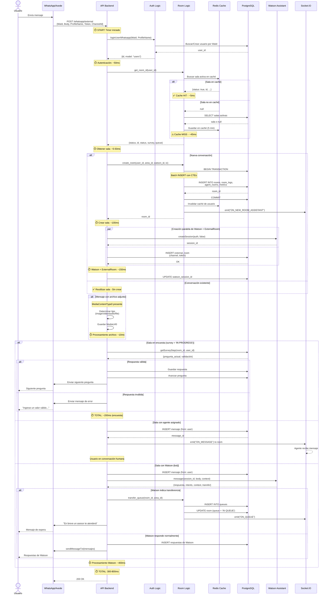

# 🔄 Flujo Funcional - Mensaje Entrante WhatsApp

## 🎯 Objetivo

Documentar el flujo completo de procesamiento de un mensaje entrante desde WhatsApp hasta su atención.

---

## 📊 Información del Flujo

| Propiedad | Valor |
|-----------|-------|
| **Nombre** | Procesamiento de Mensaje WhatsApp |
| **Participantes** | 6 (Usuario, Axede, API, Logic, DB, Watson) |
| **Complejidad** | Alta |
| **Asíncrono** | Parcial (Watson en paralelo) |
| **Integraciones** | WhatsApp (Axede), Watson Assistant, Redis Cache |
| **Tiempo Promedio** | 300-800ms (según caché) |

---

## 🔄 Diagrama de Secuencia



---

## 📋 Descripción Detallada del Flujo

### Paso 1: Recepción del Mensaje

**Qué sucede**:

- Usuario envía mensaje por WhatsApp

- Proveedor Axede recibe mensaje

- Axede dispara webhook a nuestra API

**Datos recibidos**:
```json
{
  "WaId": "573001234567",
  "ProfileName": "Juan Pérez",
  "Body": "Hola, necesito ayuda",
  "MediaContentType0": null,
  "MediaUrl0": null,
  "Token": "abc123...",
  "ChannelId": "channel_001"
}
```

**Validaciones**:

- Token de canal válido

- WaId en formato correcto

---

### Paso 2: Autenticación de Usuario

**Qué sucede**:

- Sistema busca usuario por número de teléfono (WaId)

- Si no existe, lo crea automáticamente

- Retorna user_id

**Lógica**:
```javascript
// Si usuario existe → retornar
// Si no existe → crear con:
//   - username: WaId
//   - fullname: ProfileName
//   - provider: 'WHATSAPP_API'
```

**Performance**: ~50ms

---

### Paso 3: Obtener/Crear Conversación

**Qué sucede**:

- Sistema busca sala activa del usuario

- Primero en caché Redis (5 min TTL)

- Si no está en caché, consulta base de datos

- Si no existe sala, crea nueva

**Optimización con Caché**:

- **Cache HIT**: ~5ms

- **Cache MISS**: ~45ms

- TTL: 5 minutos (balance entre frescura y performance)

**Creación de Sala (si no existe)**:

- Batch INSERT con CTEs (6 queries → 1 query)

- Crea: room, logs, agent_room, metrics

- Invalida caché anterior

- Emite evento Socket.IO

---

### Paso 4: Creación de Sesión Watson (Solo Salas Nuevas)

**Qué sucede**:

- Sistema crea sesión en Watson Assistant

- Simultáneamente guarda info de canal externo

- **Optimización**: Ambas llamadas en paralelo

**Código Optimizado**:
```javascript
const [session] = await Promise.all([
  assistant.createSession(auth, false),
  externalRoom.save(room_id, ChannelId, Token)
]);
```

**Performance**: ~150ms (paralelo) vs ~250ms (secuencial)

---

### Paso 5: Determinación del Flujo

**Sistema decide basándose en estado de la sala**:

#### Opción A: Sala en Encuesta

- survey = 'IN PROGRESS'

- **Flujo**: Validar respuesta → Guardar → Siguiente pregunta

- **Salida**: Pregunta de encuesta vía WhatsApp

#### Opción B: Sala con Agente Humano

- agent_rooms tiene agente activo con status = true

- **Flujo**: Guardar mensaje → Emit Socket.IO → Agente ve mensaje

- **Salida**: Notificación al agente

#### Opción C: Sala con Watson (Bot)

- agent_rooms tiene solo Watson Assistant

- **Flujo**: Procesar con Watson → Detectar transferencia o responder

- **Salida**: Respuesta de Watson vía WhatsApp

---

### Paso 6: Procesamiento con Watson

**Qué sucede**:

- Sistema envía mensaje a Watson Assistant

- Watson analiza intención y contexto

- Watson retorna respuesta y/o acción

**Detección de Transferencia**:
```javascript
if (watsonResponse.context.action === "transfer_to_agent") {
  // Completó flujo de captura de información
  // Encolar para agente humano
  await room.transfer_queue(room_id, area_id);
}
```

**Criterio**: "Completar un flujo (action) definido para la captura de información previo a lanzar la transferencia con un agente"

**Importante**: Usuario NO puede solicitar agente directamente (watsonMaxAttempts = 0)

---

## 📊 Validaciones y Reglas de Negocio

| Paso | Validación | Regla de Negocio | Acción si Falla |
|------|------------|------------------|-----------------|
| 1 | Token y ChannelId válidos | RN-061: Solo canales autorizados | Rechazar request (401) |
| 2 | WaId en formato correcto | RN-001: Un usuario por número | Error (400) |
| 3 | Usuario sin sala duplicada | RN-001: Una sala activa por usuario | Reutilizar sala existente |
| 4 | Horario de atención | RN-002: L-D 07:00-22:00 | Encolar para cierre automático |
| 5 | Estado de sala válido | RN-003: Solo estados permitidos | Error de estado |
| 6 | Encuesta: Respuesta válida | RN-050: Validación por tipo | Mensaje de error |
| 7 | Watson: Timeout 10s | RN-062: SLA de Watson | Error y posible encolamiento |

---

## 🚨 Casos de Error y Manejo

### Error 1: Watson No Responde

**Causa**: Timeout de Watson Assistant (>10s) o error 500

**Manejo**:

1. Sistema registra error en logs

2. Sistema envía mensaje genérico al usuario

3. Opción: Encolar automáticamente para agente humano

4. Notificación a equipo de soporte

**Mensaje al usuario**: "Estamos experimentando problemas técnicos. Un asesor te atenderá pronto."

**Rollback**: No aplica (mensaje ya guardado)

---

### Error 2: Axede Falla al Enviar Respuesta

**Causa**: API de Axede retorna error o timeout

**Manejo**:

1. Mensaje guardado en BD (registro existe)

2. Sistema marca mensaje como FAILED

3. Registra en pending_messages para reintento

4. No se notifica al usuario (él no ve respuesta)

**Rollback**: Parcial (registro permanece)

---

### Error 3: Error al Crear Sala

**Causa**: Fallo en transacción de base de datos

**Manejo**:

1. ROLLBACK completo de transacción

2. No se crea ningún registro

3. Error propagado al caller

4. Usuario recibirá error en próximo intento

**Rollback**: Completo (ROLLBACK SQL)

---

### Error 4: Fuera de Horario

**Causa**: Mensaje recibido fuera de L-D 07:00-22:00

**Manejo**:

1. Sistema crea sala normalmente

2. Cron job detecta sala fuera de horario

3. Sistema cierra sala automáticamente (CLOSED_BY_SCHEDULE)

4. No se envía a cola ni se asigna agente

**Comportamiento**: afterHoursBehavior = close

---

## ⏱️ Métricas y Performance

### Tiempos de Ejecución (Promedio)

| Escenario | Tiempo | Componente Crítico |
|-----------|--------|-------------------|
| **Mensaje con caché** | ~300ms | Watson Assistant |
| **Mensaje sin caché** | ~350ms | DB query + Watson |
| **Sala nueva** | ~700ms | create_room + Watson session |
| **Mensaje con archivo** | ~350ms | Watson (archivo solo URL) |
| **Respuesta encuesta** | ~150ms | Validación + DB |

### Optimizaciones Aplicadas

1. **Caché de salas activas**: Redis 5 min → Reduce 40ms por request

2. **CTEs en create_room**: 6 queries → 1 query → Reduce 60% latencia

3. **Paralelo Watson + ExternalRoom**: Reduce 100ms en salas nuevas

4. **Lazy emit Socket.IO**: setImmediate → No bloquea respuesta

---

## 🎯 Escenarios Especiales

### Escenario 1: Mensaje con Archivo Adjunto

**Condición**: MediaContentType0 presente

**Flujo**:

1. Sistema identifica tipo de archivo

2. Guarda MediaUrl0 (Axede maneja storage)

3. Si es audio: Convierte a tag HTML `<audio>`

4. Continúa flujo normal con Body = URL

**Tipos soportados**: image, video, audio, document

---

### Escenario 2: Usuario Retorna Después de Encuesta

**Condición**: Usuario envía mensaje después de completar encuesta

**Flujo**:

1. Sistema detecta survey = 'COMPLETED'

2. Sistema cierra sala actual

3. Sistema crea nueva sala

4. Nuevo ciclo de atención inicia

---

### Escenario 3: Transferencia Automática desde Watson

**Condición**: Watson detecta action = "transfer_to_agent"

**Flujo**:

1. Watson completó captura de información

2. Sistema encola conversación

3. Usuario recibe mensaje de espera

4. Se ejecuta releaseQueue() automáticamente

5. Agente disponible toma la conversación

**Criterio**: watsonTransferCriteria = "Completar un flujo (action) definido para la captura de información"

---

**Última Actualización**: 18 de diciembre de 2025
