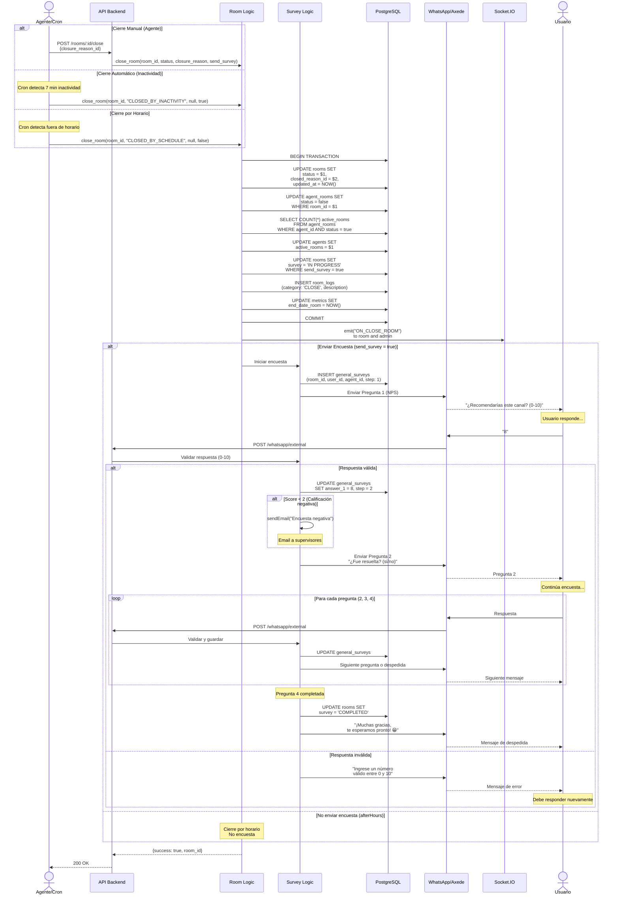

# 🔄 Flujo Funcional - Cierre de Conversación y Encuesta

## 🎯 Objetivo

Documentar el flujo completo de cierre de conversación seguido de encuesta de satisfacción.

---

## 📊 Información del Flujo

| Propiedad | Valor |
|-----------|-------|
| **Nombre** | Cierre de Conversación + Encuesta |
| **Participantes** | 5 (Agente/Sistema, API, Logic, DB, WhatsApp) |
| **Complejidad** | Media |
| **Asíncrono** | No |
| **Tiempo Promedio** | 200-400ms |

---

## 🔄 Diagrama de Secuencia



---

## 📋 Descripción Detallada

### Tipos de Cierre

#### 1. Cierre Manual (Agente)

- **Trigger**: Agente presiona "Cerrar conversación"

- **Motivo**: Obligatorio (closureReasonsRequired = agent_only)

- **Encuesta**: Sí (send_survey = true)

- **Estado**: 'CLOSED'

#### 2. Cierre Automático por Inactividad

- **Trigger**: Cron job detecta 7 minutos sin actividad

- **Tiempo**: autoCloseRoomTime = 7 minutos

- **Encuesta**: Sí

- **Estado**: 'CLOSED_BY_INACTIVITY'

#### 3. Cierre por Horario

- **Trigger**: Cron job fuera de L-D 07:00-22:00

- **Comportamiento**: afterHoursBehavior = close

- **Encuesta**: No

- **Estado**: 'CLOSED_BY_SCHEDULE'

---

### Proceso de Cierre (Paso a Paso)

**Paso 1**: Actualizar estado de sala
```sql
UPDATE rooms SET 
  status = 'CLOSED',
  closed_reason_id = 5,
  updated_at = NOW()
WHERE id = 123
```

**Paso 2**: Desasignar agente
```sql
UPDATE agent_rooms SET status = false
WHERE room_id = 123
```

**Paso 3**: Actualizar contador del agente
```sql
-- Contar salas activas
SELECT COUNT(*) FROM agent_rooms 
WHERE agent_id = 10 AND status = true

-- Actualizar contador
UPDATE agents SET active_rooms = 4
WHERE id = 10
```

**Paso 4**: Iniciar encuesta (si aplica)
```sql
UPDATE rooms SET survey = 'IN PROGRESS'
WHERE id = 123 AND send_survey = true
```

**Paso 5**: Registrar en logs y métricas
```sql
INSERT INTO room_logs (room_id, category, description)
VALUES (123, 'CLOSE', 'Closed by agent with reason_id 5')

UPDATE metrics SET end_date_room = NOW()
WHERE room_id = 123
```

---

### Flujo de Encuesta (4 Preguntas)

#### Pregunta 1: NPS (0-10)
```
"¿Recomendarías este canal a un compañero 
para sus consultas o solicitudes?

Califica de 0 a 10, siendo:
0 = definitivamente no lo recomendaría
10 = lo recomendaría totalmente"
```
**Validación**: Número entero entre 0 y 10

**Acción especial**: Si respuesta < 2 → Email de alerta

---

#### Pregunta 2: Resolución (Sí/No)
```
"¿Fue resuelta su consulta o solicitud?

Responda sí o no"
```
**Validación**: Texto = "sí", "si" o "no" (case insensitive)

---

#### Pregunta 3: Satisfacción (1-5)
```
"¿Qué tan satisfecho estás con la atención 
del servicio por el canal digital?

Califica:
5 = totalmente satisfecho
4 = satisfecho
3 = parcialmente satisfecho
2 = insatisfecho
1 = muy insatisfecho"
```
**Validación**: Número entero entre 1 y 5

---

#### Pregunta 4: Comentarios (Texto Libre)
```
"📝 Escribe tu respuesta en un solo mensaje, 
sin usar Enviar.

Es importante para nosotros conocer más de 
tu experiencia, por favor, deja tus 
observaciones acerca del servicio.

📌 Usa enviar hasta el final; responde todo 
en un solo mensaje"
```
**Validación**: Texto libre, máximo 250 caracteres

---

## 📊 Reglas de Negocio

- **RN-063**: Cierre manual requiere motivo (closure_reason_id)

- **RN-064**: Cierre automático a los 7 minutos de inactividad

- **RN-065**: Cierre por horario NO genera encuesta

- **RN-066**: Encuestas con score < 2 generan alerta por email

- **RN-067**: Agente debe esperar a que usuario complete encuesta para ver resultado

- **RN-068**: Usuario puede responder encuesta en su tiempo (no expira)

- **RN-069**: Contador active_rooms se decrementa automáticamente

---

## 🚨 Casos de Error

### Error 1: Usuario No Responde Encuesta
**Situación**: Usuario cierra WhatsApp sin completar encuesta

**Manejo**:

- Sala queda con survey = 'IN PROGRESS'

- Cuando usuario regrese y envíe mensaje:
  - Sistema detecta encuesta pendiente
  - Continúa desde pregunta actual
  - Usuario puede completar en cualquier momento

**No hay timeout** para encuestas.

---

### Error 2: Respuesta Inválida en Encuesta
**Situación**: Usuario responde "regular" en pregunta Sí/No

**Manejo**:

1. Sistema valida respuesta según tipo de pregunta

2. Detecta que "regular" no está en ["sí", "si", "no"]

3. Envía mensaje de error específico

4. NO avanza pregunta

5. Usuario debe responder nuevamente

**Mensajes de Error**:

- Pregunta 1: "Ingrese un número válido entre 0 y 10"

- Pregunta 2: "Por favor, ingresa solo sí o no"

- Pregunta 3: "Ingrese un número válido entre 1 y 5"

- Pregunta 4: "Comentario muy largo (máx 250 caracteres)"

---

## ⏱️ Métricas

### Tiempos de Ejecución

| Operación | Tiempo Promedio |
|-----------|----------------|
| Cierre de sala | ~200ms |
| Inicio de encuesta | ~150ms |
| Validación de respuesta | ~50ms |
| Encuesta completa (4 preguntas) | Variable (depende de usuario) |

### KPIs de Encuesta

- **Tasa de Respuesta**: % de usuarios que completan encuesta

- **NPS Promedio**: Promedio de pregunta 1

- **Tasa de Resolución**: % de "sí" en pregunta 2

- **Satisfacción Promedio**: Promedio de pregunta 3

- **Alertas Generadas**: Count de scores < 2

---

**Última Actualización**: 18 de diciembre de 2025
