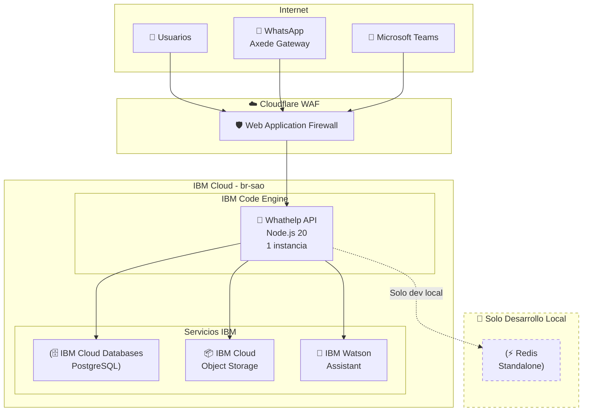
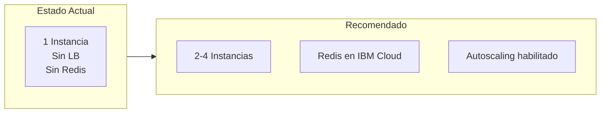
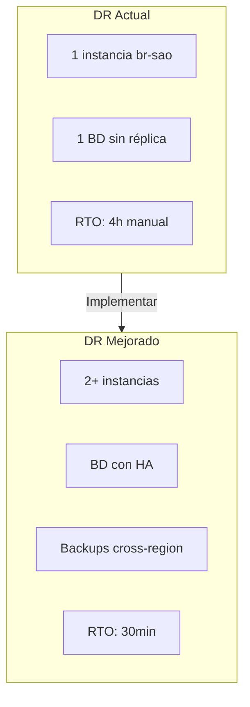

# Deployment - Whathelp Chat API

> **Última actualización**: 18 de diciembre de 2025  
> **Versión**: 2.1.2  
> **Cloud Provider**: IBM Cloud

---

## 📊 Diagrama de Arquitectura



### Componentes

| Componente | Descripción | Estado |
|------------|-------------|--------|
| **Usuarios/Internet** | Clientes web, WhatsApp (Axede), Teams | ✅ Producción |
| **WAF** | Cloudflare Web Application Firewall | ✅ Producción |
| **Load Balancer** | No configurado (instancia única) | ⚠️ Sin LB |
| **Aplicación** | IBM Cloud Code Engine (1 instancia fija) | ✅ Producción |
| **PostgreSQL** | IBM Cloud Databases for PostgreSQL | ✅ Producción |
| **Object Storage** | IBM Cloud Object Storage (us-south) | ✅ Producción |
| **Watson Assistant** | IBM Watson Assistant (us-south) | ✅ Producción |
| **Redis** | Self-hosted, standalone | 🔧 Solo desarrollo |

---

## 🌍 Ambientes

### Development (Local)

| Aspecto | Valor |
|---------|-------|
| **Configuración** | Docker con `Dockerfile.dev` |
| **Puerto** | 8080 |
| **Base de datos** | PostgreSQL local o cloud |
| **Redis** | Sí (localhost:6379) |
| **Hot Reload** | Sí (`node --watch`) |

```bash
# Iniciar en desarrollo
npm run dev
# o con Docker
docker build -f Dockerfile.dev -t whathelp-dev .
docker run -p 8080:8080 whathelp-dev
```

### QA / Testing

| Aspecto | Valor |
|---------|-------|
| **URL** | `https://ibm-watshelpqa-*.codeengine.appdomain.cloud` |
| **Plataforma** | IBM Cloud Code Engine |
| **Base de datos** | IBM Cloud Databases (schema: `banco_bgta_chat_qa`) |
| **Redis** | ❌ No disponible |
| **Instancias** | 1 |

### Production

| Aspecto | Valor |
|---------|-------|
| **URL API** | `https://watsonada.ibmsmartservices.com` |
| **URL Agente** | `https://agente-bdb.ibmsmartservices.com` |
| **URL Usuario** | `https://usuario-bdb.ibmsmartservices.com` |
| **Plataforma** | IBM Cloud Code Engine |
| **Región** | `br-sao` (São Paulo, Brasil) |
| **Base de datos** | IBM Cloud Databases (schema: `banco_bgta_chat`) |
| **Redis** | ❌ No disponible en producción |
| **Instancias** | 1 (fija, sin autoscaling) |
| **Alta disponibilidad** | ❌ No configurada (zona única) |

---

## 📦 Contenedorización

### Docker

#### Dockerfile de Producción (`Dockerfile`)

```dockerfile
FROM --platform=linux/amd64 node:20-slim AS base
RUN mkdir -p /home/node/app/node_modules && chown -R node:node /home/node/app
WORKDIR /home/node/app

COPY package*.json ./
RUN npm install
RUN npm ci --omit=dev

COPY --chown=node:node . .
EXPOSE 8080
CMD [ "node", "./index.js" ]
```

| Aspecto | Valor |
|---------|-------|
| **Imagen base** | `node:20-slim` |
| **Plataforma** | `linux/amd64` |
| **Puerto expuesto** | `8080` |
| **Usuario** | `node` (no root) |
| **Dependencias** | Solo producción (`--omit=dev`) |
| **Comando inicio** | `node ./index.js` |

#### Dockerfile de Desarrollo (`Dockerfile.dev`)

```dockerfile
FROM --platform=linux/amd64 node:20-slim
WORKDIR /home/node/app
COPY . .
EXPOSE 8080
CMD sh -c "npm install && npm run dev"
```

#### Variables de Entorno Críticas

Referencia: `.env.example`

```bash
# Server
NODE_ENV=production
PORT=8080

# PostgreSQL (IBM Cloud Databases)
PG_USERNAME=***
PG_PASSWORD=***
PG_HOST=***.databases.appdomain.cloud
PG_PORT=***
PG_DATABASE=ibmclouddb
PG_SCHEMA=banco_bgta_chat

# Redis (SOLO DESARROLLO - NO EN PROD)
REDIS_HOST=localhost
REDIS_PORT=6379

# IBM Watson Assistant
ASSISTANT_IAM_APIKEY=***
ASSISTANT_URL=https://api.us-south.assistant.watson.cloud.ibm.com/***
ASSISTANT_ID=***

# IBM Cloud Object Storage
COS_ENDPOINT=s3.us-south.cloud-object-storage.appdomain.cloud
COS_APIKEYID=***
COS_BUCKET=whatshelp-bancodebogota

# JWT
JWT_KEY=***
JWT_EXPIRES_IN=24h

# Axede/WhatsApp Gateway
AXEDE_BASE_URL=https://orchgt.app
```

### Container Registry

| Aspecto | Valor |
|---------|-------|
| **Registry** | IBM Cloud Container Registry |
| **Región** | `br-sao` |
| **Naming** | `[⚠️ VALIDAR: nombre exacto del repositorio]` |
| **Tag Strategy** | `latest` (⚠️ No recomendado para producción) |

```bash
# Build y push a IBM CR
ibmcloud cr login
docker build -t br.icr.io/[namespace]/whathelp-api:latest .
docker push br.icr.io/[namespace]/whathelp-api:latest
```

---

## ☸️ Orquestación: IBM Cloud Code Engine

> **Nota**: No se usa Kubernetes tradicional. La aplicación corre en IBM Cloud Code Engine (serverless containers).

### Configuración Actual

| Aspecto | Valor |
|---------|-------|
| **Plataforma** | IBM Cloud Code Engine |
| **Región** | `br-sao` |
| **Proyecto** | `[⚠️ VALIDAR: nombre del proyecto]` |
| **Aplicación** | `[⚠️ VALIDAR: nombre de la app]` |
| **Instancias** | 1 (mínimo y máximo) |
| **Autoscaling** | ❌ Deshabilitado |
| **PM2** | No se usa en Code Engine |

### Gestión de Aplicación

```bash
# Login a IBM Cloud
ibmcloud login -r br-sao

# Seleccionar proyecto Code Engine
ibmcloud ce project select --name [PROYECTO]

# Ver estado de la aplicación
ibmcloud ce app get --name [APP_NAME]

# Ver logs
ibmcloud ce app logs --name [APP_NAME]

# Actualizar imagen
ibmcloud ce app update --name [APP_NAME] --image br.icr.io/[namespace]/whathelp-api:latest
```

---

## 📈 Escalabilidad

### Estado Actual

| Aspecto | Configuración |
|---------|---------------|
| **Tipo de escalamiento** | ❌ No configurado |
| **Instancias** | 1 fija |
| **Autoscaling** | Deshabilitado |
| **Métrica base** | CPU (no activo) |

### ⚠️ Limitaciones Actuales

1. **Instancia única**: No hay redundancia ante fallos

2. **Sin autoscaling**: No responde a picos de demanda

3. **Sin Load Balancer**: Punto único de entrada

4. **Redis solo local**: Cache no disponible en producción

### 💡 Recomendaciones para Escalabilidad



**Plan de mejora sugerido**:

1. Habilitar autoscaling en Code Engine (min: 2, max: 5)

2. Migrar Redis a IBM Cloud Databases for Redis

3. Configurar health checks más estrictos

---

## 🔒 Seguridad y Networking

### WAF (Web Application Firewall)

| Aspecto | Valor |
|---------|-------|
| **Proveedor** | Cloudflare |
| **Estado** | ✅ Configurado |
| **Protección** | DDoS, SQL Injection, XSS |

### SSL/TLS

| Aspecto | Valor |
|---------|-------|
| **Terminación SSL** | En la aplicación |
| **Certificados** | Manuales (`certificate.crt`, `private.key`) |
| **Renovación** | Manual |
| **Ubicación** | Root del proyecto |

```javascript
// Referencia: app/app.js (comentado, disponible para activar)
this.server = https.createServer({
    cert: fs.readFileSync('certificate.crt'),
    key: fs.readFileSync('private.key')
}, this.app)
```

### Seguridad de Aplicación

| Característica | Implementación |
|----------------|----------------|
| **Headers de seguridad** | Helmet v6.2.0 |
| **CSP** | helmet-csp v3.3.1 |
| **CORS** | cors v2.8.5 (configurado) |
| **Hashing passwords** | bcryptjs v3.0.2 |
| **Autenticación** | JWT (jsonwebtoken v9.0.2) |
| **reCAPTCHA** | Google reCAPTCHA v2 |
| **Cookies** | secure: true, httpOnly: true |

### VPC / Networking

| Aspecto | Valor |
|---------|-------|
| **VPC privada** | ❌ No configurada |
| **Red** | Pública |
| **Load Balancer** | ❌ No hay |
| **Multi-AZ** | ❌ No |

---

## 💾 Persistencia y Backups

### Base de Datos PostgreSQL

| Aspecto | Valor |
|---------|-------|
| **Servicio** | IBM Cloud Databases for PostgreSQL |
| **Versión** | [⚠️ VALIDAR: versión específica] |
| **Driver** | `pg` v8.5.1 |
| **Schema** | `banco_bgta_chat` |
| **SSL** | ✅ Habilitado (certificado en `app/config/Cert/postgresql`) |
| **Alta Disponibilidad** | ❌ No configurada |

#### Pool de Conexiones

```javascript
// Referencia: app/services/postgresql.js
{
  max: 20,              // Máximo conexiones
  min: 5,               // Mínimo conexiones
  idleTimeoutMillis: 30000,
  connectionTimeoutMillis: 30000,
  statement_timeout: 30000
}
```

### Backups

| Aspecto | Valor |
|---------|-------|
| **Automáticos** | ✅ Sí (IBM Cloud) |
| **Frecuencia** | Cada 24 horas |
| **Retención** | 7 días |
| **Tipo** | Snapshot completo |

#### Restauración

```bash
# Desde IBM Cloud Console o CLI
ibmcloud cdb deployment-backup-restore [DEPLOYMENT_ID] [BACKUP_ID]
```

### Migraciones

| Aspecto | Valor |
|---------|-------|
| **Herramienta** | SQL manual (psql) |
| **Ubicación** | `db/migrations/` |
| **Archivos** | 3 scripts de índices |
| **Herramienta futura** | No planificada |

```bash
# Aplicar migración
psql $DATABASE_URL -f db/migrations/001_add_performance_indexes.sql
```

### Object Storage

| Aspecto | Valor |
|---------|-------|
| **Servicio** | IBM Cloud Object Storage |
| **Región** | us-south |
| **Bucket** | `whatshelp-bancodebogota` |
| **Uso** | Archivos de conversación |
| **Limpieza** | Diaria (cron 23:30 Bogotá) |

---

## 🏗️ Infraestructura como Código

### Estado Actual

> ⚠️ **No hay IaC configurado actualmente**

La infraestructura se gestiona manualmente a través de:

- IBM Cloud Console (UI)

- IBM Cloud CLI (`ibmcloud`)

### 💡 Recomendación: Terraform para IBM Cloud

```hcl
# Ejemplo de configuración futura
terraform {
  required_providers {
    ibm = {
      source  = "IBM-Cloud/ibm"
      version = "~> 1.0"
    }
  }
}

provider "ibm" {
  region = "br-sao"
}

resource "ibm_code_engine_app" "whathelp_api" {
  project_id = var.project_id
  name       = "whathelp-api"
  image_reference = "br.icr.io/${var.namespace}/whathelp-api:latest"
  
  scale_min_instances = 1
  scale_max_instances = 1
  
  run_env_variables {
    type  = "literal"
    name  = "NODE_ENV"
    value = "production"
  }
}
```

---

## 🔄 Alta Disponibilidad y DR

### Estado Actual

| Aspecto | Valor |
|---------|-------|
| **Multi-AZ** | ❌ No |
| **Multi-región** | ❌ No |
| **Región primaria** | `br-sao` |
| **Región secundaria** | N/A |
| **RTO** | 4 horas |
| **RPO** | [⚠️ VALIDAR: definir RPO] |

### ⚠️ Riesgos Identificados

1. **Punto único de fallo**: Una sola instancia en una sola zona

2. **Sin failover automático**: Recuperación manual requerida

3. **Sin réplica de BD**: Datos en una sola instancia

### 💡 Plan de DR Recomendado



---

## 📋 Checklist de Deployment

### Pre-deployment

- [ ] Variables de entorno configuradas

- [ ] Certificados SSL actualizados

- [ ] Migraciones de BD aplicadas

- [ ] Tests pasando (⚠️ actualmente 0%)

- [ ] Build Docker exitoso

### Deployment

- [ ] Push a IBM Container Registry

- [ ] Actualizar app en Code Engine

- [ ] Verificar logs de inicio

- [ ] Health check `/health` responde 200

### Post-deployment

- [ ] Verificar conexión a PostgreSQL

- [ ] Verificar conexión a Watson

- [ ] Test de endpoints críticos

- [ ] Monitorear errores (⚠️ sin herramienta actual)

---

## 📚 Referencias

- **Dockerfile**: `/Dockerfile`

- **Dockerfile Dev**: `/Dockerfile.dev`

- **Variables ejemplo**: `/.env.example`

- **Configuración app**: `/app/config/index.js`

- **Servicio PostgreSQL**: `/app/services/postgresql.js`

- **Servicio Cache**: `/app/services/cache.js`

- **Migraciones**: `/db/migrations/`
