# CI/CD Pipeline - Whathelp Chat API

> **Última actualización**: 18 de diciembre de 2025  
> **Estado**: Proceso Manual  
> **Herramienta CI/CD**: Ninguna (deployment manual)

---

## 🛠️ Herramienta

| Aspecto | Valor |
|---------|-------|
| **Platform** | ❌ Sin herramienta de CI/CD |
| **Tipo** | Deployment manual |
| **Archivo de config** | N/A |
| **Automatización** | Ninguna |

> ⚠️ **Nota importante**: Actualmente todo el proceso de build y deployment se realiza manualmente desde la máquina del desarrollador.

---

## 📊 Diagrama del Pipeline Actual

```mermaid
flowchart TD
    subgraph Developer["👨‍💻 Desarrollador Local"]
        A["Código fuente"]
        B["git commit/push"]
        C["docker build"]
        D["docker push"]
    end

    subgraph Git["📦 Repositorio Git"]
        E["GitHub/GitLab<br/>GitFlow branches"]
    end

    subgraph Registry["📦 IBM Container Registry"]
        F["br.icr.io/.../whathelp-api:latest"]
    end

    subgraph Production["☁️ IBM Cloud Code Engine"]
        G["ibmcloud ce app update"]
        H["🚀 App desplegada"]
    end

    A --> B
    B --> E
    B --> C
    C --> D
    D --> F
    F --> G
    G --> H

    style A fill:#e1f5fe
    style H fill:#c8e6c9
```



### Stages Actuales (Manuales)

| # | Stage | Descripción | Ejecutor |
|---|-------|-------------|----------|
| 1 | **Commit** | Commit y push a repositorio | Desarrollador |
| 2 | **Build Docker** | `docker build` local | Desarrollador |
| 3 | **Push Registry** | Push a IBM Container Registry | Desarrollador |
| 4 | **Deploy** | Actualizar app en Code Engine | Desarrollador |
| 5 | **Verificación** | Health check manual | Desarrollador |

---

## ⚙️ Proceso de Deployment Detallado

### 1. Preparación del Código

```bash
# Asegurar que estás en la rama correcta
git checkout main  # o develop para QA

# Pull de últimos cambios
git pull origin main

# Verificar que todo esté listo
npm install
npm start  # Test local
```

### 2. Build de Imagen Docker

```bash
# Login a IBM Cloud
ibmcloud login -r br-sao

# Login a Container Registry
ibmcloud cr login

# Build de imagen (producción)
docker build -t br.icr.io/[NAMESPACE]/whathelp-api:latest .

# Verificar imagen creada
docker images | grep whathelp
```

**Tiempo estimado**: ~2-5 minutos

### 3. Push a Registry

```bash
# Push a IBM Container Registry
docker push br.icr.io/[NAMESPACE]/whathelp-api:latest

# Verificar que la imagen está en el registry
ibmcloud cr images --restrict [NAMESPACE]
```

**Tiempo estimado**: ~3-10 minutos (depende del tamaño)

### 4. Deploy a Code Engine

```bash
# Seleccionar proyecto Code Engine
ibmcloud ce project select --name [PROYECTO]

# Actualizar aplicación con nueva imagen
ibmcloud ce app update \
  --name [APP_NAME] \
  --image br.icr.io/[NAMESPACE]/whathelp-api:latest

# Ver estado del deployment
ibmcloud ce app get --name [APP_NAME]
```

**Tiempo estimado**: ~1-3 minutos

### 5. Verificación Post-Deploy

```bash
# Health check
curl https://[URL_APP]/api/health

# Verificar logs
ibmcloud ce app logs --name [APP_NAME] --follow

# Verificar versión
curl https://[URL_APP]/api/ | jq '.version'
```

---

## 🌿 Estrategia de Branching

### Modelo: GitFlow


### Branches

| Branch | Propósito | Deploy a |
|--------|-----------|----------|
| `main` | Código de producción estable | Production |
| `develop` | Desarrollo activo, integración | QA |
| `feature/*` | Nuevas funcionalidades | - |
| `hotfix/*` | Correcciones urgentes | Production (directo) |
| `release/*` | Preparación de releases | Staging → Production |

### Reglas de Branching

```
feature/* → develop (PR requerido)
develop → release/* (cuando hay features listos)
release/* → main (después de QA)
hotfix/* → main + develop (urgente)
```

### Protecciones de Branch

| Branch | Protección |
|--------|------------|
| `main` | [⚠️ VALIDAR: ¿PR requerido? ¿Reviews?] |
| `develop` | [⚠️ VALIDAR: ¿Protegido?] |

> ⚠️ **Recomendación**: Configurar protección de branches con:
> - Requerir Pull Request antes de merge
> - Requerir al menos 1 review
> - Requerir CI passing (cuando se implemente)

---

## 🚀 Proceso de Deployment por Ambiente

### Deploy a Development (Local)

```bash
# Clonar repositorio
git clone [URL_REPO]
cd Demo-Whathelp-Chat-Api

# Instalar dependencias
npm install

# Configurar variables de entorno
cp .env.example .env
# Editar .env con valores locales

# Iniciar en modo desarrollo
npm run dev
```

### Deploy a QA

**Trigger**: Manual, después de merge a `develop`

```bash
# 1. Checkout develop
git checkout develop
git pull origin develop

# 2. Build imagen QA
docker build -t br.icr.io/[NAMESPACE]/whathelp-api-qa:latest .

# 3. Push
docker push br.icr.io/[NAMESPACE]/whathelp-api-qa:latest

# 4. Deploy a Code Engine (proyecto QA)
ibmcloud ce project select --name [PROYECTO_QA]
ibmcloud ce app update --name [APP_QA] --image br.icr.io/[NAMESPACE]/whathelp-api-qa:latest

# 5. Verificar
curl https://[URL_QA]/api/health
```

**Verificación post-deploy**:

- [ ] Health check responde 200

- [ ] Conexión a BD QA funciona

- [ ] Watson Assistant responde

- [ ] Test manual de flujo principal

### Deploy a Production

**Trigger**: Manual, después de merge a `main`

**⚠️ Approval Gate**: Manual (decisión del equipo)

```bash
# 1. Checkout main
git checkout main
git pull origin main

# 2. Build imagen PROD
docker build -t br.icr.io/[NAMESPACE]/whathelp-api:latest .

# 3. Push
docker push br.icr.io/[NAMESPACE]/whathelp-api:latest

# 4. Deploy a Code Engine (proyecto PROD)
ibmcloud ce project select --name [PROYECTO_PROD]
ibmcloud ce app update --name [APP_PROD] --image br.icr.io/[NAMESPACE]/whathelp-api:latest

# 5. Verificar health
curl https://watsonada.ibmsmartservices.com/api/health

# 6. Verificar logs
ibmcloud ce app logs --name [APP_PROD] --follow
```

**Estrategia de deploy**: Rolling (Code Engine default)

---

## 🔐 Secrets y Variables

### Gestión de Secrets

| Aspecto | Valor |
|---------|-------|
| **Almacenamiento** | Archivos `.env` en servidor/contenedor |
| **Método** | Archivos montados o variables de Code Engine |
| **Rotación** | [⚠️ VALIDAR: frecuencia de rotación] |

> ⚠️ **Riesgo**: Los secrets en archivos .env no son la práctica más segura. Considerar IBM Secrets Manager.

### Variables por Ambiente

#### Development
```bash
NODE_ENV=development
PORT=8080
LOG_LEVEL=debug
PG_HOST=localhost
REDIS_HOST=localhost
# Credenciales de desarrollo
```

#### QA
```bash
NODE_ENV=staging
PORT=8080
LOG_LEVEL=info
PG_HOST=***.databases.appdomain.cloud
PG_SCHEMA=banco_bgta_chat_qa
# Sin Redis
```

#### Production
```bash
NODE_ENV=production
PORT=8080
LOG_LEVEL=error
PG_HOST=***.databases.appdomain.cloud
PG_SCHEMA=banco_bgta_chat
# Sin Redis
```

### Lista de Secrets Requeridos

| Secret | Descripción | Ambientes |
|--------|-------------|-----------|
| `PG_USERNAME` | Usuario PostgreSQL | QA, Prod |
| `PG_PASSWORD` | Password PostgreSQL | QA, Prod |
| `JWT_KEY` | Clave para firmar JWTs | Todos |
| `ASSISTANT_IAM_APIKEY` | API Key de Watson | Todos |
| `COS_APIKEYID` | API Key de Object Storage | Todos |
| `GOOGLE_SECRET_KEY_RECAPTCHA` | Secret de reCAPTCHA | Prod |
| `VAPID_PRIVATE_KEY` | Clave para Web Push | Todos |

### Inyección de Variables en Code Engine

```bash
# Configurar variable de entorno
ibmcloud ce app update --name [APP] \
  --env NODE_ENV=production \
  --env PORT=8080

# Configurar desde archivo .env
ibmcloud ce app update --name [APP] --env-from-file .env.production
```

---

## 🔄 Rollback

### Proceso de Rollback Manual

```bash
# 1. Identificar versión anterior (si hay tags)
git log --oneline -10

# 2. Checkout versión anterior
git checkout [COMMIT_HASH]

# 3. Rebuild y push
docker build -t br.icr.io/[NAMESPACE]/whathelp-api:rollback .
docker push br.icr.io/[NAMESPACE]/whathelp-api:rollback

# 4. Deploy versión anterior
ibmcloud ce app update --name [APP] --image br.icr.io/[NAMESPACE]/whathelp-api:rollback

# 5. Verificar
curl https://[URL]/api/health
```

### ⚠️ Limitaciones del Rollback Actual

1. **Sin versionado de imágenes**: Solo se usa tag `latest`

2. **Sin historial en registry**: Imágenes anteriores se sobrescriben

3. **Rollback lento**: Requiere rebuild completo

### 💡 Mejora Recomendada: Versionado de Imágenes

```bash
# Usar semantic versioning o git SHA
VERSION=$(git rev-parse --short HEAD)
docker build -t br.icr.io/[NAMESPACE]/whathelp-api:${VERSION} .
docker build -t br.icr.io/[NAMESPACE]/whathelp-api:latest .

# Push ambas
docker push br.icr.io/[NAMESPACE]/whathelp-api:${VERSION}
docker push br.icr.io/[NAMESPACE]/whathelp-api:latest

# Para rollback, solo cambiar el tag
ibmcloud ce app update --name [APP] --image br.icr.io/[NAMESPACE]/whathelp-api:[VERSION_ANTERIOR]
```

---

## 🧪 Testing en Pipeline

### Estado Actual

| Tipo de Test | Estado | Cobertura |
|--------------|--------|-----------|
| Unit Tests | ❌ No existen | 0% |
| Integration Tests | ❌ No existen | 0% |
| E2E Tests | ❌ No existen | 0% |
| Load Tests | ❌ No existen | 0% |

> ⚠️ **Riesgo Crítico**: Sin tests automatizados, no hay manera de validar que los cambios no rompan funcionalidad existente.

### 💡 Recomendación: Implementar Tests Mínimos

```javascript
// test/health.test.js (ejemplo)
const request = require('supertest');
const app = require('../app/app');

describe('Health Check', () => {
  it('GET /api/health should return 200', async () => {
    const res = await request(app).get('/api/health');
    expect(res.statusCode).toBe(200);
    expect(res.body.status).toBe('healthy');
  });
});
```

---

## 📋 Checklist de Deployment

### Pre-Deployment

- [ ] Código revisado y mergeado a branch correcta

- [ ] Variables de entorno verificadas

- [ ] `.env` actualizado si hay nuevas variables

- [ ] Migraciones de BD aplicadas (si hay)

- [ ] Test local exitoso

### Deployment

- [ ] `ibmcloud login` exitoso

- [ ] `ibmcloud cr login` exitoso

- [ ] `docker build` exitoso

- [ ] `docker push` exitoso

- [ ] `ibmcloud ce app update` exitoso

### Post-Deployment

- [ ] `/api/health` retorna 200

- [ ] `/api/` retorna versión correcta

- [ ] Logs sin errores críticos

- [ ] Test de flujo principal de chat

- [ ] Verificar conexión a Watson

- [ ] Notificar al equipo

---

## 💡 Recomendaciones de CI/CD

### Implementar GitHub Actions (Recomendado)

```yaml
# .github/workflows/deploy.yml (ejemplo futuro)
name: Deploy to IBM Cloud

on:
  push:
    branches: [main]
  workflow_dispatch:

jobs:
  build-and-deploy:
    runs-on: ubuntu-latest
    
    steps:
      - uses: actions/checkout@v4
      
      - name: Setup Node.js
        uses: actions/setup-node@v4
        with:
          node-version: '20'
          
      - name: Install dependencies
        run: npm ci
        
      - name: Run tests
        run: npm test
        
      - name: Login to IBM Cloud
        uses: ibm/actions/iam-login@v1
        with:
          apikey: ${{ secrets.IBM_CLOUD_API_KEY }}
          region: br-sao
          
      - name: Build and push Docker image
        run: |
          ibmcloud cr login
          docker build -t br.icr.io/${{ secrets.ICR_NAMESPACE }}/whathelp-api:${{ github.sha }} .
          docker push br.icr.io/${{ secrets.ICR_NAMESPACE }}/whathelp-api:${{ github.sha }}
          
      - name: Deploy to Code Engine
        run: |
          ibmcloud ce project select --name ${{ secrets.CE_PROJECT }}
          ibmcloud ce app update --name whathelp-api \
            --image br.icr.io/${{ secrets.ICR_NAMESPACE }}/whathelp-api:${{ github.sha }}
            
      - name: Health check
        run: |
          sleep 30
          curl -f https://${{ secrets.APP_URL }}/api/health
```

### Beneficios de Automatizar

| Aspecto | Manual (Actual) | Automatizado |
|---------|-----------------|--------------|
| Tiempo deploy | ~15-20 min | ~5-8 min |
| Errores humanos | Alto riesgo | Bajo riesgo |
| Trazabilidad | Ninguna | Completa |
| Rollback | Difícil | Fácil (por commit) |
| Tests | No se ejecutan | Obligatorios |

---

## 📚 Referencias

- **Package.json**: `/package.json`

- **Dockerfile**: `/Dockerfile`

- **Variables ejemplo**: `/.env.example`

- **Ecosystem PM2**: `/ecosystem.config.js` (no usado en Code Engine)
