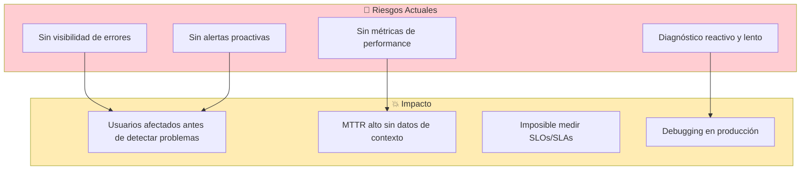

# Monitoreo y Observabilidad - Whathelp Chat API

> **Última actualización**: 18 de diciembre de 2025  
> **Estado**: ⚠️ Sin herramientas de monitoreo configuradas  
> **Prioridad**: CRÍTICA

---

## 🛠️ Stack de Herramientas

### Estado Actual

| Categoría | Herramienta | Estado |
|-----------|-------------|--------|
| APM / Métricas | ❌ Ninguna | No configurado |
| Logs Centralizados | ❌ Ninguna | Solo console.log |
| Error Tracking | ❌ Ninguna | No configurado |
| Alertas | ❌ Ninguna | No configurado |
| Dashboards | ❌ Ninguna | No existen |
| Tracing | ❌ Ninguna | No configurado |

---

## ⚠️ Monitoreo No Configurado - Análisis de Riesgos



### Impacto de No Tener Monitoreo

| Escenario | Sin Monitoreo | Con Monitoreo |
|-----------|---------------|---------------|
| Error en producción | Usuario reporta → Debugging manual | Alerta automática + stack trace |
| Performance degradado | Nadie lo nota hasta quejas | Alerta cuando latency > threshold |
| Base de datos lenta | App falla misteriosamente | Métrica de query time visible |
| Memory leak | App crashea | Alerta gradual antes del crash |

---

## 💡 RECOMENDACIONES CRÍTICAS

### Prioridad 1: Métricas de Aplicación (URGENTE)

#### Opción A: Prometheus + Grafana (Open Source) ⭐ RECOMENDADA

**Pros**:

- ✅ Gratuito y open source

- ✅ Estándar de la industria

- ✅ Muy flexible y extensible

- ✅ Gran comunidad y documentación

**Cons**:

- ⚠️ Requiere infraestructura adicional

- ⚠️ Curva de aprendizaje inicial

**Implementación para Node.js**:

```bash
npm install prom-client
```

```javascript
// app/services/metrics.js
const promClient = require('prom-client');

// Habilitar métricas por defecto
promClient.collectDefaultMetrics({ prefix: 'whathelp_' });

// Métricas custom
const httpRequestDuration = new promClient.Histogram({
  name: 'whathelp_http_request_duration_seconds',
  help: 'Duration of HTTP requests in seconds',
  labelNames: ['method', 'route', 'status_code'],
  buckets: [0.1, 0.3, 0.5, 0.7, 1, 3, 5, 7, 10]
});

const activeConnections = new promClient.Gauge({
  name: 'whathelp_active_socket_connections',
  help: 'Number of active Socket.io connections'
});

const messagesSent = new promClient.Counter({
  name: 'whathelp_messages_total',
  help: 'Total number of messages sent',
  labelNames: ['channel', 'type']
});

module.exports = {
  promClient,
  httpRequestDuration,
  activeConnections,
  messagesSent
};
```

```javascript
// Middleware para medir requests
// app/middlewares/metrics.js
const { httpRequestDuration } = require('../services/metrics');

const metricsMiddleware = (req, res, next) => {
  const start = Date.now();
  
  res.on('finish', () => {
    const duration = (Date.now() - start) / 1000;
    httpRequestDuration
      .labels(req.method, req.route?.path || req.path, res.statusCode)
      .observe(duration);
  });
  
  next();
};

module.exports = metricsMiddleware;
```

```javascript
// Endpoint para Prometheus
// En app/routes/api.js
const { promClient } = require('../services/metrics');

router.get('/metrics', async (req, res) => {
  res.set('Content-Type', promClient.register.contentType);
  res.send(await promClient.register.metrics());
});
```

#### Opción B: Datadog (SaaS)

**Pros**:

- ✅ Setup rápido (minutos)

- ✅ APM, logs, métricas integrados

- ✅ Dashboards pre-configurados

**Cons**:

- ⚠️ Costo mensual (~$15-30/host)

- ⚠️ Vendor lock-in

```bash
npm install dd-trace
```

```javascript
// Primer línea de index.js
require('dd-trace').init({
  service: 'whathelp-api',
  env: process.env.NODE_ENV,
  version: '2.1.2'
});
```

#### Opción C: IBM Cloud Monitoring (Sysdig)

**Pros**:

- ✅ Integración nativa con IBM Cloud

- ✅ Ya tienes cuenta IBM Cloud

**Cons**:

- ⚠️ Costo adicional

- ⚠️ Menos features que Datadog

```bash
# Habilitar desde IBM Cloud Console
ibmcloud ob monitoring config create \
  --cluster [CLUSTER] \
  --instance [SYSDIG_INSTANCE]
```

---

### Prioridad 2: Logs Centralizados (ALTA)

#### Estado Actual del Logging

```javascript
// Actual: console.log en todo el código
console.log(`[CACHE] ✓ Redis connected and ready`);
console.log("Error Metrics Bot");
console.error("Query timeout", errorInfo);
```

**Problemas**:

- ❌ No estructurado (difícil buscar)

- ❌ Se pierde al reiniciar contenedor

- ❌ No hay niveles consistentes

- ❌ No hay contexto (request_id, user_id)

#### Recomendación: Implementar Logger Estructurado

**Opción A: Pino (Recomendado para Node.js)**

```bash
npm install pino pino-pretty
```

```javascript
// app/services/logger.js
const pino = require('pino');

const logger = pino({
  level: process.env.LOG_LEVEL || 'info',
  transport: process.env.NODE_ENV === 'development' 
    ? { target: 'pino-pretty', options: { colorize: true } }
    : undefined,
  base: {
    service: 'whathelp-api',
    version: '2.1.2',
    env: process.env.NODE_ENV
  },
  formatters: {
    level: (label) => ({ level: label })
  }
});

// Child logger con contexto de request
const createRequestLogger = (req) => {
  return logger.child({
    requestId: req.headers['x-request-id'] || crypto.randomUUID(),
    method: req.method,
    url: req.url,
    userAgent: req.headers['user-agent'],
    ip: req.ip
  });
};

module.exports = { logger, createRequestLogger };
```

```javascript
// Uso en código
const { logger } = require('./services/logger');

// En lugar de console.log
logger.info({ roomId: room.id, userId: user.id }, 'Room created');
logger.error({ err, query: sql.text }, 'Database query failed');
logger.warn({ attempts: retries }, 'Redis reconnection attempt');
```

**Formato de salida (JSON estructurado)**:
```json
{
  "level": "info",
  "time": 1734537600000,
  "service": "whathelp-api",
  "version": "2.1.2",
  "requestId": "abc-123",
  "roomId": 456,
  "userId": 789,
  "msg": "Room created"
}
```

#### Centralización de Logs

**Para IBM Cloud**: IBM Log Analysis (LogDNA)

```bash
# Instalar agente LogDNA
npm install @logdna/logger

# Configurar
const logdna = require('@logdna/logger');
const logdnaLogger = logdna.createLogger(process.env.LOGDNA_INGESTION_KEY, {
  app: 'whathelp-api',
  env: process.env.NODE_ENV
});
```

---

### Prioridad 3: Error Tracking (RECOMENDADO)

#### Recomendación: Sentry

```bash
npm install @sentry/node @sentry/profiling-node
```

```javascript
// index.js (al inicio del archivo)
const Sentry = require('@sentry/node');

Sentry.init({
  dsn: process.env.SENTRY_DSN,
  environment: process.env.NODE_ENV,
  release: 'whathelp-api@2.1.2',
  
  // Performance monitoring
  tracesSampleRate: process.env.NODE_ENV === 'production' ? 0.1 : 1.0,
  
  // Profiling
  profilesSampleRate: 0.1,
  
  // Filtrar datos sensibles
  beforeSend(event) {
    // Remover datos sensibles
    if (event.request?.headers) {
      delete event.request.headers['authorization'];
    }
    return event;
  }
});
```

```javascript
// Middleware de error con Sentry
// app/middlewares/errors.js
const Sentry = require('@sentry/node');

const errorHandler = (err, req, res, next) => {
  // Capturar en Sentry
  Sentry.captureException(err, {
    extra: {
      requestId: req.headers['x-request-id'],
      userId: req.user?.id,
      body: req.body
    }
  });
  
  // Log local
  logger.error({ err, requestId: req.requestId }, 'Unhandled error');
  
  res.status(err.status || 500).json({
    error: process.env.NODE_ENV === 'production' 
      ? 'Internal Server Error' 
      : err.message
  });
};
```

**Beneficios de Sentry**:

- Stack traces completos con contexto

- Agrupación automática de errores similares

- Notificaciones por email/Slack

- Integración con GitHub para tracking

- Gratis hasta 5K errores/mes

---

## 📈 Métricas Recomendadas a Monitorear

### Infraestructura (USE Method)

| Recurso | Métrica | Threshold Alerta |
|---------|---------|------------------|
| **CPU** | Utilización % | > 80% por 5min |
| **Memoria** | Uso MB/% | > 85% del límite |
| **Disco** | Espacio disponible | < 20% |
| **Red** | Throughput, errores | Anomalías |

### Aplicación (RED Method)

| Métrica | Descripción | Threshold Alerta |
|---------|-------------|------------------|
| **Rate** | Requests por segundo | Anomalías (> 2x normal) |
| **Errors** | % de respuestas 5xx | > 1% |
| **Duration** | Latencia p95 | > 1 segundo |

### Base de Datos

| Métrica | Descripción | Threshold Alerta |
|---------|-------------|------------------|
| **Conexiones** | Activas / Máximo | > 80% del pool |
| **Query Time** | Duración de queries | p95 > 500ms |
| **Locks** | Lock waits | > 0 por 1min |
| **Replication** | Lag (si aplica) | > 10 segundos |

### Métricas de Negocio (Custom)

| Métrica | Descripción |
|---------|-------------|
| `whathelp_active_rooms` | Salas de chat activas |
| `whathelp_messages_total` | Mensajes enviados (por canal) |
| `whathelp_agents_online` | Agentes conectados |
| `whathelp_queue_size` | Usuarios en cola de espera |
| `whathelp_watson_response_time` | Tiempo de respuesta de Watson |
| `whathelp_transfer_rate` | Transferencias de agente |

---

## 🚨 Alertas Recomendadas

### Alertas Críticas (P0/P1) - Configurar Inmediatamente

```yaml
# Ejemplo de configuración de alertas
alerts:
  - name: High Error Rate
    condition: error_rate > 5%
    duration: 5 minutes
    severity: critical
    action: Page on-call
    
  - name: High Latency
    condition: p95_latency > 2 seconds
    duration: 5 minutes
    severity: critical
    action: Page on-call
    
  - name: Service Down
    condition: health_check_failed
    duration: 2 minutes
    severity: critical
    action: Page on-call immediately
    
  - name: Database Connection Pool Exhausted
    condition: db_connections > 90% of max
    duration: 3 minutes
    severity: critical
    action: Page on-call
```

### Alertas de Warning (P2/P3)

```yaml
alerts:
  - name: High Memory Usage
    condition: memory_usage > 80%
    duration: 10 minutes
    severity: warning
    action: Notify Slack
    
  - name: Slow Watson Response
    condition: watson_response_time_p95 > 3 seconds
    duration: 5 minutes
    severity: warning
    action: Notify Slack
    
  - name: High Queue Size
    condition: queue_size > 50
    duration: 10 minutes
    severity: warning
    action: Notify Slack
    
  - name: Redis Disconnected (Dev Only)
    condition: redis_connected == false
    duration: 1 minute
    severity: warning
    action: Log only
```

### Canales de Notificación Recomendados

| Severidad | Canal | Acción |
|-----------|-------|--------|
| Critical (P0) | SMS + Llamada | Despertar on-call |
| High (P1) | Slack #alerts + Email | Responder < 30min |
| Warning (P2) | Slack #monitoring | Revisar en horario laboral |
| Info (P3) | Log solamente | Revisión semanal |

---

## 📝 Estrategia de Logging

### Niveles de Log Recomendados

| Nivel | Uso | Ejemplos |
|-------|-----|----------|
| `fatal` | App no puede continuar | Fallo de conexión a BD crítico |
| `error` | Errores que afectan funcionalidad | Query falló, API externa down |
| `warn` | Situaciones anormales recuperables | Retry de conexión, rate limit |
| `info` | Información importante | Inicio de app, request completado |
| `debug` | Debugging detallado | Valores de variables, flujo interno |
| `trace` | Muy detallado | Entrada/salida de cada función |

### Configuración por Ambiente

| Ambiente | Nivel Mínimo | Destino |
|----------|--------------|---------|
| Development | `debug` | Console (pretty) |
| QA | `debug` | Console + LogDNA |
| Production | `info` | LogDNA (JSON) |

### Campos Estándar en Logs

```javascript
{
  // Metadatos automáticos
  "timestamp": "2025-12-18T16:53:00.000Z",
  "level": "info",
  "service": "whathelp-api",
  "version": "2.1.2",
  "env": "production",
  "hostname": "whathelp-abc123",
  "pid": 1234,
  
  // Contexto de request
  "requestId": "req-uuid-here",
  "method": "POST",
  "path": "/api/whatsapp/external",
  "statusCode": 200,
  "duration": 245,
  
  // Contexto de negocio
  "userId": 789,
  "roomId": 456,
  "channel": "whatsapp",
  
  // Mensaje
  "msg": "Message sent successfully"
}
```

---

## 📊 Dashboards Recomendados

### Dashboard 1: Overview de Salud

```
┌─────────────────────────────────────────────────────────────┐
│  WHATHELP API - OVERVIEW                                    │
├─────────────────┬─────────────────┬─────────────────────────┤
│ Request Rate    │ Error Rate      │ P95 Latency             │
│ [███████] 150/s │ [██] 0.3%       │ [████] 234ms            │
├─────────────────┴─────────────────┴─────────────────────────┤
│ Requests over Time                                          │
│ ▂▃▅▇█▇▅▃▂▁▂▃▅▇█▇▅▃▂▁▂▃▅▇█▇▅▃▂▁▂▃▅▇                        │
├─────────────────────────────────────────────────────────────┤
│ Top Endpoints by Latency          │ Error Count by Type     │
│ /whatsapp/external: 450ms         │ 500: 12                 │
│ /room/close: 230ms                │ 401: 45                 │
│ /message: 120ms                   │ 404: 8                  │
└─────────────────────────────────────────────────────────────┘
```

### Dashboard 2: Base de Datos

```
┌─────────────────────────────────────────────────────────────┐
│  POSTGRESQL - METRICS                                       │
├─────────────────┬─────────────────┬─────────────────────────┤
│ Active Conns    │ Query Time P95  │ Pool Utilization        │
│ [████] 12/20    │ [██] 45ms       │ [████████] 60%          │
├─────────────────────────────────────────────────────────────┤
│ Slow Queries (>100ms) - Last Hour                           │
│ SELECT * FROM rooms WHERE... : 156ms (15 times)             │
│ UPDATE metrics SET... : 123ms (8 times)                     │
└─────────────────────────────────────────────────────────────┘
```

### Dashboard 3: Métricas de Negocio

```
┌─────────────────────────────────────────────────────────────┐
│  WHATHELP - BUSINESS METRICS                                │
├─────────────────┬─────────────────┬─────────────────────────┤
│ Active Rooms    │ Agents Online   │ Users in Queue          │
│ [███████] 45    │ [████] 8        │ [██] 3                  │
├─────────────────────────────────────────────────────────────┤
│ Messages by Channel (Today)                                 │
│ WhatsApp: ████████████████████████████ 1,234                │
│ Web:      ████████████ 567                                  │
│ Teams:    ████ 123                                          │
├─────────────────────────────────────────────────────────────┤
│ Avg Response Time (Agent) │ Transfer Rate    │ Satisfaction │
│ [██████] 2.5 min          │ [██] 12%         │ [████] 4.2/5 │
└─────────────────────────────────────────────────────────────┘
```

---

## 📏 SLIs y SLOs

### Definidos por el Equipo

| SLI | Target (SLO) | Actual | Estado |
|-----|--------------|--------|--------|
| **Disponibilidad** | 99.5% mensual | [⚠️ Sin medición] | ❓ |
| **Latencia P95** | < 500ms | [⚠️ Sin medición] | ❓ |
| **Error Rate** | < 1% | [⚠️ Sin medición] | ❓ |
| **RTO** | 4 horas | Definido | ✅ |

### SLOs Recomendados

```yaml
slos:
  availability:
    target: 99.5%
    window: 30 days
    calculation: successful_requests / total_requests
    
  latency:
    target: 95th percentile < 500ms
    window: 30 days
    
  error_rate:
    target: < 1%
    window: 7 days
    
  throughput:
    target: > 100 req/s capacity
    
error_budget:
  monthly_downtime_allowed: 3.65 hours  # (100% - 99.5%) * 30 * 24
```

---

## 🔍 Tracing Distribuido

### Estado Actual
❌ No configurado

### Recomendación: OpenTelemetry

```bash
npm install @opentelemetry/sdk-node @opentelemetry/auto-instrumentations-node
```

```javascript
// tracing.js
const { NodeSDK } = require('@opentelemetry/sdk-node');
const { getNodeAutoInstrumentations } = require('@opentelemetry/auto-instrumentations-node');

const sdk = new NodeSDK({
  serviceName: 'whathelp-api',
  instrumentations: [getNodeAutoInstrumentations()],
});

sdk.start();
```

**Beneficios**:

- Ver flujo completo de requests

- Identificar bottlenecks entre servicios

- Debug de problemas de latencia

- Visualización de dependencias

---

## 📋 Plan de Implementación Recomendado

### Fase 1: Quick Wins (1-2 semanas)

1. **Implementar logger estructurado (Pino)**
   - Reemplazar console.log
   - Agregar contexto de request
   - Formato JSON en producción

2. **Agregar endpoint de métricas básicas**
   - `/api/metrics` con prom-client
   - Métricas de request rate, latency, errors

3. **Configurar Sentry (gratis)**
   - Captura automática de errores
   - Alertas por email

### Fase 2: Observabilidad Básica (2-4 semanas)

1. **IBM Log Analysis**
   - Centralizar logs en LogDNA
   - Configurar retención 7-30 días

2. **Prometheus + Grafana**
   - Desplegar en IBM Cloud
   - Dashboards básicos

3. **Alertas críticas**
   - Error rate > 5%
   - Latency P95 > 2s
   - Health check fails

### Fase 3: Observabilidad Avanzada (1-2 meses)

1. **Métricas de negocio custom**

2. **OpenTelemetry tracing**

3. **SLO tracking y error budgets**

4. **On-call rotation**

---

## 📚 Referencias

- **Logging actual**: Morgan en `app/app.js`

- **Health check**: `/api/health` en `app/routes/api.js`

- **Cache stats**: `/api/cache/stats` en `app/routes/api.js`

- **Métricas internas**: Tabla `metrics` en PostgreSQL

### Recursos Externos

- [Pino Logger](https://github.com/pinojs/pino)

- [prom-client](https://github.com/siimon/prom-client)

- [Sentry Node.js](https://docs.sentry.io/platforms/node/)

- [OpenTelemetry JS](https://opentelemetry.io/docs/instrumentation/js/)

- [IBM Cloud Monitoring](https://cloud.ibm.com/docs/monitoring)
