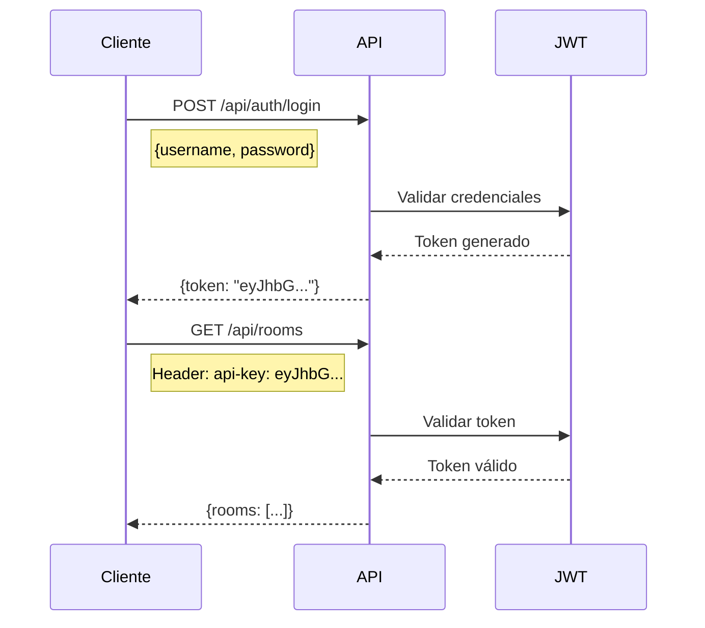

# 📖 Referencia de API

## 🎯 Documentación Interactiva (Swagger UI)

!!! info "🚀 Selector de Servidor"
    El Swagger UI incluye un dropdown de servidores donde puedes elegir:

    - 🚀 **Producción**: `https://banco-bogota-chat-api.1el8z9mf01yx.br-sao.codeengine.appdomain.cloud/api`
    - 🧪 **Staging/QA**: `https://ibm-watshelpqa-api.1js641d0bqq3.us-east.codeengine.appdomain.cloud/api`
    - 💻 **Desarrollo Local**: `http://localhost:8080/api`

    También puedes escribir manualmente cualquier URL personalizada.

<swagger-ui src="../openapi.json"/>

!!! tip "💡 Cómo Usar el Swagger UI"
    1. Selecciona el servidor en el dropdown
    2. Haz clic en "Authorize" para configurar tu token
    3. Expande un endpoint y haz clic en "Try it out"
    4. Completa los parámetros requeridos
    5. Haz clic en "Execute" para probar la API en vivo

---

## Información General

| Propiedad | Valor |
|-----------|-------|
| **Nombre** | api-watshelp-bdb |
| **Versión** | 1.5.0 |
| **Formato** | JSON |
| **Charset** | UTF-8 |
| **Base Path** | `/api` |
| **Licencia** | ISC |

### Descripción

API backend desarrollada en Node.js/Express para el sistema de atención al cliente WhatsHelp de las entidades. Provee funcionalidades de chat multicanal con:

- 💚 **WhatsApp** - Integración con Axede

- 🟣 **Microsoft Teams** - Canal empresarial

- 🤖 **Watson Assistant** - Chatbot inteligente

---

## Servidores Disponibles

| Ambiente | URL | Descripción |
|----------|-----|-------------|
| 🚀 Producción | `https://banco-bogota-chat-api.1el8z9mf01yx.br-sao.codeengine.appdomain.cloud/api` | Servidor de producción en IBM Code Engine (Brasil) |
| 🧪 Staging/QA | `https://ibm-watshelpqa-api.1js641d0bqq3.us-east.codeengine.appdomain.cloud/api` | Ambiente de pruebas y QA |
| 💻 Desarrollo | `http://localhost:8080/api` | Servidor local para desarrollo |

---

## 🔐 Autenticación

La API utiliza **JWT (JSON Web Token)** transmitido mediante el header `api-key`.

### Esquema de Seguridad

| Tipo | Nombre | Ubicación |
|------|--------|-----------|
| API Key | `api-key` | Header HTTP |

### Flujo de Autenticación



### Endpoints de Autenticación

| Endpoint | Método | Descripción |
|----------|--------|-------------|
| `/api/auth/login` | POST | Login de usuario final |
| `/api/auth/agent/login` | POST | Login de agente de soporte |
| `/api/auth/admin/login` | POST | Login de administrador |
| `/api/auth/agent/logout/{agent}` | DELETE | Logout de agente |
| `/api/auth/profile` | GET | Obtener perfil autenticado |

### Ejemplo de Login

```bash
curl -X POST "https://banco-bogota-chat-api.1el8z9mf01yx.br-sao.codeengine.appdomain.cloud/api/auth/agent/login" \
  -H "Content-Type: application/json" \
  -d '{
    "username": "agente.soporte",
    "password": "MiContraseña123!"
  }'
```

**Respuesta exitosa:**

```json
{
  "token": "eyJhbGciOiJIUzI1NiIsInR5cCI6IkpXVCJ9.eyJpZCI6MSwibW9kZWwiOiJhZ2VudHMiLCJpYXQiOjE3MDI5MjAwMDB9.abc123...",
  "user": {
    "id": 1,
    "fullname": "Agente de Soporte",
    "username": "agente.soporte",
    "email": "agente@empresa.com",
    "status": "ACTIVE",
    "admin": false
  }
}
```

### Uso del Token

```bash
curl -X GET "https://banco-bogota-chat-api.1el8z9mf01yx.br-sao.codeengine.appdomain.cloud/api/rooms" \
  -H "api-key: eyJhbGciOiJIUzI1NiIsInR5cCI6IkpXVCJ9..."
```

---

## 🚦 Rate Limiting

!!! warning "No Configurado"
    Actualmente la API **no tiene rate limiting** implementado. Se recomienda implementar límites en un API Gateway o proxy inverso.

---

## 📦 Versionado

La API utiliza versionado mediante **base path**:

- Versión actual: `1.5.0`

- Base path: `/api`

No hay versionado numérico en la URL (ej: `/api/v1/`). Los cambios breaking se comunican mediante release notes.

---

## 📋 Headers Globales

### Headers de Request

| Header | Tipo | Requerido | Descripción |
|--------|------|-----------|-------------|
| `Content-Type` | string | Sí | `application/json` para la mayoría de endpoints |
| `api-key` | string | Sí* | Token JWT de autenticación |
| `Accept` | string | No | `application/json` |

*Requerido para endpoints protegidos

### Headers de Response

| Header | Descripción |
|--------|-------------|
| `Content-Type` | `application/json; charset=utf-8` |
| `X-Powered-By` | `Express` |

---

## 📊 Códigos de Estado HTTP

| Código | Nombre | Descripción |
|--------|--------|-------------|
| `200` | OK | Solicitud exitosa |
| `201` | Created | Recurso creado exitosamente |
| `400` | Bad Request | Error en los datos enviados |
| `401` | Unauthorized | Token inválido o no proporcionado |
| `403` | Forbidden | Sin permisos para el recurso |
| `404` | Not Found | Recurso no encontrado |
| `423` | Locked | Recurso bloqueado (ej: tipo de archivo no permitido) |
| `500` | Internal Server Error | Error interno del servidor |

---

## 📝 Formato de Respuestas

### Respuesta Exitosa

```json
{
  "agents": [
    {
      "id": 1,
      "fullname": "Juan Pérez",
      "username": "juan.perez",
      "email": "juan.perez@empresa.com",
      "status": "ACTIVE",
      "online": true
    }
  ]
}
```

### Respuesta de Error

```json
{
  "message": "Unauthorized",
  "code": "AUTH_FAILED",
  "details": {
    "reason": "Token expired"
  }
}
```

### Error de Validación

```json
{
  "errors": {
    "username": {
      "msg": "The field username is required",
      "param": "username",
      "location": "body"
    },
    "password": {
      "msg": "The field password is required",
      "param": "password",
      "location": "body"
    }
  }
}
```

---

## 📄 Paginación

Los endpoints que retornan listas soportan paginación mediante query parameters:

| Parámetro | Tipo | Default | Descripción |
|-----------|------|---------|-------------|
| `page` | integer | 1 | Número de página (1-indexed) |
| `pageSize` | integer | 20 | Elementos por página |

### Ejemplo

```bash
curl -X GET "https://banco-bogota-chat-api.../api/agents?page=2&pageSize=10" \
  -H "api-key: eyJhbG..."
```

**Respuesta con paginación:**

```json
{
  "agents": [...],
  "page": 2,
  "pageSize": 10,
  "total": 45,
  "totalPages": 5
}
```

---

## 📁 Subida de Archivos

### Configuración

| Propiedad | Valor |
|-----------|-------|
| Tamaño máximo | 5 MB |
| Tipos permitidos | `image/*`, `application/pdf` |
| Encoding | `multipart/form-data` |

### Endpoints de Upload

| Endpoint | Descripción |
|----------|-------------|
| `POST /api/messages/file` | Enviar archivo en mensaje |
| `POST /api/watson/assistant/messages/file` | Enviar archivo a Watson |
| `POST /api/mass-alerts` | Crear alerta con imagen |

### Ejemplo

```bash
curl -X POST "https://banco-bogota-chat-api.../api/messages/file" \
  -H "api-key: eyJhbG..." \
  -F "file=@documento.pdf"
```

---

## 🔧 Ejemplos Completos

### 1. Listar Salas Activas

```bash
curl -X GET "https://banco-bogota-chat-api.1el8z9mf01yx.br-sao.codeengine.appdomain.cloud/api/rooms" \
  -H "api-key: eyJhbGciOiJIUzI1NiIsInR5cCI6IkpXVCJ9..." \
  -H "Content-Type: application/json"
```

### 2. Enviar Mensaje

```bash
curl -X POST "https://banco-bogota-chat-api.1el8z9mf01yx.br-sao.codeengine.appdomain.cloud/api/messages" \
  -H "api-key: eyJhbGciOiJIUzI1NiIsInR5cCI6IkpXVCJ9..." \
  -H "Content-Type: application/json" \
  -d '{
    "roomId": 123,
    "fromModel": "agents",
    "type": "text",
    "body": "¡Hola! ¿En qué puedo ayudarte?",
    "read": false,
    "phone_number": "3001234567"
  }'
```

### 3. Crear Agente

```bash
curl -X POST "https://banco-bogota-chat-api.1el8z9mf01yx.br-sao.codeengine.appdomain.cloud/api/agents" \
  -H "api-key: eyJhbGciOiJIUzI1NiIsInR5cCI6IkpXVCJ9..." \
  -H "Content-Type: application/json" \
  -d '{
    "fullname": "Carlos Rodríguez",
    "username": "carlos.rodriguez",
    "password": "SecurePass123!",
    "email": "carlos.rodriguez@empresa.com",
    "phone_number": "3001234567",
    "rooms": 5,
    "admin": false,
    "status": "ACTIVE"
  }'
```

---

## 🧪 Testing con Swagger UI

1. Abre el Swagger UI en tu navegador

2. Selecciona el servidor QA: `https://ibm-watshelpqa-api.1js641d0bqq3.us-east.codeengine.appdomain.cloud/api`

3. Haz clic en **Authorize** 🔒

4. Ingresa tu token JWT en el campo `api-key`

5. Prueba los endpoints interactivamente

---

## 📥 Importar en Postman

### Opción 1: Importar OpenAPI directamente

1. Abre Postman

2. Click en **Import** → **Link**

3. Pega la URL del archivo `openapi.json`

4. Click **Continue** → **Import**

### Opción 2: Importar archivo local

1. Descarga `openapi.json` desde el repositorio

2. En Postman: **Import** → **Upload Files**

3. Selecciona el archivo `openapi.json`

4. Configura las variables de entorno:
   - `baseUrl`: URL del servidor
   - `apiKey`: Token JWT

---

## 🛠️ Generar SDKs

Puedes generar clientes automáticamente usando [OpenAPI Generator](https://openapi-generator.tech/):

### JavaScript/TypeScript

```bash
npx @openapitools/openapi-generator-cli generate \
  -i openapi.json \
  -g typescript-axios \
  -o ./sdk/typescript
```

### Python

```bash
npx @openapitools/openapi-generator-cli generate \
  -i openapi.json \
  -g python \
  -o ./sdk/python
```

### Java

```bash
npx @openapitools/openapi-generator-cli generate \
  -i openapi.json \
  -g java \
  -o ./sdk/java
```

---

## 🏷️ Tags de Endpoints

| Tag | Descripción | Endpoints |
|-----|-------------|-----------|
| Health | Monitoreo y estado del sistema | 4 |
| Auth | Autenticación y sesiones | 8 |
| Agents | Gestión de agentes | 15 |
| Users | Gestión de usuarios | 6 |
| Rooms | Salas de conversación | 10 |
| Messages | Mensajes y comunicación | 3 |
| Areas | Áreas de atención | 3 |
| Watson | Integración Watson Assistant | 4 |
| Surveys | Encuestas de satisfacción | 3 |
| Metrics | Métricas y reportes | 6 |
| Alerts | Alertas para agentes | 5 |
| Notifications | Sistema de notificaciones | 4 |
| Queue | Cola de atención | 2 |
| MassAlerts | Alertas masivas | 4 |
| ProtocolMessages | Mensajes de protocolo | 4 |
| ClosureReasons | Motivos de cierre | 4 |
| Teams | Integración Microsoft Teams | 1 |
| WhatsApp | Integración WhatsApp | 1 |

---

## 📚 Recursos Adicionales

- [Especificación OpenAPI 3.0](https://swagger.io/specification/)

- [Documentación de arquitectura](./04-tecnica/01-arquitectura.md)

- [Modelo de datos](./04-tecnica/02-modelo-datos.md)

- [Integraciones externas](./04-tecnica/04-integraciones.md)

---

## 📧 Contacto

Para soporte técnico o preguntas sobre la API:

- **Email**: Daniel.Collazos@ibm.com

- **Equipo**: IBM - Transformation and Innovation Team
