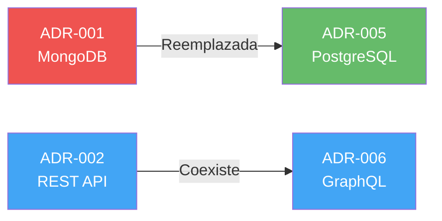

# 📝 Especificación de Salida - ADR (Architecture Decision Records)

## CONTEXTO

Recibirás:
1. **Análisis automático** (decisiones identificadas del código)
2. **Respuestas del formulario** (contexto, alternativas, justificaciones)

---

## TAREA

Genera el archivo: `ai_docs/03-arquitectura/04-decisiones.md`

---

## GUÍAS DE ESTILO

### Formato ADR
- **Estructura estándar** → Status, Context, Decision, Alternatives, Consequences
- **Lenguaje claro** → Técnico pero entendible
- **Justificaciones** → Por qué, no solo qué
- **Trade-offs explícitos** → Qué se sacrificó

### Diagramas
- **Decision tree** si hay múltiples alternativas evaluadas
- **Comparison tables** para pros/cons de alternativas
- **Timeline** si hay evolución de decisiones

---

## ESTRUCTURA DEL ARCHIVO

```markdown
# 🏗️ Decisiones de Arquitectura (ADRs)

## 🎯 Objetivo

Documentar las decisiones arquitectónicas significativas del proyecto, su contexto y consecuencias.

---

## 📋 Índice de Decisiones

| ID | Título | Estado | Fecha | Categoría |
|----|--------|--------|-------|-----------|
| ADR-001 | [Título] | Aceptada ✅ | [YYYY-MM-DD] | Stack |
| ADR-002 | [Título] | Aceptada ✅ | [YYYY-MM-DD] | Arquitectura |
| ADR-003 | [Título] | Aceptada ✅ | [YYYY-MM-DD] | Base de Datos |
| [Listar todas las decisiones detectadas + del formulario] |

**Leyenda de Estados:**
- ✅ Aceptada - Implementada y en uso
- 🔄 En Revisión - Bajo evaluación
- ⚠️ Deprecated - Reemplazada por otra decisión
- ❌ Rechazada - Evaluada pero no implementada

---

## 🏗️ ADRs Detallados

[Para CADA decisión identificada]

---

### ADR-001: [Título Descriptivo de la Decisión]

**Estado:** ✅ Aceptada

**Fecha:** [YYYY-MM-DD] - [Inferir de git history o usar fecha actual]

**Categoría:** [Stack Tecnológico / Arquitectura / Base de Datos / Seguridad / etc.]

**Autores:** [Si se conoce del formulario o git]

---

#### Contexto

[Explicación clara del problema o necesidad que llevó a esta decisión]

**Situación:**
- [Qué problema se necesitaba resolver]
- [Qué restricciones existían]
- [Qué requisitos había]

**Restricciones:**
- [Técnicas: performance, escalabilidad]
- [Negocio: presupuesto, tiempo, equipo]
- [Organizacionales: experiencia del equipo, soporte]

---

#### Decisión

**Se decidió:** [QUÉ se decidió hacer - claro y específico]

**Implementación:**
```[lenguaje si aplica]
// Ejemplo de cómo se implementó (del código real)
```

**Configuración:**
- [Detalles de configuración relevantes]
- [Versiones específicas]

---

#### Alternativas Consideradas

[Para cada alternativa evaluada]

##### Alternativa 1: [Nombre de la alternativa]

**Descripción:** [Qué era esta alternativa]

**Pros:**
- ✅ [Ventaja 1]
- ✅ [Ventaja 2]

**Contras:**
- ❌ [Desventaja 1]
- ❌ [Desventaja 2]

**Razón de rechazo:** [Por qué NO se eligió esta alternativa]

---

##### Alternativa 2: [Otra alternativa]

[Misma estructura]

---

[Si hay más de 3 alternativas, usar tabla comparativa]

#### Tabla Comparativa de Alternativas

| Criterio | [Decisión Tomada] | [Alt 1] | [Alt 2] | [Alt 3] |
|----------|-------------------|---------|---------|---------|
| Performance | ⭐⭐⭐⭐⭐ | ⭐⭐⭐ | ⭐⭐⭐⭐ | ⭐⭐ |
| Facilidad de uso | ⭐⭐⭐⭐ | ⭐⭐⭐⭐⭐ | ⭐⭐ | ⭐⭐⭐ |
| Costo | Bajo | Alto | Medio | Bajo |
| Madurez | Alta | Media | Alta | Baja |
| Experiencia equipo | Alta | Baja | Media | Ninguna |

---

#### Consecuencias

##### ✅ Positivas

- [Beneficio 1 obtenido]
- [Beneficio 2 obtenido]
- [Impacto positivo en X]

##### ⚠️ Negativas (Trade-offs)

- [Compromiso 1 aceptado]
- [Limitación 2 asumida]
- [Qué se sacrificó]

##### 🔄 Neutral

- [Cambios necesarios]
- [Ajustes requeridos]

---

#### Riesgos y Mitigaciones

| Riesgo | Probabilidad | Impacto | Mitigación |
|--------|--------------|---------|------------|
| [Riesgo 1] | Alta/Media/Baja | Alto/Medio/Bajo | [Cómo se mitiga] |

---

#### Decisiones Relacionadas

- Ver [ADR-XXX]: [Relación con otra decisión]
- Reemplaza [ADR-YYY]: [Si depreca otra decisión]

---

#### Referencias

- [Documentación oficial de la tecnología]
- [Artículos/Papers que influyeron]
- [Benchmarks realizados]
- [Issues/PRs relevantes]

---

[Repetir estructura para TODAS las ADRs]

---

## 📊 Diagrama de Evolución de Decisiones

[Si hay decisiones que han evolucionado o se han reemplazado]



---

## 📈 Impacto de Decisiones por Categoría

| Categoría | # Decisiones | Impacto en Complejidad | Impacto en Costo | Impacto en Performance |
|-----------|--------------|------------------------|------------------|------------------------|
| Stack | [N] | [Bajo/Medio/Alto] | [Bajo/Medio/Alto] | [Bajo/Medio/Alto] |
| Arquitectura | [N] | [Bajo/Medio/Alto] | [Bajo/Medio/Alto] | [Bajo/Medio/Alto] |
| Base de Datos | [N] | [Bajo/Medio/Alto] | [Bajo/Medio/Alto] | [Bajo/Medio/Alto] |

---

## 🔮 Decisiones Futuras en Consideración

[Del formulario si se mencionaron]

### En Evaluación

**[Nombre de decisión futura]**
- **Motivación:** [Por qué se está considerando]
- **Estado:** 🔄 En investigación
- **Fecha estimada:** [Cuándo se decidirá]

---

## 📝 Decisiones Lamentadas / Lecciones Aprendidas

[Del formulario si se especificó]

**[Nombre de decisión]**
- **Qué salió mal:** [Problema encontrado]
- **Costo del cambio:** [Si se cambió o se planea cambiar]
- **Lección:** [Qué se aprendió]

---

## ✅ Principios Arquitectónicos Emergentes

[Inferidos de las decisiones documentadas]

Basándose en las decisiones tomadas, los principios arquitectónicos que guían el proyecto son:

1. **[Principio 1]**: [Descripción - ej: "Simplicidad sobre complejidad prematura"]
   - Evidencia: ADR-001, ADR-003
   
2. **[Principio 2]**: [Descripción - ej: "Priorizar experiencia del equipo"]
   - Evidencia: ADR-002, ADR-005

3. **[Principio 3]**: [Descripción]
   - Evidencia: [ADRs relacionados]

---

<div style="text-align: center; margin-top: 50px;">
    <small>📅 Última actualización: [FECHA_ACTUAL]</small><br/>
    <small>🏗️ ADRs identificados y documentados automáticamente</small>
</div>
```

---

## REGLAS DE IMPLEMENTACIÓN

### 1. Contenido
- **5-8 ADRs** principales (del análisis + formulario)
- **Decisiones significativas** → No trivialidades
- **Contexto completo** → Por qué era necesaria
- **Alternativas reales** → Las que se evaluaron de verdad

### 2. Estructura
- **Formato ADR estándar** → Status, Context, Decision, Alternatives, Consequences
- **Secciones completas** → No omitir partes
- **Lenguaje claro** → Técnico pero entendible

### 3. Evidencia
- **Basado en código** → Ejemplos del proyecto real
- **Referencias** → A archivos específicos
- **Versiones** → Exactas de package.json, etc.

### 4. Diagramas (si aplica)
- **Evolution diagram** → Si hay decisiones que evolucionaron
- **Comparison tables** → Para alternativas
- **Decision tree** → Si hay flujo de decisiones dependientes

### 5. Formato
- **Línea en blanco antes de listas**
- **Tablas bien formadas**
- **Emojis consistentes** (✅, ⚠️, ❌, 🔄)
- **Código de ejemplo** del proyecto real

### 6. Creación de Archivo
- **Ruta**: `ai_docs/03-arquitectura/04-decisiones.md`
- **Crear carpeta** si no existe
- **1 archivo** con todas las ADRs
- **Guardar automáticamente**

---

## PROCESO DE EJECUCIÓN

1. **Leer** análisis + respuestas del formulario
2. **Generar ADRs** para cada decisión identificada
3. **Completar estructura** → Todas las secciones
4. **Verificar**:
   - Contexto claro y justificado
   - Alternativas documentadas
   - Consecuencias explícitas
   - Trade-offs identificados
   - Formato consistente
5. **Guardar** en ruta especificada

---

## EJEMPLO DE INFERENCIA

**Si detectas:**
- `package.json`: `"express": "^4.18.2"`
- No hay NestJS, Fastify, Koa
- Estructura simple de controllers/routes

**Genera ADR:**

```markdown
### ADR-001: Usar Express.js como framework web

**Contexto:**
Necesitábamos un framework web para Node.js que fuera:
- Maduro y confiable
- Con ecosistema amplio de middleware
- Fácil de aprender para el equipo

**Decisión:**
Usar Express.js v4.18 como framework web principal

**Alternativas Consideradas:**

**Fastify:** Rechazado por priorizar simplicidad sobre performance extrema
**NestJS:** Rechazado por overhead arquitectural innecesario para un equipo pequeño
**Koa:** Rechazado por menor ecosistema de plugins

**Consecuencias:**
✅ Ecosistema maduro con miles de middlewares
✅ Curva de aprendizaje baja
⚠️ Performance ligeramente inferior a Fastify (aceptable para nuestro caso)
```
