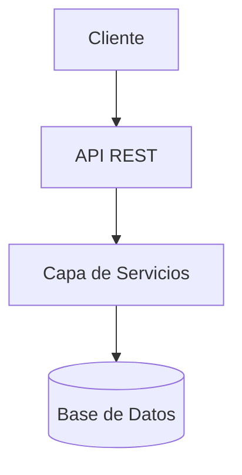

# 📄 Especificación de Salida - Arquitectura

Genera **1 archivo markdown** con la siguiente estructura:

---

## 📁 Archivo: `ai_docs/01-arquitectura/arquitectura.md`

```markdown
# 🏗️ Arquitectura del Sistema

## Resumen Ejecutivo
Breve descripción de la arquitectura del sistema.

---

## Diagrama de Alto Nivel



---

## Componentes Principales

### 1. Capa de Presentación
- Descripción
- Tecnologías

### 2. Capa de Lógica
- Descripción
- Patrones utilizados

### 3. Capa de Datos
- Descripción
- Persistencia

---

## Integraciones Externas

### API Externa 1
- Propósito
- Endpoint
- Autenticación

---

## Decisiones Arquitectónicas

### ¿Por qué Monolito?
Explicación de la decisión.

### ¿Por qué PostgreSQL?
Explicación de la decisión.

---

## Escalabilidad

### Estrategia Actual
Descripción.

### Planes Futuros
Roadmap.
```
