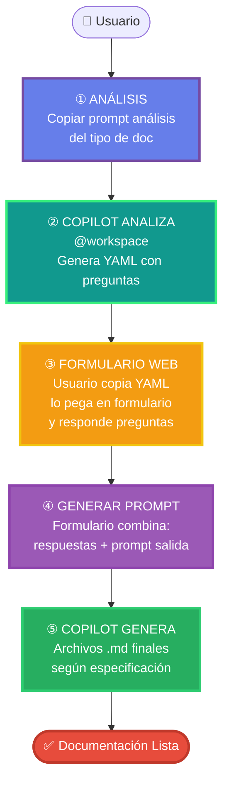

# 🤖 Sistema de Generación de Documentación con IA

Sistema que combina análisis automático del código con formularios interactivos para generar documentación técnica completa.

---

## 📊 Flujo General (Aplica para Todos los Prompts)



---

## 🎯 Componentes del Sistema

### Para CADA Tipo de Documentación

Cada tipo de documentación (deployment, API, arquitectura, etc.) tiene:

#### 1. **`01-analisis.md`**
- **Qué hace**: Prompt que Copilot ejecuta sobre `@workspace`
- **Input**: Código del proyecto
- **Output**: 
  - Reporte en consola con hallazgos
  - YAML con preguntas categorizadas:
    - ✅ **YA_SABEMOS**: Info encontrada con certeza
    - ⚠️ **VALIDAR**: Info parcial que necesita confirmación
    - ❓ **NO_SABEMOS**: Info que no está en el código
- **NO genera archivos**, solo análisis + YAML

#### 2. **`02-salida.md`**
- **Qué contiene**: Especificación de archivos a generar
- **Incluye**:
  - Formato de cada archivo
  - Estructura requerida
  - Diagramas Mermaid necesarios
  - Reglas de validación
  - Ejemplos
- **Cuándo se usa**: Se combina con respuestas del formulario para generar el prompt final

#### 3. **`ejemplo-yaml.yaml`** (opcional)
- Ejemplo de YAML generado para referencia

---

## 🔄 Flujo Detallado Paso a Paso

### ① Copiar Prompt de Análisis

El usuario navega a la sección del tipo de documentación que necesita (ej: Deployment) y:

1. **Hace clic en "Copiar Prompt de Análisis"**
2. El botón copia el contenido completo de `01-analisis.md`

### ② Copilot Analiza el Workspace

1. Usuario **pega el prompt en Copilot**
2. Copilot analiza `@workspace` exhaustivamente
3. **NO genera archivos** (esto es crítico)
4. Genera **output en consola**:
   ```
   ================================================================================
   📊 ANÁLISIS DE [TIPO DE DOC] - [PROYECTO]
   ================================================================================
   
   ✅ YA_SABEMOS:
      - [Info encontrada con certeza]
   
   ⚠️ VALIDAR:
      - [Info parcial que requiere confirmación]
   
   ❓ NO_SABEMOS:
      - [Info que no está en el código]
   
   # ============================================
   # YAML CON PREGUNTAS
   # ============================================
   
   conocido:
     [... info auto-extraída ...]
   
   validar:
     [... preguntas de confirmación ...]
   
   preguntas:
     [... preguntas abiertas ...]
   ```

### ③ Usuario Responde en Formulario Web

1. Usuario **copia el YAML** del output de Copilot
2. **Pega el YAML** en el formulario web de la página
3. El formulario **se auto-rellena** con las preguntas
4. Usuario **responde** lo que falta

### ④ Generar Prompt Final

Al hacer clic en "Generar Prompt":

1. **Formulario combina**:
   ```
   PROMPT FINAL =
   ┌─────────────────────────────────┐
   │ Respuestas del formulario       │ (preguntas + valores)
   │ (conocido + validar + preguntas)│
   └─────────────────────────────────┘
                  +
   ┌─────────────────────────────────┐
   │ Contenido de 02-salida.md       │ (especificación de archivos)
   │ (formato, estructura, reglas)   │
   └─────────────────────────────────┘
   ```

2. **Auto-copia** el prompt al clipboard
3. Usuario **pega en Copilot** (mismo chat o nuevo)

### ⑤ Copilot Genera Archivos

1. Copilot **lee el prompt completo**:
   - Tiene las respuestas específicas del proyecto
   - Tiene las especificaciones de salida
2. **Genera los archivos** según `02-salida.md`
3. **Guarda automáticamente** en el workspace

---

## 🎨 Ejemplo: Documentación de Deployment

### Archivos:
```
docs/prompts/deployment/
├── 01-analisis.md         # Analiza Docker, CI/CD, cloud, K8s, etc.
├── 02-salida.md           # Especifica: 01-deployment.md, 02-cicd.md, 03-monitoreo.md
└── ejemplo-yaml.yaml      # YAML de ejemplo
```

### Flujo específico:

1. **Usuario copia** `deployment/01-analisis.md`
2. **Copilot analiza** → genera YAML con preguntas sobre cloud, CI/CD, monitoreo
3. **Usuario responde** en formulario web
4. **Formulario genera prompt** combinando respuestas + `deployment/02-salida.md`
5. **Copilot genera**:
   - `ai_docs/06-infraestructura/01-deployment.md`
   - `ai_docs/06-infraestructura/02-cicd.md`
   - `ai_docs/06-infraestructura/03-monitoreo.md`

---

## 📁 Tipos de Documentación Disponibles

| Tipo | Carpeta | Qué Documenta | Archivos Generados |
|------|---------|---------------|-------------------|
| 🚀 **Deployment** | `prompts/deployment/` | Infraestructura, CI/CD, monitoreo | 3 archivos .md |
| 📡 **API** | `prompts/api/` | Endpoints, autenticación, schemas | 2 archivos .md |
| 🏗️ **Arquitectura** | `prompts/arquitectura/` | Componentes, patrones, integraciones | 1 archivo .md |
| ... | ... | ... | ... |

---

## ✅ Ventajas del Sistema

1. **Reutilizable**: El mismo flujo aplica para cualquier tipo de documentación
2. **Inteligente**: Solo pregunta lo que NO puede determinar del código
3. **Específico**: Usa configuraciones reales del proyecto
4. **Conversacional**: Interacción natural con Copilot
5. **Extensible**: Fácil agregar nuevos tipos de documentación

---

## 🔧 Cómo Agregar un Nuevo Tipo de Documentación

1. **Crear carpeta**: `docs/prompts/[nuevo-tipo]/`
2. **Crear `01-analisis.md`**: Prompt que analiza workspace
3. **Crear `02-salida.md`**: Especificación de archivos a generar
4. **Agregar a navegación**: En `mkdocs.yml`
5. **Crear página web**: Con formulario y botones

---

## 📚 Documentación Relacionada

- [Deployment](deployment/01-analisis.md) - Infraestructura y CI/CD
- *Próximamente: API, Arquitectura, etc.*

---

## ❓ FAQ

??? question "¿Por qué separar análisis de salida?"
    Para que el mismo análisis pueda generar diferentes formatos de documentación
    según las necesidades del equipo.

??? question "¿Puedo modificar los prompts?"
    Sí, los prompts son archivos markdown editables. Adáptalos a tus necesidades.

??? question "¿Funciona sin formulario web?"
    Sí, puedes copiar el YAML, responderlo manualmente y combinar con `02-salida.md`.
    El formulario solo facilita el proceso.
