# 🤖 Sistema de Generación de Documentación con IA

Sistema que combina análisis automático del código con formularios interactivos para generar documentación técnica completa mediante un **proceso iterativo** donde la IA pregunta hasta obtener toda la información necesaria.

---

## 📊 Flujo General (Aplica para Todos los Prompts)

```mermaid
flowchart LR
    Start([👤 Usuario]) --> Step0["⓪ ELEGIR ANÁLISIS<br/>Deployment, API,<br/>Arquitectura, etc."]
    Step0 --> Step1["① COPIAR PROMPT<br/>Análisis Inicial"]
    Step1 --> Step11["①.① COPILOT ANALIZA<br/>@workspace<br/>Genera YAML"]
    Step11 --> Step2["② PEGAR YAML<br/>Cargar Formulario"]
    Step2 --> Step21["②.① RESPONDER<br/>Preguntas"]
    Step21 --> Step22["②.② COPIAR<br/>Respuestas"]
    Step22 --> Decision{"¿IA tiene<br/>más dudas?"}
    Decision -->|Sí, genera YAML| Step2
    Decision -->|No, 'todo ok'| Step3["③ COPIAR PROMPT<br/>Formato Salida"]
    Step3 --> Step31["③.① COPILOT GENERA<br/>Archivos .md"]
    Step31 --> End([✅ Docs Listas])
    
    style Start fill:#667eea,color:#fff,stroke:#764ba2,stroke-width:2px
    style Step0 fill:#a8edea,color:#333,stroke:#fed6e3,stroke-width:2px
    style Step1 fill:#667eea,color:#fff,stroke:#764ba2,stroke-width:2px
    style Step11 fill:#11998e,color:#fff,stroke:#38ef7d,stroke-width:2px
    style Step2 fill:#f39c12,color:#fff,stroke:#f1c40f,stroke-width:2px
    style Step21 fill:#9b59b6,color:#fff,stroke:#8e44ad,stroke-width:2px
    style Step22 fill:#8e44ad,color:#fff,stroke:#9b59b6,stroke-width:2px
    style Decision fill:#e74c3c,color:#fff,stroke:#c0392b,stroke-width:3px
    style Step3 fill:#3498db,color:#fff,stroke:#2980b9,stroke-width:2px
    style Step31 fill:#27ae60,color:#fff,stroke:#2ecc71,stroke-width:2px
    style End fill:#f39c12,color:#fff,stroke:#f1c40f,stroke-width:3px
```



---

## 🎯 Componentes del Sistema

### Para CADA Tipo de Documentación

Cada tipo de documentación (deployment, API, arquitectura, etc.) tiene:

#### 1. **Página Principal (`deployment.md`, `api.md`, etc.)**
- **Qué es**: Página web interactiva con formulario
- **Contiene**:
  - Botones para copiar prompts
  - Input para pegar YAML
  - Formulario auto-generado
  - Botón "Copiar Respuestas"
  - Botón "Copiar Prompt de Salida"

#### 2. **`01-analisis.md`**
- **Qué hace**: Prompt que Copilot ejecuta sobre `@workspace`
- **Input**: Código del proyecto
- **Output**: 
  - Reporte en consola con hallazgos
  - YAML con preguntas en formato específico
- **Proceso iterativo**: Se ejecuta tantas veces como sea necesario hasta que Copilot confirme "todo ok"
- **NO genera archivos**, solo análisis + YAML

#### 3. **`02-salida.md`**
- **Qué contiene**: Especificación de archivos a generar
- **Incluye**:
  - Formato de cada archivo markdown
  - Estructura requerida
  - Diagramas Mermaid necesarios
---

## 🔄 Flujo Detallado Paso a Paso

### ⓪ Elegir el Análisis a Ejecutar

El usuario navega a la página del tipo de documentación que necesita:

- 🚀 **Deployment e Infraestructura** → `/prompts/deployment/deployment.md`
- 📡 **API Documentation** → `/prompts/api/api.md`
- 🏗️ **Arquitectura** → `/prompts/arquitectura/arquitectura.md`

Abre la página correspondiente que contiene el formulario interactivo.

---

### ① Copiar Prompt de Análisis Inicial

1. **Hace clic en "📋 Copiar Prompt de Análisis Inicial"**
2. El botón copia el contenido completo de `01-analisis.md`
3. **Pega el prompt en Copilot**

---

### ①.① Copilot Analiza el Workspace

Copilot ejecuta el prompt sobre `@workspace` y genera:

```
================================================================================
📊 ANÁLISIS DE [TIPO DE DOC] - [PROYECTO]
================================================================================

✅ ENCONTRADO:
   - [Info extraída del código con certeza]

❓ PREGUNTAR:
   - [Info que no pudo determinar]

# ============================================
# YAML CON PREGUNTAS
# ============================================

title: "🚀 Deployment - Mi Proyecto"
description: "Completa este formulario..."

sections:
  - icon: "☁️"
    title: "Cloud Provider"
    questions:
      - id: cloudProvider
        type: checkbox
        label: "¿Qué cloud providers usa?"
        options:
          - value: aws
            label: "AWS"
          - value: gcp
            label: "GCP"
        help: "Se detectó AWS. ¿Hay otros?"
```

⚠️ **IMPORTANTE**: Copilot **NO genera archivos**, solo análisis + YAML.

---

### ② Pegar YAML y Cargar Formulario

1. Usuario **copia el YAML completo** del output de Copilot
2. **Pega el YAML** en el textarea de la página web
3. **Hace clic en "🚀 Cargar Formulario"**
4. El formulario se auto-genera con las preguntas del YAML

---

### ②.① Responder Preguntas

El usuario responde todas las preguntas del formulario generado.

---

### ②.② Copiar Respuestas

1. **Hace clic en "📋 Copiar Respuestas"**
2. El sistema copia al clipboard:
   ```
---

### 🔄 Proceso Iterativo: Copilot Decide

**Opción A: Copilot tiene MÁS dudas**

Copilot responde con un **nuevo YAML**:
```
Tengo algunas dudas adicionales sobre el monitoreo...

# YAML CON NUEVAS PREGUNTAS
title: "🚀 Deployment - Iteración 2"
sections:
  - icon: "📊"
    title: "Monitoreo - Detalles"
    questions:
      - id: alertingChannels
        type: checkbox
        label: "¿Qué canales de alertas usan?"
        options:
          - value: slack
            label: "Slack"
          - value: email
            label: "Email"
```

→ **VOLVER AL PASO ②**: Pegar YAML, cargar formulario, responder, copiar respuestas.

⚠️ **IMPORTANTE**: **NO vuelvas a pegar el prompt de análisis inicial**, solo pega las nuevas respuestas.

**Opción B: Copilot NO tiene más dudas**

Copilot responde:
```
todo ok
```

→ **CONTINUAR AL PASO ③**

---

### ③ Copiar Prompt de Formato de Salida

Una vez que Copilot confirma "todo ok":

1. **Hace clic en "📄 Copiar Prompt de Formato de Salida"**
2. El botón copia el contenido completo de `02-salida.md`
3. **Pega el prompt en Copilot** (mismo chat, manteniendo TODO el historial)

---

### ③.① Copilot Genera los Archivos

Copilot tiene en su historial:

1. ✅ Análisis completo del workspace (paso ①.①)
2. ✅ Todas las respuestas del usuario (iteraciones del paso ②)
3. ✅ Especificación de formato de salida (`02-salida.md`)

Copilot **genera los archivos** automáticamente:

```
✅ Generando archivos...

📁 ai_docs/06-infraestructura/
├── 01-deployment.md
├── 02-ci-cd.md
└── 03-monitoreo.md

✅ Archivos creados exitosamente
```

---

## 🎨 Ejemplo Completo: Documentación de Deployment

### Archivos del sistema:
```
docs/prompts/deployment/
├── deployment.md          # Página web con formulario interactivo
├── 01-analisis.md         # Prompt de análisis (analiza Docker, CI/CD, K8s, etc.)
└── 02-salida.md           # Especificación de salida (3 archivos .md)
```

### Flujo real paso a paso:

**⓪** Abrir `deployment.md`

**①** Click en "Copiar Prompt de Análisis Inicial" → Pegar en Copilot

**①.①** Copilot genera YAML:
```yaml
title: "🚀 Deployment - Mi Proyecto"
sections:
  - icon: "☁️"
    title: "Cloud Provider"
    questions:
      - id: cloudProvider
        type: checkbox
        label: "¿Qué cloud providers?"
```

**②** Pegar YAML → Click "Cargar Formulario"

**②.①** Responder preguntas del formulario

**②.②** Click "Copiar Respuestas" → Pegar en Copilot (mismo chat)

**🔄 Copilot responde con nuevo YAML (iteración 2)**

**②** Pegar nuevo YAML → Cargar formulario

**②.①** Responder nuevas preguntas

**②.②** Copiar respuestas → Pegar en Copilot

**🔄 Copilot responde:** `todo ok`

**③** Click "Copiar Prompt de Formato de Salida" → Pegar en Copilot (mismo chat)

**③.①** Copilot genera:
```
ai_docs/06-infraestructura/
├── 01-deployment.md
├── 02-ci-cd.md
└── 03-monitoreo.md
```
   - Tiene las respuestas específicas del proyecto
   - Tiene las especificaciones de salida
2. **Genera los archivos** según `02-salida.md`
3. **Guarda automáticamente** en el workspace

---

## 🎨 Ejemplo: Documentación de Deployment

### Archivos:
```
docs/prompts/deployment/
├── 01-analisis.md         # Analiza Docker, CI/CD, cloud, K8s, etc.
├── 02-salida.md           # Especifica: 01-deployment.md, 02-cicd.md, 03-monitoreo.md
└── ejemplo-yaml.yaml      # YAML de ejemplo
```

---

## ✅ Ventajas del Sistema

1. **Iterativo**: La IA pregunta hasta tener toda la información necesaria
2. **Inteligente**: Solo pregunta lo que NO puede determinar del código
3. **Conversacional**: Mantiene el historial del chat para contexto completo
4. **Específico**: Usa configuraciones reales del proyecto
5. **Reutilizable**: El mismo flujo aplica para cualquier tipo de documentación
6. **Extensible**: Fácil agregar nuevos tipos de documentación

---

## 🔑 Conceptos Clave

### 📋 Formato del YAML

El YAML que genera Copilot sigue este formato específico:

```yaml
title: "🚀 Deployment - [NOMBRE_PROYECTO]"
description: "Completa este formulario para generar documentación de infraestructura."

sections:
  - icon: "☁️"
    title: "Cloud Provider"
    description: "Información sobre el proveedor cloud"
---

## ❓ FAQ

??? question "¿Por qué separar análisis de salida?"
    Para que el mismo análisis pueda generar diferentes formatos de documentación
    según las necesidades del equipo.

??? question "¿Puedo modificar los prompts?"
    Sí, los prompts son archivos markdown editables. Adáptalos a tus necesidades.

??? question "¿Funciona sin formulario web?"
    Sí, puedes copiar el YAML, responderlo manualmente en texto plano y pegarlo en Copilot.
    El formulario solo facilita el proceso y garantiza el formato correcto.

??? question "¿Cuántas iteraciones puede haber?"
    Las necesarias. Copilot decide cuándo tiene suficiente información.
    Normalmente son 1-3 iteraciones. Solo el primer paso requiere pegar el prompt de análisis,
    las iteraciones siguientes solo requieren pegar respuestas.

??? question "¿Qué pasa si pierdo el historial del chat?"
    Perderías el contexto. Es importante usar el **mismo chat** para todo el proceso.
    Si se pierde, hay que empezar de nuevo desde el paso ①.

??? question "¿Tengo que volver a pegar el prompt de análisis en cada iteración?"
    **NO**. El prompt de análisis inicial (paso ①) se pega **una sola vez**.
    En las iteraciones siguientes, Copilot genera nuevos YAMLs basándose en el análisis inicial
    que ya tiene en su historial. Solo pegas las respuestas del formulario.

??? question "¿Puedo usar este sistema para otros tipos de documentación?"
    Sí, solo necesitas crear una nueva carpeta en `/prompts/` con:
    - Página principal con formulario (`tipo.md`)
    - `01-analisis.md` (prompt de análisis)
    - `02-salida.md` (especificación de archivos)
        type: select
        label: "Región principal de AWS:"
        options:
          - value: us-east-1
            label: "us-east-1 (N. Virginia)"
          - value: us-west-2
            label: "us-west-2 (Oregon)"
          - value: nolose
            label: "No sé / A investigar"
        help: "Región donde corre producción"
```

**Tipos de preguntas soportados:**
### 🔄 Proceso Iterativo

El sistema permite **múltiples iteraciones** de preguntas:

1. **Primera iteración**: Usuario pega prompt de análisis inicial (solo una vez)
2. **Copilot genera YAML** → Usuario pega YAML, responde, copia respuestas
3. **Copilot decide**:
   - Si necesita más info → Genera **nuevo YAML** (no repite el análisis)
   - Si está claro → Responde `todo ok`
4. **Iteraciones siguientes**: Solo se pega el **nuevo YAML** y las **respuestas**, **NO se vuelve a pegar el prompt de análisis**
5. **Se repite** hasta que Copilot confirme "todo ok"

Esto permite un **diálogo natural** donde la IA profundiza sin repetir el análisis inicial.
3. **Copilot decide**:
   - Si necesita más info → Genera nuevo YAML (iteración 2)
   - Si está claro → Responde "todo ok"
4. **Se repite** hasta que Copilot confirme que tiene toda la información

Esto permite un **diálogo natural** donde la IA puede profundizar según las respuestas del usuario.

### 📝 Mantenimiento del Historial

Es **CRÍTICO** mantener el historial del chat en Copilot:

- ✅ Usar el **mismo chat** para todas las iteraciones
- ✅ Copilot "recuerda" el análisis inicial
- ✅ Copilot "recuerda" todas las respuestas anteriores
- ✅ Al final, tiene **contexto completo** para generar archivos perfectos

❌ **NO abrir chats nuevos** entre iteraciones, se pierde el contexto.
   - `ai_docs/06-infraestructura/03-monitoreo.md`

---
## 📁 Tipos de Documentación Disponibles

| Tipo | Carpeta | Qué Documenta | Archivos Generados |
|------|---------|---------------|-------------------|
| 🚀 **Deployment** | `prompts/deployment/` | Infraestructura, CI/CD, monitoreo | 3 archivos .md |
| 📡 **API** | `prompts/api/` | Endpoints, autenticación, schemas | 2 archivos .md |
| 🏗️ **Arquitectura** | `prompts/arquitectura/` | Componentes, patrones, integraciones | 1 archivo .md |

---

## ✅ Ventajas del Sistema

1. **Iterativo**: La IA pregunta hasta tener toda la información necesaria
2. **Inteligente**: Solo pregunta lo que NO puede determinar del código
3. **Conversacional**: Mantiene el historial del chat para contexto completo
4. **Específico**: Usa configuraciones reales del proyecto
5. **Reutilizable**: El mismo flujo aplica para cualquier tipo de documentación
6. **Extensible**: Fácil agregar nuevos tipos de documentación
7. **Eficiente**: El análisis inicial se hace una sola vez, las iteraciones solo ajustan detalles - Infraestructura y CI/CD
- *Próximamente: API, Arquitectura, etc.*

---

## ❓ FAQ

??? question "¿Por qué separar análisis de salida?"
    Para que el mismo análisis pueda generar diferentes formatos de documentación
    según las necesidades del equipo.

??? question "¿Puedo modificar los prompts?"
    Sí, los prompts son archivos markdown editables. Adáptalos a tus necesidades.

??? question "¿Funciona sin formulario web?"
    Sí, puedes copiar el YAML, responderlo manualmente y combinar con `02-salida.md`.
    El formulario solo facilita el proceso.
