# Generador de Navegación MkDocs - Análisis

## 🎯 Objetivo

Este prompt genera la configuración de navegación (`nav`) del archivo `mkdocs.yml` basándose en los archivos markdown generados en las etapas anteriores de documentación.

## 📋 Instrucciones de Uso

### 1. **Contexto Previo**
Antes de usar este prompt, asegúrate de haber completado:
- ✅ Generación de todos los tipos de documentación (Vista Ejecutiva, Arquitectura, Requerimientos, etc.)
- ✅ Archivos `.md` ya creados y ubicados en su carpeta correspondiente

### 2. **Copiar Prompt**

### 3. **Ejecutar en Copilot**

1. Abre el **workspace del proyecto de documentación** (NO el proyecto analizado)
2. Pega el prompt generado en Copilot
3. Copilot analizará los archivos markdown existentes
4. Generará la configuración `nav` para `mkdocs.yml`

### 4. **Resultado Esperado**

Copilot te entregará:
- 📝 Sección `nav` completa para tu `mkdocs.yml`
- 🗂️ Estructura jerárquica organizada por tipo de documentación
- 🎨 Emojis y nombres descriptivos para cada sección

---

## 💡 Próximo Paso

Una vez que tengas la configuración `nav`:

1. **Copiar al mkdocs.yml**: Reemplaza o actualiza la sección `nav` en tu archivo `mkdocs.yml`
2. **Probar localmente**: Ejecuta `mkdocs serve` para verificar
3. **Desplegar**: Haz commit y push para desplegar la documentación

---

## 🔄 Flujo Completo

```mermaid
graph LR
    A[1. Generar Documentación] --> B[2. Archivos .md creados]
    B --> C[3. Usar este prompt]
    C --> D[4. Obtener nav]
    D --> E[5. Actualizar mkdocs.yml]
    E --> F[6. Deploy]
    
    style C fill:#667eea,color:#fff
    style D fill:#764ba2,color:#fff
```

---

## 📚 Documentación Relacionada

- [Inicio Rápido](/guia-documentacion/10-inicio-rapido/)
- [Deployment Guide](/guia-documentacion/07-deployment-guide/)
- [Generador de Documentación](/prompts/generador/)
