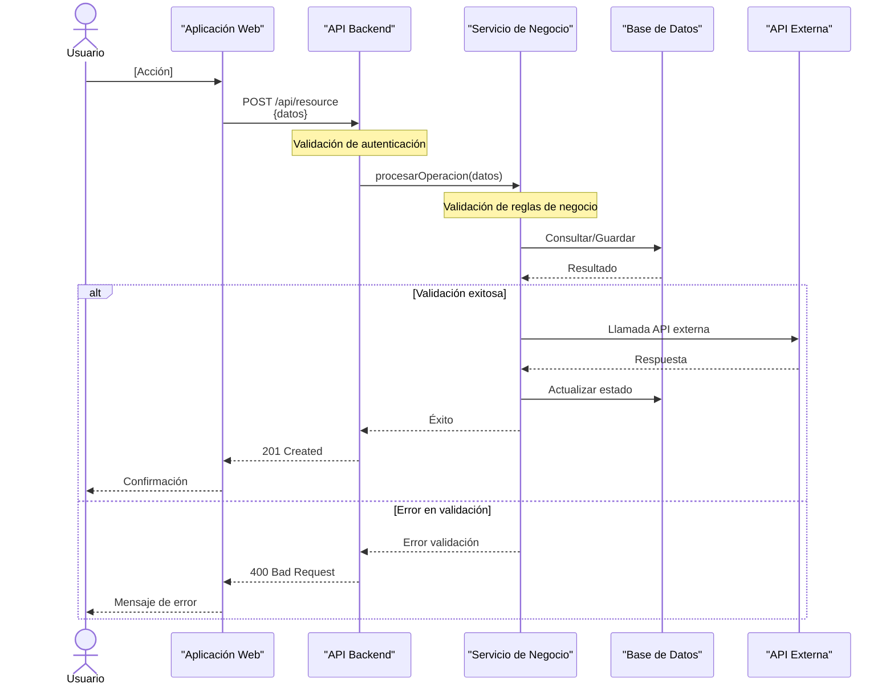
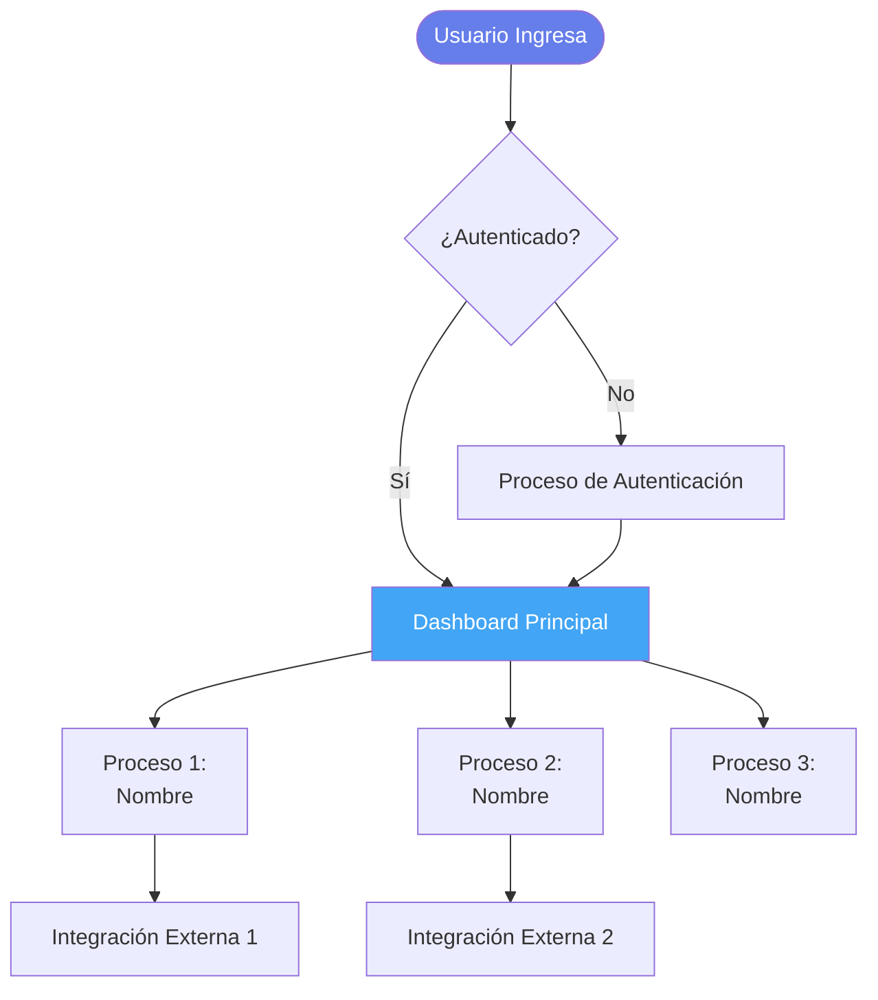

# 📝 Especificación de Salida - Procesos de Negocio

## CONTEXTO

Recibirás:
1. **Análisis automático** (casos de uso y flujos detectados del código)
2. **Respuestas del formulario** (prioridades, reglas adicionales, escenarios)

---

## TAREA

Genera 2 archivos de procesos de negocio:

1. `ai_docs/05-procesos-negocio/01-casos-uso.md`
2. `ai_docs/05-procesos-negocio/02-flujos-funcionales.md`

---

## GUÍAS DE ESTILO

### Casos de Uso
- **Lenguaje de negocio** → Entendible por no-técnicos
- **Formato estructurado** → Actores, Precondiciones, Flujo, Postcondiciones
- **Completo** → Happy path + flujos alternativos + excepciones

### Diagramas de Secuencia
- **Mermaid sequenceDiagram** para flujos funcionales
- **Participantes claros** → Usuario, Sistema, APIs externas
- **Flechas sólidas** (->>) para llamadas síncronas
- **Flechas punteadas** (-->>) para respuestas
- **Notas** para validaciones y errores
- **Labels con espacios** → Entre comillas dobles

### Reglas de Negocio
- **Explícitas** → Documentar todas las detectadas
- **Justificadas** → Por qué existe la regla
- **Validables** → Cómo se verifica

---

## ESTRUCTURA DE ARCHIVOS

### ARCHIVO 1: `01-casos-uso.md`

```markdown
# 📋 Casos de Uso

## 🎯 Objetivo

Documentar los casos de uso principales del sistema desde perspectiva de negocio.

---

## 📊 Resumen de Casos de Uso

| ID | Caso de Uso | Actor | Criticidad | Estado |
|----|-------------|-------|------------|--------|
| CU-001 | [Nombre] | [Actor] | Alta/Media/Baja | Implementado |
| [Listar TODOS los casos de uso detectados] |

**Total**: [N] casos de uso

---

## 📋 Casos de Uso Detallados

[Para CADA caso de uso detectado en el análisis, priorizado según formulario]

### CU-001: [Nombre del Caso de Uso]

**Descripción**: [Qué hace este caso de uso en lenguaje de negocio]

**Actores**:
- **Primario**: [Usuario/Admin/Sistema que inicia]
- **Secundarios**: [Otros participantes]

**Precondiciones**:
- [Condición 1 que debe cumplirse antes]
- [Condición 2]

**Trigger**: [Qué inicia este caso de uso]
- Evento: [POST /api/resource o evento específico]
- Origen: [Usuario, sistema, cron job]

---

#### Flujo Principal (Happy Path)

1. [Actor] [acción en lenguaje de negocio]
2. Sistema valida [qué valida]
3. Sistema [procesa/calcula/guarda] [qué]
4. Sistema [acción] con [sistema externo si aplica]
5. Sistema confirma/notifica a [actor]
6. **Postcondición**: [Estado resultante]

---

#### Flujos Alternativos

**FA-1: [Escenario alternativo]**

1a. Si [condición], entonces:
   - Sistema [acción alternativa]
   - Retorna a paso [N] o termina

**FA-2: [Otro escenario]**

2a. Si [condición]:
   - [Acción]
   - Fin del caso de uso

---

#### Flujos de Excepción

**FE-1: [Error o excepción]**

Xa. Si [error ocurre]:
   - Sistema [cómo maneja el error]
   - Sistema notifica [a quién]
   - [Rollback si aplica]
   - Fin del caso de uso

---

#### Reglas de Negocio

[Detectadas del código + adicionales del formulario]

- **RN-001**: [Regla] - [Justificación]
- **RN-002**: [Regla] - [Justificación]

---

#### Postcondiciones

**Éxito**:
- [Estado 1 del sistema]
- [Estado 2 del sistema]

**Fallo**:
- [Estado si falla]

---

#### Información Técnica

**Endpoint**: `[MÉTODO] [/ruta]`

**Archivo**: `[ruta del controlador]`

**Estado**: ✅ Implementado | 🚧 En desarrollo | 📋 Planificado

---

[Repetir para TODOS los casos de uso prioritarios]

---

## 🎯 Matriz de Casos de Uso

### Por Criticidad

**Alta (Críticos para el negocio)**:
- CU-001: [Nombre]
- CU-002: [Nombre]

**Media (Importantes)**:
- CU-XXX: [Nombre]

**Baja (Auxiliares)**:
- CU-YYY: [Nombre]

### Por Actor

**Usuario**:
- [Lista de CUs]

**Administrador**:
- [Lista de CUs]

**Sistema**:
- [Lista de CUs]

---
```

### ARCHIVO 2: `02-flujos-funcionales.md`

```markdown
# 🔄 Flujos Funcionales

## 🎯 Objetivo

Documentar los flujos funcionales principales con diagramas de secuencia detallados.

---

## 📊 Resumen de Flujos

| Flujo | Participantes | Complejidad | Asíncrono | Integraciones |
|-------|---------------|-------------|-----------|---------------|
| [Flujo 1] | [N] | Alta/Media/Baja | Sí/No | [APIs externas] |
| [Listar flujos principales] |

---

## 🔄 Flujos Detallados

[Para CADA flujo prioritario del formulario]

### Flujo 1: [Nombre del Proceso de Negocio]

**Objetivo de Negocio**: [Del formulario o inferido]

**Trigger**: [Qué lo inicia]

**Resultado Esperado**: [Qué se logra]

---

#### Diagrama de Secuencia

[Genera diagrama Mermaid basado en el flujo REAL del código]



---

#### Descripción Detallada del Flujo

**Paso 1: Inicio**
- [Qué sucede al inicio]
- **Validaciones**: [Qué se valida]

**Paso 2: [Nombre del paso]**
- [Descripción de la acción]
- **Validaciones**: [Reglas de negocio aplicadas]
- **Datos procesados**: [Qué datos se manejan]

**Paso 3: Integración con [Sistema Externo]**
- [Para qué se llama]
- **Datos enviados**: [Qué se envía]
- **Respuesta esperada**: [Qué se recibe]
- **Manejo de errores**: [Qué pasa si falla]

[... continuar con todos los pasos del flujo]

---

#### Validaciones y Reglas de Negocio

| Paso | Validación | Regla de Negocio | Acción si Falla |
|------|------------|------------------|-----------------|
| [N] | [Qué valida] | [Regla] | [Qué hace] |

---

#### Casos de Error y Manejo

**Error 1: [Tipo de error]**
- **Causa**: [Por qué ocurre]
- **Manejo**: [Cómo se maneja]
- **Mensaje al usuario**: [Qué se muestra]
- **Rollback**: [Sí/No - qué se reversa]

**Error 2: [Otro error común]**
- [Del formulario si se especificó]

---

#### Escenarios Especiales

[Si existen caminos alternativos importantes]

**Escenario 1: [Nombre]**
- **Condición**: [Cuándo ocurre]
- **Flujo**: [Qué cambia]

---

[Repetir para TODOS los flujos prioritarios]

---

## 📊 Diagrama de Alto Nivel - Procesos Principales

[Flowchart mostrando cómo se relacionan los principales procesos]



---

## 🎯 Métricas y KPIs de Procesos

[Si se tiene información]

| Proceso | Tiempo Promedio | SLA | Volumen Diario | Tasa de Error |
|---------|----------------|-----|----------------|---------------|
| [Proceso 1] | [X] seg | [Y] seg | [N] ops | [%] |

---
```

---

## REGLAS DE IMPLEMENTACIÓN

### 1. Casos de Uso
- **Top 5-10** más importantes (del formulario)
- **Estructura completa** → Precondiciones, flujo, postcondiciones, excepciones
- **Lenguaje de negocio** → No tecnicismos
- **Todos los flujos** → Principal, alternativos, excepciones

### 2. Diagramas de Secuencia
- **Basados en código REAL** → Sigue las llamadas reales
- **Participantes claros** → Usuario, Frontend, API, Services, DB, External APIs
- **Validaciones visibles** → Notas en puntos de validación
- **Alt/Opt blocks** → Para flujos condicionales
- **Labels entre comillas** si tienen espacios

### 3. Reglas de Negocio
- **Todas documentadas** → Las del código + adicionales del formulario
- **Justificadas** → Por qué existe cada regla
- **Referenciadas** → En qué paso del flujo aplican

### 4. Formato
- **Línea en blanco antes de listas**
- **Tablas bien formadas**
- **Diagramas correctos**
- **Lenguaje claro**

### 5. Creación de Archivos
- **Ruta**: `ai_docs/05-procesos-negocio/[nombre].md`
- **Crear carpeta** si no existe
- **2 archivos** exactamente
- **Guardar automáticamente**

---

## PROCESO DE EJECUCIÓN

1. **Leer** análisis + respuestas del formulario
2. **Priorizar** casos de uso según formulario
3. **Generar los 2 archivos**:
   - Casos de uso detallados
   - Flujos con diagramas de secuencia
4. **Verificar**:
   - Casos de uso completos (todos los campos)
   - Diagramas de secuencia basados en código real
   - Reglas de negocio documentadas
   - Lenguaje de negocio (no técnico)
5. **Guardar** en rutas especificadas
