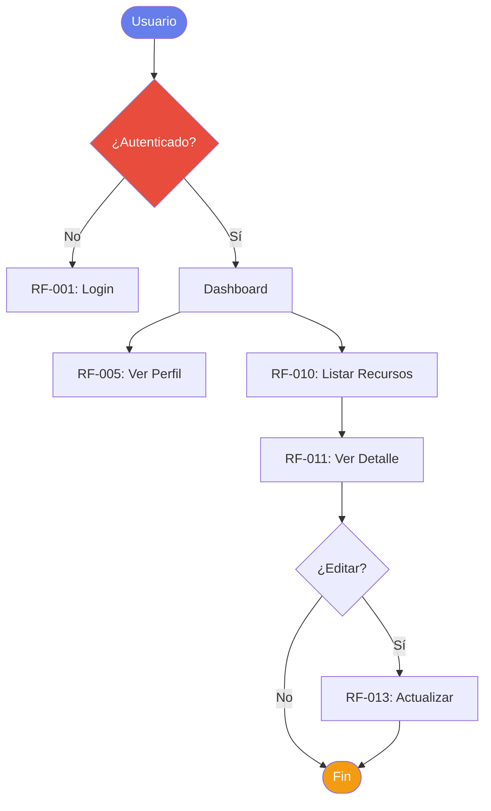
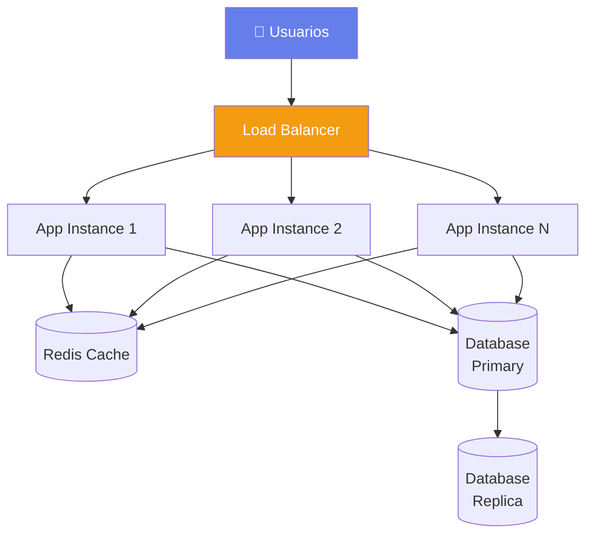
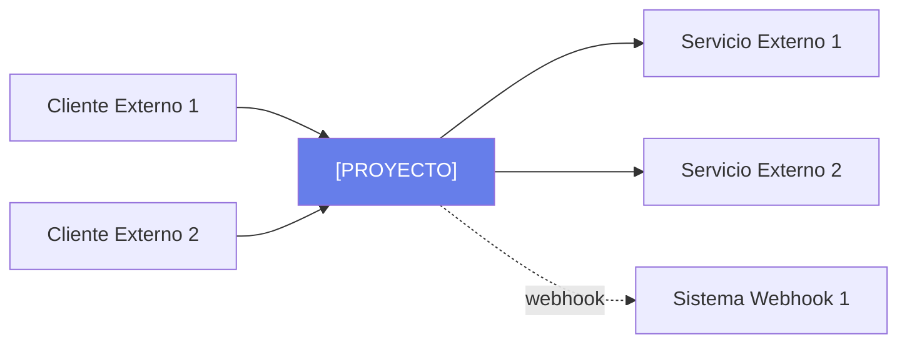

# 📝 Especificación de Salida - Documentación de Requerimientos


## TAREA: Generar 2 Archivos de Documentación

Con toda la información proporcionada, genera exactamente estos 2 archivos:

---

## ARCHIVO 1: `ai_docs/02-requerimientos/01-funcionales.md`

### Estructura requerida:

```markdown
# Requisitos Funcionales - [NOMBRE_PROYECTO]

## 🎯 Propósito

Este documento especifica todos los requisitos funcionales del sistema [NOMBRE_PROYECTO], describiendo QUÉ debe hacer el sistema desde la perspectiva del usuario.

---

## 📊 Resumen

| Métrica | Valor |
|---------|-------|
| **Total de requisitos** | [N] |
| **Implementados** | [N implementados] |
| **En desarrollo** | [N en desarrollo] |
| **Planificados** | [N planificados] |
| **Must Have** | [N] |
| **Should Have** | [N] |
| **Could Have** | [N] |

---

## 📋 Requisitos Funcionales

[Para CADA funcionalidad detectada en el análisis, genera una sección siguiendo este formato]

### RF-001: [Nombre de la Funcionalidad]

**Historia de Usuario:**

- **Como** [tipo de usuario - inferir del rol/autenticación detectada]
- **Quiero** [descripción de la acción - basada en endpoint/función]
- **Para** [beneficio - usar respuestas del formulario o inferir del contexto]

**Endpoint/Operación:**
```
[MÉTODO] [RUTA]
```

**Criterios de Aceptación:**

[Generar basado en validaciones detectadas, status codes, y lógica de negocio]

- [ ] El endpoint `[RUTA]` responde correctamente
- [ ] Valida que `[campo]` sea `[validación detectada]`
- [ ] [Cada validación detectada se convierte en un criterio]
- [ ] [Cada status code se convierte en un criterio: "Retorna 400 si..."]
- [ ] [Si hay autenticación] Requiere autenticación válida
- [ ] [Si hay roles] Solo accesible para roles: `[roles]`
- [ ] [Si hay tests] Tiene tests que validan el comportamiento

**Detalles Técnicos:**

- **Módulo:** `[módulo/dominio]`
- **Archivo:** `[ruta del archivo]` (línea [N])
- **Autenticación:** [Sí/No] - [Mecanismo]
- **Roles permitidos:** [Lista de roles o "Todos los usuarios autenticados"]
- **Parámetros:**
  - **Path:** [Listar path params si hay]
  - **Query:** [Listar query params si hay]
  - **Body:** [Listar campos del body con sus validaciones]
- **Respuestas:**
  - `200`: [Descripción del caso exitoso]
  - `201`: [Si aplica]
  - `400`: [Validación fallida - detallar qué casos]
  - `401`: [No autenticado]
  - `403`: [Sin permisos]
  - `404`: [Recurso no encontrado]
  - `409`: [Conflicto - ej: email duplicado]
  - `500`: [Error del servidor]

**Prioridad:** [Must Have / Should Have / Could Have - basado en respuestas del formulario]

**Estado:** [✅ Implementado / 🚧 En desarrollo / 📋 Planificado]

**Tests:** [✅ Sí - archivo / ❌ No / ⚠️ Parcial]

---

[Repetir para CADA RF detectado - RF-002, RF-003, etc.]

---

### RF-XXX: [Funcionalidades Adicionales - Del Formulario]

[Si en el formulario se especificaron funcionalidades no implementadas, agregarlas aquí]

**Historia de Usuario:**

- **Como** [a especificar]
- **Quiero** [descripción del formulario]
- **Para** [beneficio del formulario]

**Criterios de Aceptación:**

[A definir en fase de diseño]

- [ ] [Criterio 1]
- [ ] [Criterio 2]

**Prioridad:** [Del formulario]

**Estado:** 📋 Planificado (no implementado)

---

## 📊 Diagrama de Flujo de Usuarios

[Genera diagrama Mermaid mostrando los principales flujos de usuario]

**Ejemplo de estructura:**



[IMPORTANTE: Asegúrate de que TODOS los labels en Mermaid que contengan espacios, acentos o caracteres especiales estén entre comillas dobles]

---

## 📋 Priorización MoSCoW

### 🔴 Must Have (Críticos - MVP)

[Listar SOLO los RF categorizados como Must Have]

- **RF-001**: [Nombre] - [Breve descripción]
- **RF-002**: [Nombre] - [Breve descripción]
- ...

### 🟡 Should Have (Importantes - Release 1.0)

[Listar RF categorizados como Should Have]

- **RF-XXX**: [Nombre] - [Breve descripción]
- ...

### 🟢 Could Have (Deseables - Futuras versiones)

[Listar RF categorizados como Could Have]

- **RF-XXX**: [Nombre] - [Breve descripción]
- ...

### ⚪ Won't Have (Excluidos de esta versión)

[Listar RF categorizados como Won't Have]

- **RF-XXX**: [Nombre] - [Razón de exclusión]
- ...

---

## 📊 Matriz de Funcionalidades por Módulo

| Módulo | Funcionalidades | Implementadas | Pendientes | Prioridad Alta |
|--------|-----------------|---------------|------------|----------------|
| [Módulo 1] | [N total] | [N impl] | [N pend] | [N alta] |
| [Módulo 2] | [N total] | [N impl] | [N pend] | [N alta] |
| ... | | | | |
| **TOTAL** | **[N]** | **[N]** | **[N]** | **[N]** |

---

## 🔗 Trazabilidad con Componentes

| ID | Requisito | Componente/Archivo | Tests | Docs API |
|----|-----------|-------------------|-------|----------|
| RF-001 | [Nombre] | `[archivo]` | ✅ / ❌ | ✅ / ❌ |
| RF-002 | [Nombre] | `[archivo]` | ✅ / ❌ | ✅ / ❌ |
| ... | | | | |

---

## 📈 Cobertura de Testing

[Si se detectó información de tests]

| Categoría | Tests Implementados | Cobertura |
|-----------|-------------------|-----------|
| Unitarios | [N archivos] | [%] |
| Integración | [N archivos] | [%] |
| E2E | [N archivos] | [%] |
| **Total** | **[N]** | **[%]** |

**Funcionalidades sin tests:**

- RF-XXX: [Nombre]
- RF-YYY: [Nombre]

---

## ✅ Checklist de Completitud

- [x] Todos los endpoints mapeados a RF
- [x] Criterios de aceptación definidos
- [x] Priorización MoSCoW aplicada
- [x] Matriz de trazabilidad creada
- [ ] Stakeholders han aprobado (pendiente)
- [ ] Casos de uso documentados
- [ ] Flujos de error documentados

---

## 📝 Notas y Consideraciones

[Agregar aquí cualquier nota importante del análisis o respuestas del formulario]

---

<div style="text-align: center; margin-top: 50px;">
    <small>📅 Última actualización: [FECHA_ACTUAL]</small><br/>
    <small>🤖 Generado automáticamente por análisis de código + formulario de requerimientos</small>
</div>
```

---

## ARCHIVO 2: `ai_docs/02-requerimientos/02-no-funcionales.md`

### Estructura requerida:

```markdown
# Requisitos No Funcionales - [NOMBRE_PROYECTO]

## 🎯 Propósito

Este documento especifica todos los requisitos no funcionales del sistema [NOMBRE_PROYECTO], describiendo CÓMO debe comportarse el sistema en términos de calidad, rendimiento, seguridad y otros atributos.

---

## 📊 Resumen de Cumplimiento

| Categoría | Especificado | Implementado | Gap |
|-----------|-------------|--------------|-----|
| 🚀 Rendimiento | ✅ | [✅/⚠️/❌] | [Gap description] |
| 🔒 Seguridad | ✅ | [✅/⚠️/❌] | [Gap description] |
| 📈 Escalabilidad | ✅ | [✅/⚠️/❌] | [Gap description] |
| ⏱️ Disponibilidad | ✅ | [✅/⚠️/❌] | [Gap description] |
| 🔧 Mantenibilidad | ✅ | [✅/⚠️/❌] | [Gap description] |
| 👥 Usabilidad | ✅ | [✅/⚠️/❌] | [Gap description] |
| 🌐 Integración | ✅ | [✅/⚠️/❌] | [Gap description] |
| 💰 Costo | ✅ | [✅/⚠️/❌] | [Gap description] |

**Leyenda:** ✅ Cumple | ⚠️ Parcial | ❌ No cumple

---

## 🚀 RNF-001: Rendimiento

### Especificación

| Métrica | Valor Requerido | Valor Actual | Estado |
|---------|----------------|--------------|--------|
| **Tiempo de respuesta promedio** | < [del formulario] ms | [del análisis o "A medir"] | [✅/⚠️/❌] |
| **Tiempo de respuesta P95** | < [del formulario] ms | [del análisis o "A medir"] | [✅/⚠️/❌] |
| **Throughput** | [del formulario] TPS | [del análisis o "A medir"] | [✅/⚠️/❌] |
| **Usuarios concurrentes** | [mín/prom/pico del formulario] | [capacidad actual o "A determinar"] | [✅/⚠️/❌] |
| **Crecimiento de datos** | [inicial/año1/año3 del formulario] | [actual] | [✅/⚠️/❌] |

### Implementación Actual

[Basado en el análisis del código]

✅ **Optimizaciones detectadas:**

- [Timeout configurado]: [valor] ms
- [Connection pool]: min [N], max [N]
- [Cache]: [tipo - Redis/Memcached] configurado con TTL [N]s
- [Rate limiting]: [N] requests por [ventana de tiempo]
- [Compression]: [gzip/brotli] habilitado
- [Otros hallazgos del análisis]

⚠️ **Gaps identificados:**

- [Listar lo que falta para cumplir la especificación]
- Ejemplo: "No hay APM configurado para medir P95 en producción"
- Ejemplo: "Connection pool podría optimizarse para soportar [N] usuarios concurrentes"

### Recomendaciones

1. [Recomendación basada en gap 1]
2. [Recomendación basada en gap 2]
3. Implementar monitoreo de métricas de rendimiento (APM)

---

## 🔒 RNF-002: Seguridad

### Especificación

- **Nivel de seguridad:** [del formulario - Básico/Medio/Alto/Crítico]
- **Datos sensibles:** [lista del formulario]
- **Cumplimiento normativo:** [lista del formulario]

### Implementación Actual

[Basado en el análisis del código]

✅ **Controles de seguridad detectados:**

- **Autenticación:** [mecanismo detectado - JWT/Sessions/OAuth]
  - Implementación: `[archivo]`
  - Token expiration: [tiempo]
  
- **Password hashing:** [bcrypt/argon2] con [N] rounds/iterations
  - Implementación: `[archivo]`
  
- **Validación de entrada:** [express-validator/Joi/Zod]
  - [Detalles de implementación]
  
- **Security headers:** [Helmet/equivalente] configurado
  - Headers activos: [listar]
  
- **CORS:** Configurado
  - Orígenes permitidos: [lista]
  
- **HTTPS:** [Sí/No/A determinar]

- **Secrets management:** [Variables de entorno/Vault/Secrets Manager]

⚠️ **Gaps de seguridad:**

[Comparar especificación vs implementación]

- [Si requiere cumplimiento GDPR pero no se detectó]: Implementar mecanismos de GDPR (derecho al olvido, portabilidad)
- [Si maneja datos financieros pero no hay encriptación en reposo]: Implementar encriptación de datos sensibles
- [Otros gaps identificados]

❌ **Vulnerabilidades potenciales:**

- [Listar basado en análisis - ej: "No se detectó rate limiting en endpoints de login"]
- [Ej: "No se detectó CSRF protection"]

### Recomendaciones

1. [Recomendación para cerrar gap 1]
2. [Recomendación para cerrar gap 2]
3. Realizar auditoría de seguridad / pentesting

---

## 📈 RNF-003: Escalabilidad

### Especificación

- **Escalado horizontal:** [del formulario - Auto/Manual/Vertical]
- **Crecimiento de usuarios:** [año1/año2/año3 del formulario]
- **Multi-región:** [Sí/No/Futuro - del formulario]

### Implementación Actual

[Basado en el análisis del código]

✅ **Configuración de escalabilidad detectada:**

- **Réplicas configuradas:** [N instancias]
  - Archivo: `[docker-compose.yml / kubernetes deployment]`
  
- **Autoscaling:** [Sí/No]
  - [Si sí]: HPA configurado con min [N], max [N], target CPU [%]
  
- **Load balancer:** [tipo detectado]
  - Configuración: `[archivo]`
  
- **Diseño stateless:** [Sí/No]
  - [Si no]: Sessions almacenadas en [Redis/DB]

⚠️ **Gaps de escalabilidad:**

- [Listar lo que falta para soportar el crecimiento esperado]

### Diagrama de Escalamiento

[Genera diagrama Mermaid mostrando arquitectura escalable]



### Recomendaciones

1. [Recomendación basada en crecimiento esperado]
2. Implementar autoscaling si aún no existe
3. Considerar CDN para contenido estático

---

## ⏱️ RNF-004: Disponibilidad

### Especificación

- **SLA:** [del formulario] % ([downtime permitido])
- **Operación:** [24/7 / Laboral / Extendido - del formulario]
- **Backup frecuencia:** [del formulario]
- **Backup retención:** [del formulario]
- **RPO:** [del formulario]
- **RTO:** [del formulario]

### Implementación Actual

[Basado en el análisis del código]

✅ **Mecanismos de alta disponibilidad detectados:**

- **Health checks:** [Sí/No]
  - Endpoints: `[lista]`
  - Verifican: [DB connectivity / Redis / External APIs]
  
- **Backups automáticos:** [Sí/No]
  - [Si sí]: Frecuencia [detectada], Retención [detectada]
  - Script: `[ubicación]`
  
- **Redundancia:** [Sí/No]
  - [Detalles de configuración multi-AZ / multi-región]
  
- **Monitoreo:** [herramienta detectada]
  - Configuración: `[archivo]`

⚠️ **Gaps de disponibilidad:**

[Comparar SLA requerido vs implementación actual]

- [Ej: "Para cumplir SLA de 99.99% se requiere multi-AZ, actualmente single-zone"]
- [Ej: "RPO de 1h requiere backups más frecuentes que los actuales (diarios)"]

### Estrategia de Disaster Recovery

| Escenario | RPO Requerido | RTO Requerido | RPO Actual | RTO Actual | Acción Necesaria |
|-----------|---------------|---------------|------------|------------|------------------|
| Fallo de instancia | [del form] | [del form] | [actual] | [actual] | [acción] |
| Fallo de BD | [del form] | [del form] | [actual] | [actual] | [acción] |
| Fallo de región | [del form] | [del form] | [actual] | [actual] | [acción] |

### Recomendaciones

1. [Recomendación para alcanzar SLA]
2. Implementar monitoreo 24/7 con alertas
3. Documentar runbooks de incident response

---

## 🔧 RNF-005: Mantenibilidad

### Especificación

- **Nivel de documentación:** [del formulario - Básico/Estándar/Extensivo]
- **Debugging en producción:** [del formulario - APM/Logs/Básico]
- **Versionado de API:** [del formulario - Sí/No]

### Implementación Actual

[Basado en el análisis del código]

✅ **Prácticas de mantenibilidad detectadas:**

- **Test coverage:** [%] ([fuente])
  - Unitarios: [N archivos]
  - Integración: [N archivos]
  - E2E: [N archivos]
  
- **Linting:** [herramientas detectadas]
  - Configuración: `[archivo]`
  - Reglas: [N reglas activas]
  
- **Type safety:** [TypeScript/Flow/No]
  - [Si sí]: Strict mode [enabled/disabled]
  
- **Documentación existente:**
  - README: [✅/❌] - [nivel de detalle]
  - API docs: [✅/❌] - [Swagger/OpenAPI en `[ubicación]`]
  - Arquitectura: [✅/❌]
  - Runbooks: [✅/❌]
  
- **Logging:** [librería detectada]
  - Niveles configurados: [debug/info/warn/error]
  - Destino: [consola/archivo/centralizado]
  
- **Versionado de API:** [Sí/No]
  - [Si sí]: Estrategia [URL-based /v1 / Header-based]

⚠️ **Gaps de mantenibilidad:**

- [Listar lo que falta según nivel de documentación requerido]
- [Ej: "Se requiere nivel Extensivo pero solo hay README básico"]
- [Ej: "No hay APM para debugging en prod pero es requerido"]

### Recomendaciones

1. [Recomendación para alcanzar nivel de documentación requerido]
2. Implementar logging centralizado (ELK/CloudWatch/Datadog)
3. Aumentar test coverage a mínimo 80%

---

## 👥 RNF-006: Usabilidad

### Especificación

- **Dispositivos:** [del formulario - Desktop/Tablet/Mobile/API only]
- **Accesibilidad WCAG:** [del formulario - A/AA/AAA/No aplica]
- **Navegadores:** [lista del formulario]
- **Multiidioma:** [del formulario - Sí/No/Futuro]
- **Idiomas:** [lista del formulario]

### Implementación Actual

[Basado en el análisis del código]

✅ **Características de usabilidad detectadas:**

- **Framework frontend:** [detectado - React/Vue/Angular/etc]
  - Versión: [N]
  
- **Responsive design:** [Sí/No]
  - [Si sí]: Framework CSS [Bootstrap/Tailwind/Material-UI]
  - Breakpoints: [detectados]
  
- **Internationalization (i18n):** [Sí/No]
  - [Si sí]: Librería [react-intl/vue-i18n/etc]
  - Idiomas configurados: [lista]
  - Archivo de traducciones: `[ubicación]`
  
- **Accesibilidad:** [Sí/No]
  - [Si sí]: Librerías detectadas [react-aria/etc]
  - aria-labels: [usado/no usado]
  
- **Browser support:** [detectado en browserslist]
  - Configuración: [lista de navegadores]

⚠️ **Gaps de usabilidad:**

- [Listar lo que falta según especificación]
- [Ej: "Se requiere WCAG AA pero no se detectaron librerías de accesibilidad"]
- [Ej: "Se requiere soporte para IE11 pero browserslist solo incluye evergreen browsers"]

### Recomendaciones

1. [Recomendación para dispositivos no soportados]
2. Implementar tests de accesibilidad (axe-core)
3. Agregar idiomas faltantes al sistema i18n

---

## 🌐 RNF-007: Integración

### Especificación

- **Integraciones externas:** [lista del formulario + análisis]
- **Exponer API:** [del formulario - Pública/Privada/No]
- **Enviar webhooks:** [del formulario - Sí/No]

### Implementación Actual

[Basado en el análisis del código]

✅ **Integraciones detectadas:**

[Para CADA integración detectada en el análisis]

#### [Nombre del servicio externo]

- **Propósito:** [para qué se usa]
- **Protocolo:** [REST/GraphQL/gRPC/WebSocket]
- **Autenticación:** [API Key/OAuth/JWT]
- **Archivo:** `[ubicación del cliente]`
- **Endpoints consumidos:** [lista]
- **Datos intercambiados:** [descripción]

---

⚠️ **Integraciones planificadas (del formulario):**

[Listar integraciones mencionadas en el formulario que no están implementadas]

- [Sistema 1]: [propósito] - Estado: 📋 Planificado
- [Sistema 2]: [propósito] - Estado: 📋 Planificado

✅ **API expuesta:**

[Si se detectaron endpoints que pueden ser consumidos externamente]

- **Tipo:** [REST/GraphQL]
- **Documentación:** [Swagger en `[URL]` / No documentado]
- **Autenticación:** [mecanismo]
- **Rate limiting:** [Sí/No]
- **Versionado:** [Sí/No]

### Diagrama de Integraciones

[Genera diagrama Mermaid mostrando sistema actual + integraciones]



### Recomendaciones

1. Documentar todas las APIs externas consumidas (rate limits, SLA, costos)
2. [Si expone API]: Implementar API Gateway para gestión centralizada
3. Implementar circuit breaker para integraciones críticas

---

## 💰 RNF-008: Costo

### Especificación

- **Presupuesto mensual:** $[del formulario] USD
- **Hosting preferencia:** [del formulario]

### Estimación de Costos Actual

[Basado en el análisis del código]

| Servicio | Tipo | Costo Estimado Mensual | Notas |
|----------|------|------------------------|-------|
| [Compute] | [tipo instancia] | $[estimado] | [N instancias] |
| [Database] | [tipo/managed] | $[estimado] | [storage + IOPS] |
| [Cache] | [Redis/etc] | $[estimado] | [N nodos] |
| [Storage] | [S3/Blob/etc] | $[estimado] | [GB estimados] |
| [CDN] | [CloudFront/etc] | $[estimado] | [transfer out] |
| [Monitoring] | [Datadog/New Relic] | $[estimado] | [según plan] |
| **TOTAL** | | **$[TOTAL]** | |

**Estado vs Presupuesto:** [Dentro/Excede/A determinar]

⚠️ **Optimizaciones recomendadas:**

[Si el costo estimado excede el presupuesto]

1. [Recomendación 1 - ej: "Usar instancias spot para workloads no críticos"]
2. [Recomendación 2 - ej: "Implementar autoscaling para reducir instancias en horas valle"]
3. [Recomendación 3]

### Proyección de Costos

[Basado en crecimiento esperado de usuarios/datos]

| Período | Usuarios Estimados | Datos (GB) | Costo Mensual Proyectado |
|---------|-------------------|-----------|--------------------------|
| Actual | [N] | [N GB] | $[N] |
| Año 1 | [del formulario] | [calculado] | $[estimado] |
| Año 2 | [del formulario] | [calculado] | $[estimado] |
| Año 3 | [del formulario] | [calculado] | $[estimado] |

### Recomendaciones

1. Implementar tagging de recursos para cost allocation
2. Configurar alertas de presupuesto
3. Revisar costos mensualmente y optimizar recursos no utilizados

---

## 📊 Diagrama de Calidad (RNF Overview)

[Genera diagrama Mermaid tipo mindmap o flowchart mostrando todas las categorías de RNF]

```mermaid
mindmap
  root((RNF<br/>[PROYECTO]))
    Rendimiento
      Tiempo respuesta
      Throughput
      Usuarios concurrentes
    Seguridad
      Autenticación
      Autorización
      Encriptación
      Compliance
    Escalabilidad
      Horizontal scaling
      Multi-región
      Load balancing
    Disponibilidad
      SLA 99.XX%
      Backups
      Disaster Recovery
    Mantenibilidad
      Tests
      Documentación
      Logging
    Usabilidad
      Responsive
      i18n
      Accesibilidad
    Integración
      APIs externas
      Webhooks
    Costo
      $[presupuesto]/mes
```

---

## 🎯 Roadmap de Implementación

[Basado en gaps identificados, generar roadmap priorizado]

### Fase 1: Crítico (0-3 meses)

- [ ] [Gap crítico 1 - ej: "Implementar backups automáticos para cumplir RPO"]
- [ ] [Gap crítico 2]
- [ ] [Gap crítico 3]

### Fase 2: Importante (3-6 meses)

- [ ] [Gap importante 1]
- [ ] [Gap importante 2]

### Fase 3: Mejoras (6-12 meses)

- [ ] [Mejora 1]
- [ ] [Mejora 2]

---

## ✅ Checklist de Validación

- [x] Todos los RNF especificados
- [x] Gaps identificados
- [x] Implementación actual documentada
- [x] Recomendaciones priorizadas
- [ ] Stakeholders han aprobado RNF
- [ ] Plan de implementación de gaps aprobado
- [ ] Métricas de monitoreo definidas
- [ ] Pruebas de RNF planificadas (load testing, security testing, etc.)

---

## 📝 Notas y Consideraciones

[Agregar aquí cualquier nota importante del análisis o respuestas del formulario]

**Trade-offs identificados:**

- [Ej: "Cumplir SLA 99.99% incrementa costo mensual en $X"]
- [Ej: "Soportar IE11 requiere polyfills que impactan rendimiento"]

---

<div style="text-align: center; margin-top: 50px;">
    <small>📅 Última actualización: [FECHA_ACTUAL]</small><br/>
    <small>🤖 Generado automáticamente por análisis de código + formulario de requerimientos</small>
</div>
```

---

## REGLAS CRÍTICAS PARA GENERACIÓN

### 1. **Maximizar uso del análisis automático**

- Usa TODA la información extraída del código en FASE 1
- NO inventes datos - si algo no se detectó, marca como "A determinar"
- Combina hallazgos del código con respuestas del formulario

### 2. **Requisitos Funcionales (RF)**

- **Un RF por cada endpoint/operación detectada**
- Genera criterios de aceptación ESPECÍFICOS basados en:
  - Validaciones detectadas en el código
  - Status codes encontrados
  - Lógica de negocio identificada
  - Tests existentes
- Si hay 20 endpoints, debe haber 20 RF mínimo

### 3. **Requisitos No Funcionales (RNF)**

- **Sección por cada categoría (8 total)**
- Formato consistente:
  - Especificación (del formulario)
  - Implementación actual (del análisis)
  - Gaps (diferencia entre especificación y actual)
  - Recomendaciones (cómo cerrar gaps)

### 4. **Diagramas Mermaid**

- **CRÍTICO:** TODOS los labels con espacios, acentos o caracteres especiales DEBEN estar entre comillas dobles
- Correcto: `A["Web App"]`, `B["Base de Datos"]`
- Incorrecto: `A[Web App]`, `B[Base de Datos]`

### 5. **Listas en Markdown**

- **SIEMPRE** deja una línea en blanco antes de cualquier lista (-, *, 1.)
- Correcto:
  ```
  Texto antes.
  
  - Item 1
  - Item 2
  ```
- Incorrecto:
  ```
  Texto antes.
  - Item 1
  ```

### 6. **Estados y Símbolos**

- ✅ Implementado/Cumple
- ⚠️ Parcial/Gap identificado
- ❌ No implementado/No cumple
- 📋 Planificado
- 🚧 En desarrollo

### 7. **Secciones Obligatorias**

#### Para 01-funcionales.md:
- Resumen cuantitativo
- Un RF por funcionalidad (mínimo 15-20)
- Diagrama de flujo de usuarios
- Priorización MoSCoW
- Matriz de trazabilidad

#### Para 02-no-funcionales.md:
- 8 categorías de RNF (Rendimiento, Seguridad, Escalabilidad, Disponibilidad, Mantenibilidad, Usabilidad, Integración, Costo)
- Cada categoría con: Especificación + Implementación + Gaps + Recomendaciones
- Diagrama de overview de RNF
- Roadmap de implementación de gaps

### 8. **Valores Concretos**

- NO uses valores genéricos como "bajo", "alto", "bueno"
- USA valores específicos: "< 200ms", "99.9%", "1000 usuarios", "$500/mes"
- Si no hay dato, usa "A determinar en [fase/reunión/testing]"

### 9. **Creación de Archivos**

- **CREAR EXACTAMENTE** estos 2 archivos:
  - `ai_docs/02-requerimientos/01-funcionales.md`
  - `ai_docs/02-requerimientos/02-no-funcionales.md`
- Si la carpeta `ai_docs/02-requerimientos/` no existe, créala primero
- Guardar archivos automáticamente

### 10. **Fecha y Metadatos**

- Reemplaza `[FECHA_ACTUAL]` con la fecha real en formato "DD de MMMM de YYYY"
- Reemplaza `[NOMBRE_PROYECTO]` con el nombre real del proyecto

---

## EJEMPLO DE COMBINACIÓN DE DATOS

**Del análisis automático:**
```
RF-001: Crear Usuario
- Endpoint: POST /api/users
- Validaciones: email (requerido, formato), password (min 8)
- Autenticación: Sí
- Status codes: 201, 400, 401
```

**Del formulario:**
```
rf_beneficios: "Para que nuevos clientes puedan registrarse en la plataforma"
rf_prioridad_manual: "RF-001: Must Have"
```

**Output en 01-funcionales.md:**
```markdown
### RF-001: Crear Usuario

**Historia de Usuario:**

- **Como** visitante de la plataforma
- **Quiero** crear una cuenta de usuario
- **Para** poder registrarme en la plataforma y acceder a los servicios

**Endpoint/Operación:**
```
POST /api/users
```

**Criterios de Aceptación:**

- [ ] El endpoint `/api/users` acepta método POST
- [ ] Valida que el campo `email` sea requerido y tenga formato email válido
- [ ] Valida que el campo `password` sea requerido y tenga mínimo 8 caracteres
- [ ] Retorna status 201 cuando el usuario se crea exitosamente
- [ ] Retorna status 400 si las validaciones fallan
- [ ] Retorna status 401 si el token de autenticación es inválido
- [ ] Retorna status 409 si el email ya existe en el sistema
- [ ] El password se almacena hasheado (bcrypt)

**Prioridad:** Must Have

**Estado:** ✅ Implementado
```

---

## PROCESO DE EJECUCIÓN

1. **Leer** toda la información proporcionada:
   - Análisis automático del código (de 01-analisis.md)
   - Respuestas del formulario
   
2. **Mapear** datos:
   - Funcionalidades detectadas → RF-001, RF-002, etc.
   - RNF detectados → Sección "Implementación Actual"
   - Respuestas formulario → Sección "Especificación"
   - Diferencias → Sección "Gaps"

3. **Generar** los 2 archivos markdown completos

4. **Verificar**:
   - Todos los diagramas Mermaid con labels correctamente entrecomillados
   - Todas las listas con línea en blanco anterior
   - Valores concretos (no genéricos)
   - 8 categorías de RNF presentes

5. **Guardar** archivos en las rutas especificadas

Genera diagramas mermaid cuando lo veas necesario