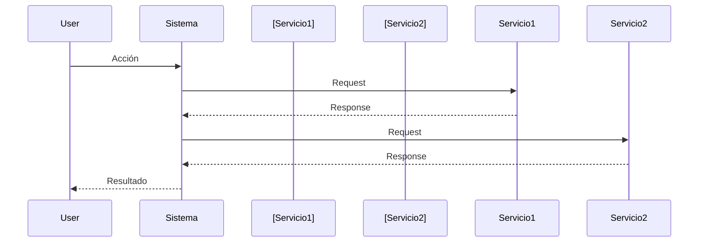

# 📝 Especificación de Salida - Documentación Técnica


## TAREA

Con la infomracion obtenida Genera 4 archivos de documentación técnica:

1. `ai_docs/04-tecnica/01-stack-tecnologico.md`

2. `ai_docs/04-tecnica/02-modelo-datos.md`

3. `ai_docs/04-tecnica/03-apis.md`

4. `ai_docs/04-tecnica/04-integraciones.md`

---

## GUÍAS DE ESTILO

### Diagramas Mermaid

- **ERD (Entity-Relationship)** para modelo de datos

- **Flowcharts** para flujos de integración

- **Sequence diagrams** para llamadas API complejas

- **Labels con espacios** → Entre comillas dobles

### Tablas

- Usa tablas para listar endpoints, campos, tecnologías

- Headers claros y alineación consistente

- Incluye ejemplos cuando sea relevante

### Código

- **Ejemplos reales** del proyecto cuando sea posible

- **Syntax highlighting** apropiado

- **Request/Response examples** en JSON

---

## ESTRUCTURA DE ARCHIVOS

### ARCHIVO 1: `01-stack-tecnologico.md`

```markdown
# ⚙️ Stack Tecnológico

## 🎯 Objetivo

Documentar todas las tecnologías utilizadas con versiones y justificaciones.

---

## 🖥️ Backend

### Runtime y Lenguaje

**[Lenguaje]**: v[VERSION]

- **Por qué**: [Del formulario o inferido del contexto]

- **Versión soportada**: [Mínima y recomendada]

### Framework Web

**[Framework]**: v[VERSION]

- **Por qué**: [Justificación]

- **Configuración**: [Si hay particularidades]

### Base de Datos

**[DB]**: v[VERSION]

- **Por qué**: [Justificación]

- **Driver/ORM**: [Nombre] v[VERSION]

- **Connection pool**: [Configuración si se conoce]

### Librerías Principales

[Listar TODAS las dependencias importantes del análisis]

| Librería | Versión | Propósito |
|----------|---------|-----------|
| [nombre] | [ver] | [para qué se usa] |

---

## 🎨 Frontend

[Si existe, misma estructura]

---

## 🛠️ Herramientas de Desarrollo

**Testing:**

- [Framework de tests] v[VERSION]

- [Coverage tool] v[VERSION]

**Linting/Formatting:**

- [ESLint/Prettier] v[VERSION]

**Build Tools:**

- [Webpack/Vite] v[VERSION]

---

## 📦 Gestión de Dependencias

**Package Manager**: [npm/yarn/pnpm] v[VERSION]

**Estrategia de versiones**: [Semver / Fixed versions]

**Deuda técnica**: [Del formulario si existe]

---
```

### ARCHIVO 2: `02-modelo-datos.md`

```markdown
# 💾 Modelo de Datos

## 🎯 Objetivo

Documentar el esquema de base de datos completo del sistema.

---

## 📊 Diagrama Entidad-Relación

[Genera diagrama Mermaid ERD con TODAS las entidades detectadas]

**Reglas:**

- Incluir PK, FK, UK

- Tipos de relaciones (||--o{, }o--||, etc.)

- Cardinalidad correcta

- Nombres descriptivos

```mermaid
erDiagram
    [ENTIDAD1] ||--o{ [ENTIDAD2] : "relación"
    [ENTIDAD1] {
        uuid id PK
        string campo1
        int campo2
    }
    ["Generar para TODAS las entidades"]
```

---

## 📋 Entidades

[Para CADA entidad detectada en el análisis]

### [Nombre de Entidad]

**Descripción**: [Qué representa en el dominio]

**Tabla/Colección**: `[nombre_real]`

#### Campos

| Campo | Tipo | Constraints | Descripción |
|-------|------|-------------|-------------|
| [campo1] | [tipo] | PK, NOT NULL | [qué es] |
| [campo2] | [tipo] | FK → [tabla] | [qué es] |
| [campo3] | [tipo] | UNIQUE | [qué es] |

#### Relaciones

- **[Tipo relación]** con `[OtraEntidad]`: [Descripción de la relación]

#### Índices

- `idx_[nombre]`: Sobre `[campos]` - [Para qué]

#### Reglas de Negocio

[Del formulario si se especificaron reglas complejas]

- [Regla 1]

- [Regla 2]

---

[Repetir para TODAS las entidades]

---

## 🔄 Migraciones

**Estrategia**: [Del formulario]

**Ubicación**: `[ruta]`

**Herramienta**: [Prisma/Flyway/TypeORM/etc]

**Cómo aplicar**:
```bash
[comando para aplicar migraciones]
```

---
```

### ARCHIVO 3: `03-apis.md`

```markdown
# 📡 Documentación de APIs

## 🎯 Objetivo

Documentar todos los endpoints REST/GraphQL del sistema.

---

## 📊 Resumen de Endpoints

| Método | Endpoint | Descripción | Auth |
|--------|----------|-------------|------|
| [GET] | [/api/resource] | [Qué hace] | ✅/❌ |
| [Listar TODOS los endpoints detectados] |

**Total endpoints**: [N]

---

## 🔗 Endpoints Detallados

[Para CADA endpoint detectado en el análisis]

### [MÉTODO] [/ruta/completa]

**Descripción**: [Qué hace este endpoint]

**Autenticación**: ✅ Requerida | ❌ Pública

**Roles permitidos**: [Admin, User, etc. | "Todos"]

#### Request

**Path Parameters**:

- `[param]`: [Descripción] - [Tipo]

**Query Parameters**:

- `[param]`: [Descripción] - [Tipo] - [Opcional/Requerido]

**Body** (si aplica):
```json
{
  "campo1": "valor",
  "campo2": 123
}
```

**Schema de validación** (del código):
```
[Si hay Joi/Zod/class-validator, mostrar schema]
```

#### Response

**Success (200/201)**:
```json
{
  "campo": "valor"
}
```

**Error (400)**:
```json
{
  "error": "Descripción del error",
  "details": []
}
```

#### Status Codes

| Code | Descripción |
|------|-------------|
| 200 | [Caso éxito] |
| 400 | [Validación fallida] |
| 401 | [No autenticado] |
| 403 | [Sin permisos] |
| 404 | [No encontrado] |

#### Ejemplo Completo

**Request**:
```bash
curl -X [MÉTODO] \
  [URL] \
  -H "Authorization: Bearer [token]" \
  -d '[body si aplica]'
```

**Response**:
```json
[Ejemplo de respuesta real]
```

---

[Repetir para TODOS los endpoints]

---

## 📖 Documentación OpenAPI/Swagger

[Si existe del formulario]

**Ubicación**: `[ruta o URL]`

**Acceso**: [Cómo acceder]

---
```

### ARCHIVO 4: `04-integraciones.md`

```markdown
# 🌐 Integraciones Externas

## 🎯 Objetivo

Documentar todas las integraciones con servicios y APIs externas.

---

## 📊 Resumen de Integraciones

| Servicio | Propósito | Protocolo | Criticidad |
|----------|-----------|-----------|------------|
| [Servicio1] | [Para qué] | [REST/SDK] | Alta/Media/Baja |
| [Listar TODAS las integraciones detectadas] |

---

## 🔗 Integraciones Detalladas

[Para CADA integración detectada]

### [Nombre del Servicio]

**Proveedor**: [Empresa/Plataforma]

**Propósito**: [Para qué se usa en el sistema]

**Criticidad**: Alta / Media / Baja

**Documentación oficial**: [URL]

#### Configuración

**Autenticación**: [API Key / OAuth / JWT]

**Credenciales** (variables de entorno):
```bash
[SERVICIO]_API_KEY=xxx
[SERVICIO]_API_SECRET=xxx
```

**Base URL**: `https://api.[servicio].com/v1`

#### Endpoints Consumidos

| Endpoint | Método | Propósito |
|----------|--------|-----------|
| [/resource] | [GET] | [Qué hace] |

#### Rate Limits

[Del formulario o investigado]

- **Límite**: [N] requests / [período]

- **Estrategia ante límite**: [Qué hace el sistema]

#### Manejo de Errores

**Estrategia de retry**: [Sí/No - política]

**Circuit breaker**: [Implementado/No]

**Fallback**: [Del formulario - qué pasa si falla]

#### Código de Ejemplo

**Ubicación en el proyecto**: `[ruta del archivo]`

```[lenguaje]
// Ejemplo real del código
[Fragmento de cómo se usa la integración]
```

#### Costos

[Si se conocen]

- **Plan**: [Free/Paid - tipo]

- **Costo**: $[X]/mes o por uso

---

[Repetir para TODAS las integraciones]

---

## 🔄 Diagrama de Flujo de Integraciones

[Diagrama Mermaid mostrando flujo de datos con servicios externos]



---
```

---

## REGLAS DE IMPLEMENTACIÓN

### 1. Exhaustividad

- **TODO** lo detectado en el análisis debe documentarse

- No omitir endpoints, entidades o integraciones

- Versiones **exactas** de package.json/pom.xml

### 2. Exactitud

- **NO inventes** información que no esté en el código

- **Ejemplos reales** del proyecto cuando sea posible

- **Marca** como "[REQUIERE VERIFICACIÓN]" si algo no es claro

### 3. Diagramas

- **ERD completo** en modelo de datos

- **Sequence diagrams** para flujos de integración complejos

- **Labels entre comillas** si tienen espacios

### 4. Formato

- **Línea en blanco antes de listas**

- **Tablas bien formadas**

- **Code blocks** con syntax highlighting

- **Ejemplos JSON** bien formateados

### 5. Creación de Archivos

- **Ruta**: `ai_docs/04-tecnica/[nombre].md`

- **Crear carpeta** si no existe

- **4 archivos** exactamente

- **Guardar automáticamente**

---

## PROCESO DE EJECUCIÓN

1. **Leer** análisis exhaustivo + respuestas del formulario

2. **Generar los 4 archivos** con toda la información detectada

3. **Verificar**:
   - Todas las tecnologías listadas con versiones
   - Todas las entidades documentadas
   - Todos los endpoints documentados
   - Todas las integraciones documentadas
   - Diagramas correctos

4. **Guardar** en rutas especificadas
