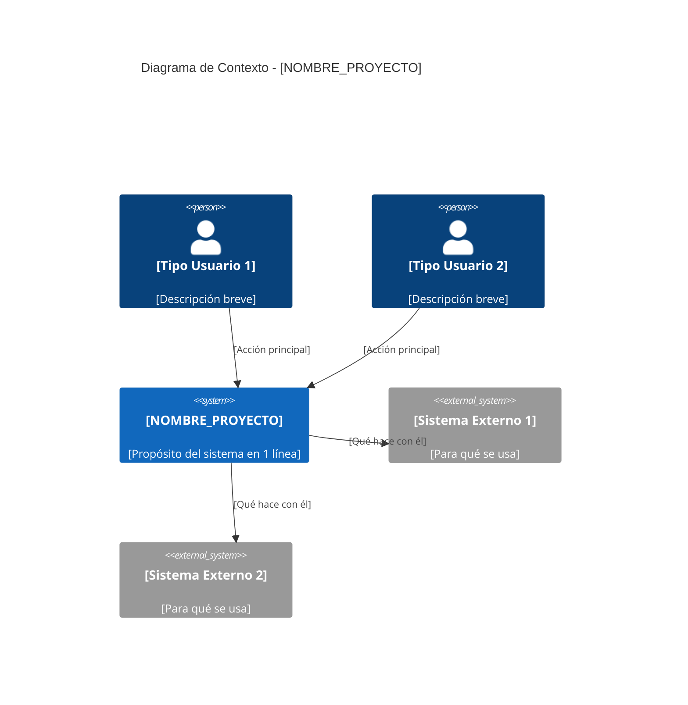

# 📝 Especificación de Salida - Vista Ejecutiva


## TAREA

Con la informacion analizada genera el archivo: `ai_docs/01-vista-ejecutiva/resumen-ejecutivo.md`

---

## ESTRUCTURA DEL ARCHIVO

```markdown
# 📊 Vista Ejecutiva: [NOMBRE_PROYECTO]

## 🎯 Resumen Ejecutivo

[3-4 párrafos en lenguaje de NEGOCIO (sin tecnicismos) respondiendo:]

1. ¿Qué problema de negocio resuelve este sistema?
2. ¿Cómo lo resuelve? (alto nivel)
3. ¿Qué valor aporta a la organización?
4. ¿Cuáles son las métricas clave de éxito?

[Usa información del análisis + respuestas del formulario]

---

## 💼 Valor de Negocio

### Objetivos Estratégicos

[Listar objetivos del formulario]

- **[Objetivo 1]**: [Descripción]
- **[Objetivo 2]**: [Descripción]
- **[Objetivo 3]**: [Descripción]

### Métricas de Éxito (KPIs)

| Métrica | Objetivo | Actual | Estado |
|---------|----------|--------|--------|
| [KPI 1] | [Valor objetivo] | [Valor actual o "A medir"] | ✅/⚠️/❌ |
| [KPI 2] | [Valor objetivo] | [Valor actual o "A medir"] | ✅/⚠️/❌ |
| [KPI 3] | [Valor objetivo] | [Valor actual o "A medir"] | ✅/⚠️/❌ |

[Si no hay datos: marca "A medir" y estado ⚠️]

### ROI y Beneficios Cuantificables

[Si hay información de ROI del formulario, incluir aquí]

- **Ahorro estimado**: [cantidad/período]
- **Incremento de ingresos**: [cantidad/período]
- **Reducción de costos operativos**: [%]
- **Payback period**: [meses/años]

---

## 👥 Usuarios y Casos de Uso

[Para CADA tipo de usuario detectado en el análisis]

### [Nombre del Rol]

**Perfil:** [Descripción del formulario o inferida]

**Volumen:** [Del formulario si está disponible]

**Casos de Uso Principales:**

[Listar top funcionalidades del análisis, traducidas a lenguaje de negocio]

1. [Caso de uso 1 - lenguaje de negocio]
2. [Caso de uso 2 - lenguaje de negocio]
3. [Caso de uso 3 - lenguaje de negocio]

**Beneficios Tangibles:**

[Del formulario]

- [Beneficio 1 con métricas si es posible]
- [Beneficio 2 con métricas si es posible]

---

[Repetir para cada tipo de usuario]

---

## 📊 Vista General del Sistema

### Diagrama de Contexto

[Genera diagrama Mermaid C4 NIVEL 1 - Solo contexto de negocio]

**Reglas del diagrama:**
- UNA caja central para el sistema
- Usuarios como actores externos
- Sistemas externos clave (máximo 5-7)
- Labels en lenguaje de NEGOCIO (no técnico)
- TODOS los labels con espacios DEBEN estar entre comillas dobles



**Descripción del Sistema:**

[Explicación en lenguaje de negocio de cómo fluye la información]

El sistema [NOMBRE] permite a [USUARIOS] [ACCIÓN PRINCIPAL]. Para esto, se integra con [SISTEMAS EXTERNOS] para [PROPÓSITO]. 

---

## ⚠️ Riesgos y Dependencias

### Riesgos Principales

[Identificar del análisis técnico + respuestas del formulario]

| Riesgo | Probabilidad | Impacto al Negocio | Mitigación Actual | Estado |
|--------|--------------|-------------------|-------------------|--------|
| [Riesgo 1] | Alta/Media/Baja | [Describir impacto] | [Qué se hace hoy] | ✅/⚠️/❌ |
| [Riesgo 2] | Alta/Media/Baja | [Describir impacto] | [Qué se hace hoy] | ✅/⚠️/❌ |

[Ejemplos de riesgos:]
- Dependencia de [Servicio X]: Si falla, [impacto de negocio]
- Escalabilidad: Límite actual de [N] usuarios, crecimiento proyectado [M]
- Integración con [Sistema Y]: Sin SLA definido

### Dependencias Críticas

[Del análisis de integraciones + impacto del formulario]

**Críticas (sistema no opera sin ellas):**

- **[Sistema/Servicio 1]**: [Impacto de negocio si falla]
- **[Sistema/Servicio 2]**: [Impacto de negocio si falla]

**Importantes (funcionalidad reducida):**

- **[Sistema/Servicio 3]**: [Qué funcionalidad se pierde]

---

## 💰 Inversión y Presupuesto

[Si hay información del formulario]

| Concepto | Monto Anual | Notas |
|----------|-------------|-------|
| Infraestructura | $[X] | [Cloud, servers, etc.] |
| Licencias | $[X] | [SaaS, APIs, etc.] |
| Mantenimiento | $[X] | [Equipo, soporte] |
| **Total** | **$[X]** | |

**Presupuesto asignado:** $[del formulario] USD/año

**Estado:** [Dentro de presupuesto / Requiere ajuste / A definir]

---

## 📈 Roadmap y Próximos Pasos

[Si hay información sobre planes futuros en el análisis o formulario]

### Corto Plazo (0-3 meses)

- [Prioridad 1]
- [Prioridad 2]

### Mediano Plazo (3-6 meses)

- [Mejora 1]
- [Mejora 2]

### Largo Plazo (6-12 meses)

- [Iniciativa estratégica 1]
- [Iniciativa estratégica 2]

---

## ✅ Conclusiones y Recomendaciones

**Fortalezas:**

- [Fortaleza 1 identificada en el análisis]
- [Fortaleza 2 identificada en el análisis]

**Áreas de Mejora:**

- [Gap 1 con impacto de negocio]
- [Gap 2 con impacto de negocio]

**Recomendaciones Ejecutivas:**

1. [Recomendación 1 - con justificación de negocio]
2. [Recomendación 2 - con justificación de negocio]
3. [Recomendación 3 - con justificación de negocio]

---

<div style="text-align: center; margin-top: 50px;">
    <small>📅 Última actualización: [FECHA_ACTUAL]</small><br/>
    <small>🤖 Generado por análisis automático del sistema</small>
</div>
```

---

## REGLAS CRÍTICAS DE ESTILO

### 1. Lenguaje
- **CERO tecnicismos**: No mencionar tecnologías específicas (React, PostgreSQL, Docker)
- **Lenguaje de NEGOCIO**: Usa "aplicación web", "base de datos", "sistema de pagos"
- **Orientado a VALOR**: Enfócate en beneficios, no en features técnicos

### 2. Métricas
- **Cuantificables**: Siempre que sea posible, usa números
- **Honestas**: Si no hay dato, marca "A medir" o "A definir"
- **Relevantes**: Solo KPIs que importen al negocio

### 3. Diagramas Mermaid
- **Labels entre comillas**: SIEMPRE si tienen espacios o caracteres especiales
- **Máximo 10 elementos**: Mantén simplicidad ejecutiva
- **Términos de negocio**: No términos técnicos

### 4. Formato Markdown
- **Línea en blanco antes de listas**: SIEMPRE
- **Emojis en títulos**: Usa los especificados
- **Tablas bien formadas**: Con headers y alineación
- **Máximo 4 páginas**: Documento ejecutivo conciso

### 5. Creación de Archivo
- **Ruta exacta**: `ai_docs/01-vista-ejecutiva/resumen-ejecutivo.md`
- **Crear carpeta** si no existe
- **Guardar automáticamente**

---

## EJEMPLO DE TRADUCCIÓN TÉCNICO → NEGOCIO

❌ **TÉCNICO (evitar):**
> El sistema usa un microservicio en Node.js con Express que expone una API REST. Se conecta a PostgreSQL mediante Prisma ORM y usa Redis para cache. Está deployado en AWS ECS con autoscaling.

✅ **NEGOCIO (correcto):**
> El sistema es una aplicación web que permite a los usuarios realizar operaciones en tiempo real. La información se almacena de forma segura en una base de datos, y el sistema puede crecer automáticamente según la demanda de usuarios.

---

## PROCESO DE EJECUCIÓN

1. **Leer** análisis automático + respuestas del formulario
2. **Traducir** hallazgos técnicos a lenguaje de negocio
3. **Combinar** datos técnicos con información de negocio del formulario
4. **Generar** el archivo markdown completo
5. **Verificar**:
   - Cero tecnicismos
   - Métricas cuantificables o marcadas "A medir"
   - Diagramas con labels correctos
   - Listas con línea en blanco anterior
   - Máximo 4 páginas
6. **Guardar** en ruta especificada

Crea diagramas donde lo veas necesario